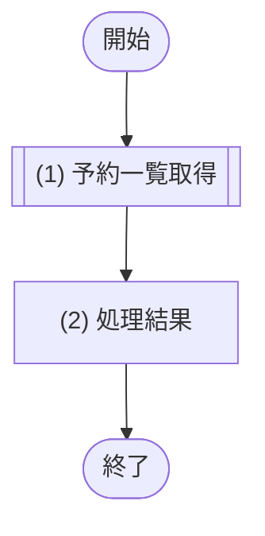

# 1. 基本情報

| 項目 | 内容 |
|---|---|
| API ID | API-006 |
| API名 | 予約一覧取得 |
| メソッド | GET |
| パス | /api/reservations |
| 認証 | 要 |
| 認可 | 一般=可, 管理者=可(いずれも本人の予約のみ) |
| 冪等性 | あり(参照系) |
| トレース元 | FR-003/UC-01, FR-003/UC-02 |
| 概要 | 認証済み利用者本人の予約一覧を取得する。予約ステータス・利用開始日の期間で絞り込み、ページネーションして返す。 |

# 2. リクエスト

| 項目名 | 型 | 必須 | 説明・制約 |
|---|---|---|---|
| 予約ステータス | int | No | DEF-001/CODE-004。指定時は該当ステータスの予約のみ |
| 期間開始 | string | No | YYYY-MM-DD 形式。利用開始日がこの日以降の予約を対象 |
| 期間終了 | string | No | YYYY-MM-DD 形式。利用開始日がこの日以前の予約を対象 |
| ページ | int | No | ページネーション(API-COM §5)。既定 1 |
| 取得件数 | int | No | ページネーション(API-COM §5)。既定 20 |

# 3. レスポンス

| 項目 | 内容 |
|---|---|
| HTTPステータス | 200 |

以下は items 配列の各要素。

| 項目名 | 型 | 説明 |
|---|---|---|
| 予約ID | int | 予約の一意な識別子 |
| 会議室ID | int | 予約対象の会議室ID |
| 会議室名 | string | 予約対象の会議室名 |
| 予約タイトル | string | 予約タイトル |
| 利用開始日時 | string | 利用開始日時(ISO 8601) |
| 利用終了日時 | string | 利用終了日時(ISO 8601) |
| 予約ステータス | int | DEF-001/CODE-004 |
| リマインド状態 | int | DEF-001/CODE-005 |

# 4. 処理フロー

この API の基本フローをフローチャートで定義する。

# 5. 処理詳細

処理フローの各処理で行う内容を定義する。

## (1) 予約一覧取得

認証済みユーザー本人の予約を、指定された条件(予約ステータス・期間)で絞り込んで取得する。該当が無い場合は空一覧を返す。

| MOD-ID | 処理名 |
|---|---|
| MOD-003 | 自予約一覧取得処理 |

| 引数項目 | 値 |
|---|---|
| ユーザーID | 認証済みユーザーID |
| 予約ステータス | リクエスト.予約ステータス |
| 期間開始 | リクエスト.期間開始 |
| 期間終了 | リクエスト.期間終了 |
| ページ | リクエスト.ページ(未指定時は API-COM §5 の既定値) |
| 取得件数 | リクエスト.取得件数(未指定時は API-COM §5 の既定値) |

## (2) 処理結果

(1) 予約一覧取得の結果にページネーションを適用し、レスポンスとして返却する。

| 項目名 | データ型 | 値 | 説明 |
|---|---|---|---|
| 予約一覧 | Object[] | (1) 予約一覧取得の結果にページネーションを適用した一覧 | 返却する予約一覧 |
| - 予約ID | Integer | (1) 予約一覧取得の結果 | 返却する予約ID |
| - 会議室ID | Integer | (1) 予約一覧取得の結果 | 返却する会議室ID |
| - 会議室名 | String | (1) 予約一覧取得の結果 | 返却する会議室名 |
| - 予約タイトル | String | (1) 予約一覧取得の結果 | 返却する予約タイトル |
| - 利用開始日時 | String | (1) 予約一覧取得の結果 | 返却する利用開始日時 |
| - 利用終了日時 | String | (1) 予約一覧取得の結果 | 返却する利用終了日時 |
| - 予約ステータス | Integer | (1) 予約一覧取得の結果 | 返却する予約ステータス |
| - リマインド状態 | Integer | (1) 予約一覧取得の結果 | 返却するリマインド状態 |
| 総件数 | Integer | (1) 予約一覧取得の結果の総件数 | 返却する総件数 |

# 6. バリデーション

入力バリデーションの構文ルールを、成立条件(AND / OR の論理式)で定義する。

- 成立条件を満たさない場合、エラーコードを返し、違反項目ごとに details[] へ {field=項目名, message=違反した成立条件の内容} を設定する。
- 任意項目は「指定なし OR(指定あり AND 制約)」の形で表す。

| 項目名 | 成立条件 | エラーコード |
|---|---|---|
| 予約ステータス | 指定なし OR(指定あり AND int AND DEF-001/CODE-004 の有効値) | [ERR-006](エラーメッセージ一覧.md) |
| 期間開始 | 指定なし OR(指定あり AND YYYY-MM-DD形式) | [ERR-006](エラーメッセージ一覧.md) |
| 期間終了 | 指定なし OR(指定あり AND YYYY-MM-DD形式) | [ERR-006](エラーメッセージ一覧.md) |
| 期間開始 / 期間終了 | 両方なし OR いずれか一方のみ OR(両方指定 AND 期間開始 ＜＝ 期間終了) | [ERR-006](エラーメッセージ一覧.md) |
| ページ / 取得件数 | 指定なし OR(指定あり AND 1 ＜＝ 整数) | [ERR-006](エラーメッセージ一覧.md) |

# 7. エラー

本 API が返却するエラーの一覧。定義は エラーメッセージ一覧.md が正本。発生条件は共通処理フロー(API-COM §7)で表現する。本 API に固有エラーはない。

| エラーコード | 区分 | 発生箇所 |
|---|---|---|
| ERR-001 | 共通 | 共通処理フロー(認証) |
| ERR-006 | 共通 | 共通処理フロー(入力バリデーション) |
