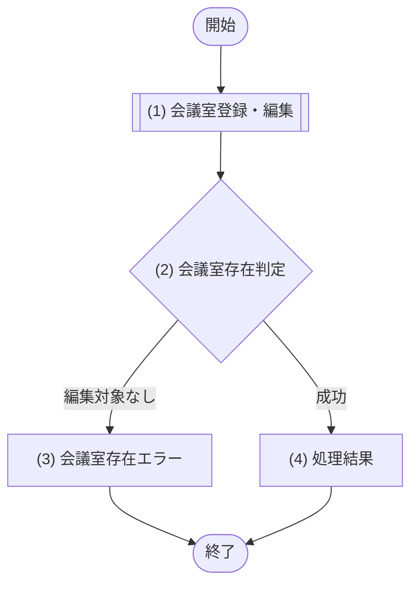

# 1. 基本情報

| 項目 | 内容 |
|---|---|
| API ID | API-007 |
| API名 | 会議室登録・編集 |
| メソッド | POST(登録) / PUT(編集) |
| パス | POST /api/rooms(登録) / PUT /api/rooms/{id}(編集) |
| 認証 | 要 |
| 認可 | 一般=不可, 管理者=可 |
| 冪等性 | POST=なし(再送で会議室が重複登録される可能性) / PUT=あり(同一内容の再送でも結果は同じ) |
| トレース元 | FR-005/UC-01 |
| 概要 | 管理者が会議室(名称・収容人数・場所・利用単価・ステータス・設備)を新規登録、または既存会議室を編集する。利用単価は円/時で 0=無料。 |

# 2. リクエスト

| 項目名 | 型 | 必須 | 説明・制約 |
|---|---|---|---|
| 会議室ID | int | Yes(PUT時) | パスパラメータ。編集対象の会議室ID。POST(登録)時は指定しない |
| 会議室名 | string | Yes | 100文字以内 |
| 収容人数 | int | Yes | 1以上の整数 |
| 設置場所 | string | No | 100文字以内 |
| 利用単価 | int | Yes | 円/時。0以上の整数。0=無料 |
| 会議室ステータス | int | No | DEF-001/CODE-003。未指定時は DEF-001/SET-003 |
| 備考 | string | No | 会議室の備考。500文字以内 |
| 設備ID一覧 | array | No | 会議室に紐づく設備IDの配列(各要素は int) |

# 3. レスポンス

| 項目 | 内容 |
|---|---|
| HTTPステータス | 201(登録) / 200(編集) |

| 項目名 | 型 | 説明 |
|---|---|---|
| 会議室ID | int | 会議室の一意な識別子 |
| 会議室名 | string | 会議室の名称 |
| 収容人数 | int | 収容できる人数 |
| 設置場所 | string | 会議室の場所 |
| 利用単価 | int | 1時間あたり利用単価(円)。0=無料 |
| 会議室ステータス | int | DEF-001/CODE-003 |
| 備考 | string | 会議室の備考 |
| 設備一覧 | array | 会議室に紐づく設備一覧。要素の構造は以下のとおり |
| 設備ID | int | 設備の一意な識別子 |
| 設備名 | string | 設備の名称 |

# 4. 処理フロー

この API の基本フローをフローチャートで定義する。

# 5. 処理詳細

処理フローの各処理で行う内容を定義する。

## (1) 会議室登録・編集

操作種別(登録/編集)に応じて会議室を登録・編集し、あわせて指定された設備との紐づけを再設定する。入力の制約検証・編集対象の存在確認は呼び出し先で行う。

・会議室IDの指定がない場合(登録/POST)は、会議室登録処理で新規登録する
・会議室IDの指定がある場合(編集/PUT)は、会議室編集処理で更新する。編集対象の会議室が存在しない場合は該当なし(NULL)を返す

| MOD-ID | 処理名 |
|---|---|
| MOD-004 | 会議室登録処理 |
| MOD-004 | 会議室編集処理 |

| 引数項目 | 値 |
|---|---|
| 会議室ID | リクエスト.会議室ID(会議室編集処理) |
| 会議室名 | リクエスト.会議室名 |
| 収容人数 | リクエスト.収容人数 |
| 設置場所 | リクエスト.設置場所 |
| 利用単価 | リクエスト.利用単価 |
| 会議室ステータス | リクエスト.会議室ステータス |
| 備考 | リクエスト.備考 |
| 設備IDリスト | リクエスト.設備ID一覧 |

## (2) 会議室存在判定

(1) 会議室登録・編集の結果をもとに、編集対象の会議室が存在し登録・編集が成立したかを判定する。

### 条件定義

| No | 判定対象 | 条件 |
|---|---|---|
| 条件(1) | (1) 会議室登録・編集の結果 | != NULL |

### 条件分岐マトリクス

条件は ◯=満たす・×=満たさない、処理は ◯=そのパターンで実行・-=実行しない で表す。

| 条件・処理 | #1 成功 | #2 編集対象なし |
|---|---|---|
| 条件(1) | ◯ | × |
| 処理 |  |  |
| (4) 処理結果へ進む | ◯ | - |
| (3) 会議室存在エラーへ進む | - | ◯ |

## (3) 会議室存在エラー

編集対象の会議室が存在しない場合のエラーレスポンスを返却する。

| エラーコード | 引数 | 値 |
|---|---|---|
| ERR-007 | {0} 会議室ID | リクエスト.会議室ID |

## (4) 処理結果

登録・編集した会議室情報をレスポンスとして返却する。

| 項目名 | データ型 | 値 | 説明 |
|---|---|---|---|
| 会議室ID | Integer | (1) 会議室登録・編集の結果 | 返却する会議室ID |
| 会議室名 | String | (1) 会議室登録・編集の結果 | 返却する会議室名 |
| 収容人数 | Integer | (1) 会議室登録・編集の結果 | 返却する収容人数 |
| 設置場所 | String | (1) 会議室登録・編集の結果 | 返却する設置場所 |
| 利用単価 | Integer | (1) 会議室登録・編集の結果 | 返却する利用単価 |
| 会議室ステータス | Integer | (1) 会議室登録・編集の結果 | 返却する会議室ステータス |
| 備考 | String | (1) 会議室登録・編集の結果 | 返却する備考 |
| 設備一覧 | Object[] | (1) 会議室登録・編集の結果 | 返却する設備一覧 |
| - 設備ID | Integer | (1) 会議室登録・編集の結果 | 返却する設備ID |
| - 設備名 | String | (1) 会議室登録・編集の結果 | 返却する設備名 |

# 6. バリデーション

入力バリデーションの構文ルールを、成立条件(AND / OR の論理式)で定義する。

- 任意項目は「指定なし OR(指定あり AND 制約)」の形で表す。

| 項目名 | 成立条件 | エラーメッセージ |
|---|---|---|
| 会議室ID | 指定なし OR(指定あり AND int) | 会議室の指定が正しくありません |
| 会議室名 | 指定あり AND string AND 文字数 ＜＝ 100 | 会議室名を100文字以内で入力してください |
| 収容人数 | 指定あり AND int AND 1 ＜＝ 収容人数 | 収容人数は1人以上で入力してください |
| 設置場所 | 指定なし OR(指定あり AND string AND 文字数 ＜＝ 100) | 設置場所は100文字以内で入力してください |
| 利用単価 | 指定あり AND int AND 0 ＜＝ 利用単価 | 利用単価は0以上の金額で入力してください |
| 会議室ステータス | 指定なし OR(指定あり AND int AND DEF-001/CODE-003 の有効値) | 会議室ステータスの指定が正しくありません |
| 備考 | 指定なし OR(指定あり AND string AND 文字数 ＜＝ 500) | 備考は500文字以内で入力してください |
| 設備ID一覧 | 指定なし OR(指定あり AND 配列 AND 各要素が int) | 設備の指定が正しくありません |
