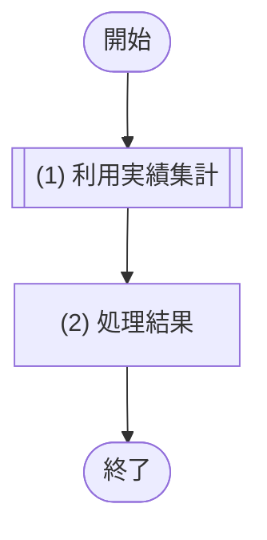

# 1. 基本情報

| 項目 | 内容 |
|---|---|
| API ID | API-008 |
| API名 | 利用実績取得 |
| メソッド | GET |
| パス | /api/reports/usage |
| 認証 | 要 |
| 認可 | 一般=不可, 管理者=可 |
| 冪等性 | あり(参照系) |
| トレース元 | FR-006/UC-01 |
| 概要 | 管理者が指定月の会議室別利用実績(予約件数・利用時間)を取得する。完了予約を集計対象とし、ページネーションして返す。 |

# 2. リクエスト

| 項目名 | 型 | 必須 | 説明・制約 |
|---|---|---|---|
| 対象月 | string | Yes | YYYY-MM 形式。集計対象の月 |
| ページ | int | No | ページネーション(API-COM §5)。既定 1 |
| 取得件数 | int | No | ページネーション(API-COM §5)。既定 20 |

# 3. レスポンス

| 項目 | 内容 |
|---|---|
| HTTPステータス | 200 |

| 項目名 | 型 | 説明 |
|---|---|---|
| 対象月 | string | 集計対象月(YYYY-MM) |
| 利用実績一覧 | array | 会議室別の利用実績。要素の構造は以下のとおり |
| 会議室ID | int | 会議室の一意な識別子 |
| 会議室名 | string | 会議室の名称 |
| 対象月 | string | 集計対象月(YYYY-MM) |
| 予約件数 | int | 完了予約の件数 |
| 利用時間分 | int | 完了予約の合計利用時間(分) |

# 4. 処理フロー

この API の基本フローをフローチャートで定義する。

# 5. 処理詳細

処理フローの各処理で行う内容を定義する。

## (1) 利用実績取得

指定月の会議室別の利用実績を取得する。

- 集計は JOB-003(月次利用実績集計)が事前に行っており、本 API は保存済みの実績を参照する。
- ページネーションは MOD-005 側で適用する。
- 該当が無い場合は空一覧を返す。

| MOD-ID | 処理名 |
|---|---|
| MOD-005 | 利用実績取得処理 |

| 引数項目 | 値 |
|---|---|
| 対象月 | リクエスト.対象月 |
| ページ | リクエスト.ページ(未指定時は API-COM §5 の既定値) |
| 取得件数 | リクエスト.取得件数(未指定時は API-COM §5 の既定値) |

## (2) 処理結果

(1) 利用実績取得の結果(ページネーション適用済み)をレスポンスとして返却する。

| 項目名 | データ型 | 値 | 説明 |
|---|---|---|---|
| 対象月 | String | リクエスト.対象月 | 返却する対象月 |
| 利用実績一覧 | Object[] | (1) 利用実績取得の結果(ページネーション適用済みの一覧) | 返却する利用実績一覧 |
| - 会議室ID | Integer | (1) 利用実績取得の結果 | 返却する会議室ID |
| - 会議室名 | String | (1) 利用実績取得の結果 | 返却する会議室名 |
| - 対象月 | String | (1) 利用実績取得の結果 | 返却する対象月 |
| - 予約件数 | Integer | (1) 利用実績取得の結果 | 返却する予約件数 |
| - 利用時間分 | Integer | (1) 利用実績取得の結果 | 返却する利用時間分 |
| 総件数 | Integer | (1) 利用実績取得の結果の総件数 | 返却する総件数 |

# 6. バリデーション

入力バリデーションの構文ルールを、成立条件(AND / OR の論理式)で定義する。成立条件を満たさない場合、エラーコードを返し、違反項目ごとに details[] へ {field=項目名, message=違反した成立条件の内容} を設定する。

| 項目名 | 成立条件 | エラーコード |
|---|---|---|
| 対象月 | 指定あり AND string AND YYYY-MM形式 | [ERR-006](エラーメッセージ一覧.md) |
| ページ / 取得件数 | 指定なし OR(指定あり AND 1 ＜＝ 整数) | [ERR-006](エラーメッセージ一覧.md) |

# 7. エラー

本 API が返却するエラーの一覧。定義は エラーメッセージ一覧.md が正本。発生条件は共通処理フロー(API-COM §7)で表現する。本 API に固有エラーはない。

| エラーコード | 区分 | 発生箇所 |
|---|---|---|
| ERR-001 | 共通 | 共通処理フロー(認証) |
| ERR-002 | 共通 | 共通処理フロー(認可) |
| ERR-006 | 共通 | 共通処理フロー(入力バリデーション) |
