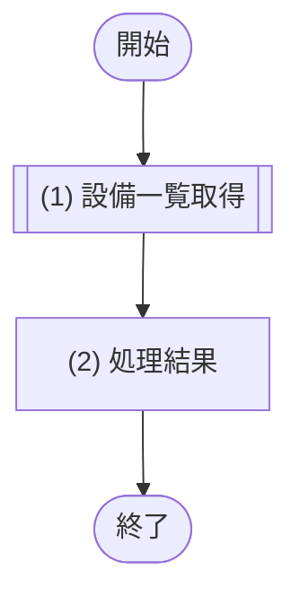

# 1. 基本情報

| 項目 | 内容 |
|---|---|
| API ID | API-009 |
| API名 | 設備一覧取得 |
| メソッド | GET |
| パス | /api/equipments |
| 認証 | 要 |
| 認可 | 一般=可, 管理者=可 |
| 冪等性 | あり(参照系) |
| トレース元 | FR-005/UC-01, FR-001/UC-01 |
| 概要 | 登録済みの設備の一覧を取得する。会議室検索の設備条件や会議室管理の設備選択で使用する。 |

# 2. リクエスト

| 項目名 | 型 | 必須 | 説明・制約 |
|---|---|---|---|
| なし | - | - | 入力項目なし |

# 3. レスポンス

| 項目 | 内容 |
|---|---|
| HTTPステータス | 200 |

以下は items 配列の各要素。

| 項目名 | 型 | 説明 |
|---|---|---|
| 設備ID | int | 設備の一意な識別子 |
| 設備名 | string | 設備の名称 |

# 4. 処理フロー

この API の基本フローをフローチャートで定義する。

# 5. 処理詳細

処理フローの各処理で行う内容を定義する。

## (1) 設備一覧取得

登録済みの全設備を取得する。該当が無い場合は空一覧を返す。

| MOD-ID | 処理名 |
|---|---|
| MOD-004 | 設備一覧取得処理 |

| 引数項目 | 値 |
|---|---|
| なし | - |

## (2) 処理結果

(1) 設備一覧取得の結果をレスポンスとして返却する。

| 項目名 | データ型 | 値 | 説明 |
|---|---|---|---|
| 設備一覧 | Object[] | (1) 設備一覧取得の結果 | 返却する設備一覧 |
| - 設備ID | Integer | (1) 設備一覧取得の結果 | 返却する設備ID |
| - 設備名 | String | (1) 設備一覧取得の結果 | 返却する設備名 |
| 総件数 | Integer | (1) 設備一覧取得の結果の総件数 | 返却する総件数 |

# 6. バリデーション

入力項目がないため、入力バリデーションは行わない。

| 項目名 | 成立条件 | エラーメッセージ |
|---|---|---|
| なし | - | - |
