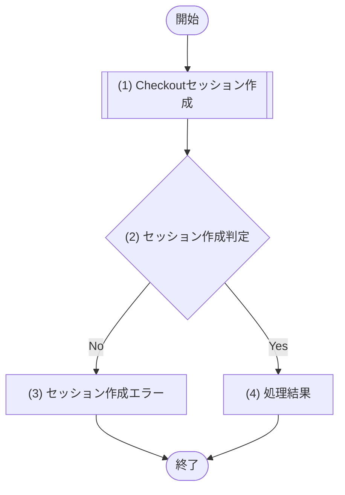

# 1. 基本情報

| 項目 | 内容 |
|---|---|
| API ID | API-010 |
| API名 | 支払い方法登録セッション作成 |
| メソッド | POST |
| パス | /api/billing/checkout |
| 認証 | 要 |
| 認可 | 一般=可, 管理者=可 |
| 冪等性 | なし(呼び出すたびに新しい Checkout セッションを作成する) |
| トレース元 | FR-008/UC-01 |
| 概要 | 従量課金サブスクリプションの支払い方法を登録するための Stripe Checkout セッション(subscription モード)を作成し、決済ページの URL を返す。利用者はこの URL で支払い方法を登録する。 |

# 2. リクエスト

| 項目名 | 型 | 必須 | 説明・制約 |
|---|---|---|---|
| 成功時遷移先URL | string | No | Checkout 完了後にリダイレクトする URL。未指定時はサーバ既定値を使用 |
| キャンセル時遷移先URL | string | No | Checkout 中断時にリダイレクトする URL。未指定時はサーバ既定値を使用 |

# 3. レスポンス

| 項目 | 内容 |
|---|---|
| HTTPステータス | 200 |

| 項目名 | 型 | 説明 |
|---|---|---|
| セッションID | string | Stripe Checkout セッションの一意なID |
| 決済ページURL | string | 支払い方法登録ページの URL。利用者をこの URL へ遷移させる |

# 4. 処理フロー

この API の基本フローをフローチャートで定義する。

# 5. 処理詳細

処理フローの各処理で行う内容を定義する。

## (1) Checkoutセッション作成

従量課金サブスクリプションの支払い方法を登録するため、Stripe Checkout セッション(subscription モード)を作成する。Stripe 連携に失敗した場合は NULL を返す。

・利用者の Stripe 顧客が未作成の場合は、Stripe 顧客を新規作成して利用者に紐付ける

| MOD-ID | 処理名 |
|---|---|
| MOD-007 | 支払い方法登録セッション作成処理 |

| 引数項目 | 値 |
|---|---|
| ユーザーID | 認証済みユーザーID |
| 成功時遷移先URL | リクエスト.成功時遷移先URL |
| キャンセル時遷移先URL | リクエスト.キャンセル時遷移先URL |

## (2) セッション作成判定

(1) Checkoutセッション作成の結果をもとに、セッションが作成できたかを判定する。

### 条件定義

| No | 判定対象 | 条件 |
|---|---|---|
| 条件(1) | (1) Checkoutセッション作成の結果 | != NULL |

### 条件分岐マトリクス

条件は ◯=満たす・×=満たさない、処理は ◯=そのパターンで実行・-=実行しない で表す。

| 条件・処理 | #1 正常 | #2 課金処理失敗 |
|---|---|---|
| 条件(1) | ◯ | × |
| 処理 |  |  |
| (4) 処理結果へ進む | ◯ | - |
| (3) セッション作成エラーへ進む | - | ◯ |

処理結果以外の処理のため、処理結果は「なし」とする。

| 項目名 | データ型 | 値 | 説明 |
|---|---|---|---|
| なし | - | - | - |

## (3) セッション作成エラー

Stripe 連携に失敗し Checkout セッションを作成できなかった場合のエラーレスポンスを返却する。

| エラーコード | 引数 | 値 |
|---|---|---|
| ERR-009 | なし | ― |

## (4) 処理結果

作成した Checkout セッションの情報をレスポンスとして返却する。

| 項目名 | データ型 | 値 | 説明 |
|---|---|---|---|
| セッションID | String | (1) Checkoutセッション作成の結果 | 返却するセッションID |
| 決済ページURL | String | (1) Checkoutセッション作成の結果 | 返却する決済ページURL |

# 6. バリデーション

入力バリデーションの構文ルールを、成立条件(AND / OR の論理式)で定義する。

- 任意項目は「指定なし OR(指定あり AND 制約)」の形で表す。

| 項目名 | 成立条件 | エラーメッセージ |
|---|---|---|
| 成功時遷移先URL | 指定なし OR(指定あり AND string AND URL形式) | 成功時遷移先URLを正しいURLで入力してください |
| キャンセル時遷移先URL | 指定なし OR(指定あり AND string AND URL形式) | キャンセル時遷移先URLを正しいURLで入力してください |
