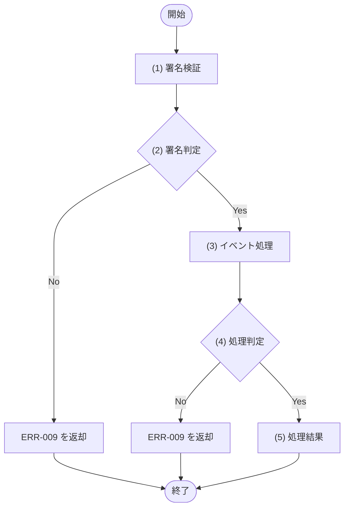

# 1. 基本情報

| 項目 | 内容 |
|---|---|
| API ID | API-011 |
| API名 | Stripe Webhook受信 |
| メソッド | POST |
| パス | /api/webhooks/stripe |
| 認証 | 不要(Stripe-Signature ヘッダによる署名検証で真正性を担保) |
| 認可 | Stripe(署名検証に成功したリクエストのみ処理) |
| 冪等性 | あり(同一イベントID の再送は処理済みとしてスキップする) |
| トレース元 | FR-008/UC-01 |
| 概要 | Stripe からのイベント通知を受信し、署名検証の上で課金契約状態(TBL-001)・請求状態(TBL-008)を更新する。同一イベントの再送は冪等に処理する。 |

# 2. リクエスト

| 項目名 | 型 | 必須 | 説明・制約 |
|---|---|---|---|
| 署名 | string | Yes | HTTPヘッダ。Stripe 署名検証に使用する |
| イベントID | string | Yes | Stripe イベントの一意なID。冪等キーとして使用 |
| イベント種別 | string | Yes | イベント種別(checkout.session.completed / customer.subscription.updated / customer.subscription.deleted / invoice.paid / invoice.payment_failed) |
| イベントデータ | object | Yes | イベント対象オブジェクト(session / subscription / invoice) |

# 3. レスポンス

| 項目 | 内容 |
|---|---|
| HTTPステータス | 200 |

| 項目名 | 型 | 説明 |
|---|---|---|
| 受信結果 | boolean | 受信・処理受付を示す。常に true を返し、Stripe に受信完了を通知する |

# 4. 処理フロー

この API の基本フローをフローチャートで定義する。

# 5. 処理詳細

処理フローの各処理で行う内容を定義する。

## (1) 署名検証

Stripe-Signature ヘッダと受信ペイロードを検証し、正当であればイベントを復元する。検証に失敗した場合は NULL を返す。

| MOD-ID | 処理名 |
|---|---|
| MOD-007 | Webhook署名検証 |

| 引数項目 | 値 |
|---|---|
| 署名 | リクエスト.署名 |
| ペイロード | リクエストボディ(生データ) |

## (2) 署名判定

(1) 署名検証の結果をもとに、リクエストが真正な Stripe イベントかを判定する。

### 条件定義

| No | 判定対象 | 条件 |
|---|---|---|
| 条件(1) | (1) 署名検証の結果 | != NULL |

### 条件分岐マトリクス

条件は ◯=満たす・×=満たさない、処理は ◯=そのパターンで実行・-=実行しない で表す。

| 条件・処理 | #1 正常 | #2 署名不正 |
|---|---|---|
| 条件(1) | ◯ | × |
| 処理 |  |  |
| (3) イベント処理へ進む | ◯ | - |
| ERR-009 を返却する | - | ◯ |

処理結果以外の処理のため、処理結果は「なし」とする。

| 項目名 | データ型 | 値 | 説明 |
|---|---|---|---|
| なし | - | - | - |

## (3) イベント処理

受信した Stripe イベントを冪等に処理し、種別に応じて課金契約状態・請求状態を更新する。

・イベントIDが未処理の場合は、イベント種別に応じて課金契約状態・請求状態を更新する
・イベントIDが処理済みの場合は、更新を行わずスキップする
・Stripe 連携・DB 更新に失敗した場合はエラー(失敗)を返す

| MOD-ID | 処理名 |
|---|---|
| MOD-007 | Webhookイベント処理 |

| 引数項目 | 値 |
|---|---|
| イベント | (1) 署名検証の結果 |

| イベント種別 | 処理内容 | 更新対象 |
|---|---|---|
| checkout.session.completed | STRIPE_SUBSCRIPTION_ID を保存し、DEF-001/SET-001 に更新 | TBL-001 |
| customer.subscription.updated | サブスクリプションの状態に応じて DEF-001/CODE-002 を更新 | TBL-001 |
| customer.subscription.deleted | DEF-001/SET-002 に更新 | TBL-001 |
| invoice.paid | DEF-001/SET-014 に更新 | TBL-008 |
| invoice.payment_failed | DEF-001/SET-015 に更新 | TBL-008 |

## (4) 処理判定

(3) イベント処理の結果をもとに、処理が成功したかを判定する。

### 条件定義

| No | 判定対象 | 条件 |
|---|---|---|
| 条件(1) | (3) イベント処理の結果 | 成功=true である |

### 条件分岐マトリクス

条件は ◯=満たす・×=満たさない、処理は ◯=そのパターンで実行・-=実行しない で表す。

| 条件・処理 | #1 正常 | #2 処理失敗 |
|---|---|---|
| 条件(1) | ◯ | × |
| 処理 |  |  |
| (5) 処理結果へ進む | ◯ | - |
| ERR-009 を返却する | - | ◯ |

処理結果以外の処理のため、処理結果は「なし」とする。

| 項目名 | データ型 | 値 | 説明 |
|---|---|---|---|
| なし | - | - | - |

## (5) 処理結果

受信・処理受付を示すレスポンスを返却する。

| 項目名 | データ型 | 値 | 説明 |
|---|---|---|---|
| 受信結果 | Boolean | true | 返却する受信結果 |

# 6. バリデーション

入力バリデーションの構文ルールを、成立条件(AND / OR の論理式)で定義する。成立条件を満たさない場合、エラー列のコードを返し、違反項目ごとに details[] へ {field=項目名, message=メッセージ列} を設定する。署名の真正性の検証(署名値の検証)は §5 個別処理フロー((1) 署名検証・(2) 署名判定)に定義する。

| 項目名 | 成立条件 | エラー | メッセージ |
|---|---|---|---|
| 署名 | 指定あり AND string | ERR-006 | Stripe-Signature ヘッダは必須です |

# 7. エラー

入力バリデーションで発生する共通エラーは API-COM_共通設計.md §4.1 共通エラー一覧を参照する。本 API に適用される共通エラーは ERR-006(バリデーションエラー。§6 の署名ヘッダ必須検証)。本 API は署名検証で真正性を担保するため認証・認可の共通エラー(ERR-001 / ERR-002)は発生しない。この API 固有のエラーを以下にインライン定義する。

| ERR ID | エラー名 | HTTPステータス | この API での発生条件 | 開発者向けメッセージ |
|---|---|---|---|---|
| ERR-009 | 課金処理エラー | 500 | Stripe-Signature の署名検証に失敗した((2) 署名判定)、またはイベント処理(契約状態・請求状態の更新)に失敗した((4) 処理判定) | Billing processing error |
