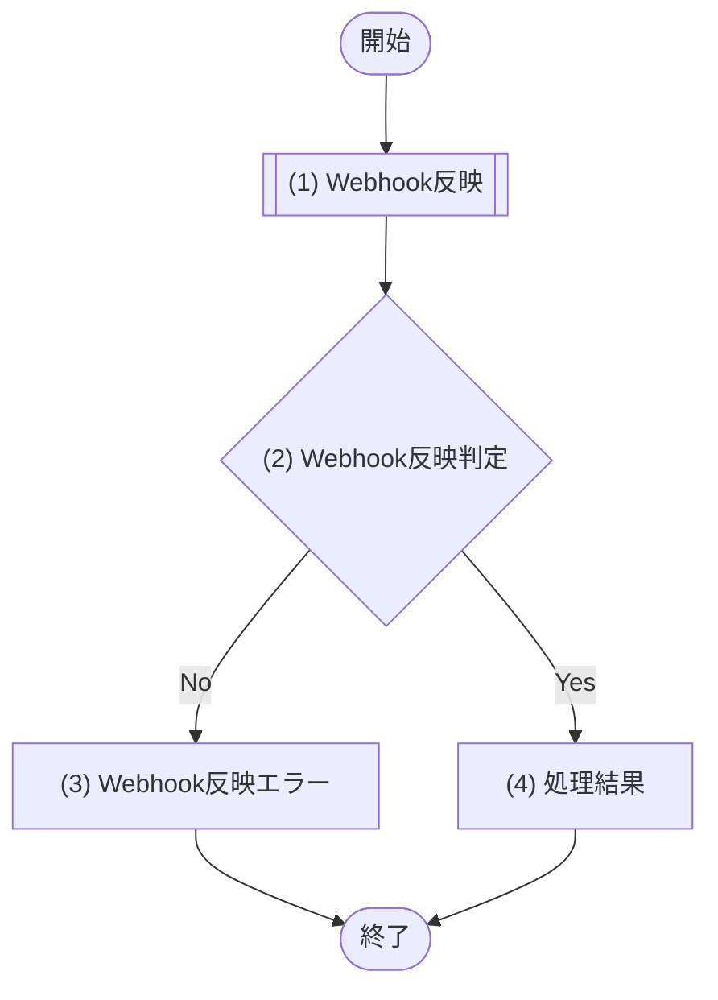

# 1. 基本情報

| 項目 | 内容 |
|---|---|
| API ID | API-011 |
| API名 | Stripe Webhook受信 |
| メソッド | POST |
| パス | /api/webhooks/stripe |
| 認証 | 不要(Stripe-Signature ヘッダによる署名検証で真正性を担保) |
| 認可 | Stripe(署名検証に成功したリクエストのみ処理) |
| 冪等性 | あり(同一 Webhook の再送は冪等に処理する) |
| トレース元 | FR-008/UC-01 |
| 概要 | Stripe からのイベント通知を受信し、署名検証の上で課金契約状態・請求状態を更新する。署名検証・状態反映・冪等処理は MOD-007(課金サービス)が担当する。 |

# 2. リクエスト

| 項目名 | 型 | 必須 | 説明・制約 |
|---|---|---|---|
| 署名 | string | Yes | HTTPヘッダ。Stripe 署名検証に使用する |
| イベントID | string | Yes | Stripe イベントの一意なID。冪等キーとして使用 |
| イベント種別 | string | Yes | イベント種別(checkout.session.completed / customer.subscription.updated / customer.subscription.deleted / invoice.paid / invoice.payment_failed) |
| イベントデータ | object | Yes | イベント対象オブジェクト(session / subscription / invoice) |

# 3. レスポンス

| 項目 | 内容 |
|---|---|
| HTTPステータス | 200 |

| 項目名 | 型 | 説明 |
|---|---|---|
| 受信結果 | boolean | 受信・処理受付を示す。常に true を返し、Stripe に受信完了を通知する |

# 4. 処理フロー

この API の基本フローをフローチャートで定義する。

# 5. 処理詳細

処理フローの各処理で行う内容を定義する。

## (1) Webhook反映

受信した Stripe Webhook の反映を課金サービスへ委譲する。署名検証・イベント種別ごとの状態反映・冪等処理は呼び出し先で行い、反映に失敗した場合は失敗を返す。

| MOD-ID | 処理名 |
|---|---|
| MOD-007 | Webhook反映処理 |

| 引数項目 | 値 |
|---|---|
| 署名 | リクエスト.署名 |
| ペイロード | リクエストボディ(生データ) |

## (2) Webhook反映判定

(1) Webhook反映の結果をもとに、反映処理が成功したかを判定する。

### 条件定義

| No | 判定対象 | 条件 |
|---|---|---|
| 条件(1) | (1) Webhook反映の結果 | 成功である |

### 条件分岐マトリクス

条件は ◯=満たす・×=満たさない、処理は ◯=そのパターンで実行・-=実行しない で表す。

| 条件・処理 | #1 正常 | #2 反映失敗 |
|---|---|---|
| 条件(1) | ◯ | × |
| 処理 |  |  |
| (4) 処理結果へ進む | ◯ | - |
| (3) Webhook反映エラーへ進む | - | ◯ |

処理結果以外の処理のため、処理結果は「なし」とする。

| 項目名 | データ型 | 値 | 説明 |
|---|---|---|---|
| なし | - | - | - |

## (3) Webhook反映エラー

Stripe Webhook の反映(署名検証・状態反映・冪等処理)に失敗した場合のエラーレスポンスを返却する。

| エラーコード | 引数 | 値 |
|---|---|---|
| ERR-009 | なし | ― |

## (4) 処理結果

受信・処理受付を示すレスポンスを返却する。

| 項目名 | データ型 | 値 | 説明 |
|---|---|---|---|
| 受信結果 | Boolean | true | 返却する受信結果 |

# 6. バリデーション

入力バリデーションの構文ルールを、成立条件(AND / OR の論理式)で定義する。

| 項目名 | 成立条件 | エラーメッセージ |
|---|---|---|
| 署名 | 指定あり AND string | 署名が指定されていません |
