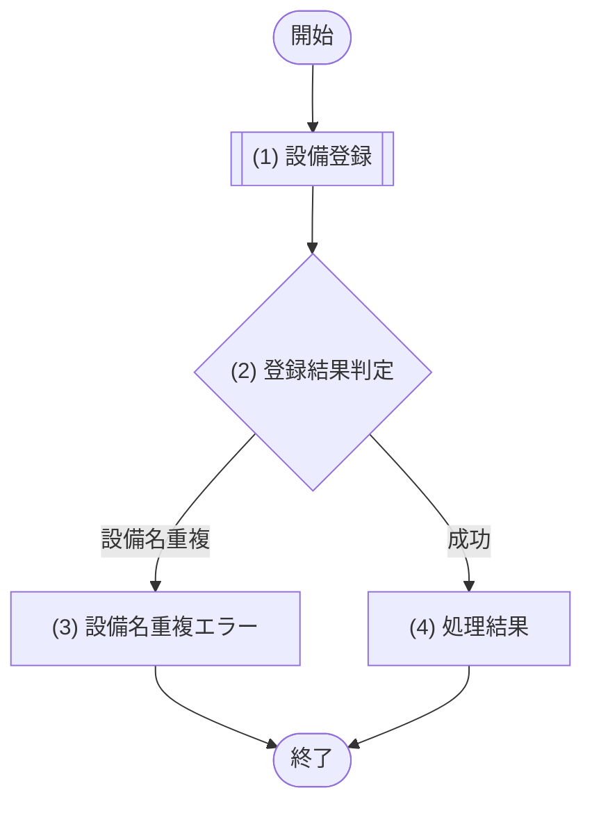

# 1. 基本情報

| 項目 | 内容 |
|---|---|
| API ID | API-013 |
| API名 | 設備登録 |
| メソッド | POST |
| パス | /api/equipments |
| 認証 | 要 |
| 認可 | 一般=不可, 管理者=可 |
| 冪等性 | なし(再送で同名設備は重複登録されず ERR-011 となる) |
| トレース元 | FR-005/UC-01 |
| 概要 | 管理者が設備を新規登録する。会議室に紐付ける設備が未登録の場合に用いる。設備名は一意。 |

# 2. リクエスト

| 項目名 | 型 | 必須 | 説明・制約 |
|---|---|---|---|
| 設備名 | string | Yes | 100文字以内。既存設備と重複不可 |

# 3. レスポンス

| 項目 | 内容 |
|---|---|
| HTTPステータス | 201 |

| 項目名 | 型 | 説明 |
|---|---|---|
| 設備ID | int | 設備の一意な識別子 |
| 設備名 | string | 設備の名称 |

# 4. 処理フロー

この API の基本フローをフローチャートで定義する。

# 5. 処理詳細

処理フローの各処理で行う内容を定義する。

## (1) 設備登録

設備を新規登録する。

- 登録時に設備名が既存設備と重複しないかを確認する。

| MOD-ID | 処理名 |
|---|---|
| MOD-004 | 設備登録処理 |

| 引数項目 | 値 |
|---|---|
| 設備名 | リクエスト.設備名 |

## (2) 登録結果判定

(1) 設備登録の結果をもとに、設備名が既存設備と重複していないかを判定する。

### 条件定義

| No | 判定対象 | 条件 |
|---|---|---|
| 条件(1) | (1) 設備登録の重複確認結果 | 設備名重複あり=false である |

### 条件分岐マトリクス

条件は ◯=満たす・×=満たさない、処理は ◯=そのパターンで実行・-=実行しない で表す。

| 条件・処理 | #1 成功 | #2 設備名重複 |
|---|---|---|
| 条件(1) | ◯ | × |
| 処理 |  |  |
| (4) 処理結果へ進む | ◯ | - |
| (3) 設備名重複エラーへ進む | - | ◯ |

## (3) 設備名重複エラー

登録結果判定で設備名が既存設備と重複していた場合のエラーレスポンスを返却する。

| エラーコード | 引数 | 値 |
|---|---|---|
| ERR-011 | {0} 設備名 | リクエスト.設備名 |

## (4) 処理結果

登録した設備情報をレスポンスとして返却する。

| 項目名 | データ型 | 値 | 説明 |
|---|---|---|---|
| 設備ID | Integer | (1) 設備登録の結果 | 返却する設備ID |
| 設備名 | String | (1) 設備登録の結果 | 返却する設備名 |

# 6. バリデーション

入力バリデーションの構文ルールを、成立条件(AND / OR の論理式)で定義する。

- 成立条件を満たさない場合、エラーコードを返し、違反項目ごとに details[] へ {field=項目名, message=違反した成立条件の内容} を設定する。
- 設備名の重複確認は DB 参照を伴うため §5 個別処理フロー((1) 設備登録)に定義する。

| 項目名 | 成立条件 | エラーコード |
|---|---|---|
| 設備名 | 指定あり AND string AND 文字数 ＜＝ 100 | [ERR-006](エラーメッセージ一覧.md) |

# 7. エラー

本 API が返却するエラーの一覧。定義(エラー名・HTTPステータス・開発者向けメッセージ)は エラーメッセージ一覧.md が正本。発生条件は、共通エラーは API-COM_共通設計.md §7 共通処理フロー、固有エラーは §4/§5 個別処理フローで表現する。

| エラーコード | 区分 | 発生箇所 |
|---|---|---|
| ERR-001 | 共通 | 共通処理フロー(認証) |
| ERR-002 | 共通 | 共通処理フロー(認可) |
| ERR-006 | 共通 | 共通処理フロー(入力バリデーション) |
| ERR-011 | 固有 | 個別処理フロー(§4/§5) |
