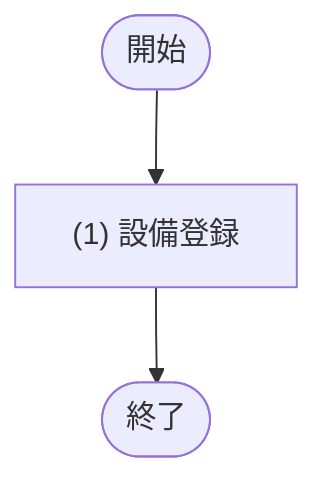

# 1. 基本情報

| 項目 | 内容 |
|---|---|
| API ID | API-013 |
| API名 | 設備登録 |
| メソッド | POST |
| パス | /api/equipments |
| 認証 | 要 |
| 認可 | 一般=不可, 管理者=可 |
| 冪等性 | なし(再送で同名設備は重複登録されず ERR-011 となる) |
| トレース元 | FR-005/UC-01 |
| 概要 | 管理者が設備を新規登録する。会議室に紐付ける設備が未登録の場合に用いる。設備名は一意。 |

# 2. リクエスト

| 項目名 | 型 | 必須 | 説明・制約 |
|---|---|---|---|
| 設備名 | string | Yes | 100文字以内。既存設備と重複不可 |

# 3. レスポンス

| 項目 | 内容 |
|---|---|
| HTTPステータス | 201 |

| 項目名 | 型 | 説明 |
|---|---|---|
| 設備ID | int | 設備の一意な識別子 |
| 設備名 | string | 設備の名称 |

# 4. 処理フロー

この API の基本フローをフローチャートで定義する。

# 5. 処理詳細

処理フローの各処理で行う内容を定義する。

## (1) 設備登録

設備を新規登録する。

・設備名が既存設備と重複する場合は ERR-011 を送出する

| MOD-ID | 処理名 |
|---|---|
| MOD-004 | 設備登録処理 |

| 引数項目 | 値 |
|---|---|
| 設備名 | リクエスト.設備名 |

## エラー結果

個別処理フローで返却するエラーレスポンスの各項目に設定する値を定義する。封筒構造は API-COM §4 エラーレスポンスが正本。

| 項目名 | データ型 | 値 | 説明 |
|---|---|---|---|
| エラーコード | String | ERR-011((1) 設備登録) | 返却するエラーコード |
| 開発者向けメッセージ | String | 返却する ERR の開発者向けメッセージ(§7 エラー、共通エラーは API-COM §4.1) | 返却する開発者向けメッセージ |
| エラー明細 | Array | 空配列(明細なし) | 返却するエラー明細 |

# 6. バリデーション

入力バリデーションの構文ルールを、成立条件(AND / OR の論理式)で定義する。成立条件を満たさない場合、エラー列のコードを返し、違反項目ごとに details[] へ {field=項目名, message=メッセージ列} を設定する。設備名の重複確認は DB 参照を伴うため §5 個別処理フロー((1) 設備登録)に定義する。

| 項目名 | 成立条件 | エラー | メッセージ |
|---|---|---|---|
| 設備名 | 指定あり AND string AND 文字数 ＜＝ 100 | ERR-006 | 設備名は必須で、100文字以内で指定してください |

# 7. エラー

認証・認可・入力バリデーションで発生する共通エラーは API-COM_共通設計.md §4.1 共通エラー一覧を参照する。本 API に適用される共通エラーは ERR-001(認証失敗) / ERR-002(権限なし。管理者以外による実行) / ERR-006(バリデーションエラー)。この API 固有のエラーを以下にインライン定義する。

| ERR ID | エラー名 | HTTPステータス | この API での発生条件 | 開発者向けメッセージ |
|---|---|---|---|---|
| ERR-011 | 設備名重複 | 409 | 指定した設備名が既存設備と重複する((1) 設備登録・設備名の一意制約) | Equipment name already exists |
