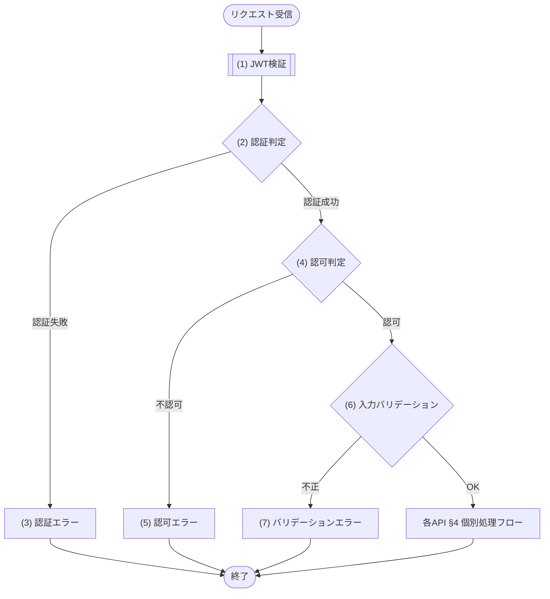

# 1. 概要

MeetRoom の全 REST API に適用される共通仕様(認証・共通ヘッダ・エラーレスポンス封筒・ページネーション・共通規約)の正本。
各 API 文書には本書との差分のみを記載する(再記載は禁止)。

# 2. 認証

| 項目 | 内容 |
|---|---|
| 方式 | Bearer JWT(Authorization: Bearer {token}) |
| トークン取得 | API-001 で取得 |
| 有効期限 | 24時間 |

## 2.1 JWT 仕様

JWT の発行・検証仕様を定義する。秘密鍵は実行基盤の秘密情報として管理し、コード・リポジトリには含めない。

| 項目 | 内容 |
|---|---|
| 署名方式 | HS256(HMAC-SHA-256) |
| 発行・検証方法 | MOD-008 認証暗号サービスの JWT発行処理・JWT検証処理を利用する |
| 外部ライブラリ直接利用 | 外部ライブラリ利用専用モジュール以外の API・JOB・モジュールからの直接利用は禁止 |
| 秘密鍵 | 実行基盤の秘密情報として管理する JWT 署名秘密鍵 |
| 必須情報 | ユーザーID、ロール、発行日時、有効期限 |
| 認証主体ロール | DEF-001/CODE-001 のユーザーロールを設定する |
| 認可判定 | 認証主体ロールを CFR-002 の権限マトリクス(機能×ロール)に照合して判定する |
| 有効期限判定 | 現在時刻が有効期限以下であること |

# 3. 共通リクエストヘッダ

| ヘッダ | 値 | 対象 |
|---|---|---|
| Authorization | Bearer {token} | 認証「要」の API |
| Content-Type | application/json | 全 API |

# 4. エラーレスポンス

全 API のエラーは以下の封筒形式で返す。message は エラーメッセージ一覧.md で定義する開発者向けメッセージを設定する。
ERR-XXX の定義(エラー名・HTTPステータス・開発者向けメッセージ)は エラーメッセージ一覧.md が正本(システム全体を通した連番で一元管理)。本書・各 API 文書は再掲せずエラーコードで参照する。エラーの発生条件は定義側に持たせず、共通エラー(区分=共通)は §7 共通処理フロー、API 固有エラー(区分=固有)は各 API 文書 §4/§5 個別処理フローで表現する。

```json
{
  "error": {
    "code": "ERR-006",
    "message": "Validation failed",
    "details": [
      { "field": "start_time", "message": "開始時刻は HH:mm 形式で指定してください" }
    ]
  }
}
```

| 項目 | 内容 |
|---|---|
| error.code | エラーコード |
| error.message | 開発者向けメッセージ(エラーメッセージ一覧.md で定義) |
| error.details[] | 項目単位のエラー明細。どの項目のどのルールに反したかを判別できるようにする |
| error.details[].field | 対象項目のパラメータ名(各 API §2 リクエストのパラメータ名) |
| error.details[].message | 違反したルールの内容(各 API §6 バリデーションの成立条件に対応) |

バリデーションエラー(ERR-006)は、違反した項目ごとに details[] を1件ずつ設定する。details[] を持たないエラーは details を空配列 [] とする。

## 4.1 共通エラー一覧

共通処理フロー(§7)で全 API 共通に発生するエラー(区分=共通)。定義(エラー名・HTTPステータス・開発者向けメッセージ)は エラーメッセージ一覧.md が正本のため再掲せず、本書は該当エラーコードと共通処理フロー上の発生箇所のみを示す。各エラーの発生条件は §7 共通処理フローで表現する。

| エラーコード | 発生箇所 |
|---|---|
| ERR-001 | (2) 認証判定 |
| ERR-002 | (4) 認可判定 |
| ERR-006 | (6) 入力バリデーション |

# 5. ページネーション

一覧系 API は以下のクエリパラメータとレスポンス形式を用いる。

| パラメータ | 配置 | 型 | 既定値 | 制約 |
|---|---|---|---|---|
| page | query | int | 1 | 1始まり |
| limit | query | int | 20 | 最大100 |

```json
{ "items": [...], "page": n, "limit": n, "total": n }
```

# 6. 共通規約

| 項目 | 規約 |
|---|---|
| 日時形式 | ISO 8601(保存UTC・表示 Asia/Tokyo) |
| 文字コード | UTF-8 |
| 認証エラー | 全APIで ERR-001 |
| 認可エラー | 全APIで ERR-002 |

# 7. 共通処理フロー

全 REST API は、各 API 文書 §4 の個別処理フローに入る前に以下の共通フローを経る。認証・認可・入力バリデーションは全 API 共通の前処理であり、各 API 文書のフロー(§4・§5)には記載しない。



## 共通処理詳細

共通処理フローの各処理((1)〜(7))で行う内容を、個別 API の §5 処理詳細と同じ形式で定義する。

- 取得・検証・整形(JWT検証)の結果を判定する段階は、その取得・検証・整形処理を独立したステップとして先に定義し、判定はその結果を参照する。
- 各判定は、失敗すると §4 エラーレスポンスの封筒でエラーを返す。
- 各判定は、成功すると次の処理(最後は各 API §4 個別処理フロー)へ進む。

### (1) JWT検証

Authorization ヘッダの Bearer トークンを検証し、認証主体(ユーザーID・ロール)と有効性を得る。

- 署名・有効期限・必須クレームの検証は §2 認証・§2.1 JWT仕様に従い MOD-008 認証暗号サービスに委譲する。
- トークンが無い・不正な場合も含め、検証結果を (2) 認証判定へ渡す。

| MOD-ID | 処理名 |
|---|---|
| MOD-008 | JWT検証処理 |

| 引数項目 | 値 |
|---|---|
| トークン | Authorization ヘッダの Bearer トークン |

### (2) 認証判定

(1) JWT検証の結果が有効かを判定し、認証の成否を決める。トークン未指定・無効・期限切れの場合は ERR-001 を返す。

#### 条件定義

| No | 判定対象 | 条件 |
|---|---|---|
| 条件(1) | Authorization ヘッダの Bearer トークン | != NULL |
| 条件(2) | (1) JWT検証の結果.有効 | = true |

#### 条件分岐マトリクス

条件は ◯=満たす・×=満たさない・-=判定しない、処理は ◯=そのパターンで実行・-=実行しない で表す。

| 条件・処理 | #1 認証成功 | #2 トークンなし | #3 検証失敗 |
|---|---|---|---|
| 条件(1) | ◯ | × | ◯ |
| 条件(2) | ◯ | - | × |
| 処理 |  |  |  |
| (4) 認可判定へ進む | ◯ | - | - |
| (3) 認証エラーへ進む | - | ◯ | ◯ |

### (3) 認証エラー

認証に失敗した(トークン未指定・無効・期限切れ)場合のエラーレスポンスを返却する。

| エラーコード | 引数 | 値 |
|---|---|---|
| ERR-001 | なし | ― |

### (4) 認可判定

認証主体のロールが、当該 API に許可された操作かを判定する。

- 判定は各 API 文書 §1 基本情報の認可と CFR-002 の権限マトリクス(§9)に従う。
- 許可されない場合は ERR-002 を返す。

#### 条件定義

| No | 判定対象 | 条件 |
|---|---|---|
| 条件(1) | (1) JWT検証の結果.ロール | 当該 API の認可(各 API §1 基本情報)で許可される(CFR-002) |

#### 条件分岐マトリクス

条件は ◯=満たす・×=満たさない、処理は ◯=そのパターンで実行・-=実行しない で表す。

| 条件・処理 | #1 認可 | #2 不認可 |
|---|---|---|
| 条件(1) | ◯ | × |
| 処理 |  |  |
| (6) 入力バリデーションへ進む | ◯ | - |
| (5) 認可エラーへ進む | - | ◯ |

### (5) 認可エラー

認証主体のロールが当該 API に許可されていない場合のエラーレスポンスを返却する。

| エラーコード | 引数 | 値 |
|---|---|---|
| ERR-002 | なし | ― |

### (6) 入力バリデーション

リクエストが各 API 文書 §2 リクエスト・§6 バリデーションの構文ルール(必須・型・形式・単項目制約・項目間相関)を満たすかを判定する。

- 満たさない場合は ERR-006 を返し、違反項目ごとに §4 エラーレスポンスの details[] を設定して、どの項目で違反したかを判別できるようにする。
- DB 参照・業務ルールを伴う判定はここに含めず、各 API §4 個別処理フローで行う(範囲は「入力バリデーションの範囲」)。

#### 条件定義

| No | 判定対象 | 条件 |
|---|---|---|
| 条件(1) | リクエスト各項目 | 各 API §6 バリデーションの成立条件をすべて満たす |

#### 条件分岐マトリクス

条件は ◯=満たす・×=満たさない、処理は ◯=そのパターンで実行・-=実行しない で表す。

| 条件・処理 | #1 正常 | #2 構文不正 |
|---|---|---|
| 条件(1) | ◯ | × |
| 処理 |  |  |
| 各 API §4 個別処理フローへ進む | ◯ | - |
| (7) バリデーションエラーへ進む | - | ◯ |

### (7) バリデーションエラー

リクエストが構文ルールを満たさない場合のエラーレスポンスを返却する。

| エラーコード | 引数 | 値 |
|---|---|---|
| ERR-006 | 違反項目明細(details[]) | 違反項目ごとに field=違反項目・message=違反したルール内容を設定 |

※ ERR-006 はメッセージのプレースホルダを持たず、エラー明細(details[])に違反内容を設定する点が他のエラーノードと異なる(封筒構造は §4 が正本)。

## 入力バリデーションの範囲

(6) 入力バリデーションが検証するのは、リクエスト単体で機械的に判定できる構文的チェックに限る。

| 区分 | 内容 |
|---|---|
| 必須 | 必須項目が指定されている |
| 型 | 値の型が正しい |
| 形式 | 日付・時刻・コード等の形式が正しい |
| 単項目制約 | 文字数・数値範囲・許可値など1項目で判定できる制約 |
| 項目間相関 | 開始＜終了など複数項目の相関 |

DB 参照や業務ルールを伴う判定(存在確認・重複・期間制約・状態遷移など)は共通フローに含めず、各 API 文書 §4 個別処理フローで業務判定として定義する(返すエラーは判定内容による)。
