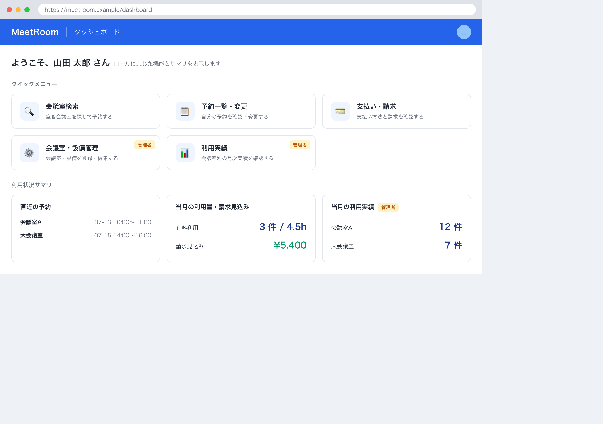

# 1. 基本情報

| 項目 | 内容 |
|---|---|
| 画面ID | SCR-008 |
| 画面名 | ダッシュボード |
| 概要 | ログイン後の起点画面。利用者のロールに応じた利用可能機能への導線と、本人に関係する利用状況のサマリを表示する |
| トレース元 | CFR-008/UC-01 |
| URL / ルート | /dashboard |
| 利用可能ロール | 全員（認証済み。共通コード定義/CODE-001。導線・サマリはロールで出し分け） |

# 2. 画面レイアウト

# 3. 初期表示

| 項目 | 内容 |
|---|---|
| 表示時に呼び出すAPI | API-006（本人の予約／一般）、API-012（当月の利用量・請求見込み／一般）、API-008（当月の会議室別利用実績／管理者） |
| デフォルト値 | サマリの対象月は当月 |
| ソート順 | 直近の予約は利用開始日時昇順、利用実績は会議室名昇順 |
| 0件時の表示 | 直近の予約なし=MSG-059、当月の有料利用なし=MSG-060、当月の利用実績なし=MSG-061 |

# 4. 画面項目

| 項目ID | 項目名 | 種別 | 表示/入力 | 必須 | 初期値 | 備考 |
|---|---|---|---|---|---|---|
| ITM-01 | 利用者名 | label | 表示 | - | ログイン中の利用者名 | - |
| ITM-02 | 会議室検索リンク | button | 入力 | - | - | EVT-02 を発火（全ロール） |
| ITM-03 | 予約一覧リンク | button | 入力 | - | - | EVT-03 を発火（全ロール） |
| ITM-04 | 支払い・請求リンク | button | 入力 | - | - | EVT-04 を発火（全ロール） |
| ITM-05 | 会議室・設備管理リンク | button | 入力 | - | - | EVT-05 を発火（管理者のみ表示） |
| ITM-06 | 利用実績リンク | button | 入力 | - | - | EVT-06 を発火（管理者のみ表示） |
| ITM-07 | 直近の予約サマリ | label | 表示 | - | 本人の直近の予約 | 0件時 MSG-059 |
| ITM-08 | 当月利用量・請求見込みサマリ | label | 表示 | - | 当月の利用量・請求見込み | 0件時 MSG-060 |
| ITM-09 | 当月利用実績サマリ | label | 表示 | - | 当月の会議室別利用実績 | 管理者のみ表示。0件時 MSG-061 |

# 5. 画面イベント

| イベントID | イベント名 | 発火条件 | 呼び出しAPI | 成功時 | 失敗時 |
|---|---|---|---|---|---|
| EVT-01 | ダッシュボード表示 | 画面表示時 | API-006, API-012（一般）／API-008（管理者） | ロールに応じたサマリを各サマリ領域に表示。0件時は各領域に MSG-059 / MSG-060 / MSG-061 を表示 | ERR-001 発生時は SCR-001(ログイン)へ遷移 |
| EVT-02 | 会議室検索へ | 会議室検索リンク押下 | - | SCR-002 へ遷移 | - |
| EVT-03 | 予約一覧へ | 予約一覧リンク押下 | - | SCR-004 へ遷移 | - |
| EVT-04 | 支払い・請求へ | 支払い・請求リンク押下 | - | SCR-007 へ遷移 | - |
| EVT-05 | 会議室・設備管理へ | 会議室・設備管理リンク押下 | - | SCR-005 へ遷移 | - |
| EVT-06 | 利用実績へ | 利用実績リンク押下 | - | SCR-006 へ遷移 | - |

# 6. 入力チェック

<!-- クライアント側チェックのみ。サーバ側バリデーションは API 文書に記載 -->

| 対象項目 | チェック内容 | 表示メッセージ |
|---|---|---|
| - | 本画面に入力項目はなく、クライアント側の入力チェックはない | - |

# 7. 表示制御

| 条件 | 対象 | 制御内容 |
|---|---|---|
| ロールが一般 | 会議室・設備管理リンク(ITM-05)・利用実績リンク(ITM-06)・当月利用実績サマリ(ITM-09) | 非表示 |
| ロールが管理者 | 会議室・設備管理リンク(ITM-05)・利用実績リンク(ITM-06)・当月利用実績サマリ(ITM-09) | 表示 |

# 8. 画面遷移

| 遷移先 | トリガ |
|---|---|
| SCR-002 | 会議室検索リンク押下（EVT-02） |
| SCR-004 | 予約一覧リンク押下（EVT-03） |
| SCR-007 | 支払い・請求リンク押下（EVT-04） |
| SCR-005 | 会議室・設備管理リンク押下（EVT-05、管理者のみ） |
| SCR-006 | 利用実績リンク押下（EVT-06、管理者のみ） |
| SCR-001 | API 呼び出しで ERR-001(認証失敗・トークン失効)を受信、または未認証で本画面へアクセス |

# 9. メッセージ一覧

本画面が参照する画面表示文言(MSG)を以下にインライン定義する。対応ERR は当該メッセージの表示契機となるエラー(なしは -)。

| MSG ID | 種別 | 文言 | 対応ERR |
|---|---|---|---|
| MSG-059 | 情報 | 直近の予約はありません。 | - |
| MSG-060 | 情報 | 当月の有料会議室の利用はありません。 | - |
| MSG-061 | 情報 | 当月の利用実績はありません。 | - |
