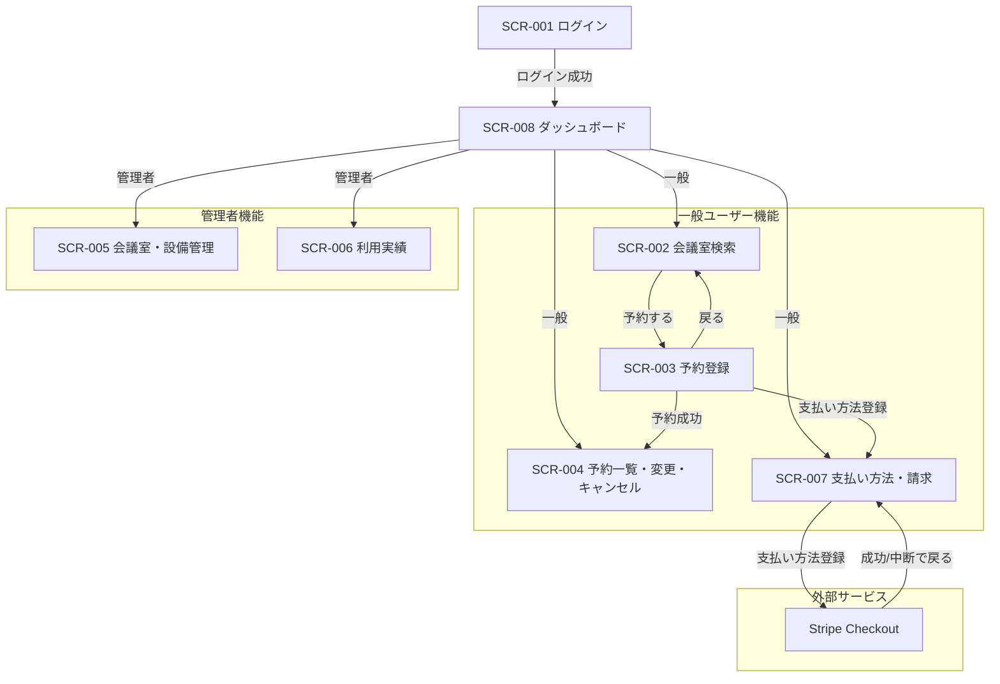

# 1. 概要

MeetRoom の画面(SCR-XXX)の一覧。

- 各画面の項目・イベント・入力チェック・表示制御は各 SCR 文書に定義する。
- 作成・更新前に `../11_トレーサビリティ/traceability_sequence_design.md` で関連SEQを特定し、ユーザー操作・入力・API契機・正常/エラー表示・遷移を反映する。
- 画面表示文言(MSG-XXX)はカタログを設けず、各画面が参照する MSG を当該 SCR 文書の「メッセージ一覧」節にインライン定義する。
- 各 SCR 文書はその節を ID で参照する。

# 2. 画面遷移図

各画面(SCR-XXX)間の遷移を俯瞰する。遷移の契機・条件・引き継ぎ項目・エラー時表示の正本は各 SCR 文書の「画面遷移」「画面イベント」節とし、本図はその集約として全体像を示す。

- ログイン後は SCR-008 ダッシュボードへ着地し、利用者のロールに応じた導線で各機能へ遷移する(一般＝検索/予約一覧/支払い・請求、管理者＝管理/実績)。
- 認証が必須の画面(SCR-002〜SCR-008)は、API 呼び出しでの認証失敗・未認証アクセス時に SCR-001(ログイン)へ遷移する。全画面共通のため図では省略する。

# 3. 一覧

<!-- 標準列。トレース元＝実現元の上流ID(UC)、主要依存＝呼び出す下流ID(API)。該当なしは「-」。URL は画面種別の固有列 -->

| ID | 名称 | 概要 | URL | トレース元 | 主要依存 |
|---|---|---|---|---|---|
| SCR-001 | ログイン | メールアドレスとパスワードで本人確認を行うログイン画面 | /login | CFR-001/UC-01 | API-001 |
| SCR-002 | 会議室検索 | 日時・人数・設備を条件に空き会議室を検索する画面 | /rooms | FR-001/UC-01, FR-002/UC-01 | API-002, API-009 |
| SCR-003 | 予約登録 | 選択した会議室・日時にタイトルを入力して予約を登録する画面 | /reservations/new | FR-002/UC-01 | API-003 |
| SCR-004 | 予約一覧・変更・キャンセル | 自分の予約の一覧表示・変更・キャンセルを行う画面 | /reservations | FR-003/UC-01, FR-003/UC-02 | API-006, API-004, API-005 |
| SCR-005 | 会議室・設備管理 | 管理者が会議室（利用単価含む）と設備を登録・編集する画面 | /admin/rooms | FR-005/UC-01 | API-007, API-009, API-013, API-014 |
| SCR-006 | 利用実績 | 管理者が会議室別の月次利用実績を確認する画面 | /admin/reports | FR-006/UC-01 | API-008 |
| SCR-007 | 支払い方法・請求 | 支払い方法登録と当月利用量・請求見込み・請求履歴を確認する画面 | /billing | FR-008/UC-01, FR-008/UC-02 | API-010, API-012 |
| SCR-008 | ダッシュボード | ログイン後の起点。ロールに応じた利用可能機能への導線と利用状況サマリを表示する画面 | /dashboard | CFR-008/UC-01 | API-006, API-008, API-012 |
