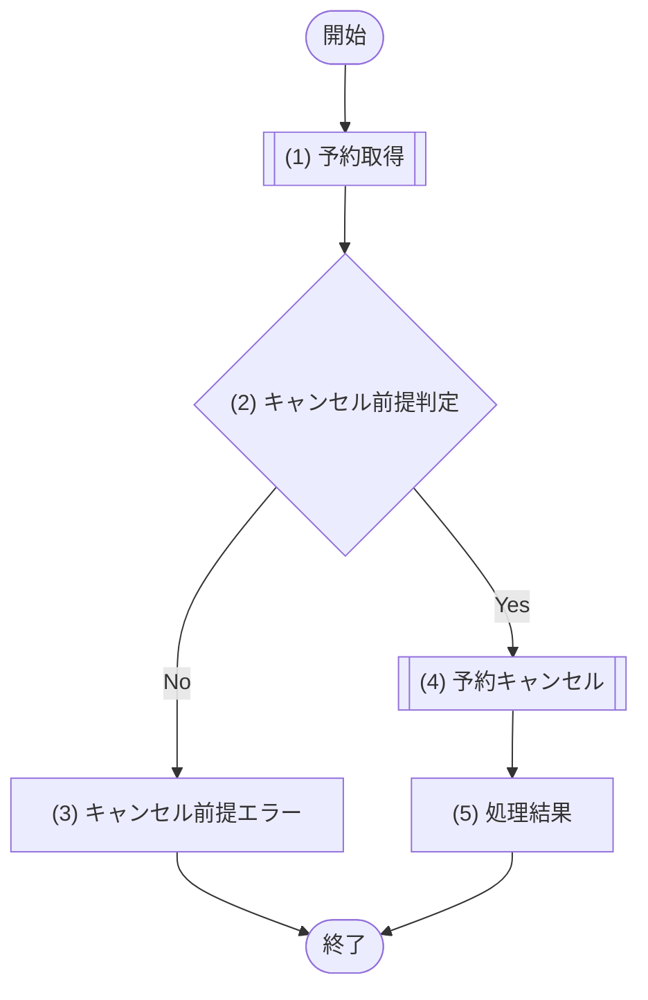

# 1. 基本情報

| 項目 | 内容 |
|---|---|
| API ID | API-005 |
| API名 | 予約キャンセル |
| メソッド | POST |
| パス | /api/reservations/{id}/cancel |
| 認証 | 要 |
| 認可 | 一般=可, 管理者=可(いずれも予約者本人の予約のみ) |
| 冪等性 | なし(POST。ただしキャンセル済みの予約の再送は ERR-005 となり、二重取消は発生しない) |
| トレース元 | FR-003/UC-02 |
| 概要 | 予約者本人が自分の予約をキャンセルし、予約ステータスをキャンセルに更新する。キャンセル済み・完了済み・開始済みの予約はキャンセルできない。 |

# 2. リクエスト

| 項目名 | 型 | 必須 | 説明・制約 |
|---|---|---|---|
| 予約ID | int | Yes | パスパラメータ。キャンセル対象の予約ID |

# 3. レスポンス

| 項目 | 内容 |
|---|---|
| HTTPステータス | 200 |

| 項目名 | 型 | 説明 |
|---|---|---|
| 予約ID | int | 予約の一意な識別子 |
| 予約ステータス | int | 共通コード定義/CODE-004(キャンセル) |

# 4. 処理フロー

この API の基本フローをフローチャートで定義する。

# 5. 処理詳細

処理フローの各処理で行う内容を定義する。

## (1) 予約取得

キャンセル対象の予約を予約IDで取得する(予約者に限定せず取得し、予約者本人かどうかは (2) キャンセル前提判定で判定する)。該当が無い場合は NULL を返す。

| MOD-ID | 処理名 |
|---|---|
| MOD-003 | 予約取得処理 |

| 引数項目 | 値 |
|---|---|
| 予約ID | リクエスト.予約ID |

## (2) キャンセル前提判定

(1) 予約取得の結果が、予約キャンセルの前提を満たすかを判定する。

### 条件定義

| No | 判定対象 | 条件 |
|---|---|---|
| 条件(1) | (1) 予約取得の結果 | != NULL |
| 条件(2) | (1) 予約取得の結果.予約者 | 認証済みユーザー本人である |
| 条件(3) | (1) 予約取得の結果.予約ステータス | 予約済(1) である |
| 条件(4) | (1) 予約取得の結果.利用開始日時 | 現在日時 ＜ 利用開始日時 |

### 条件分岐マトリクス

条件は ◯=満たす・×=満たさない・-=判定しない、処理は ◯=そのパターンで実行・-=実行しない で表す。

| 条件・処理 | #1 正常 | #2 予約なし | #3 他者 | #4 キャンセル不可状態(完了含む) | #5 開始済み |
|---|---|---|---|---|---|
| 条件(1) | ◯ | × | ◯ | ◯ | ◯ |
| 条件(2) | ◯ | - | × | ◯ | ◯ |
| 条件(3) | ◯ | - | - | × | ◯ |
| 条件(4) | ◯ | - | - | - | × |
| 処理 |  |  |  |  |  |
| (4) 予約キャンセルへ進む | ◯ | - | - | - | - |
| (3) キャンセル前提エラーへ進む | - | ◯ | ◯ | ◯ | ◯ |

処理結果以外の処理のため、処理結果は「なし」とする。

| 項目名 | データ型 | 値 | 説明 |
|---|---|---|---|
| なし | - | - | - |

## (3) キャンセル前提エラー

予約キャンセルの前提を満たさない(予約なし、他者の予約、キャンセル不可状態、開始済み)場合のエラーレスポンスを返却する。

| エラーコード | 引数 | 値 |
|---|---|---|
| ERR-005(予約なし / キャンセル不可状態(完了含む) / 開始済み) | {0} 予約ID | リクエスト.予約ID |
| ERR-013(他者の予約) | {0} 予約ID | リクエスト.予約ID |

## (4) 予約キャンセル

対象予約の予約ステータスをキャンセルに更新する。

| MOD-ID | 処理名 |
|---|---|
| MOD-003 | 予約キャンセル処理 |

| 引数項目 | 値 |
|---|---|
| 予約ID | (1) 予約取得の結果.予約ID |

## (5) 処理結果

キャンセルした予約情報をレスポンスとして返却する。

| 項目名 | データ型 | 値 | 説明 |
|---|---|---|---|
| 予約ID | Integer | (4) 予約キャンセルの結果 | 返却する予約ID |
| 予約ステータス | Integer | (4) 予約キャンセルの結果(共通コード定義/CODE-004) | 返却する予約ステータス |

# 6. バリデーション

入力バリデーションの構文ルールを、成立条件(AND / OR の論理式)で定義する。

| 項目名 | 成立条件 | エラーメッセージ |
|---|---|---|
| 予約ID | 指定あり AND int | 対象の予約を指定してください |
