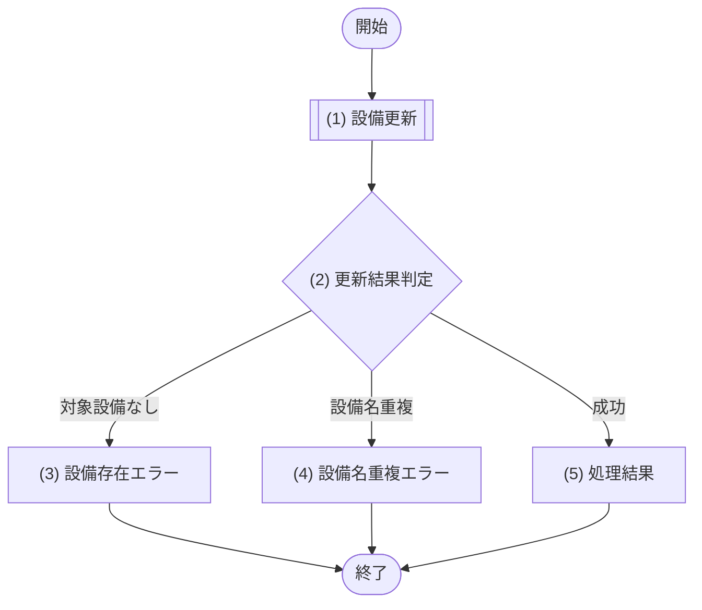

# 1. 基本情報

| 項目 | 内容 |
|---|---|
| API ID | API-015 |
| API名 | 設備更新 |
| メソッド | PUT |
| パス | /api/equipments/{id} |
| 認証 | 要 |
| 認可 | 一般=不可, 管理者=可 |
| 冪等性 | あり(同一設備名の再送でも結果は同じ。対象設備の設備名を指定内容に更新する) |
| トレース元 | FR-005/UC-01 |
| 概要 | 管理者が既存設備の設備名を更新する。設備名は一意。 |

# 2. リクエスト

| 項目名 | 型 | 必須 | 説明・制約 |
|---|---|---|---|
| 設備ID | int | Yes | パスパラメータ。更新対象の設備ID |
| 設備名 | string | Yes | 50文字以内。既存設備と重複不可 |

# 3. レスポンス

| 項目 | 内容 |
|---|---|
| HTTPステータス | 200 |

| 項目名 | 型 | 説明 |
|---|---|---|
| 設備ID | int | 設備の一意な識別子 |
| 設備名 | string | 設備の名称 |

# 4. 処理フロー

この API の基本フローをフローチャートで定義する。

# 5. 処理詳細

処理フローの各処理で行う内容を定義する。

## (1) 設備更新

対象設備の設備名を更新する。

- 更新対象の設備が存在するかを確認する。
- 更新後の設備名が他の既存設備と重複しないかを確認する。

| MOD-ID | 処理名 |
|---|---|
| MOD-004 | 設備更新処理 |

| 引数項目 | 値 |
|---|---|
| 設備ID | リクエスト.設備ID |
| 設備名 | リクエスト.設備名 |
| 利用者ID | 認証済みユーザーID(監査ログ記録の操作者) |

## (2) 更新結果判定

(1) 設備更新の結果をもとに、更新対象の設備が存在し、設備名が既存設備と重複していないかを判定する。

### 条件定義

| No | 判定対象 | 条件 |
|---|---|---|
| 条件(1) | (1) 設備更新の対象設備存在確認結果 | 対象設備が存在する(= true) |
| 条件(2) | (1) 設備更新の重複確認結果 | 設備名重複あり=false である |

### 条件分岐マトリクス

条件は ◯=満たす・×=満たさない、処理は ◯=そのパターンで実行・-=実行しない で表す。

| 条件・処理 | #1 成功 | #2 対象設備なし | #3 設備名重複 |
|---|---|---|---|
| 条件(1) | ◯ | × | ◯ |
| 条件(2) | ◯ | - | × |
| 処理 |  |  |  |
| (5) 処理結果へ進む | ◯ | - | - |
| (3) 設備存在エラーへ進む | - | ◯ | - |
| (4) 設備名重複エラーへ進む | - | - | ◯ |

処理結果以外の処理のため、処理結果は「なし」とする。

| 項目名 | データ型 | 値 | 説明 |
|---|---|---|---|
| なし | - | - | - |

## (3) 設備存在エラー

更新対象の設備が存在しない場合のエラーレスポンスを返却する。

| エラーコード | 引数 | 値 |
|---|---|---|
| ERR-017 | {0} 設備ID | リクエスト.設備ID |

## (4) 設備名重複エラー

更新結果判定で設備名が既存設備と重複していた場合のエラーレスポンスを返却する。

| エラーコード | 引数 | 値 |
|---|---|---|
| ERR-011 | {0} 設備名 | リクエスト.設備名 |

## (5) 処理結果

更新した設備情報をレスポンスとして返却する。

| 項目名 | データ型 | 値 | 説明 |
|---|---|---|---|
| 設備ID | Integer | (1) 設備更新の結果 | 返却する設備ID |
| 設備名 | String | (1) 設備更新の結果 | 返却する設備名 |

# 6. バリデーション

入力バリデーションの構文ルールを、成立条件(AND / OR の論理式)で定義する。

- 入力検証エラーはトップレベル ERR-006(バリデーションエラー)の封筒で返し、項目単位の違反は details[] に各サブコード(必須項目未入力=ERR-014 / 桁数超過=ERR-015)を設定する(封筒構造は API-COM_共通設計.md §4)。

| 項目名 | 成立条件 | エラーメッセージ |
|---|---|---|
| 設備ID | 指定あり AND int | 対象の設備を指定してください |
| 設備名 | 指定あり AND string AND 文字数 ＜＝ 50 | 未入力の場合は必須項目未入力(ERR-014 {0}=設備名)、50文字を超える場合は桁数超過(ERR-015 {0}=設備名, {1}=50) |
