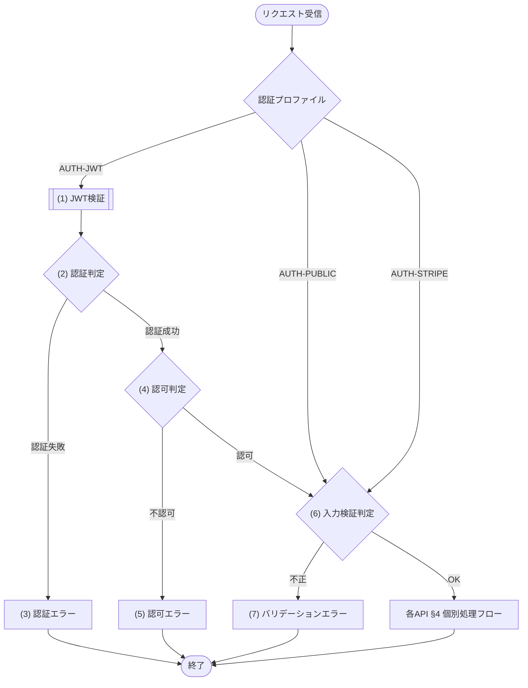

# 1. 概要

MeetRoom の全 REST API に適用される共通仕様(認証プロファイル・共通ヘッダ・エラーレスポンス封筒・ページネーション・相関ID・冪等受付・版管理・タイムアウト)の正本。論理契約は IFC-001〜IFC-015（01_概要設計/04_論理インターフェース契約.md）を入力とする。
各 API 文書には本書との差分のみを記載する(再記載は禁止)。

# 2. 認証

| 項目 | 内容 |
|---|---|
| 方式 | Bearer JWT(Authorization: Bearer {token}) |
| トークン取得 | API-001 で取得 |
| 有効期限 | 24時間 |

## 2.1 JWT 仕様

JWT の発行・検証仕様を定義する。秘密鍵は実行基盤の秘密情報として管理し、コード・リポジトリには含めない。

| 項目 | 内容 |
|---|---|
| 署名方式 | HS256(HMAC-SHA-256) |
| 発行・検証方法 | MOD-008 認証暗号サービスの JWT発行処理・JWT検証処理を利用する |
| 外部ライブラリ直接利用 | 外部ライブラリ利用専用モジュール以外の API・JOB・モジュールからの直接利用は禁止 |
| 秘密鍵 | 実行基盤の秘密情報として管理する JWT 署名秘密鍵 |
| 必須情報 | ユーザーID、ロール、発行日時、有効期限 |
| 認証主体ロール | 共通コード定義/CODE-001 のユーザーロールを設定する |
| 認可判定 | 認証主体ロールを CFR-002 の権限マトリクス(機能×ロール)に照合して判定する |
| 有効期限判定 | 現在時刻が有効期限以下であること |

## 2.2 認証プロファイル

| プロファイル | 対象 | 共通前処理 | 認可 |
|---|---|---|---|
| AUTH-JWT | API-002〜010、API-012〜015 | Bearer JWT検証後、ロールと本人条件を検証する | 各API §1とCFR-002 |
| AUTH-PUBLIC | API-001 | JWT検証を行わず、入力検証とログインレート制御を行う | 認証前のため不要 |
| AUTH-STRIPE | API-011 | JWT検証を行わず、生payloadを保持してMOD-007へ渡し、Stripe-Signatureを検証する | 署名検証成功時だけ反映 |

- 「認証不要」は共通前処理自体を省略する意味ではない。AUTH-PUBLIC は入力検証、AUTH-STRIPE は署名検証を必ず行う。
- JWT失効方式を使用する場合はJWTの一意識別子をKVの失効情報と照合する。KV障害時の扱いは認証失敗ではなく依存先停止(ERR-023)とする。

# 3. 共通リクエストヘッダ

| ヘッダ | 値 | 対象 |
|---|---|---|
| Authorization | Bearer {token} | 認証「要」の API |
| Content-Type | application/json | 全 API |
| X-Request-ID | 呼出元が生成した相関ID。未指定時はWorkersが生成 | 全 API |
| X-API-Version | `1`。未指定時もv1として扱う | 全 API |
| Idempotency-Key | 呼出元が生成した一意キー | 副作用を持つPOST（API-003/005/007登録/010/013） |

全レスポンスに `X-Request-ID` を返す。WebhookはStripeのEvent IDも相関属性として記録するが、X-Request-IDの代替にはしない。

# 4. エラーレスポンス

全 API のエラーは以下の封筒形式で返す。message は エラーメッセージ一覧.md で定義する開発者向けメッセージを設定する。
ERR-XXX の定義(エラー名・HTTPステータス・開発者向けメッセージ)は エラーメッセージ一覧.md が正本(システム全体を通した連番で一元管理)。本書・各 API 文書は再掲せずエラーコードで参照する。エラーの発生条件は定義側に持たせず、共通エラー(区分=共通)は §7 共通処理フロー、API 固有エラー(区分=固有)は各 API 文書 §4/§5 個別処理フローで表現する。

```json
{
  "error": {
    "code": "ERR-006",
    "message": "Validation failed",
    "request_id": "req-...",
    "details": [
      { "field": "room_name", "code": "ERR-014", "message": "会議室名は必須です" }
    ]
  }
}
```

| 項目 | 内容 |
|---|---|
| error.code | エラーコード |
| error.message | 開発者向けメッセージ(エラーメッセージ一覧.md で定義) |
| error.request_id | 問い合わせ・ログ相関に使用するX-Request-IDと同じ値 |
| error.details[] | 項目単位のエラー明細。どの項目のどのルールに反したかを判別できるようにする |
| error.details[].field | 対象項目のパラメータ名(各 API §2 リクエストのパラメータ名) |
| error.details[].code | 違反の粒度サブコード(区分=詳細: ERR-014 必須項目未入力 / ERR-015 桁数超過 / ERR-016 入力値制約違反 / ERR-019 形式不正)。エラーメッセージ一覧.md が正本 |
| error.details[].message | 違反したルールの内容(各 API §6 バリデーションのエラーメッセージ列で定義) |

バリデーションエラーは、トップレベル error.code=ERR-006 とし、違反した項目ごとに details[] を1件ずつ設定する。各 details[] には field と粒度サブコード code(ERR-014/015/016/019)を持たせ、1リクエストの複数項目違反を1レスポンスで表現する。details[] を持たないエラーは details を空配列 [] とする。日時整合(開始≥終了=ERR-012)など単一項目に閉じない業務起因の検証はトップレベル固有コードで返す。

## 4.1 共通エラー一覧

共通処理フロー(§7)で全 API 共通に発生するエラー(区分=共通)。定義(エラー名・HTTPステータス・開発者向けメッセージ)は エラーメッセージ一覧.md が正本のため再掲せず、本書は該当エラーコードと共通処理フロー上の発生箇所のみを示す。各エラーの発生条件は §7 共通処理フローで表現する。

| エラーコード | 発生箇所 |
|---|---|
| ERR-001 | (2) 認証判定 |
| ERR-002 | (4) 認可判定 |
| ERR-006 | (6) 入力検証判定 |
| ERR-020 | 予期しない内部障害。詳細をレスポンスへ露出せずX-Request-IDで追跡する |
| ERR-021 | APIまたは依存先のタイムアウト |
| ERR-022 | レート制限超過。Retry-Afterを返す |
| ERR-023 | D1/KV/外部依存先の一時停止 |
| ERR-024 | 同じIdempotency-Keyに異なるリクエスト内容を指定 |
| ERR-025 | 期待状態不一致・同時更新による競合 |

# 5. ページネーション

一覧系 API は以下のクエリパラメータとレスポンス形式を用いる。

| パラメータ | 配置 | 型 | 既定値 | 制約 |
|---|---|---|---|---|
| page | query | int | 1 | 1始まり |
| limit | query | int | 20 | 最大100 |

```json
{ "items": [...], "page": n, "limit": n, "total": n }
```

# 6. 共通規約

| 項目 | 規約 |
|---|---|
| 日時形式 | ISO 8601(保存UTC・表示 Asia/Tokyo) |
| 文字コード | UTF-8 |
| 認証エラー | 全APIで ERR-001 |
| 認可エラー | 全APIで ERR-002 |
| 内部API版 | 現行はv1。X-API-Version未指定もv1。破壊的変更は `/api/v2` とし、v1内は任意項目追加等の後方互換変更だけを行う |
| クライアントタイムアウト | UIからAPIへの要求は10秒。タイムアウト後の副作用API再送は同じIdempotency-Keyを使用する |

# 7. 共通処理フロー

全 REST API は、各 API 文書 §4 の個別処理フローに入る前に認証プロファイルを選択する。JWT検証・ロール認可はAUTH-JWTだけに適用し、AUTH-PUBLICとAUTH-STRIPEへ誤適用しない。入力バリデーション、相関ID、一般例外変換は全プロファイルに適用する。



## 共通処理詳細

共通処理フローの各処理((1)〜(7))で行う内容を、個別 API の §5 処理詳細と同じ形式で定義する。(1)〜(5)はAUTH-JWTだけが通過し、AUTH-PUBLIC/AUTH-STRIPEは(6)へ進む。

- 取得・検証・整形(JWT検証)の結果を判定する段階は、その取得・検証・整形処理を独立したステップとして先に定義し、判定はその結果を参照する。
- 各判定は、失敗すると §4 エラーレスポンスの封筒でエラーを返す。
- 各判定は、成功すると次の処理(最後は各 API §4 個別処理フロー)へ進む。

### (1) JWT検証

Authorization ヘッダの Bearer トークンを検証し、認証主体(ユーザーID・ロール)と有効性を得る。

- 署名・有効期限・必須クレームの検証は §2 認証・§2.1 JWT仕様に従い MOD-008 認証暗号サービスに委譲する。
- トークンが無い・不正な場合も含め、検証結果を (2) 認証判定へ渡す。

| MOD-ID | 処理名 |
|---|---|
| MOD-008 | JWT検証処理 |

| 引数項目 | 値 |
|---|---|
| トークン | Authorization ヘッダの Bearer トークン |

### (2) 認証判定

(1) JWT検証の結果が有効かを判定し、認証の成否を決める。トークン未指定・無効・期限切れの場合は ERR-001 を返す。

#### 条件定義

| No | 判定対象 | 条件 |
|---|---|---|
| 条件(1) | Authorization ヘッダの Bearer トークン | != NULL |
| 条件(2) | (1) JWT検証の結果.有効 | = true |

#### 条件分岐マトリクス

条件は ◯=満たす・×=満たさない・-=判定しない、処理は ◯=そのパターンで実行・-=実行しない で表す。

| 条件・処理 | #1 認証成功 | #2 トークンなし | #3 検証失敗 |
|---|---|---|---|
| 条件(1) | ◯ | × | ◯ |
| 条件(2) | ◯ | - | × |
| 処理 |  |  |  |
| (4) 認可判定へ進む | ◯ | - | - |
| (3) 認証エラーへ進む | - | ◯ | ◯ |

処理結果以外の処理のため、処理結果は「なし」とする。

| 項目名 | データ型 | 値 | 説明 |
|---|---|---|---|
| なし | - | - | - |

### (3) 認証エラー

認証に失敗した(トークン未指定・無効・期限切れ)場合のエラーレスポンスを返却する。

| エラーコード | 引数 | 値 |
|---|---|---|
| ERR-001 | なし | ― |

### (4) 認可判定

認証主体のロールが、当該 API に許可された操作かを判定する。

- 判定は各 API 文書 §1 基本情報の認可と CFR-002 の権限マトリクス(§9)に従う。
- 許可されない場合は ERR-002 を返す。

#### 条件定義

| No | 判定対象 | 条件 |
|---|---|---|
| 条件(1) | (1) JWT検証の結果.ロール | 当該 API の認可(各 API §1 基本情報)で許可される(CFR-002) |

#### 条件分岐マトリクス

条件は ◯=満たす・×=満たさない、処理は ◯=そのパターンで実行・-=実行しない で表す。

| 条件・処理 | #1 認可 | #2 不認可 |
|---|---|---|
| 条件(1) | ◯ | × |
| 処理 |  |  |
| (6) 入力検証判定へ進む | ◯ | - |
| (5) 認可エラーへ進む | - | ◯ |

処理結果以外の処理のため、処理結果は「なし」とする。

| 項目名 | データ型 | 値 | 説明 |
|---|---|---|---|
| なし | - | - | - |

### (5) 認可エラー

認証主体のロールが当該 API に許可されていない場合のエラーレスポンスを返却する。

| エラーコード | 引数 | 値 |
|---|---|---|
| ERR-002 | なし | ― |

### (6) 入力検証判定

リクエストが各 API 文書 §2 リクエスト・§6 バリデーションの構文ルール(必須・型・形式・単項目制約・項目間相関)を満たすかを判定する。

- 満たさない場合はトップレベル ERR-006 を返し、違反項目ごとに §4 エラーレスポンスの details[] を設定して、どの項目で違反したかを判別できるようにする。各 details[] の code には違反ルール種別に応じた粒度サブコードを設定する(必須欠落=ERR-014 / 桁数超過=ERR-015 / 単項目の範囲・制約違反=ERR-016 / 型・形式不正=ERR-019)。各 API 文書 §6 バリデーションの各ルールはこのマッピングに従って details[].code を決める(§6表に code 列は持たせない)。
- 項目間相関(単一項目に閉じない検証。例: 利用開始 ＜ 利用終了)は details[] ではなく、該当する固有エラーコードをトップレベルで返す(例: 日時整合=ERR-012)。
- DB 参照・業務ルールを伴う判定はここに含めず、各 API §4 個別処理フローで行う(範囲は「入力バリデーションの範囲」)。

#### 条件定義

| No | 判定対象 | 条件 |
|---|---|---|
| 条件(1) | リクエスト各項目 | 各 API §6 バリデーションの成立条件をすべて満たす |

#### 条件分岐マトリクス

条件は ◯=満たす・×=満たさない、処理は ◯=そのパターンで実行・-=実行しない で表す。

| 条件・処理 | #1 正常 | #2 構文不正 |
|---|---|---|
| 条件(1) | ◯ | × |
| 処理 |  |  |
| 各 API §4 個別処理フローへ進む | ◯ | - |
| (7) バリデーションエラーへ進む | - | ◯ |

処理結果以外の処理のため、処理結果は「なし」とする。

| 項目名 | データ型 | 値 | 説明 |
|---|---|---|---|
| なし | - | - | - |

### (7) バリデーションエラー

リクエストが構文ルールを満たさない場合のエラーレスポンスを返却する。

| エラーコード | 引数 | 値 |
|---|---|---|
| ERR-006 | 違反項目明細(details[]) | 違反項目ごとに field=違反項目・message=違反したルール内容を設定 |

※ ERR-006 はメッセージのプレースホルダを持たず、エラー明細(details[])に違反内容を設定する点が他のエラーノードと異なる(封筒構造は §4 が正本)。

## 入力バリデーションの範囲

(6) 入力バリデーションが検証するのは、リクエスト単体で機械的に判定できる構文的チェックに限る。

| 区分 | 内容 |
|---|---|
| 必須 | 必須項目が指定されている |
| 型 | 値の型が正しい |
| 形式 | 日付・時刻・コード等の形式が正しい |
| 単項目制約 | 文字数・数値範囲・許可値など1項目で判定できる制約 |
| 項目間相関 | 開始＜終了など複数項目の相関 |

DB 参照や業務ルールを伴う判定(存在確認・重複・期間制約・状態遷移など)は共通フローに含めず、各 API 文書 §4 個別処理フローで業務判定として定義する(返すエラーは判定内容による)。

# 8. 相関ID・運用ログ

| 項目 | 規約 |
|---|---|
| 受付 | X-Request-IDを受理し、未指定または形式不正ならWorkersが一意値を生成する |
| 伝播 | API→MOD→SQL/外部IF、API→Queueメッセージへ同じ相関IDを伝播する |
| 応答 | 成功・失敗を問わずレスポンスヘッダへX-Request-IDを返す。エラー封筒にもrequest_idを設定する |
| ログ | 認証主体ID（取得できる場合）、API-ID、HTTP結果、処理時間、Idempotency-Keyのハッシュ、外部リクエストIDを構造化属性として記録する。秘密情報・生パスワード・カード情報は記録しない |

# 9. 冪等受付

- API-003/005/007(登録)/010/013 は `Idempotency-Key` を必須とする。
- `{認証主体}:{API-ID}:{Idempotency-Key}` をキーとして、リクエスト本文ハッシュ、処理状態、HTTP結果をKVへ24時間保持する。
- 同一キー・同一ハッシュの再送は保存済み結果を返す。処理中は409、同一キー・異なるハッシュはERR-024を返す。
- 業務DBの一意制約・条件付き更新も併用し、KVだけを業務整合性の根拠にしない。
- API-001は資格情報検証のためIdempotency-Key対象外、API-011はStripe Event IDとTBL-010を使用する。

# 10. 版管理・互換性

- 現行 `/api/...` を内部API v1として扱い、`X-API-Version: 1` を返す。
- v1では任意項目・新規エンドポイント・新規エラーコードの追加だけを許可し、既存項目の削除、型変更、意味変更を行わない。
- 破壊的変更は `/api/v2/...` として並行提供し、利用中クライアント、移行期限、廃止日を運用設計で管理する。

# 11. タイムアウト・再試行

| 境界 | タイムアウト | 自動再試行 |
|---|---|---|
| UI→API | 10秒 | GETのみ利用者操作またはUIで再取得可。副作用POSTは同じIdempotency-Keyで再要求する |
| Workers→D1/KV | API全体の10秒以内に収める | 同期API内で無条件再試行しない。busy/一時障害はERR-023へ変換する |
| Workers→Stripe/Resend | 1回5秒 | 同期APIでは自動再試行しない。Queue Consumerはtimeout/429/一時的5xxだけを指数バックオフ＋jitterで最大3回再試行する |

- 4xx（429を除く）、署名不正、業務競合は再試行しない。
- 最大回数後はDLQへ移動し、OPS-002のアラートを発報する。
