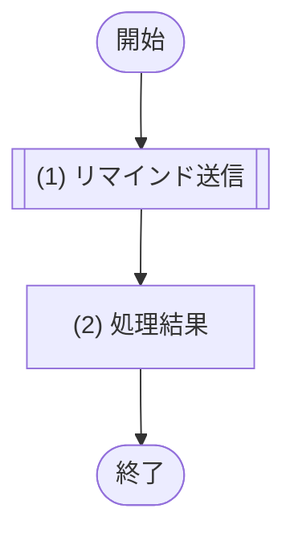

# 1. 基本情報

| 項目 | 内容 |
|---|---|
| ジョブID | JOB-001 |
| ジョブ名 | 予約リマインド通知 |
| 実行契機 | 定期(Cloudflare Cron Trigger) |
| スケジュール | */15 * * * *(15分毎、Cloudflare Cron Trigger) |
| 多重起動 | 禁止(Cron Trigger による起動は単一。DEF-001/SET-008 条件で冪等処理し二重送信しない) |
| 冪等性 | あり(DEF-001/SET-008 のみ抽出するため再実行しても二重送信しない) |
| リトライ方針 | 送信失敗時の再送(最大3回)、継続失敗時の失敗記録と管理者(DEF-001/CODE-001)への通知、送信成功時の送信済み更新は、いずれも MOD-006(通知サービス)が担当する |
| 想定処理件数 / 時間 | 最大100件・1分以内(正常時) |
| トレース元 | FR-004 |
| 概要 | 開始30分以内の予約済・リマインド未送信の予約について、MOD-006(通知サービス)が予約者へメールでリマインド通知する。対象抽出・送信・送信状態更新・失敗時の再送と管理者通知は MOD-006 が担当する。 |

# 2. 起動パラメータ

| 項目名 | 型 | 必須 | 説明・制約 |
|---|---|---|---|
| なし | - | - | 定期実行のみ。起動パラメータは受け取らない |

# 3. 処理対象

| 対象 | 抽出条件 |
|---|---|
| TBL-003 | 開始前・リマインド未送信の予約(抽出条件の詳細は (1) リマインド送信(MOD-006)が担当) |

# 4. 処理フロー

このジョブの基本フローをフローチャートで定義する。

# 5. 処理詳細

処理フローの各処理で行う内容を定義する。

## (1) リマインド送信

リマインド対象の予約者へリマインド通知を送信する。対象の抽出・送信・送信状態の更新・失敗時の再送と管理者通知は呼び出し先へ委譲する。

| MOD-ID | 処理名 |
|---|---|
| MOD-006 | リマインド送信処理 |

| 引数項目 | 値 |
|---|---|
| リマインド閾値分 | 事前通知分数(30分) |

## (2) 処理結果

ジョブの実行結果として返却・記録する項目を定義する。

| 項目名 | データ型 | 値 | 説明 |
|---|---|---|---|
| 対象件数 | Integer | (1) リマインド送信の結果の送信済件数と失敗件数の合計 | 返却する対象件数 |
| 送信成功件数 | Integer | (1) リマインド送信の結果.送信済件数 | 返却する送信成功件数 |
| 失敗件数 | Integer | (1) リマインド送信の結果.失敗件数 | 返却する失敗件数 |
| 実行ログ | Object | 開始・終了時刻、各件数(対象・送信成功・失敗) | 返却する実行ログ |

# 6. 実行結果・出力

| 項目名 | 内容 |
|---|---|
| 対象件数 | (1) リマインド送信の結果の送信済件数と失敗件数の合計 |
| 送信成功件数 | (1) リマインド送信の結果.送信済件数 |
| 失敗件数 | (1) リマインド送信の結果.失敗件数 |
| 実行ログ | 開始・終了時刻、各件数(対象・送信成功・失敗) |

# 7. エラー時の対応

| エラー条件 | エラー | 対応 | 通知 |
|---|---|---|---|
| 個別予約のメール送信失敗(再送しても送信不可) | - | MOD-006 が該当予約を失敗として記録し、1件の失敗を全体に波及させず継続する | 要(MOD-006 が管理者へ通知) |
