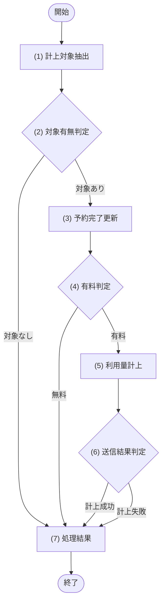

# 1. 基本情報

| 項目 | 内容 |
|---|---|
| ジョブID | JOB-002 |
| ジョブ名 | 利用量の従量課金計上 |
| 実行契機 | 定期(Cloudflare Cron Trigger) |
| スケジュール | */15 * * * *(15分毎、Cloudflare Cron Trigger) |
| 多重起動 | 禁止(Cron Trigger による起動は単一。予約は DEF-001/SET-005 条件で抽出し、利用量記録は予約IDの一意性と計上ステータス条件で冪等処理する) |
| 冪等性 | あり(完了処理は DEF-001/SET-005 のみ対象、利用量は予約IDで二重記録せず、DEF-001/SET-012 の記録は再送しないため、再実行しても二重計上しない) |
| リトライ方針 | Meter Event 送信、送信失敗時の記録保持、次回実行での再送、計上ステータスの更新は、いずれも MOD-007(課金サービス)が担当する。Stripe 障害時も利用量記録は保持し、利用量を消失させない |
| 想定処理件数 / 時間 | 最大100件・1分以内(正常時) |
| トレース元 | FR-008 |
| 概要 | 終了時刻を過ぎた予約済の予約を完了にし、有料会議室(利用単価>0)の予約は利用量を計上して Stripe へ Meter Event として送信する(計上・送信は MOD-007 が担当)。送信に失敗した記録は次回実行で再送する。 |

# 2. 起動パラメータ

| 項目名 | 型 | 必須 | 説明・制約 |
|---|---|---|---|
| なし | - | - | 定期実行のみ。起動パラメータは受け取らない |

# 3. 処理対象

| 対象 | 抽出条件 |
|---|---|
| TBL-003 | 完了・計上対象: 利用終了日時が現在時刻を過ぎた DEF-001/SET-005 の予約(あわせて会議室の利用単価を取得する) |
| TBL-007 | Meter Event の再送対象: DEF-001/SET-013 の利用量記録 |

# 4. 処理フロー

このジョブの基本フローをフローチャートで定義する。対象ごとに (3)〜(6) を繰り返す。

# 5. 処理詳細

処理フローの各処理で行う内容を定義する。

## (1) 計上対象抽出

このジョブで計上・再送すべき対象(終了した予約済の予約と Meter Event 再送対象の利用量記録)を抽出する。あわせて有料判定・計上に用いる会議室の利用単価も取得する。該当が無い場合は空配列(0件)を返す。

| 参照項目 | 値 |
|---|---|
| 現在時刻 | ジョブ実行時刻 |

| 項目名 | データ型 | 値 | 説明 |
|---|---|---|---|
| 計上対象一覧 | Object[] | 終了した予約済の予約と Meter Event 再送対象の利用量記録。該当が無い場合は空配列 | 返却する計上対象一覧 |
| - 対象予約 | Object | 終了済み予約(新規計上対象) | 返却する対象予約 |
| - 利用量記録 | Object | Meter Event 再送対象の利用量記録(再送対象) | 返却する利用量記録 |
| - 利用単価 | Integer | 対象予約の会議室利用単価 | 返却する利用単価 |

## (2) 対象有無判定

条件定義:

| No | 判定対象 | 条件 |
|---|---|---|
| 条件(1) | (1) 計上対象抽出の結果 | 件数 ＞ 0 |

条件分岐マトリクス:

| 条件・処理 | #1 対象あり | #2 対象なし |
|---|---|---|
| 条件(1) | ◯ | × |
| 処理 |  |  |
| (3) 予約完了更新へ進む | ◯ | - |
| ジョブを正常終了する | - | ◯ |

## (3) 予約完了更新

計上対象の予約を完了状態にする。

・新規計上対象の予約は、予約ステータスを完了に更新する
・再送対象の利用量記録は、対応する予約が既に完了済みのため本処理をスキップする

| 参照項目 | 値 |
|---|---|
| 対象予約 | (1) 計上対象抽出の結果.対象予約 |

| 対象 | 更新内容 |
|---|---|
| TBL-003 | DEF-001/SET-005 → DEF-001/SET-007 |

## (4) 有料判定

対象予約の会議室が有料かを判定する。

条件定義:

| No | 判定対象 | 条件 |
|---|---|---|
| 条件(1) | (1) 計上対象抽出の結果.利用単価 | ＞ 0 |

条件分岐マトリクス:

| 条件・処理 | #1 有料 | #2 無料 |
|---|---|---|
| 条件(1) | ◯ | × |
| 処理 |  |  |
| (5) 利用量計上へ進む | ◯ | - |
| 計上せず次の対象へ進む(課金対象外) | - | ◯ |

| 対象 | 更新内容 |
|---|---|
| なし | - |

## (5) 利用量計上

有料と判定された予約の利用量を計上し、Stripe へ Meter Event として送信する。利用時間の算出・利用量の記録・Meter Event 送信・計上ステータスの更新・送信失敗時の再送対象保持は、すべて呼び出し先へ委譲する。

・新規計上対象は、予約IDと適用単価から利用量を計上する(利用量計上処理)
・再送対象は、既存の利用量記録の Meter Event を再送する(利用量再送処理)

| MOD-ID | 処理名 |
|---|---|
| MOD-007 | 利用量計上処理 |
| MOD-007 | 利用量再送処理 |

| 引数項目 | 値 |
|---|---|
| 予約ID | (1) 計上対象抽出の結果.対象予約の予約ID(利用量計上処理) |
| 適用単価 | (1) 計上対象抽出の結果.利用単価(利用量計上処理) |
| 利用量記録 | (1) 計上対象抽出の結果.利用量記録(利用量再送処理) |

## (6) 送信結果判定

(5) 利用量計上の結果に応じて、対象ごとの計上成否を集計する。計上ステータスの更新・再送対象の保持は MOD-007 が行うため、本処理では件数の集計と継続可否のみを判定する。

・計上に成功した場合は成功件数に計上して次の対象へ進む
・計上に失敗した場合はスキップして継続し、失敗件数に計上する(記録は保持され次回実行で再送される)

条件定義:

| No | 判定対象 | 条件 |
|---|---|---|
| 条件(1) | (5) 利用量計上の結果 | 計上成功(ERR-009 が送出されない) |

条件分岐マトリクス:

| 条件・処理 | #1 計上成功 | #2 計上失敗 |
|---|---|---|
| 条件(1) | ◯ | × |
| 処理 |  |  |
| 成功件数に計上して次の対象へ進む | ◯ | - |
| スキップして継続し失敗件数に計上する | - | ◯ |

| 対象 | 更新内容 |
|---|---|
| なし | - |

## (7) 処理結果

ジョブの実行結果として返却・記録する項目を定義する。

| 項目名 | データ型 | 値 | 説明 |
|---|---|---|---|
| 対象件数 | Integer | (1) 計上対象抽出の結果の件数 | 返却する対象件数 |
| 完了件数 | Integer | (3) 予約完了更新で DEF-001/SET-007 に更新した予約件数 | 返却する完了件数 |
| 成功件数 | Integer | (6) 送信結果判定で計上成功とした件数 | 返却する成功件数 |
| 失敗件数 | Integer | (6) 送信結果判定で計上失敗とした件数 | 返却する失敗件数 |
| 実行ログ | Object | 開始・終了時刻、各件数、失敗した予約ID・利用量記録IDと理由 | 返却する実行ログ |

# 6. 実行結果・出力

| 項目名 | 内容 |
|---|---|
| 対象件数 | (1) 計上対象抽出の結果の件数 |
| 完了件数 | (3) 予約完了更新で DEF-001/SET-007 に更新した予約件数 |
| 成功件数 | (6) 送信結果判定で計上成功とした件数 |
| 失敗件数 | (6) 送信結果判定で計上失敗とした件数 |
| 実行ログ | 開始・終了時刻、各件数、失敗した予約ID・利用量記録IDと理由 |

# 7. エラー時の対応

| エラー条件 | エラー | 対応 | 通知 |
|---|---|---|---|
| 予約完了更新失敗((3) 予約完了更新の更新エラー) | - | 該当予約をスキップして継続し、次回実行で再処理する | 要(管理者へ通知) |
| Meter Event 送信失敗 | ERR-009 | MOD-007 が利用量記録を失敗として保持し、当該記録を次回実行で再送する(スキップして継続) | 不要(次回再送) |
