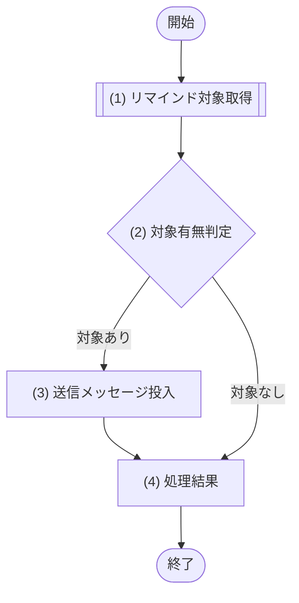

# 1. 基本情報

| 項目 | 内容 |
|---|---|
| ジョブID | JOB-001 |
| ジョブ名 | 予約リマインド通知 |
| 実行契機 | 定期(Cloudflare Cron Trigger) |
| スケジュール | */15 * * * *(15分毎、Cloudflare Cron Trigger) |
| 多重起動 | 禁止(Cron Trigger による起動は単一。共通コード定義/SET-008 条件で冪等処理し二重送信しない) |
| 冪等性 | あり(共通コード定義/SET-008 のみ抽出するため再実行しても二重投入・二重送信しない) |
| リトライ方針 | 送信メッセージの再試行(最大3回)・DLQは Queue境界(Cloudflare Queues)が管理する。DLQ到達後の失敗記録と管理者(共通コード定義/CODE-001)へのアラートは運用が担う。JOB-001 は対象取得とQueueへのメッセージ投入を行う |
| 想定処理件数 / 時間 | 最大100件・1分以内(正常時) |
| トレース元 | FR-004 |
| 概要 | 開始30分以内の予約済・リマインド未送信の予約を MOD-006(通知サービス)で抽出し、対象ごとの送信メッセージを Cloudflare Queues へ投入する。Queue Consumer が1件ずつ MOD-006 で予約者へメール送信し送信状態を更新する。送信の再試行(最大3回)・DLQ は Queue境界が管理し、継続失敗(DLQ到達)の失敗記録・管理者アラートは運用が担う。 |

# 2. 起動パラメータ

| 項目名 | 型 | 必須 | 説明・制約 |
|---|---|---|---|
| なし | - | - | 定期実行のみ。起動パラメータは受け取らない |

# 3. 処理対象

| 対象 | 抽出条件 |
|---|---|
| TBL-003 | 開始前・リマインド未送信の予約(抽出条件の詳細は (1) リマインド対象取得(MOD-006)が担当) |

# 4. 処理フロー

このジョブの基本フローをフローチャートで定義する。

- 送信・送信状態更新は Queue Consumer が対象1件ごとに MOD-006 リマインド送信処理 を実行する。送信の再試行(最大3回)・DLQ は Queue境界が管理し、DLQ到達後の失敗記録・管理者アラートは運用が担うため、本ジョブ(Producer)のフローには含めない。

# 5. 処理詳細

処理フローの各処理で行う内容を定義する。

## (1) リマインド対象取得

リマインド対象(開始前・未送信)の予約を抽出する。該当が無い場合は 0件を返す。

| MOD-ID | 処理名 |
|---|---|
| MOD-006 | リマインド対象取得処理 |

| 引数項目 | 値 |
|---|---|
| リマインド閾値分 | 事前通知分数(30分) |

## (2) 対象有無判定

リマインド対象の予約が存在するかを判定する。

### 条件定義

| No | 判定対象 | 条件 |
|---|---|---|
| 条件(1) | (1) リマインド対象取得の結果 | 件数 ＞ 0 |

### 条件分岐マトリクス

| 条件・処理 | #1 対象あり | #2 対象なし |
|---|---|---|
| 条件(1) | ◯ | × |
| 処理 |  |  |
| (3) 送信メッセージ投入へ進む | ◯ | - |
| 投入せず正常終了する | - | ◯ |

| 項目名 | データ型 | 値 | 説明 |
|---|---|---|---|
| なし | - | - | - |

## (3) 送信メッセージ投入

対象予約ごとに送信メッセージ(予約ID・予約者・固定冪等キー)を Cloudflare Queues へ投入する。Queue Consumer が1件ずつ MOD-006 リマインド送信処理 を実行する。投入自体は JOB/Queue境界のメッセージ生成であり、送信・再試行・DLQ は Queue境界が管理する。

| 参照項目 | 値 |
|---|---|
| 投入対象 | (1) リマインド対象取得の結果.リマインド対象一覧 |

## (4) 処理結果

ジョブの実行結果として返却・記録する項目を定義する。

| 項目名 | データ型 | 値 | 説明 |
|---|---|---|---|
| 対象件数 | Integer | (1) リマインド対象取得の結果の件数 | 抽出したリマインド対象の件数 |
| 投入件数 | Integer | (3) 送信メッセージ投入で投入したメッセージ件数 | Queueへ投入した送信メッセージの件数 |
| 実行ログ | Object | 開始・終了時刻、対象件数、投入件数 | 返却する実行ログ |

# 6. 実行結果・出力

| 項目名 | 内容 |
|---|---|
| 対象件数 | (1) リマインド対象取得の結果の件数 |
| 投入件数 | (3) 送信メッセージ投入で投入したメッセージ件数 |
| 実行ログ | 開始・終了時刻、対象件数、投入件数 |

# 7. エラー時の対応

| エラー条件 | エラー | 対応 | 通知 |
|---|---|---|---|
| リマインド対象取得の失敗 | - | ジョブを中断し、次回の定期実行で再取得する(未送信状態のため二重投入しない) | 不要 |
| 個別メッセージの送信失敗 | - | Queue境界が再配送(最大3回)し、継続失敗はDLQへ移動する(本ジョブの範囲外) | 要(DLQ到達を運用監視が検知し管理者へアラート) |
