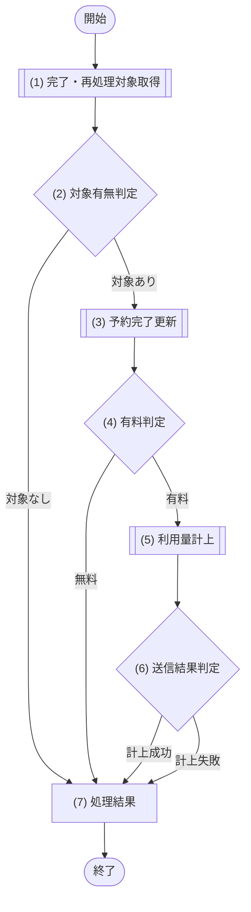

# 1. 基本情報

| 項目 | 内容 |
|---|---|
| ジョブID | JOB-002 |
| ジョブ名 | 利用量の従量課金計上 |
| 実行契機 | 定期(Cloudflare Cron Trigger) |
| スケジュール | */15 * * * *(15分毎、Cloudflare Cron Trigger) |
| 多重起動 | 許容（Queue再配送を前提とし、予約完了は期待状態、利用量は予約ID一意制約と固定Stripe冪等キーで競合を無害化する） |
| 冪等性 | あり。予約完了TXと利用量記録TXを分離し、完了後に利用量保存が失敗した予約も次回再抽出する |
| リトライ方針 | Meter Event 送信、送信失敗時の記録保持、次回実行での再送、計上ステータスの更新は、いずれも MOD-007(課金サービス)が担当する。Stripe 障害時も利用量記録は保持し、利用量を消失させない |
| 想定処理件数 / 時間 | 最大100件・1分以内(正常時) |
| トレース元 | FR-008 |
| 概要 | MOD-003が終了予約と「完了済みかつ利用量記録なし」を抽出・完了更新し、MOD-007が予約確定時単価から利用量を記録して Stripe へ送信する。2つのDB更新は別TXとし、中間失敗を次回回復する。 |

# 2. 起動パラメータ

| 項目名 | 型 | 必須 | 説明・制約 |
|---|---|---|---|
| なし | - | - | 定期実行のみ。起動パラメータは受け取らない |

# 3. 処理対象

| 取得元MOD | 対象 |
|---|---|
| MOD-003 | 終了した予約済み予約、および完了済みかつ利用量記録なしの有料予約。予約確定時単価を含む |
| MOD-007 | Meter Event送信失敗の利用量記録 |

# 4. 処理フロー

このジョブの基本フローをフローチャートで定義する。対象ごとに (3)〜(6) を繰り返す。

# 5. 処理詳細

処理フローの各処理で行う内容を定義する。

## (1) 完了・再処理対象取得

このジョブで完了・計上・再送すべき対象をMOD経由で取得する。JOBからTBL/SQLへ直接アクセスしない。

- 新規予約は会議室マスタの現在単価ではなく、予約確定時単価を取得する。
- 完了済みで利用量記録がない予約を含め、前回の中間失敗を回復する。
- 該当が無い場合は空配列(0件)を返す。

| MOD-ID | 処理名 |
|---|---|
| MOD-003 | 完了・再処理対象予約取得処理 |
| MOD-007 | Meter Event再送対象取得処理 |

| 項目名 | データ型 | 値 | 説明 |
|---|---|---|---|
| 計上対象一覧 | Object[] | 終了した予約済の予約と Meter Event 再送対象の利用量記録。該当が無い場合は空配列 | 返却する計上対象一覧 |
| - 対象予約 | Object | 終了済み予約(新規計上対象) | 返却する対象予約 |
| - 利用量記録 | Object | Meter Event 再送対象の利用量記録(再送対象) | 返却する利用量記録 |
| - 利用単価 | Integer | 対象予約の予約確定時単価 | 返却する利用単価 |

## (2) 対象有無判定

(1) 完了・再処理対象取得の結果の件数をもとに、計上対象があるかを判定する。

### 条件定義

| No | 判定対象 | 条件 |
|---|---|---|
| 条件(1) | (1) 完了・再処理対象取得の結果 | 件数 ＞ 0 |

### 条件分岐マトリクス

条件は ◯=満たす・×=満たさない、処理は ◯=そのパターンで実行・-=実行しない で表す。

| 条件・処理 | #1 対象あり | #2 対象なし |
|---|---|---|
| 条件(1) | ◯ | × |
| 処理 |  |  |
| (3) 予約完了更新へ進む | ◯ | - |
| ジョブを正常終了する | - | ◯ |

処理結果以外の処理のため、処理結果は「なし」とする。

| 項目名 | データ型 | 値 | 説明 |
|---|---|---|---|
| なし | - | - | - |

## (3) 予約完了更新

MOD-003へ委譲し、予約済みかつ終了時刻経過の予約だけを完了状態にする。

・新規計上対象の予約は、MOD-003が期待状態を条件に完了へ更新する
・既に完了済みで利用量記録がない再処理対象は、更新をスキップして利用量作成へ進む
・Meter再送対象は、対応する予約が既に完了済みのため本処理をスキップする

| MOD-ID | 処理名 |
|---|---|
| MOD-003 | 予約完了条件付き更新処理 |

| 引数項目 | 値 |
|---|---|
| 予約ID | (1) 完了・再処理対象取得の結果.対象予約.予約ID |
| 判定基準時刻 | ジョブ実行時刻 |

## (4) 有料判定

対象予約の予約確定時単価が有料かを判定する。

### 条件定義

| No | 判定対象 | 条件 |
|---|---|---|
| 条件(1) | (1) 完了・再処理対象取得の結果.予約確定時単価 | ＞ 0 |

### 条件分岐マトリクス

条件は ◯=満たす・×=満たさない、処理は ◯=そのパターンで実行・-=実行しない で表す。

| 条件・処理 | #1 有料 | #2 無料 |
|---|---|---|
| 条件(1) | ◯ | × |
| 処理 |  |  |
| (5) 利用量計上へ進む | ◯ | - |
| 計上せず次の対象へ進む(課金対象外) | - | ◯ |

処理結果以外の処理のため、処理結果は「なし」とする。

| 項目名 | データ型 | 値 | 説明 |
|---|---|---|---|
| なし | - | - | - |

## (5) 利用量計上

有料と判定された予約の利用量を計上し、Stripe へ Meter Event として送信する。利用時間の算出・利用量の記録・Meter Event 送信・計上ステータスの更新・送信失敗時の再送対象保持は、すべて呼び出し先へ委譲する。

・新規計上対象は、予約IDと適用単価から利用量を計上する(利用量計上処理)
・再送対象は、既存の利用量記録の Meter Event を再送する(利用量再送処理)

| MOD-ID | 処理名 |
|---|---|
| MOD-007 | 利用量計上処理 |
| MOD-007 | 利用量再送処理 |

| 引数項目 | 値 |
|---|---|
| 予約ID | (1) 完了・再処理対象取得の結果.対象予約の予約ID(利用量計上処理) |
| 適用単価 | (1) 完了・再処理対象取得の結果.予約確定時単価(利用量計上処理) |
| 利用量記録 | (1) 完了・再処理対象取得の結果.利用量記録(利用量再送処理) |

## (6) 送信結果判定

(5) 利用量計上の結果に応じて、対象ごとの計上成否を集計する。計上ステータスの更新・再送対象の保持は MOD-007 が行うため、本処理では件数の集計と継続可否のみを判定する。

・計上に成功した場合は成功件数に計上して次の対象へ進む
・計上に失敗した場合はスキップして継続し、失敗件数に計上する(記録は保持され次回実行で再送される)

### 条件定義

| No | 判定対象 | 条件 |
|---|---|---|
| 条件(1) | (5) 利用量計上の結果 | 計上成功(ERR-009 が送出されない) |

### 条件分岐マトリクス

条件は ◯=満たす・×=満たさない、処理は ◯=そのパターンで実行・-=実行しない で表す。

| 条件・処理 | #1 計上成功 | #2 計上失敗 |
|---|---|---|
| 条件(1) | ◯ | × |
| 処理 |  |  |
| 成功件数に計上して次の対象へ進む | ◯ | - |
| スキップして継続し失敗件数に計上する | - | ◯ |

処理結果以外の処理のため、処理結果は「なし」とする。

| 項目名 | データ型 | 値 | 説明 |
|---|---|---|---|
| なし | - | - | - |

## (7) 処理結果

ジョブの実行結果として返却・記録する項目を定義する。

| 項目名 | データ型 | 値 | 説明 |
|---|---|---|---|
| 対象件数 | Integer | (1) 完了・再処理対象取得の結果の件数 | 返却する対象件数 |
| 完了件数 | Integer | (3) 予約完了更新で 共通コード定義/SET-007 に更新した予約件数 | 返却する完了件数 |
| 成功件数 | Integer | (6) 送信結果判定で計上成功とした件数 | 返却する成功件数 |
| 失敗件数 | Integer | (6) 送信結果判定で計上失敗とした件数 | 返却する失敗件数 |
| 実行ログ | Object | 開始・終了時刻、各件数、失敗した予約ID・利用量記録IDと理由 | 返却する実行ログ |

# 6. 実行結果・出力

| 項目名 | 内容 |
|---|---|
| 対象件数 | (1) 完了・再処理対象取得の結果の件数 |
| 完了件数 | (3) 予約完了更新で 共通コード定義/SET-007 に更新した予約件数 |
| 成功件数 | (6) 送信結果判定で計上成功とした件数 |
| 失敗件数 | (6) 送信結果判定で計上失敗とした件数 |
| 実行ログ | 開始・終了時刻、各件数、失敗した予約ID・利用量記録IDと理由 |

# 7. エラー時の対応

| エラー条件 | エラー | 対応 | 通知 |
|---|---|---|---|
| 予約完了更新0件 | - | 最新状態を確認する。既完了なら利用量作成へ進み、キャンセル等なら対象外、DB失敗は次回再処理 | DB失敗のみ要 |
| 予約完了成功後の利用量保存失敗 | - | 完了状態は戻さない。次回「完了済みかつ利用量記録なし」として再抽出し、予約ID一意INSERTを再実行 | 要 |
| Meter Event 送信失敗 | ERR-009 | MOD-007 が利用量記録を失敗として保持し、当該記録を次回実行で再送する(スキップして継続) | 不要(次回再送) |
