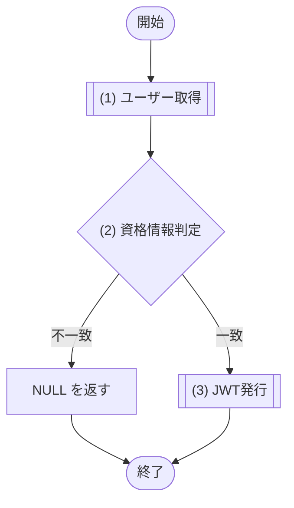
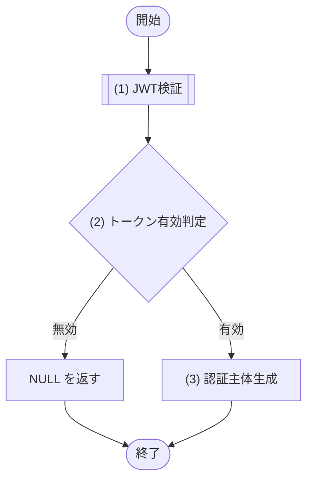

# 1. 基本情報

| 項目 | 内容 |
|---|---|
| モジュールID | MOD-001 |
| モジュール名 | 認証サービス |
| 種別 | Service |
| 概要 | ログイン時の資格情報検証、JWT の発行、API 共通前処理での JWT 検証を行う。暗号処理は MOD-008 認証暗号サービスを利用する |

# 2. 責務

| No | 責務 |
|---|---|
| 1 | ログイン資格情報(メールアドレス・パスワード)の検証 |
| 2 | 認証成功時の JWT 発行(有効期限24時間) |
| 3 | JWT の検証(署名・有効期限)と認証主体(ユーザーID・ロール)の取り出し |
| 4 | JWT 署名生成・署名検証・パスワードハッシュ照合は MOD-008 認証暗号サービスを呼び出して行う |

# 3. インターフェース

## (1) ログイン処理

### 1. 概要

資格情報を検証し JWT を発行する処理。

### 2. 入力

| 入力項目 | データ型 | 説明 |
|---|---|---|
| メールアドレス | String | ログインするユーザーのメールアドレス |
| パスワード | String | 平文パスワード |

### 3. 出力

| 出力項目 | データ型 | 説明 |
|---|---|---|
| 認証トークン | Object | 発行した認証情報。認証失敗時は NULL |
| - トークン | String | 発行した JWT 文字列 |
| - 有効期限 | String | トークン有効期限(ISO8601形式) |
| - ユーザーID | Integer | ユーザーID |
| - ユーザー名 | String | ユーザー名 |
| - ロール | Integer | ユーザーロール(DEF-001/CODE-001) |

### 4. 例外

| エラーID | 説明 |
|---|---|
| なし | 認証失敗(ユーザー不存在・パスワード不一致)は例外送出せず、認証トークン=NULL を返す |

### 5. 処理フロー

### 6. 処理詳細

#### (1) ユーザー取得処理

資格情報を照合する対象の利用者を、メールアドレスをキーに取得する。該当が無い場合は NULL を返す。

| SQL-ID | クエリ名 |
|---|---|
| SQL-003 | ユーザー取得 |

| 引数項目 | 値 |
|---|---|
| メールアドレス | 引数.メールアドレス |

| 項目名 | データ型 | 値 | 説明 |
|---|---|---|---|
| 利用者 | Object | SQL-003 ユーザー取得の結果。該当が無い場合は NULL | 返却する利用者 |
| - ユーザーID | Integer | ユーザー取得の結果 | 返却するユーザーID |
| - ユーザー名 | String | ユーザー取得の結果 | 返却するユーザー名 |
| - ロール | Integer | ユーザー取得の結果 | 返却するロール(DEF-001/CODE-001) |
| - パスワードハッシュ | String | ユーザー取得の結果 | 返却するパスワードハッシュ |

#### (2) 資格情報判定処理

取得した利用者の資格情報が正しいかを判定し、認証の成否を分岐する。利用者が存在しない、またはパスワードが一致しない場合は認証失敗とする。

| MOD-ID | 処理名 |
|---|---|
| MOD-008 | パスワード照合処理 |

| 引数項目 | 値 |
|---|---|
| パスワード | 引数.パスワード |
| パスワードハッシュ | (1) ユーザー取得の結果.パスワードハッシュ |

条件定義:

| No | 判定対象 | 条件 |
|---|---|---|
| 条件 | (1) ユーザー取得の結果 | != NULL |
| 条件 | MOD-008 パスワード照合処理の結果 | true |

条件分岐マトリクス:

| 条件・処理 | #1 一致 | #2 ユーザー不存在 | #3 パスワード不一致 |
|---|---|---|---|
| 条件 | ◯ | × | ◯ |
| 条件 | ◯ | - | × |
| 処理 |  |  |  |
| (3) JWT発行へ進む | ◯ | - | - |
| NULL(認証失敗)を返す | - | ◯ | ◯ |

| 項目名 | データ型 | 値 | 説明 |
|---|---|---|---|
| なし | - | - | - |

#### (3) JWT発行処理

認証に成功した利用者を主体として JWT を発行する。発行仕様は API-COM §2 に準拠し、署名生成は MOD-008 認証暗号サービスに委譲する。

| MOD-ID | 処理名 |
|---|---|
| MOD-008 | JWT発行処理 |

| 引数項目 | 値 |
|---|---|
| ユーザーID | (1) ユーザー取得の結果.ユーザーID |
| ロール | (1) ユーザー取得の結果.ロール(DEF-001/CODE-001) |

| 項目名 | データ型 | 値 | 説明 |
|---|---|---|---|
| 認証トークン | Object | MOD-008 JWT発行処理の結果 | 返却する認証トークン |
| - トークン | String | MOD-008 JWT発行処理の結果 | 返却する JWT 文字列 |
| - 有効期限 | String | MOD-008 JWT発行処理の結果 | 返却する有効期限 |
| - ユーザーID | Integer | (1) ユーザー取得の結果.ユーザーID | 返却するユーザーID |
| - ユーザー名 | String | (1) ユーザー取得の結果.ユーザー名 | 返却するユーザー名 |
| - ロール | Integer | (1) ユーザー取得の結果.ロール | 返却するロール(DEF-001/CODE-001) |

## (2) トークン検証処理

### 1. 概要

JWT を検証し認証主体を取り出す処理。

### 2. 入力

| 入力項目 | データ型 | 説明 |
|---|---|---|
| トークン | String | 検証対象の JWT |

### 3. 出力

| 出力項目 | データ型 | 説明 |
|---|---|---|
| 認証主体 | Object | 認証主体。検証失敗時は NULL |
| - ユーザーID | Integer | ユーザーID |
| - ロール | Integer | ユーザーロール(DEF-001/CODE-001) |

### 4. 例外

| エラーID | 説明 |
|---|---|
| なし | 検証失敗(トークン無効・改ざん・期限切れ)は例外送出せず、認証主体=NULL を返す |

### 5. 処理フロー

### 6. 処理詳細

#### (1) JWT検証処理

検証対象の JWT を MOD-008 認証暗号サービスで検証し、認証主体に利用できる検証結果を返す。無効な JWT は例外ではなく、JWT検証結果.有効=false として返す。

| MOD-ID | 処理名 |
|---|---|
| MOD-008 | JWT検証処理 |

| 引数項目 | 値 |
|---|---|
| トークン | 引数.トークン |

| 項目名 | データ型 | 値 | 説明 |
|---|---|---|---|
| JWT検証結果 | Object | MOD-008 JWT検証処理の結果 | 返却するJWT検証結果 |
| - 有効 | Boolean | MOD-008 JWT検証処理の結果 | 無効な JWT の場合は false |
| - ユーザーID | Integer | MOD-008 JWT検証処理の結果 | 有効な場合のみ設定する認証主体のユーザーID |
| - ロール | Integer | MOD-008 JWT検証処理の結果 | 有効な場合のみ設定する認証主体のロール(DEF-001/CODE-001) |

#### (2) トークン有効判定処理

JWT が有効か(署名が正当、かつ有効期限内か)を判定する。

条件定義:

| No | 判定対象 | 条件 |
|---|---|---|
| 条件 | (1) JWT検証の結果.有効 | true |

条件分岐マトリクス:

| 条件・処理 | #1 有効 | #2 無効 |
|---|---|---|
| 条件 | ◯ | × |
| 処理 |  |  |
| (3) 認証主体生成へ進む | ◯ | - |
| NULL(検証失敗)を返す | - | ◯ |

| 項目名 | データ型 | 値 | 説明 |
|---|---|---|---|
| なし | - | - | - |

#### (3) 認証主体生成処理

(1) JWT検証の結果のペイロードから認証主体を生成して返す。

| 項目名 | データ型 | 値 | 説明 |
|---|---|---|---|
| 認証主体 | Object | (1) JWT検証の結果のペイロードから生成した情報 | 返却する認証主体 |
| - ユーザーID | Integer | (1) JWT検証の結果 | 返却するユーザーID |
| - ロール | Integer | (1) JWT検証の結果 | 返却するロール(DEF-001/CODE-001) |

# 4. トランザクション・排他制御

| 項目 | 内容 |
|---|---|
| トランザクション境界 | なし(ログイン処理・トークン検証処理 ともに参照のみで DB 更新を伴わない) |
| 排他制御 | なし |

# 5. データアクセス

| テーブル | C | R | U | D | 用途 |
|---|---|---|---|---|---|
| TBL-001 |  | ✓ |  |  | メールアドレスによるユーザー取得・パスワード照合 |

# 6. エラー・例外

| 条件 | エラー | 対応 |
|---|---|---|
| ユーザーが存在しない、またはパスワードが不一致 | - | 例外を送出せず、ログイン処理は 認証トークン=NULL を返す。呼び出し元(API-001)が判定して ERR-001 を返す |
| トークンが無効・改ざん・期限切れ | - | 例外を送出せず、トークン検証処理は 認証主体=NULL を返す。呼び出し元(共通認証前処理)が判定して ERR-001 を返す |

# 7. 利用ライブラリ/基盤

| 利用ライブラリ/基盤 | 用途 | 管理方針 |
|---|---|---|
| なし | - | - |
