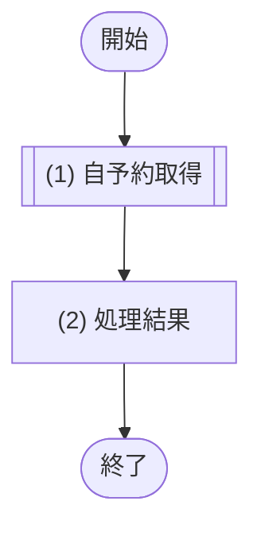
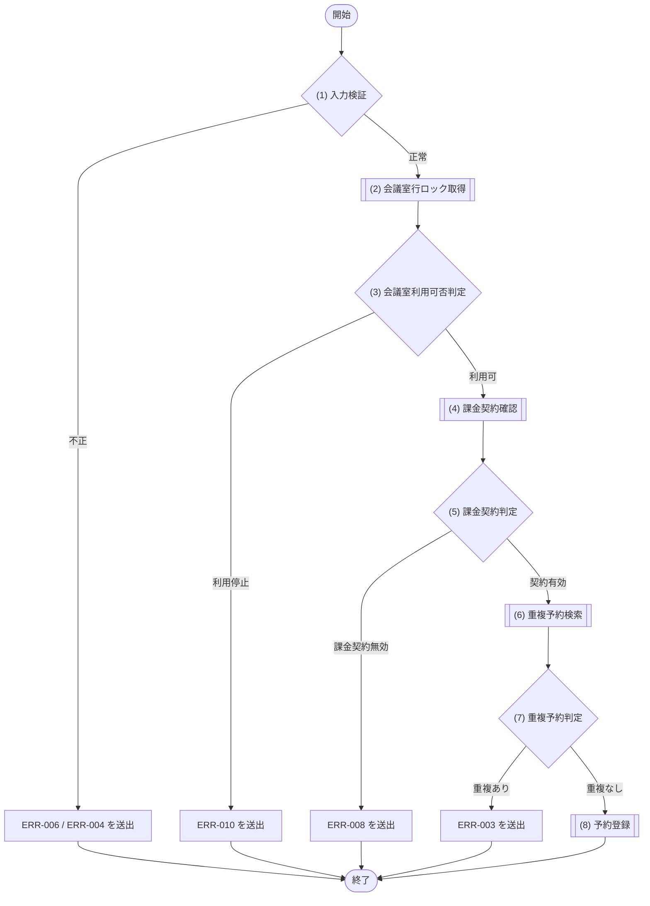
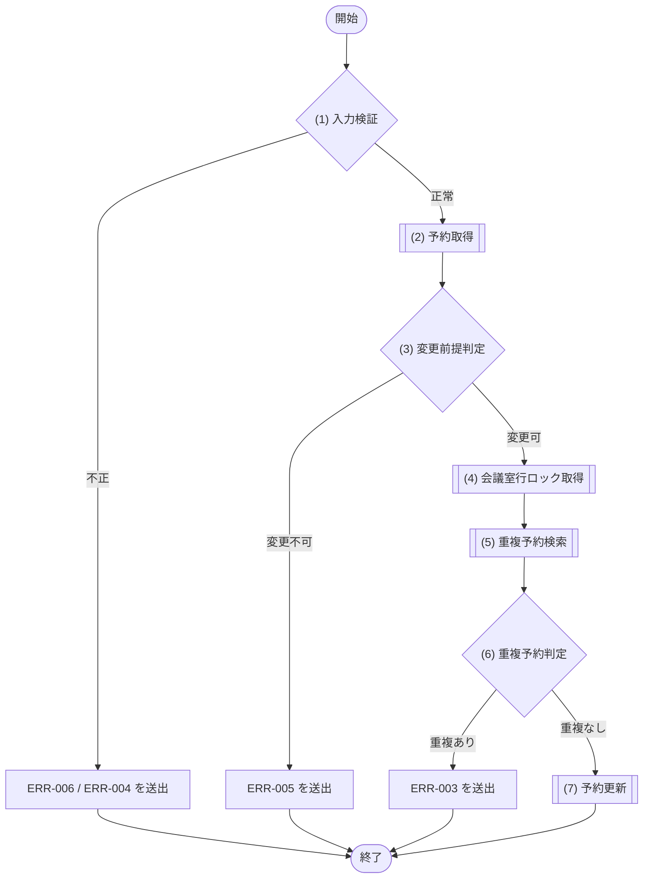
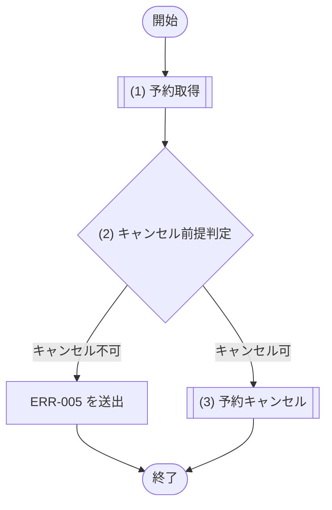
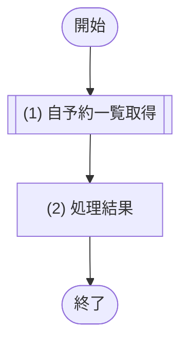

# 1. 基本情報

| 項目 | 内容 |
|---|---|
| モジュールID | MOD-003 |
| モジュール名 | 予約サービス |
| 種別 | Service |
| 概要 | 予約の登録・変更・キャンセル。二重予約チェックを含む |

# 2. 責務

| No | 責務 |
|---|---|
| 1 | 予約の登録・変更・キャンセル |
| 2 | 二重予約チェック |
| 3 | 自予約の取得 |

# 3. インターフェース

## (1) 自予約取得処理

### 1. 概要

自分の予約1件を取得する処理(会議室名を含む)。

### 2. 入力

| 入力項目 | データ型 | 説明 |
|---|---|---|
| ユーザーID | Integer | 取得を行う利用者の ID(予約者本人の判定に使用) |
| 予約ID | Integer | 取得対象の予約ID |

### 3. 出力

| 出力項目 | データ型 | 説明 |
|---|---|---|
| 予約 | Object | 会議室名を含む自予約1件。存在しない・他者の予約は NULL |
| - 予約ID | Integer | 予約の一意なID |
| - 会議室ID | Integer | 予約対象の会議室ID |
| - ユーザーID | Integer | 予約した利用者のID |
| - 予約タイトル | String | 予約のタイトル |
| - 利用開始日時 | String | 利用開始日時(ISO8601形式) |
| - 利用終了日時 | String | 利用終了日時(ISO8601形式) |
| - 予約ステータス | Integer | 予約の状態(DEF-001/CODE-004) |
| - 会議室名 | String | 予約対象の会議室名 |

### 4. 例外

| エラーID | 説明 |
|---|---|
| なし | - |

### 5. 処理フロー

### 6. 処理詳細

#### (1) 自予約取得処理

変更・キャンセルの前提確認や、フォームの現在値表示のために、利用者本人の予約1件を取得する。

- 該当が無い場合は NULL を返す。
- 参照のみで分岐・エラー・トランザクションは持たない。

| SQL-ID | クエリ名 |
|---|---|
| SQL-020 | 自予約取得 |

| 引数項目 | 値 |
|---|---|
| 予約ID | 引数.予約ID |
| ユーザーID | 引数.ユーザーID |

#### (2) 処理結果

処理結果を返却する。

| 項目名 | データ型 | 値 | 説明 |
|---|---|---|---|
| 予約 | Object | (1) 自予約取得処理の結果で取得した会議室名付きの自予約1件。該当なしは NULL | 返却する予約 |
| - 予約ID | Integer | (1) 自予約取得処理の結果 | 返却する予約ID |
| - 会議室ID | Integer | (1) 自予約取得処理の結果 | 返却する会議室ID |
| - ユーザーID | Integer | (1) 自予約取得処理の結果 | 返却するユーザーID |
| - 利用開始日時 | Datetime | (1) 自予約取得処理の結果 | 返却する利用開始日時 |
| - 利用終了日時 | Datetime | (1) 自予約取得処理の結果 | 返却する利用終了日時 |
| - リマインドステータス | Integer | (1) 自予約取得処理の結果 | 返却するリマインドステータス |
| - 予約ステータス | Integer | (1) 自予約取得処理の結果 | 返却する予約ステータス |
| - 会議室名 | String | (1) 自予約取得処理の結果 | 返却する会議室名 |

## (2) 予約登録処理

### 1. 概要

予約を登録する処理(二重予約チェック・利用停止会議室の拒否・有料会議室の課金契約確認を含む)。

### 2. 入力

| 入力項目 | データ型 | 説明 |
|---|---|---|
| ユーザーID | Integer | 予約する利用者の ID |
| 会議室ID | Integer | 予約対象の会議室ID |
| 予約タイトル | String | 予約のタイトル |
| 利用開始日時 | String | 利用開始日時 |
| 利用終了日時 | String | 利用終了日時 |

### 3. 出力

| 出力項目 | データ型 | 説明 |
|---|---|---|
| 予約 | Object | 登録した予約 |
| - 予約ID | Integer | 予約の一意なID |
| - 会議室ID | Integer | 予約対象の会議室ID |
| - ユーザーID | Integer | 予約した利用者のID |
| - 予約タイトル | String | 予約のタイトル |
| - 利用開始日時 | String | 利用開始日時(ISO8601形式) |
| - 利用終了日時 | String | 利用終了日時(ISO8601形式) |
| - 予約ステータス | Integer | 予約の状態(DEF-001/CODE-004) |

### 4. 例外

| エラーID | 説明 |
|---|---|
| ERR-003 | 時間帯が既存予約と重複する |
| ERR-004 | 利用開始日時が過去日時 |
| ERR-006 | 入力値不正(必須欠落・型不正・開始≧終了) |
| ERR-008 | 有料会議室で利用者の課金契約が有効でない |
| ERR-010 | 指定会議室が DEF-001/SET-004 に該当する |

### 5. 処理フロー

### 6. 処理詳細

#### (1) 入力判定処理

呼び出し元(API層)の検証とは独立に、モジュール側でも入力値の妥当性を検証する。トランザクション開始前に実施する。

##### 条件定義

| No | 判定対象 | 条件 |
|---|---|---|
| 条件(1) | 入力項目(ユーザーID、会議室ID、利用目的、利用開始日時、利用終了日時) | 必須指定あり AND 型正当 AND 利用開始日時 ＜ 利用終了日時 |
| 条件(2) | 利用開始日時 | 現在時刻 ＜＝ 利用開始日時 |

##### 条件分岐マトリクス

| 条件・処理 | #1 正常 | #2 入力不正 | #3 過去日時 |
|---|---|---|---|
| 条件(1) | ◯ | × | ◯ |
| 条件(2) | ◯ | - | × |
| 処理 |  |  |  |
| (2) 会議室行ロック取得へ進む | ◯ | - | - |
| ERR-006 を送出する | - | ◯ | - |
| ERR-004 を送出する | - | - | ◯ |

#### (2) 会議室行ロック取得処理

同一会議室への同時予約を直列化するため、対象会議室を行ロックで取得する(排他制御は §6)。取得した会議室ステータスは (3) 会議室利用可否判定で判定する。

| SQL-ID | クエリ名 |
|---|---|
| SQL-009 | 会議室行ロック取得 |

| 引数項目 | 値 |
|---|---|
| 会議室ID | 引数.会議室ID |

| 項目名 | データ型 | 値 | 説明 |
|---|---|---|---|
| 会議室 | Object | SQL-009 会議室行ロック取得の結果 | 返却する会議室 |
| - 会議室ID | Integer | 会議室行ロック取得の結果 | 返却する会議室ID |
| - 会議室ステータス | Integer | 会議室行ロック取得の結果 | 返却する会議室ステータス |
| - 1時間あたり利用単価 | Integer | 会議室行ロック取得の結果 | 返却する1時間あたり利用単価 |

#### (3) 会議室利用可否判定処理

(2) 会議室行ロック取得の結果をもとに、対象会議室が利用可能かを判定する。

##### 条件定義

| No | 判定対象 | 条件 |
|---|---|---|
| 条件(1) | (2) 会議室行ロック取得の結果.会議室ステータス | DEF-001/SET-004 に該当しない(利用可) |

##### 条件分岐マトリクス

| 条件・処理 | #1 利用可 | #2 利用停止 |
|---|---|---|
| 条件(1) | ◯ | × |
| 処理 |  |  |
| (4) 課金契約確認へ進む | ◯ | - |
| ERR-010 を送出する | - | ◯ |

#### (4) 課金契約確認処理

有料会議室の予約では、利用者が課金可能な状態かを MOD-007(課金サービス)に確認する。予約は即時確定し、決済待ちの仮予約は作らない。課金契約状態は (5) 課金契約判定で判定する。

・有料会議室の場合のみ課金契約状態を確認する
・無料会議室の場合は確認を行わない(有効として扱う)

| MOD-ID | 処理名 |
|---|---|
| MOD-007 | 課金契約状態確認(有料会議室のときのみ) |

| 引数項目 | 値 |
|---|---|
| ユーザーID | 引数.ユーザーID |

#### (5) 課金契約判定処理

(4) 課金契約確認の結果をもとに、予約者の課金契約が有効かを判定する。無料会議室では有効として扱う。

##### 条件定義

| No | 判定対象 | 条件 |
|---|---|---|
| 条件(1) | (4) 課金契約確認の結果 | 課金契約が有効である |

##### 条件分岐マトリクス

| 条件・処理 | #1 契約有効 | #2 課金契約無効 |
|---|---|---|
| 条件(1) | ◯ | × |
| 処理 |  |  |
| (6) 重複予約検索へ進む | ◯ | - |
| ERR-008 を送出する | - | ◯ |

#### (6) 重複予約取得処理

指定された時間帯に既存の予約が存在するかを確認し、二重予約を防止する。
・登録時の場合は、指定会議室と時間帯に重複する予約済の予約を検索する
・変更時の場合は、自身の予約を除外して、指定会議室と時間帯に重複する予約済の予約を検索する
・重複する予約が見つからない場合は該当なしとして扱う

| SQL-ID | クエリ名 |
|---|---|
| SQL-022 | 重複予約検索 |

| 引数項目 | 値 |
|---|---|
| 会議室ID | 引数.会議室ID |
| 利用開始日時 | 引数.利用開始日時 |
| 利用終了日時 | 引数.利用終了日時 |
| 除外予約ID | なし(登録時は除外なし=NULL) |

| 項目名 | データ型 | 値 | 説明 |
|---|---|---|---|
| 重複予約一覧 | Object[] | SQL-022 重複予約検索の結果。重複する予約が無い場合は空配列 | 返却する重複予約一覧 |
| - 予約ID | Integer | 重複予約検索の結果 | 返却する予約ID |

#### (7) 重複予約判定処理

指定された時間帯に他の予約が入っていないか（重複していないか）を判定する。

##### 条件定義

| No | 判定対象 | 条件 |
|---|---|---|
| 条件(1) | (6) 重複予約検索の結果 | 件数 = 0 |

##### 条件分岐マトリクス

| 条件・処理 | #1 重複なし | #2 重複あり |
|---|---|---|
| 条件(1) | ◯ | × |
| 処理 |  |  |
| (8) 予約登録へ進む | ◯ | - |
| ERR-003 を送出する | - | ◯ |

#### (8) 予約登録処理

検証と重複チェックを通過した予約を新規に登録して確定する(登録後に COMMIT する)。

| SQL-ID | クエリ名 |
|---|---|
| SQL-025 | 予約登録 |

| 引数項目 | 値 |
|---|---|
| ユーザーID | 引数.ユーザーID |
| 会議室ID | 引数.会議室ID |
| 予約タイトル | 引数.予約タイトル |
| 利用開始日時 | 引数.利用開始日時 |
| 利用終了日時 | 引数.利用終了日時 |

| 項目名 | データ型 | 値 | 説明 |
|---|---|---|---|
| 予約 | Object | (1) 予約取得処理の結果 | 返却する予約 |
| - 予約ID | Integer | (1) 予約取得処理の結果 | 返却する予約ID |
| - 会議室ID | Integer | (1) 予約取得処理の結果 | 返却する会議室ID |
| - ユーザーID | Integer | (1) 予約取得処理の結果 | 返却するユーザーID |
| - 利用開始日時 | Datetime | (1) 予約取得処理の結果 | 返却する利用開始日時 |
| - 利用終了日時 | Datetime | (1) 予約取得処理の結果 | 返却する利用終了日時 |
| - リマインドステータス | Integer | (1) 予約取得処理の結果 | 返却するリマインドステータス |
| - 予約ステータス | Integer | (1) 予約取得処理の結果 | 返却する予約ステータス |
| - 会議室名 | String | (1) 予約取得処理の結果 | 返却する会議室名 |

## (3) 予約変更処理

### 1. 概要

自分の予約を変更する処理(予約済・未開始のみ変更可)。

### 2. 入力

| 入力項目 | データ型 | 説明 |
|---|---|---|
| ユーザーID | Integer | 変更を行う利用者の ID(予約者本人の判定に使用) |
| 予約ID | Integer | 変更対象の予約ID |
| 予約タイトル | String | 変更後の予約タイトル |
| 利用開始日時 | String | 変更後の利用開始日時 |
| 利用終了日時 | String | 変更後の利用終了日時 |

### 3. 出力

| 出力項目 | データ型 | 説明 |
|---|---|---|
| 予約 | Object | 変更後の予約 |
| - 予約ID | Integer | 予約の一意なID |
| - 会議室ID | Integer | 予約対象の会議室ID |
| - ユーザーID | Integer | 予約した利用者のID |
| - 予約タイトル | String | 予約のタイトル |
| - 利用開始日時 | String | 利用開始日時(ISO8601形式) |
| - 利用終了日時 | String | 利用終了日時(ISO8601形式) |
| - 予約ステータス | Integer | 予約の状態(DEF-001/CODE-004) |

### 4. 例外

| エラーID | 説明 |
|---|---|
| ERR-003 | 時間帯が既存予約と重複する |
| ERR-004 | 利用開始日時が過去日時 |
| ERR-005 | 予約が存在しない・他者の予約、または変更不可状態(キャンセル/完了/開始済) |
| ERR-006 | 入力値不正(必須欠落・型不正・開始≧終了) |

### 5. 処理フロー

### 6. 処理詳細

#### (1) 入力判定処理

呼び出し元(API層)の検証とは独立に、モジュール側でも入力値の妥当性を検証する。

##### 条件定義

| No | 判定対象 | 条件 |
|---|---|---|
| 条件(1) | 入力項目(ユーザーID、予約ID、利用目的、利用開始日時、利用終了日時) | 必須指定あり AND 型正当 AND 利用開始日時 ＜ 利用終了日時 |
| 条件(2) | 利用開始日時 | 現在時刻 ＜＝ 利用開始日時 |

##### 条件分岐マトリクス

| 条件・処理 | #1 正常 | #2 入力不正 | #3 過去日時 |
|---|---|---|---|
| 条件(1) | ◯ | × | ◯ |
| 条件(2) | ◯ | - | × |
| 処理 |  |  |  |
| (2) 予約取得へ進む | ◯ | - | - |
| ERR-006 を送出する | - | ◯ | - |
| ERR-004 を送出する | - | - | ◯ |

#### (2) 予約取得処理

変更対象として、利用者本人の予約1件を取得する。該当が無い場合は NULL を返す。

| SQL-ID | クエリ名 |
|---|---|
| SQL-020 | 自予約取得 |

| 引数項目 | 値 |
|---|---|
| 予約ID | 引数.予約ID |
| ユーザーID | 引数.ユーザーID |

| 項目名 | データ型 | 値 | 説明 |
|---|---|---|---|
| 予約 | Object | SQL-020 自予約取得の結果。該当が無い場合は NULL | 返却する予約 |
| - 予約ID | Integer | 自予約取得の結果 | 返却する予約ID |
| - 会議室ID | Integer | 自予約取得の結果 | 返却する会議室ID |
| - ユーザーID | Integer | 自予約取得の結果 | 返却するユーザーID |
| - 利用開始日時 | Datetime | 自予約取得の結果 | 返却する利用開始日時 |
| - 利用終了日時 | Datetime | 自予約取得の結果 | 返却する利用終了日時 |
| - 予約ステータス | Integer | 自予約取得の結果 | 返却する予約ステータス |
| - 会議室名 | String | 自予約取得の結果 | 返却する会議室名 |

#### (3) 更新前提判定処理

(2) 予約取得の結果が、予約変更の前提(存在・自予約・予約済・未開始)を満たすかを判定する。API 層(API-004 §5(2))と独立にモジュール側でも判定する。

##### 条件定義

| No | 判定対象 | 条件 |
|---|---|---|
| 条件(1) | (2) 予約取得の結果 | != NULL |
| 条件(2) | (2) 予約取得の結果.予約ステータス | DEF-001/SET-005 に該当する |
| 条件(3) | (2) 予約取得の結果.利用開始日時 | 現在日時 ＜ 利用開始日時(未開始) |

##### 条件分岐マトリクス

| 条件・処理 | #1 変更可 | #2 存在しない・他者 | #3 変更不可状態(キャンセル/完了) | #4 開始済み |
|---|---|---|---|---|
| 条件(1) | ◯ | × | ◯ | ◯ |
| 条件(2) | ◯ | - | × | ◯ |
| 条件(3) | ◯ | - | - | × |
| 処理 |  |  |  |  |
| (4) 会議室行ロック取得へ進む | ◯ | - | - | - |
| ERR-005 を送出する | - | ◯ | ◯ | ◯ |

#### (4) 会議室行ロック取得処理

変更後の時間帯で重複判定を正しく行うため、対象予約の会議室を行ロックで取得する(排他制御は §6)。

| SQL-ID | クエリ名 |
|---|---|
| SQL-009 | 会議室行ロック取得 |

| 引数項目 | 値 |
|---|---|
| 会議室ID | (2) 予約取得の結果.会議室ID |

| 項目名 | データ型 | 値 | 説明 |
|---|---|---|---|
| 会議室 | Object | SQL-009 会議室行ロック取得の結果 | 返却する会議室 |
| - 会議室ID | Integer | 会議室行ロック取得の結果 | 返却する会議室ID |
| - 会議室ステータス | Integer | 会議室行ロック取得の結果 | 返却する会議室ステータス |
| - 1時間あたり利用単価 | Integer | 会議室行ロック取得の結果 | 返却する1時間あたり利用単価 |

#### (5) 重複予約取得処理

指定された時間帯に既存の予約が存在するかを確認し、二重予約を防止する。
・登録時の場合は、指定会議室と時間帯に重複する予約済の予約を検索する
・変更時の場合は、自身の予約を除外して、指定会議室と時間帯に重複する予約済の予約を検索する
・重複する予約が見つからない場合は該当なしとして扱う

| SQL-ID | クエリ名 |
|---|---|
| SQL-022 | 重複予約検索 |

| 引数項目 | 値 |
|---|---|
| 会議室ID | (2) 予約取得の結果.会議室ID |
| 利用開始日時 | 引数.利用開始日時 |
| 利用終了日時 | 引数.利用終了日時 |
| 除外予約ID | 引数.予約ID |

| 項目名 | データ型 | 値 | 説明 |
|---|---|---|---|
| 重複予約一覧 | Object[] | SQL-022 重複予約検索の結果。重複する予約が無い場合は空配列 | 返却する重複予約一覧 |
| - 予約ID | Integer | 重複予約検索の結果 | 返却する予約ID |

#### (6) 重複予約判定処理

指定された時間帯に他の予約が入っていないか（重複していないか）を判定する。

##### 条件定義

| No | 判定対象 | 条件 |
|---|---|---|
| 条件(1) | (5) 重複予約検索の結果 | 件数 = 0 |

##### 条件分岐マトリクス

| 条件・処理 | #1 重複なし | #2 重複あり |
|---|---|---|
| 条件(1) | ◯ | × |
| 処理 |  |  |
| (7) 予約更新へ進む | ◯ | - |
| ERR-003 を送出する | - | ◯ |

#### (7) 予約更新処理

変更後の内容で対象予約を更新して確定する(更新後に COMMIT する)。

| SQL-ID | クエリ名 |
|---|---|
| SQL-026 | 予約更新 |

| 引数項目 | 値 |
|---|---|
| 予約ID | 引数.予約ID |
| 予約タイトル | 引数.予約タイトル |
| 利用開始日時 | 引数.利用開始日時 |
| 利用終了日時 | 引数.利用終了日時 |

| 項目名 | データ型 | 値 | 説明 |
|---|---|---|---|
| 予約 | Object | (1) 予約取得処理の結果 | 返却する予約 |
| - 予約ID | Integer | (1) 予約取得処理の結果 | 返却する予約ID |
| - 会議室ID | Integer | (1) 予約取得処理の結果 | 返却する会議室ID |
| - ユーザーID | Integer | (1) 予約取得処理の結果 | 返却するユーザーID |
| - 利用開始日時 | Datetime | (1) 予約取得処理の結果 | 返却する利用開始日時 |
| - 利用終了日時 | Datetime | (1) 予約取得処理の結果 | 返却する利用終了日時 |
| - リマインドステータス | Integer | (1) 予約取得処理の結果 | 返却するリマインドステータス |
| - 予約ステータス | Integer | (1) 予約取得処理の結果 | 返却する予約ステータス |
| - 会議室名 | String | (1) 予約取得処理の結果 | 返却する会議室名 |

## (4) 予約キャンセル処理

### 1. 概要

自分の予約をキャンセルする処理(予約済・未開始のみキャンセル可)。

### 2. 入力

| 入力項目 | データ型 | 説明 |
|---|---|---|
| ユーザーID | Integer | キャンセルを行う利用者の ID(予約者本人の判定に使用) |
| 予約ID | Integer | キャンセル対象の予約ID |

### 3. 出力

| 出力項目 | データ型 | 説明 |
|---|---|---|
| 予約 | Object | キャンセル後の予約(DEF-001/SET-006) |
| - 予約ID | Integer | 予約の一意なID |
| - 会議室ID | Integer | 予約対象の会議室ID |
| - ユーザーID | Integer | 予約した利用者のID |
| - 予約タイトル | String | 予約のタイトル |
| - 利用開始日時 | String | 利用開始日時(ISO8601形式) |
| - 利用終了日時 | String | 利用終了日時(ISO8601形式) |
| - 予約ステータス | Integer | 予約の状態(DEF-001/CODE-004) |

### 4. 例外

| エラーID | 説明 |
|---|---|
| ERR-005 | 予約が存在しない・他者の予約、またはキャンセル不可状態(キャンセル/完了/開始済) |

### 5. 処理フロー

### 6. 処理詳細

#### (1) 予約取得処理

キャンセル対象として、利用者本人の予約1件を取得する。該当が無い場合は NULL を返す。

| SQL-ID | クエリ名 |
|---|---|
| SQL-020 | 自予約取得 |

| 引数項目 | 値 |
|---|---|
| 予約ID | 引数.予約ID |
| ユーザーID | 引数.ユーザーID |

| 項目名 | データ型 | 値 | 説明 |
|---|---|---|---|
| 予約 | Object | SQL-020 自予約取得の結果。該当が無い場合は NULL | 返却する予約 |
| - 予約ID | Integer | 自予約取得の結果 | 返却する予約ID |
| - 会議室ID | Integer | 自予約取得の結果 | 返却する会議室ID |
| - ユーザーID | Integer | 自予約取得の結果 | 返却するユーザーID |
| - 利用開始日時 | Datetime | 自予約取得の結果 | 返却する利用開始日時 |
| - 利用終了日時 | Datetime | 自予約取得の結果 | 返却する利用終了日時 |
| - 予約ステータス | Integer | 自予約取得の結果 | 返却する予約ステータス |
| - 会議室名 | String | 自予約取得の結果 | 返却する会議室名 |

#### (2) キャンセル前提判定処理

(1) 予約取得の結果が、予約キャンセルの前提(存在・自予約・予約済・未開始)を満たすかを判定する。API 層(API-005 §5(2))と独立にモジュール側でも判定する。

##### 条件定義

| No | 判定対象 | 条件 |
|---|---|---|
| 条件(1) | (1) 予約取得の結果 | != NULL |
| 条件(2) | (1) 予約取得の結果.予約ステータス | DEF-001/SET-005 に該当する |
| 条件(3) | (1) 予約取得の結果.利用開始日時 | 現在日時 ＜ 利用開始日時(未開始) |

##### 条件分岐マトリクス

| 条件・処理 | #1 キャンセル可 | #2 存在しない・他者 | #3 キャンセル不可状態(キャンセル/完了) | #4 開始済み |
|---|---|---|---|---|
| 条件(1) | ◯ | × | ◯ | ◯ |
| 条件(2) | ◯ | - | × | ◯ |
| 条件(3) | ◯ | - | - | × |
| 処理 |  |  |  |  |
| (3) 予約キャンセルへ進む | ◯ | - | - | - |
| ERR-005 を送出する | - | ◯ | ◯ | ◯ |

#### (3) 予約キャンセル更新処理

対象予約をキャンセル状態に更新して確定する(更新後に COMMIT する)。

| SQL-ID | クエリ名 |
|---|---|
| SQL-027 | 予約キャンセル |

| 引数項目 | 値 |
|---|---|
| 予約ID | 引数.予約ID |

| 項目名 | データ型 | 値 | 説明 |
|---|---|---|---|
| 予約 | Object | (1) 予約取得処理の結果 | 返却する予約 |
| - 予約ID | Integer | (1) 予約取得処理の結果 | 返却する予約ID |
| - 会議室ID | Integer | (1) 予約取得処理の結果 | 返却する会議室ID |
| - ユーザーID | Integer | (1) 予約取得処理の結果 | 返却するユーザーID |
| - 利用開始日時 | Datetime | (1) 予約取得処理の結果 | 返却する利用開始日時 |
| - 利用終了日時 | Datetime | (1) 予約取得処理の結果 | 返却する利用終了日時 |
| - リマインドステータス | Integer | (1) 予約取得処理の結果 | 返却するリマインドステータス |
| - 予約ステータス | Integer | (1) 予約取得処理の結果 | 返却する予約ステータス |
| - 会議室名 | String | (1) 予約取得処理の結果 | 返却する会議室名 |

## (5) 自予約一覧取得処理

### 1. 概要

自予約の一覧を取得する処理(会議室名を含む。ステータス・利用開始日の期間で絞り込み可)。

### 2. 入力

| 入力項目 | データ型 | 説明 |
|---|---|---|
| ユーザーID | Integer | 一覧を取得する利用者の ID |
| 予約ステータス | Integer | 絞り込む予約ステータス(任意。DEF-001/CODE-004) |
| 期間開始 | String | 利用開始日の下限(任意) |
| 期間終了 | String | 利用開始日の上限(任意) |
| ページ | Integer | 取得するページ番号 |
| 取得件数 | Integer | 1 ページあたりの取得件数 |

### 3. 出力

| 出力項目 | データ型 | 説明 |
|---|---|---|
| 予約一覧 | Object[] | 会議室名を含む自予約の一覧(ページネーション適用) |
| - 予約ID | Integer | 予約の一意なID |
| - 会議室ID | Integer | 予約対象の会議室ID |
| - ユーザーID | Integer | 予約した利用者のID |
| - 予約タイトル | String | 予約のタイトル |
| - 利用開始日時 | String | 利用開始日時(ISO8601形式) |
| - 利用終了日時 | String | 利用終了日時(ISO8601形式) |
| - 予約ステータス | Integer | 予約の状態(DEF-001/CODE-004) |
| - 会議室名 | String | 予約対象の会議室名 |

### 4. 例外

| エラーID | 説明 |
|---|---|
| なし | - |

### 5. 処理フロー

### 6. 処理詳細

#### (1) 自予約一覧取得処理

利用者本人の予約一覧を、指定された絞り込み条件で取得して返す(ページネーションは API-COM §5)。分岐・エラーは持たない。

・予約ステータスが指定された場合は、そのステータスの予約に絞り込む
・期間が指定された場合は、利用開始日がその期間内の予約に絞り込む
・絞り込み条件が未指定の場合は、その条件では絞り込まない

| SQL-ID | クエリ名 |
|---|---|
| SQL-023 | 自予約一覧取得 |

| 引数項目 | 値 |
|---|---|
| ユーザーID | 引数.ユーザーID |
| 予約ステータス | 引数.ステータス(任意。指定時は STATUS 一致で絞り込み。DEF-001/CODE-004) |
| 期間開始 | 引数.期間開始(任意。指定時は 利用開始日時 ＞＝ from) |
| 期間終了 | 引数.期間終了(任意。指定時は 利用開始日時 ＜＝ to) |
| ページ | 引数.ページ |
| 取得件数 | 引数.取得件数 |

#### (2) 処理結果

処理結果を返却する。

| 項目名 | データ型 | 値 | 説明 |
|---|---|---|---|
| 予約一覧 | Object[] | (1) 自予約一覧取得処理の結果で抽出した会議室名付き自予約に、ページネーションを適用した一覧 | 返却する予約一覧 |
| - 予約ID | Integer | (1) 自予約一覧取得処理の結果 | 返却する予約ID |
| - 会議室ID | Integer | (1) 自予約一覧取得処理の結果 | 返却する会議室ID |
| - 利用開始日時 | Datetime | (1) 自予約一覧取得処理の結果 | 返却する利用開始日時 |
| - 利用終了日時 | Datetime | (1) 自予約一覧取得処理の結果 | 返却する利用終了日時 |
| - 予約ステータス | Integer | (1) 自予約一覧取得処理の結果 | 返却する予約ステータス |
| - 会議室名 | String | (1) 自予約一覧取得処理の結果 | 返却する会議室名 |

# 4. トランザクション・排他制御

| 項目 | 内容 |
|---|---|
| トランザクション境界 | 予約登録処理・予約更新処理 は会議室行ロック取得〜COMMIT、予約キャンセル処理 は予約取得〜COMMIT。自予約一覧取得処理 は参照のみで更新トランザクションを持たない |
| 排他制御 | 予約登録処理・予約更新処理 で 会議室マスタ(TBL-002) の対象行ロックにより同一会議室の同時予約を直列化 |

# 5. データアクセス

| テーブル | C | R | U | D | 用途 |
|---|---|---|---|---|---|
| TBL-002 |  | ✓ |  |  | 対象会議室の行ロック取得(SELECT ... FOR UPDATE)・会議室ステータス判定(DEF-001/SET-004)・予約一覧/1件取得時の会議室名結合 |
| TBL-003 | ✓ | ✓ | ✓ |  | 予約の登録・変更・キャンセル、重複判定、自予約の取得 |

# 6. エラー・例外

| 条件 | エラー | 対応 |
|---|---|---|
| 時間帯重複 | ERR-003 | 例外を送出し、トランザクションをロールバックする |
| 過去日時 | ERR-004 | 例外を送出し、トランザクションをロールバックする |
| 予約が存在しない(更新/キャンセル時) | ERR-005 | 例外を送出し、トランザクションをロールバックする |
| 入力値不正(必須欠落・型不正・制約違反) | ERR-006 | 例外を送出し、トランザクションをロールバックする |
| 有料会議室(利用単価 ＞ 0)の予約で利用者の課金契約が有効でない | ERR-008 | MOD-007 の課金契約状態確認から送出され、トランザクションをロールバックする |
| 指定会議室が DEF-001/SET-004 に該当する | ERR-010 | 例外を送出し、トランザクションをロールバックする |

# 7. 利用ライブラリ/基盤

| 利用ライブラリ/基盤 | 用途 | 管理方針 |
|---|---|---|
| なし | - | - |
