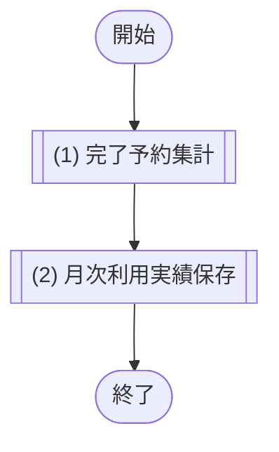
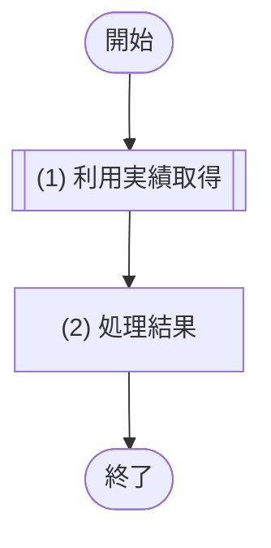
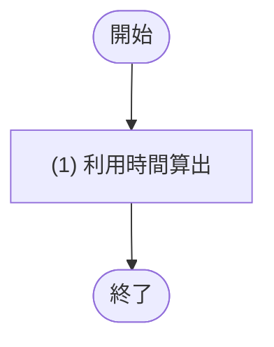

# 1. 基本情報

| 項目 | 内容 |
|---|---|
| モジュールID | MOD-005 |
| モジュール名 | 利用実績サービス |
| 種別 | Service |
| 概要 | 完了した予約を会議室×対象月で集計して月次利用実績を保存し、指定月の会議室別利用実績を取得する |

# 2. 責務

| No | 責務 |
|---|---|
| 1 | 対象月の完了した予約を会議室別に集計し、月次利用実績を保存する |
| 2 | 指定月の会議室別利用実績(件数・利用時間)の取得 |
| 3 | 予約1件の利用時間(分)の算出（**廃止**。利用時間は MOD-007.利用量計上処理 が内部算出するため未使用） |

# 3. インターフェース

## (1) 月次利用実績集計処理

### 1. 概要

対象月の完了予約を集計し月次利用実績を保存する処理。

### 2. 入力

| 入力項目 | データ型 | 説明 |
|---|---|---|
| 対象月 | String | 集計対象月('YYYY-MM') |

### 3. 出力

| 出力項目 | データ型 | 説明 |
|---|---|---|
| 集計件数 | Integer | UPSERT した会議室別実績の件数 |

### 4. 例外

| エラーID | 説明 |
|---|---|
| なし | - |

### 5. 処理フロー

### 6. 処理詳細

#### (1) 完了予約取得処理

月次利用実績を保存するため、対象月に開始した完了予約を会議室ごとに集計し、予約件数と利用時間(分)を求める。該当会議室が無い場合は 0件を返す。

| SQL-ID | クエリ名 |
|---|---|
| SQL-002 | 月次利用実績集計クエリ |

| 引数項目 | 値 |
|---|---|
| 対象月 | 引数.対象月 |

| 項目名 | データ型 | 値 | 説明 |
|---|---|---|---|
| 完了予約集計一覧 | Object[] | SQL-002 月次利用実績集計クエリの結果。該当会議室が無い場合は空配列 | 返却する完了予約集計一覧 |
| - 会議室ID | Integer | 月次利用実績集計クエリの結果 | 返却する会議室ID |
| - 予約件数 | Integer | 月次利用実績集計クエリの結果 | 返却する予約件数 |
| - 利用時間分 | Integer | 月次利用実績集計クエリの結果 | 返却する利用時間分 |

#### (2) 月次利用実績登録処理

(1) 完了予約集計の結果を、会議室×対象月単位の月次利用実績として保存する。保存した件数を返し COMMIT する。

| SQL-ID | クエリ名 |
|---|---|
| SQL-029 | 月次利用実績UPSERT |

| 引数項目 | 値 |
|---|---|
| 会議室ID | (1) 完了予約集計の結果.会議室ID(会議室ごとに実行) |
| 対象月 | 引数.対象月 |
| 予約件数 | (1) 完了予約集計の結果.予約件数 |
| 利用時間分 | (1) 完了予約集計の結果.利用時間(分) |

| 項目名 | データ型 | 値 | 説明 |
|---|---|---|---|
| 集計件数 | Integer | (2) 月次利用実績保存で UPSERT した会議室の件数 | 返却する集計件数 |

## (2) 利用実績取得処理

### 1. 概要

指定月の会議室別利用実績を会議室名昇順で取得する処理。

### 2. 入力

| 入力項目 | データ型 | 説明 |
|---|---|---|
| 対象月 | String | 取得対象月('YYYY-MM') |
| ページ | Integer | 取得するページ番号 |
| 取得件数 | Integer | 1 ページあたりの取得件数 |

### 3. 出力

| 出力項目 | データ型 | 説明 |
|---|---|---|
| 利用実績一覧 | Object[] | 会議室名を含む会議室別利用実績の一覧(会議室名昇順・ページネーション適用) |
| - 利用実績ID | Integer | 会議室利用実績のID |
| - 会議室ID | Integer | 対象の会議室ID |
| - 対象月 | String | 集計対象月 |
| - 予約件数 | Integer | 完了予約の件数 |
| - 利用時間分 | Integer | 利用時間の合計(分) |
| - 会議室名 | String | 対象の会議室名称(取得時のみ付加) |

### 4. 例外

| エラーID | 説明 |
|---|---|
| なし | - |

### 5. 処理フロー

### 6. 処理詳細

#### (1) 利用実績取得処理

対象月の利用実績一覧をページネーションを適用して取得する。該当がない場合は空配列を返す。

| SQL-ID | クエリ名 |
|---|---|
| SQL-030 | 月次利用実績取得 |

| 引数項目 | 値 |
|---|---|
| 対象月 | 引数.対象月 |
| ページ | 引数.ページ |
| 取得件数 | 引数.取得件数 |

| 項目名 | データ型 | 値 | 説明 |
|---|---|---|---|
| 利用実績一覧 | Object[] | SQL-030 月次利用実績取得の結果。該当が無い場合は空配列 | 返却する利用実績一覧 |
| - 利用実績ID | Integer | 月次利用実績取得の結果 | 返却する利用実績ID |
| - 会議室ID | Integer | 月次利用実績取得の結果 | 返却する会議室ID |
| - 対象月 | String | 月次利用実績取得の結果 | 返却する対象月 |
| - 予約件数 | Integer | 月次利用実績取得の結果 | 返却する予約件数 |
| - 利用時間分 | Integer | 月次利用実績取得の結果 | 返却する利用時間分 |
| - 会議室名 | String | 月次利用実績取得の結果 | 返却する会議室名 |

#### (2) 処理結果

処理結果を返却する。

| 項目名 | データ型 | 値 | 説明 |
|---|---|---|---|
| 利用実績一覧 | Object[] | (1) 利用実績取得処理の結果で取得した会議室名付き・会議室名昇順の会議室別利用実績に、ページネーションを適用した一覧 | 返却する利用実績一覧 |
| - 利用実績ID | Integer | (1) 利用実績取得処理の結果 | 返却する利用実績ID |
| - 会議室ID | Integer | (1) 利用実績取得処理の結果 | 返却する会議室ID |
| - 対象月 | String | (1) 利用実績取得処理の結果 | 返却する対象月 |
| - 予約件数 | Integer | (1) 利用実績取得処理の結果 | 返却する予約件数 |
| - 利用時間分 | Integer | (1) 利用実績取得処理の結果 | 返却する利用時間分 |
| - 会議室名 | String | (1) 利用実績取得処理の結果 | 返却する会議室名 |

## (3) 利用時間算出処理【廃止】

### 1. 概要

予約1件の利用時間(分)を算出する処理。**（廃止：MOD-007.利用量計上処理 が利用時間を内部算出するため未使用。現在この処理を呼び出す機能はない）**

### 2. 入力

| 入力項目 | データ型 | 説明 |
|---|---|---|
| 利用開始日時 | String | 利用開始日時 |
| 利用終了日時 | String | 利用終了日時 |

### 3. 出力

| 出力項目 | データ型 | 説明 |
|---|---|---|
| 利用時間(分) | Integer | 開始〜終了の差分を分単位に切り捨てた整数 |

### 4. 例外

| エラーID | 説明 |
|---|---|
| なし | - |

### 5. 処理フロー

### 6. 処理詳細

#### (1) 利用時間算出処理

予約1件の利用時間(分)を算出する(秒未満は切り捨て)。分岐・エラー・DB アクセスはない。

| 参照項目 | 値 |
|---|---|
| 利用開始日時 | 引数.利用開始日時 |
| 利用終了日時 | 引数.利用終了日時 |

| 項目名 | データ型 | 値 | 説明 |
|---|---|---|---|
| 利用時間(分) | Integer | 開始〜終了の差分を分単位に切り捨てた整数 | 返却する利用時間(分) |

# 4. トランザクション・排他制御

| 項目 | 内容 |
|---|---|
| トランザクション境界 | 月次実績集計処理 は完了予約集計〜月次利用実績保存〜COMMIT を1トランザクションで行う。利用実績取得処理 は参照のみで更新トランザクションを持たない |
| 排他制御 | なし(月次利用実績の一意制約 の一意制約で 会議室ID×対象月 の重複行を防止) |

# 5. データアクセス

| テーブル | C | R | U | D | 用途 |
|---|---|---|---|---|---|
| TBL-002 |  | ✓ |  |  | 会議室名の取得(集計 SQL-002・利用実績取得処理 の結合) |
| TBL-003 |  | ✓ |  |  | 完了予約の集計(SQL-002) |
| TBL-006 | ✓ | ✓ | ✓ |  | 月次利用実績の保存・取得 |

# 6. エラー・例外

| 条件 | エラー | 対応 |
|---|---|---|
| なし | - | 本モジュールは業務エラー・例外を送出しない |
