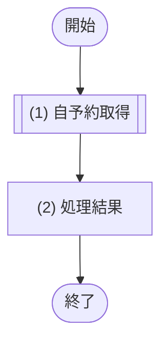
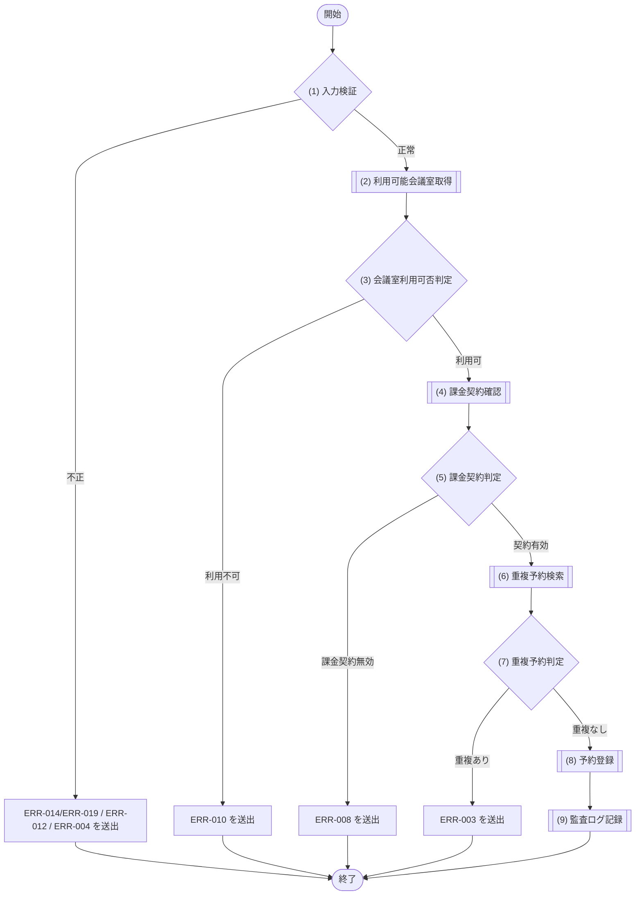
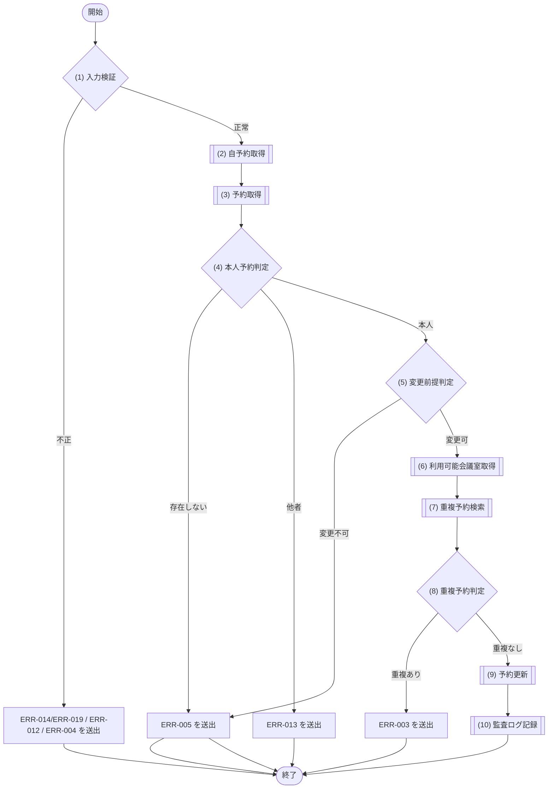
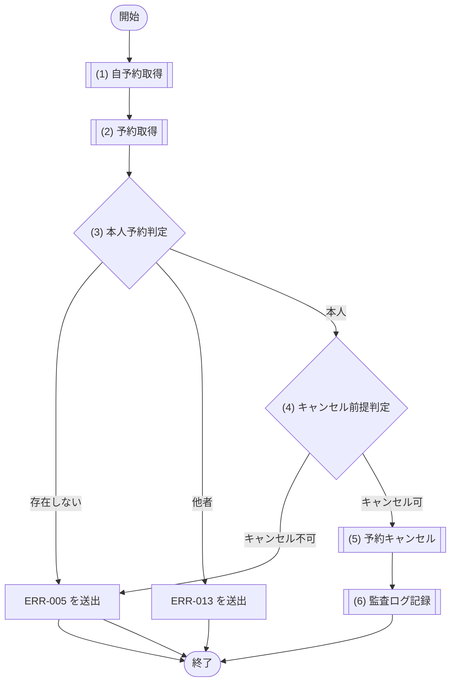
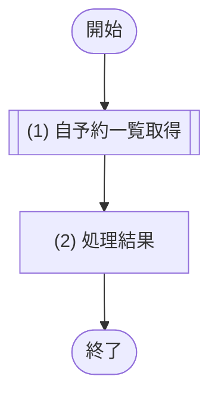
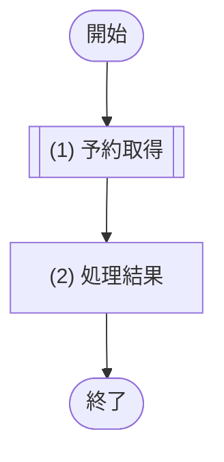

# 1. 基本情報

| 項目 | 内容 |
|---|---|
| モジュールID | MOD-003 |
| モジュール名 | 予約サービス |
| 種別 | Service |
| 概要 | 予約の登録・変更・キャンセル。二重予約チェックを含む |

# 2. 責務

| No | 責務 |
|---|---|
| 1 | 予約の登録・変更・キャンセル |
| 2 | 二重予約チェック |
| 3 | 自予約の取得 |
| 4 | 予約の取得(本人判定用・予約者非限定) |
| 5 | 終了済み予約と「完了済みかつ利用量記録なし」の再処理対象抽出 |
| 6 | 予約済・終了時刻経過を条件とする完了状態への原子的遷移 |

# 3. インターフェース

## (1) 自予約取得処理

### 1. 概要

自分の予約1件を取得する処理(会議室名を含む)。

### 2. 入力

| 入力項目 | データ型 | 説明 |
|---|---|---|
| ユーザーID | Integer | 取得を行う利用者の ID(予約者本人の判定に使用) |
| 予約ID | Integer | 取得対象の予約ID |

### 3. 出力

| 出力項目 | データ型 | 説明 |
|---|---|---|
| 予約 | Object | 会議室名を含む自予約1件。存在しない・他者の予約は NULL |
| - 予約ID | Integer | 予約の一意なID |
| - 会議室ID | Integer | 予約対象の会議室ID |
| - ユーザーID | Integer | 予約した利用者のID |
| - 予約タイトル | String | 予約のタイトル |
| - 利用開始日時 | String | 利用開始日時(ISO8601形式) |
| - 利用終了日時 | String | 利用終了日時(ISO8601形式) |
| - 予約ステータス | Integer | 予約の状態(共通コード定義/CODE-004) |
| - 会議室名 | String | 予約対象の会議室名 |

### 4. 例外

| エラーID | 説明 |
|---|---|
| なし | - |

### 5. 処理フロー

### 6. 処理詳細

#### (1) 自予約取得処理

変更・キャンセルの前提確認や、フォームの現在値表示のために、利用者本人の予約1件を取得する。

- 該当が無い場合は NULL を返す。
- 参照のみで分岐・エラー・トランザクションは持たない。

| SQL-ID | クエリ名 |
|---|---|
| SQL-020 | 自予約取得 |

| 引数項目 | 値 |
|---|---|
| 予約ID | 引数.予約ID |
| ユーザーID | 引数.ユーザーID |

#### (2) 処理結果

処理結果を返却する。

| 項目名 | データ型 | 値 | 説明 |
|---|---|---|---|
| 予約 | Object | (1) 自予約取得処理の結果で取得した会議室名付きの自予約1件。該当なしは NULL | 返却する予約 |
| - 予約ID | Integer | (1) 自予約取得処理の結果 | 返却する予約ID |
| - 会議室ID | Integer | (1) 自予約取得処理の結果 | 返却する会議室ID |
| - ユーザーID | Integer | (1) 自予約取得処理の結果 | 返却するユーザーID |
| - 利用開始日時 | Datetime | (1) 自予約取得処理の結果 | 返却する利用開始日時 |
| - 利用終了日時 | Datetime | (1) 自予約取得処理の結果 | 返却する利用終了日時 |
| - リマインドステータス | Integer | (1) 自予約取得処理の結果 | 返却するリマインドステータス |
| - 予約ステータス | Integer | (1) 自予約取得処理の結果 | 返却する予約ステータス |
| - 会議室名 | String | (1) 自予約取得処理の結果 | 返却する会議室名 |

## (2) 予約登録処理

### 1. 概要

予約を登録する処理(二重予約チェック・利用停止会議室の拒否・有料会議室の課金契約確認を含む)。

### 2. 入力

| 入力項目 | データ型 | 説明 |
|---|---|---|
| ユーザーID | Integer | 予約する利用者の ID |
| 会議室ID | Integer | 予約対象の会議室ID |
| 予約タイトル | String | 予約のタイトル |
| 利用開始日時 | String | 利用開始日時 |
| 利用終了日時 | String | 利用終了日時 |

### 3. 出力

| 出力項目 | データ型 | 説明 |
|---|---|---|
| 予約 | Object | 登録した予約 |
| - 予約ID | Integer | 予約の一意なID |
| - 会議室ID | Integer | 予約対象の会議室ID |
| - ユーザーID | Integer | 予約した利用者のID |
| - 予約タイトル | String | 予約のタイトル |
| - 利用開始日時 | String | 利用開始日時(ISO8601形式) |
| - 利用終了日時 | String | 利用終了日時(ISO8601形式) |
| - 予約ステータス | Integer | 予約の状態(共通コード定義/CODE-004) |

### 4. 例外

| エラーID | 説明 |
|---|---|
| ERR-003 | 時間帯が既存予約と重複する |
| ERR-004 | 利用開始日時が過去日時 |
| ERR-014 | 必須項目の欠落 |
| ERR-019 | 型・形式不正 |
| ERR-008 | 有料会議室で利用者の課金契約が有効でない |
| ERR-010 | 指定会議室が利用不可(共通コード定義/SET-004 に該当、または論理削除済み) |
| ERR-012 | 利用開始日時 ≧ 利用終了日時(日時整合エラー) |

### 5. 処理フロー

### 6. 処理詳細

#### (1) 入力判定処理

呼び出し元(API層)の検証とは独立に、モジュール側でも入力値の妥当性を検証する。トランザクション開始前に実施する。

##### 条件定義

| No | 判定対象 | 条件 |
|---|---|---|
| 条件(1) | 入力項目(ユーザーID、会議室ID、利用目的、利用開始日時、利用終了日時) | 必須指定あり AND 型正当 |
| 条件(2) | 利用開始日時・利用終了日時 | 利用開始日時 ＜ 利用終了日時(日時整合) |
| 条件(3) | 利用開始日時 | 現在時刻 ＜＝ 利用開始日時 |

##### 条件分岐マトリクス

| 条件・処理 | #1 正常 | #2 入力不正 | #3 日時整合不正 | #4 過去日時 |
|---|---|---|---|---|
| 条件(1) | ◯ | × | ◯ | ◯ |
| 条件(2) | ◯ | - | × | ◯ |
| 条件(3) | ◯ | - | - | × |
| 処理 |  |  |  |  |
| (2) 利用可能会議室取得へ進む | ◯ | - | - | - |
| ERR-014/ERR-019 を送出する | - | ◯ | - | - |
| ERR-012 を送出する | - | - | ◯ | - |
| ERR-004 を送出する | - | - | - | ◯ |

#### (2) 利用可能会議室取得処理

対象会議室が利用可能かを参照し、予約確定時に保存する単価を取得する。本参照はエラー分類用で、同時予約の最終保証はSQL-025の条件付きINSERTが担う。

| SQL-ID | クエリ名 |
|---|---|
| SQL-009 | 利用可能会議室取得 |

| 引数項目 | 値 |
|---|---|
| 会議室ID | 引数.会議室ID |

| 項目名 | データ型 | 値 | 説明 |
|---|---|---|---|
| 会議室 | Object | SQL-009 利用可能会議室取得の結果 | 返却する会議室 |
| - 会議室ID | Integer | 利用可能会議室取得の結果 | 返却する会議室ID |
| - 会議室ステータス | Integer | 利用可能会議室取得の結果 | 返却する会議室ステータス |
| - 1時間あたり利用単価 | Integer | 利用可能会議室取得の結果 | 予約確定時単価 |

#### (3) 会議室利用可否判定処理

(2) 利用可能会議室取得の結果をもとに、対象会議室が利用可能かを判定する。

・論理削除済みの会議室は (2) で取得できず結果が NULL となるため、利用不可として扱う。
・利用停止(共通コード定義/SET-004)の会議室も利用不可として扱う。

##### 条件定義

| No | 判定対象 | 条件 |
|---|---|---|
| 条件(1) | (2) 利用可能会議室取得の結果 | != NULL(利用可能) |
| 条件(2) | (2) 利用可能会議室取得の結果.会議室ステータス | 共通コード定義/SET-004 に該当しない(利用可) |

##### 条件分岐マトリクス

| 条件・処理 | #1 利用可 | #2 削除済み | #3 利用停止 |
|---|---|---|---|
| 条件(1) | ◯ | × | ◯ |
| 条件(2) | ◯ | - | × |
| 処理 |  |  |  |
| (4) 課金契約確認へ進む | ◯ | - | - |
| ERR-010 を送出する | - | ◯ | ◯ |

#### (4) 課金契約確認処理

有料会議室の予約では、利用者が課金可能な状態かを MOD-007(課金サービス)に確認する。予約は即時確定し、決済待ちの仮予約は作らない。課金契約状態は (5) 課金契約判定で判定する。

・有料会議室の場合のみ課金契約状態を確認する
・無料会議室の場合は確認を行わない(有効として扱う)

| MOD-ID | 処理名 |
|---|---|
| MOD-007 | 課金契約状態確認(有料会議室のときのみ) |

| 引数項目 | 値 |
|---|---|
| ユーザーID | 引数.ユーザーID |

#### (5) 課金契約判定処理

(4) 課金契約確認の結果をもとに、予約者の課金契約が有効かを判定する。無料会議室では有効として扱う。

##### 条件定義

| No | 判定対象 | 条件 |
|---|---|---|
| 条件(1) | (4) 課金契約確認の結果 | 課金契約が有効である |

##### 条件分岐マトリクス

| 条件・処理 | #1 契約有効 | #2 課金契約無効 |
|---|---|---|
| 条件(1) | ◯ | × |
| 処理 |  |  |
| (6) 重複予約検索へ進む | ◯ | - |
| ERR-008 を送出する | - | ◯ |

#### (6) 重複予約取得処理

指定された時間帯に既存の予約が存在するかを確認し、二重予約を防止する。
・登録時の場合は、指定会議室と時間帯に重複する予約済の予約を検索する
・変更時の場合は、自身の予約を除外して、指定会議室と時間帯に重複する予約済の予約を検索する
・重複する予約が見つからない場合は該当なしとして扱う

| SQL-ID | クエリ名 |
|---|---|
| SQL-022 | 重複予約検索 |

| 引数項目 | 値 |
|---|---|
| 会議室ID | 引数.会議室ID |
| 利用開始日時 | 引数.利用開始日時 |
| 利用終了日時 | 引数.利用終了日時 |
| 除外予約ID | なし(登録時は除外なし=NULL) |

| 項目名 | データ型 | 値 | 説明 |
|---|---|---|---|
| 重複予約一覧 | Object[] | SQL-022 重複予約検索の結果。重複する予約が無い場合は空配列 | 返却する重複予約一覧 |
| - 予約ID | Integer | 重複予約検索の結果 | 返却する予約ID |

#### (7) 重複予約判定処理

指定された時間帯に他の予約が入っていないか（重複していないか）を判定する。

##### 条件定義

| No | 判定対象 | 条件 |
|---|---|---|
| 条件(1) | (6) 重複予約検索の結果 | 件数 = 0 |

##### 条件分岐マトリクス

| 条件・処理 | #1 重複なし | #2 重複あり |
|---|---|---|
| 条件(1) | ◯ | × |
| 処理 |  |  |
| (8) 予約登録へ進む | ◯ | - |
| ERR-003 を送出する | - | ◯ |

#### (8) 予約登録処理

検証と事前重複チェックを通過した予約について、SQL-025で利用可能・過去でない・重複なしを同一文内で再確認し、予約時単価を保存して確定する。0件の場合は最新状態を再取得して業務エラーまたはERR-025へ変換する。

| SQL-ID | クエリ名 |
|---|---|
| SQL-025 | 予約登録 |

| 引数項目 | 値 |
|---|---|
| ユーザーID | 引数.ユーザーID |
| 会議室ID | 引数.会議室ID |
| 予約タイトル | 引数.予約タイトル |
| 利用開始日時 | 引数.利用開始日時 |
| 利用終了日時 | 引数.利用終了日時 |
| 判定基準時刻 | 現在日時 |

| 項目名 | データ型 | 値 | 説明 |
|---|---|---|---|
| 予約 | Object | (1) 予約取得処理の結果 | 返却する予約 |
| - 予約ID | Integer | (1) 予約取得処理の結果 | 返却する予約ID |
| - 会議室ID | Integer | (1) 予約取得処理の結果 | 返却する会議室ID |
| - ユーザーID | Integer | (1) 予約取得処理の結果 | 返却するユーザーID |
| - 利用開始日時 | Datetime | (1) 予約取得処理の結果 | 返却する利用開始日時 |
| - 利用終了日時 | Datetime | (1) 予約取得処理の結果 | 返却する利用終了日時 |
| - リマインドステータス | Integer | (1) 予約取得処理の結果 | 返却するリマインドステータス |
| - 予約ステータス | Integer | (1) 予約取得処理の結果 | 返却する予約ステータス |
| - 会議室名 | String | (1) 予約取得処理の結果 | 返却する会議室名 |

#### (9) 監査ログ記録処理

予約登録の完了を監査ログに記録する(重要操作の監査証跡。CFR-007)。予約登録と同一の更新トランザクション内で MOD-009 に記録を委譲する。

| MOD-ID | 処理名 |
|---|---|
| MOD-009 | 監査ログ記録処理 |

| 引数項目 | 値 |
|---|---|
| 利用者ID | 引数.ユーザーID |
| 操作種別 | 予約操作 |
| 操作対象 | (8) 予約登録処理の結果.予約ID |
| 操作結果 | 成功 |

## (3) 予約変更処理

### 1. 概要

自分の予約を変更する処理(予約済・未開始のみ変更可)。

### 2. 入力

| 入力項目 | データ型 | 説明 |
|---|---|---|
| ユーザーID | Integer | 変更を行う利用者の ID(予約者本人の判定に使用) |
| 予約ID | Integer | 変更対象の予約ID |
| 予約タイトル | String | 変更後の予約タイトル |
| 利用開始日時 | String | 変更後の利用開始日時 |
| 利用終了日時 | String | 変更後の利用終了日時 |
| 期待更新日時 | String | 一覧・詳細取得時の更新日時。楽観ロックに使用 |

### 3. 出力

| 出力項目 | データ型 | 説明 |
|---|---|---|
| 予約 | Object | 変更後の予約 |
| - 予約ID | Integer | 予約の一意なID |
| - 会議室ID | Integer | 予約対象の会議室ID |
| - ユーザーID | Integer | 予約した利用者のID |
| - 予約タイトル | String | 予約のタイトル |
| - 利用開始日時 | String | 利用開始日時(ISO8601形式) |
| - 利用終了日時 | String | 利用終了日時(ISO8601形式) |
| - 予約ステータス | Integer | 予約の状態(共通コード定義/CODE-004) |

### 4. 例外

| エラーID | 説明 |
|---|---|
| ERR-003 | 時間帯が既存予約と重複する |
| ERR-004 | 利用開始日時が過去日時 |
| ERR-005 | 予約が存在しない、または変更不可状態(キャンセル/完了/開始済) |
| ERR-014 | 必須項目の欠落 |
| ERR-019 | 型・形式不正 |
| ERR-012 | 利用開始日時 ≧ 利用終了日時(日時整合エラー) |
| ERR-013 | 他者の予約を変更しようとした |

### 5. 処理フロー

### 6. 処理詳細

#### (1) 入力判定処理

呼び出し元(API層)の検証とは独立に、モジュール側でも入力値の妥当性を検証する。

##### 条件定義

| No | 判定対象 | 条件 |
|---|---|---|
| 条件(1) | 入力項目(ユーザーID、予約ID、利用目的、利用開始日時、利用終了日時) | 必須指定あり AND 型正当 |
| 条件(2) | 利用開始日時・利用終了日時 | 利用開始日時 ＜ 利用終了日時(日時整合) |
| 条件(3) | 利用開始日時 | 現在時刻 ＜＝ 利用開始日時 |

##### 条件分岐マトリクス

| 条件・処理 | #1 正常 | #2 入力不正 | #3 日時整合不正 | #4 過去日時 |
|---|---|---|---|---|
| 条件(1) | ◯ | × | ◯ | ◯ |
| 条件(2) | ◯ | - | × | ◯ |
| 条件(3) | ◯ | - | - | × |
| 処理 |  |  |  |  |
| (2) 自予約取得へ進む | ◯ | - | - | - |
| ERR-014/ERR-019 を送出する | - | ◯ | - | - |
| ERR-012 を送出する | - | - | ◯ | - |
| ERR-004 を送出する | - | - | - | ◯ |

#### (2) 自予約取得処理

変更対象として、利用者本人の予約1件を会議室名付きで取得する。該当が無い(存在しない、または他者の予約)場合は NULL を返す。

| SQL-ID | クエリ名 |
|---|---|
| SQL-020 | 自予約取得 |

| 引数項目 | 値 |
|---|---|
| 予約ID | 引数.予約ID |
| ユーザーID | 引数.ユーザーID |

| 項目名 | データ型 | 値 | 説明 |
|---|---|---|---|
| 予約 | Object | SQL-020 自予約取得の結果。該当が無い場合は NULL | 返却する予約 |
| - 予約ID | Integer | 自予約取得の結果 | 返却する予約ID |
| - 会議室ID | Integer | 自予約取得の結果 | 返却する会議室ID |
| - ユーザーID | Integer | 自予約取得の結果 | 返却するユーザーID |
| - 利用開始日時 | Datetime | 自予約取得の結果 | 返却する利用開始日時 |
| - 利用終了日時 | Datetime | 自予約取得の結果 | 返却する利用終了日時 |
| - 予約ステータス | Integer | 自予約取得の結果 | 返却する予約ステータス |
| - 会議室名 | String | 自予約取得の結果 | 返却する会議室名 |

#### (3) 予約取得処理

本人・他者の判定のため、予約IDのみで予約1件を取得する(予約者を限定しない)。該当が無い場合は NULL を返す。

| SQL-ID | クエリ名 |
|---|---|
| SQL-021 | 予約取得 |

| 引数項目 | 値 |
|---|---|
| 予約ID | 引数.予約ID |

| 項目名 | データ型 | 値 | 説明 |
|---|---|---|---|
| 予約 | Object | SQL-021 予約取得の結果。該当が無い場合は NULL | 本人判定に用いる予約 |
| - 予約ID | Integer | 予約取得の結果 | 予約ID |
| - 予約者ユーザーID | Integer | 予約取得の結果 | 予約者のユーザーID(本人判定に使用) |

#### (4) 本人予約判定処理

(2) 自予約取得と (3) 予約取得の結果から、対象予約が存在し、かつ実行者本人の予約かを判定する。本人判定は API 層(API-004 §5(2))で行うが、モジュール側でも防御的に判定する(他者は ERR-013、存在しないは ERR-005)。

##### 条件定義

| No | 判定対象 | 条件 |
|---|---|---|
| 条件(1) | (3) 予約取得の結果 | != NULL(予約が存在する) |
| 条件(2) | (2) 自予約取得の結果 | != NULL(実行者本人の予約である) |

##### 条件分岐マトリクス

| 条件・処理 | #1 本人 | #2 存在しない | #3 他者 |
|---|---|---|---|
| 条件(1) | ◯ | × | ◯ |
| 条件(2) | ◯ | - | × |
| 処理 |  |  |  |
| (5) 変更前提判定へ進む | ◯ | - | - |
| ERR-005 を送出する | - | ◯ | - |
| ERR-013 を送出する | - | - | ◯ |

#### (5) 変更前提判定処理

(2) 自予約取得の結果が、予約変更の前提(予約済・未開始)を満たすかを判定する。API 層(API-004 §5(2))と独立にモジュール側でも判定する。

##### 条件定義

| No | 判定対象 | 条件 |
|---|---|---|
| 条件(1) | (2) 自予約取得の結果.予約ステータス | 共通コード定義/SET-005 に該当する |
| 条件(2) | (2) 自予約取得の結果.利用開始日時 | 現在日時 ＜ 利用開始日時(未開始) |

##### 条件分岐マトリクス

| 条件・処理 | #1 変更可 | #2 変更不可状態(キャンセル/完了) | #3 開始済み |
|---|---|---|---|
| 条件(1) | ◯ | × | ◯ |
| 条件(2) | ◯ | - | × |
| 処理 |  |  |  |
| (6) 利用可能会議室取得へ進む | ◯ | - | - |
| ERR-005 を送出する | - | ◯ | ◯ |

#### (6) 利用可能会議室取得処理

変更対象の会議室が利用可能かを参照する。重複なし・本人・予約済・未開始の最終保証はSQL-026の条件付きUPDATEが担う。

| SQL-ID | クエリ名 |
|---|---|
| SQL-009 | 利用可能会議室取得 |

| 引数項目 | 値 |
|---|---|
| 会議室ID | (2) 自予約取得の結果.会議室ID |

| 項目名 | データ型 | 値 | 説明 |
|---|---|---|---|
| 会議室 | Object | SQL-009 利用可能会議室取得の結果 | 返却する会議室 |
| - 会議室ID | Integer | 利用可能会議室取得の結果 | 返却する会議室ID |
| - 会議室ステータス | Integer | 利用可能会議室取得の結果 | 返却する会議室ステータス |
| - 1時間あたり利用単価 | Integer | 利用可能会議室取得の結果 | 返却する単価 |

#### (7) 重複予約取得処理

指定された時間帯に既存の予約が存在するかを確認し、二重予約を防止する。
・登録時の場合は、指定会議室と時間帯に重複する予約済の予約を検索する
・変更時の場合は、自身の予約を除外して、指定会議室と時間帯に重複する予約済の予約を検索する
・重複する予約が見つからない場合は該当なしとして扱う

| SQL-ID | クエリ名 |
|---|---|
| SQL-022 | 重複予約検索 |

| 引数項目 | 値 |
|---|---|
| 会議室ID | (2) 自予約取得の結果.会議室ID |
| 利用開始日時 | 引数.利用開始日時 |
| 利用終了日時 | 引数.利用終了日時 |
| 除外予約ID | 引数.予約ID |

| 項目名 | データ型 | 値 | 説明 |
|---|---|---|---|
| 重複予約一覧 | Object[] | SQL-022 重複予約検索の結果。重複する予約が無い場合は空配列 | 返却する重複予約一覧 |
| - 予約ID | Integer | 重複予約検索の結果 | 返却する予約ID |

#### (8) 重複予約判定処理

指定された時間帯に他の予約が入っていないか（重複していないか）を判定する。

##### 条件定義

| No | 判定対象 | 条件 |
|---|---|---|
| 条件(1) | (7) 重複予約検索の結果 | 件数 = 0 |

##### 条件分岐マトリクス

| 条件・処理 | #1 重複なし | #2 重複あり |
|---|---|---|
| 条件(1) | ◯ | × |
| 処理 |  |  |
| (9) 予約更新へ進む | ◯ | - |
| ERR-003 を送出する | - | ◯ |

#### (9) 予約更新処理

変更後の内容で、本人・予約済・未開始・重複なしをSQL-026内で再確認して更新する。0件の場合は最新状態を再取得し、不在・他者・状態変更・重複・同時更新へ分類する。

| SQL-ID | クエリ名 |
|---|---|
| SQL-026 | 予約更新 |

| 引数項目 | 値 |
|---|---|
| 予約ID | 引数.予約ID |
| 予約タイトル | 引数.予約タイトル |
| 利用開始日時 | 引数.利用開始日時 |
| 利用終了日時 | 引数.利用終了日時 |
| ユーザーID | 引数.ユーザーID |
| 判定基準時刻 | 現在日時 |
| 期待更新日時 | 引数.期待更新日時 |

| 項目名 | データ型 | 値 | 説明 |
|---|---|---|---|
| 予約 | Object | (1) 予約取得処理の結果 | 返却する予約 |
| - 予約ID | Integer | (1) 予約取得処理の結果 | 返却する予約ID |
| - 会議室ID | Integer | (1) 予約取得処理の結果 | 返却する会議室ID |
| - ユーザーID | Integer | (1) 予約取得処理の結果 | 返却するユーザーID |
| - 利用開始日時 | Datetime | (1) 予約取得処理の結果 | 返却する利用開始日時 |
| - 利用終了日時 | Datetime | (1) 予約取得処理の結果 | 返却する利用終了日時 |
| - リマインドステータス | Integer | (1) 予約取得処理の結果 | 返却するリマインドステータス |
| - 予約ステータス | Integer | (1) 予約取得処理の結果 | 返却する予約ステータス |
| - 会議室名 | String | (1) 予約取得処理の結果 | 返却する会議室名 |

#### (10) 監査ログ記録処理

予約変更の完了を監査ログに記録する(重要操作の監査証跡。CFR-007)。予約更新と同一の更新トランザクション内で MOD-009 に記録を委譲する。

| MOD-ID | 処理名 |
|---|---|
| MOD-009 | 監査ログ記録処理 |

| 引数項目 | 値 |
|---|---|
| 利用者ID | 引数.ユーザーID |
| 操作種別 | 予約操作 |
| 操作対象 | (9) 予約更新処理の結果.予約ID |
| 操作結果 | 成功 |

## (4) 予約キャンセル処理

### 1. 概要

自分の予約をキャンセルする処理(予約済・未開始のみキャンセル可)。

### 2. 入力

| 入力項目 | データ型 | 説明 |
|---|---|---|
| ユーザーID | Integer | キャンセルを行う利用者の ID(予約者本人の判定に使用) |
| 予約ID | Integer | キャンセル対象の予約ID |
| 期待更新日時 | String | 一覧・詳細取得時の更新日時。変更・キャンセル競合の楽観ロックに使用 |

### 3. 出力

| 出力項目 | データ型 | 説明 |
|---|---|---|
| 予約 | Object | キャンセル後の予約(共通コード定義/SET-006) |
| - 予約ID | Integer | 予約の一意なID |
| - 会議室ID | Integer | 予約対象の会議室ID |
| - ユーザーID | Integer | 予約した利用者のID |
| - 予約タイトル | String | 予約のタイトル |
| - 利用開始日時 | String | 利用開始日時(ISO8601形式) |
| - 利用終了日時 | String | 利用終了日時(ISO8601形式) |
| - 予約ステータス | Integer | 予約の状態(共通コード定義/CODE-004) |

### 4. 例外

| エラーID | 説明 |
|---|---|
| ERR-005 | 予約が存在しない、またはキャンセル不可状態(キャンセル/完了/開始済) |
| ERR-013 | 他者の予約をキャンセルしようとした |

### 5. 処理フロー

### 6. 処理詳細

#### (1) 自予約取得処理

キャンセル対象として、利用者本人の予約1件を会議室名付きで取得する。該当が無い(存在しない、または他者の予約)場合は NULL を返す。

| SQL-ID | クエリ名 |
|---|---|
| SQL-020 | 自予約取得 |

| 引数項目 | 値 |
|---|---|
| 予約ID | 引数.予約ID |
| ユーザーID | 引数.ユーザーID |

| 項目名 | データ型 | 値 | 説明 |
|---|---|---|---|
| 予約 | Object | SQL-020 自予約取得の結果。該当が無い場合は NULL | 返却する予約 |
| - 予約ID | Integer | 自予約取得の結果 | 返却する予約ID |
| - 会議室ID | Integer | 自予約取得の結果 | 返却する会議室ID |
| - ユーザーID | Integer | 自予約取得の結果 | 返却するユーザーID |
| - 利用開始日時 | Datetime | 自予約取得の結果 | 返却する利用開始日時 |
| - 利用終了日時 | Datetime | 自予約取得の結果 | 返却する利用終了日時 |
| - 予約ステータス | Integer | 自予約取得の結果 | 返却する予約ステータス |
| - 会議室名 | String | 自予約取得の結果 | 返却する会議室名 |

#### (2) 予約取得処理

本人・他者の判定のため、予約IDのみで予約1件を取得する(予約者を限定しない)。該当が無い場合は NULL を返す。

| SQL-ID | クエリ名 |
|---|---|
| SQL-021 | 予約取得 |

| 引数項目 | 値 |
|---|---|
| 予約ID | 引数.予約ID |

| 項目名 | データ型 | 値 | 説明 |
|---|---|---|---|
| 予約 | Object | SQL-021 予約取得の結果。該当が無い場合は NULL | 本人判定に用いる予約 |
| - 予約ID | Integer | 予約取得の結果 | 予約ID |
| - 予約者ユーザーID | Integer | 予約取得の結果 | 予約者のユーザーID(本人判定に使用) |

#### (3) 本人予約判定処理

(1) 自予約取得と (2) 予約取得の結果から、対象予約が存在し、かつ実行者本人の予約かを判定する。本人判定は API 層(API-005 §5(2))で行うが、モジュール側でも防御的に判定する(他者は ERR-013、存在しないは ERR-005)。

##### 条件定義

| No | 判定対象 | 条件 |
|---|---|---|
| 条件(1) | (2) 予約取得の結果 | != NULL(予約が存在する) |
| 条件(2) | (1) 自予約取得の結果 | != NULL(実行者本人の予約である) |

##### 条件分岐マトリクス

| 条件・処理 | #1 本人 | #2 存在しない | #3 他者 |
|---|---|---|---|
| 条件(1) | ◯ | × | ◯ |
| 条件(2) | ◯ | - | × |
| 処理 |  |  |  |
| (4) キャンセル前提判定へ進む | ◯ | - | - |
| ERR-005 を送出する | - | ◯ | - |
| ERR-013 を送出する | - | - | ◯ |

#### (4) キャンセル前提判定処理

(1) 自予約取得の結果が、予約キャンセルの前提(予約済・未開始)を満たすかを判定する。API 層(API-005 §5(2))と独立にモジュール側でも判定する。

##### 条件定義

| No | 判定対象 | 条件 |
|---|---|---|
| 条件(1) | (1) 自予約取得の結果.予約ステータス | 共通コード定義/SET-005 に該当する |
| 条件(2) | (1) 自予約取得の結果.利用開始日時 | 現在日時 ＜ 利用開始日時(未開始) |

##### 条件分岐マトリクス

| 条件・処理 | #1 キャンセル可 | #2 キャンセル不可状態(キャンセル/完了) | #3 開始済み |
|---|---|---|---|
| 条件(1) | ◯ | × | ◯ |
| 条件(2) | ◯ | - | × |
| 処理 |  |  |  |
| (5) 予約キャンセルへ進む | ◯ | - | - |
| ERR-005 を送出する | - | ◯ | ◯ |

#### (5) 予約キャンセル更新処理

SQL-027で本人・予約済・未開始を同一文内で再確認し、条件成立時だけキャンセルへ更新する。0件の場合は最新状態を再取得し、不在・他者・状態変更・同時更新へ分類する。

| SQL-ID | クエリ名 |
|---|---|
| SQL-027 | 予約キャンセル |

| 引数項目 | 値 |
|---|---|
| 予約ID | 引数.予約ID |
| ユーザーID | 引数.ユーザーID |
| 判定基準時刻 | 現在日時 |
| 期待更新日時 | 引数.期待更新日時 |

| 項目名 | データ型 | 値 | 説明 |
|---|---|---|---|
| 予約 | Object | (1) 予約取得処理の結果 | 返却する予約 |
| - 予約ID | Integer | (1) 予約取得処理の結果 | 返却する予約ID |
| - 会議室ID | Integer | (1) 予約取得処理の結果 | 返却する会議室ID |
| - ユーザーID | Integer | (1) 予約取得処理の結果 | 返却するユーザーID |
| - 利用開始日時 | Datetime | (1) 予約取得処理の結果 | 返却する利用開始日時 |
| - 利用終了日時 | Datetime | (1) 予約取得処理の結果 | 返却する利用終了日時 |
| - リマインドステータス | Integer | (1) 予約取得処理の結果 | 返却するリマインドステータス |
| - 予約ステータス | Integer | (1) 予約取得処理の結果 | 返却する予約ステータス |
| - 会議室名 | String | (1) 予約取得処理の結果 | 返却する会議室名 |

#### (6) 監査ログ記録処理

予約キャンセルの完了を監査ログに記録する(重要操作の監査証跡。CFR-007)。予約キャンセル更新と同一の更新トランザクション内で MOD-009 に記録を委譲する。

| MOD-ID | 処理名 |
|---|---|
| MOD-009 | 監査ログ記録処理 |

| 引数項目 | 値 |
|---|---|
| 利用者ID | 引数.ユーザーID |
| 操作種別 | 予約操作 |
| 操作対象 | (5) 予約キャンセル更新処理の結果.予約ID |
| 操作結果 | 成功 |

## (5) 自予約一覧取得処理

### 1. 概要

自予約の一覧を取得する処理(会議室名を含む。ステータス・利用開始日の期間で絞り込み可)。

### 2. 入力

| 入力項目 | データ型 | 説明 |
|---|---|---|
| ユーザーID | Integer | 一覧を取得する利用者の ID |
| 予約ステータス | Integer | 絞り込む予約ステータス(任意。共通コード定義/CODE-004) |
| 期間開始 | String | 利用開始日の下限(任意) |
| 期間終了 | String | 利用開始日の上限(任意) |
| ページ | Integer | 取得するページ番号 |
| 取得件数 | Integer | 1 ページあたりの取得件数 |

### 3. 出力

| 出力項目 | データ型 | 説明 |
|---|---|---|
| 予約一覧 | Object[] | 会議室名を含む自予約の一覧(ページネーション適用) |
| - 予約ID | Integer | 予約の一意なID |
| - 会議室ID | Integer | 予約対象の会議室ID |
| - ユーザーID | Integer | 予約した利用者のID |
| - 予約タイトル | String | 予約のタイトル |
| - 利用開始日時 | String | 利用開始日時(ISO8601形式) |
| - 利用終了日時 | String | 利用終了日時(ISO8601形式) |
| - 予約ステータス | Integer | 予約の状態(共通コード定義/CODE-004) |
| - 会議室名 | String | 予約対象の会議室名 |

### 4. 例外

| エラーID | 説明 |
|---|---|
| なし | - |

### 5. 処理フロー

### 6. 処理詳細

#### (1) 自予約一覧取得処理

利用者本人の予約一覧を、指定された絞り込み条件で取得して返す(ページネーションは API-COM §5)。分岐・エラーは持たない。

・予約ステータスが指定された場合は、そのステータスの予約に絞り込む
・期間が指定された場合は、利用開始日がその期間内の予約に絞り込む
・絞り込み条件が未指定の場合は、その条件では絞り込まない

| SQL-ID | クエリ名 |
|---|---|
| SQL-023 | 自予約一覧取得 |

| 引数項目 | 値 |
|---|---|
| ユーザーID | 引数.ユーザーID |
| 予約ステータス | 引数.ステータス(任意。指定時は STATUS 一致で絞り込み。共通コード定義/CODE-004) |
| 期間開始 | 引数.期間開始(任意。指定時は 利用開始日時 ＞＝ from) |
| 期間終了 | 引数.期間終了(任意。指定時は 利用開始日時 ＜＝ to) |
| ページ | 引数.ページ |
| 取得件数 | 引数.取得件数 |

#### (2) 処理結果

処理結果を返却する。

| 項目名 | データ型 | 値 | 説明 |
|---|---|---|---|
| 予約一覧 | Object[] | (1) 自予約一覧取得処理の結果で抽出した会議室名付き自予約に、ページネーションを適用した一覧 | 返却する予約一覧 |
| - 予約ID | Integer | (1) 自予約一覧取得処理の結果 | 返却する予約ID |
| - 会議室ID | Integer | (1) 自予約一覧取得処理の結果 | 返却する会議室ID |
| - 利用開始日時 | Datetime | (1) 自予約一覧取得処理の結果 | 返却する利用開始日時 |
| - 利用終了日時 | Datetime | (1) 自予約一覧取得処理の結果 | 返却する利用終了日時 |
| - 予約ステータス | Integer | (1) 自予約一覧取得処理の結果 | 返却する予約ステータス |
| - 会議室名 | String | (1) 自予約一覧取得処理の結果 | 返却する会議室名 |

## (6) 予約取得処理

### 1. 概要

予約IDを指定して予約1件を取得する処理(予約者を限定しない)。予約の存在有無、および本人/他者の判定に用いる。

### 2. 入力

| 入力項目 | データ型 | 説明 |
|---|---|---|
| 予約ID | Integer | 取得対象の予約ID |

### 3. 出力

| 出力項目 | データ型 | 説明 |
|---|---|---|
| 予約 | Object | 予約1件。存在しない場合は NULL |
| - 予約ID | Integer | 予約の一意なID |
| - 会議室ID | Integer | 予約対象の会議室ID |
| - ユーザーID | Integer | 予約した利用者のID(予約者本人の判定に使用) |
| - 予約タイトル | String | 予約のタイトル |
| - 利用開始日時 | String | 利用開始日時(ISO8601形式) |
| - 利用終了日時 | String | 利用終了日時(ISO8601形式) |
| - 予約ステータス | Integer | 予約の状態(共通コード定義/CODE-004) |

### 4. 例外

| エラーID | 説明 |
|---|---|
| なし | - |

### 5. 処理フロー

### 6. 処理詳細

#### (1) 予約取得処理

予約の存在有無・本人/他者の判定に用いるため、予約IDのみで予約1件を取得する(予約者を限定しない)。

- 該当が無い場合は NULL を返す。
- 参照のみで分岐・エラー・トランザクションは持たない。

| SQL-ID | クエリ名 |
|---|---|
| SQL-021 | 予約取得 |

| 引数項目 | 値 |
|---|---|
| 予約ID | 引数.予約ID |

#### (2) 処理結果

処理結果を返却する。

| 項目名 | データ型 | 値 | 説明 |
|---|---|---|---|
| 予約 | Object | (1) 予約取得処理の結果で取得した予約1件。該当なしは NULL | 返却する予約 |
| - 予約ID | Integer | (1) 予約取得処理の結果 | 返却する予約ID |
| - 会議室ID | Integer | (1) 予約取得処理の結果 | 返却する会議室ID |
| - ユーザーID | Integer | (1) 予約取得処理の結果 | 返却するユーザーID(予約者本人の判定に使用) |
| - 予約タイトル | String | (1) 予約取得処理の結果 | 返却する予約タイトル |
| - 利用開始日時 | Datetime | (1) 予約取得処理の結果 | 返却する利用開始日時 |
| - 利用終了日時 | Datetime | (1) 予約取得処理の結果 | 返却する利用終了日時 |
| - 予約ステータス | Integer | (1) 予約取得処理の結果 | 返却する予約ステータス |

## (7) 完了・再処理対象予約取得処理

### 1. 概要

終了時刻を過ぎた予約済み予約、および完了済みで利用量記録が存在しない有料予約を取得する。前回実行で予約完了後に利用量保存が失敗した場合も次回実行で再抽出する。

### 2. 入力

| 入力項目 | データ型 | 説明 |
|---|---|---|
| 判定基準時刻 | String | RFC3339 UTC |
| 取得上限 | Integer | 1回の最大取得件数 |

### 3. 出力

| 出力項目 | データ型 | 説明 |
|---|---|---|
| 対象予約一覧 | Object[] | 予約ID、利用者ID、開始・終了、予約確定時単価、現在ステータス |

### 4. 例外

| エラーID | 説明 |
|---|---|
| なし | DB例外はJOB境界へ伝播する |

### 5. 処理詳細

| SQL-ID | クエリ名 |
|---|---|
| SQL-040 | 完了・利用量再処理対象予約取得 |

## (8) 予約完了条件付き更新処理

### 1. 概要

予約済みかつ終了時刻経過の予約だけを完了へ更新する。既に完了済みの場合は更新せず、呼出元は既存の予約スナップショットで利用量作成へ進む。

### 2. 入力

| 入力項目 | データ型 | 説明 |
|---|---|---|
| 予約ID | Integer | 完了対象予約 |
| 判定基準時刻 | String | RFC3339 UTC |

### 3. 出力

| 出力項目 | データ型 | 説明 |
|---|---|---|
| 更新予約 | Object | 更新成功時の予約。既完了または条件不成立はNULL |

### 4. 処理詳細

| SQL-ID | クエリ名 |
|---|---|
| SQL-041 | 予約完了条件付き更新 |

# 4. トランザクション・排他制御

| 項目 | 内容 |
|---|---|
| トランザクション境界 | 予約登録・変更・キャンセルは条件付き書込み成功〜監査ログ記録を同一TXで確定する。予約完了は予約1件の条件付き更新だけを独立TXで確定し、MOD-007の利用量記録TXとは分離する |
| 排他制御 | D1非対応の行ロックは使用しない。SQL-025/026/027/041の期待状態・重複なし条件と更新件数で競合を検出する |

# 5. データアクセス

| テーブル | C | R | U | D | 用途 |
|---|---|---|---|---|---|
| TBL-002 |  | ✓ |  |  | 利用可能性・予約確定時単価・会議室名の取得 |
| TBL-003 | ✓ | ✓ | ✓ |  | 条件付きの登録・変更・キャンセル・完了、重複判定、対象抽出 |
| TBL-007 |  | ✓ |  |  | 完了済みかつ利用量記録なしの再処理対象判定のみ |

# 6. エラー・例外

| 条件 | エラー | 対応 |
|---|---|---|
| 時間帯重複 | ERR-003 | 例外を送出し、トランザクションをロールバックする |
| 過去日時 | ERR-004 | 例外を送出し、トランザクションをロールバックする |
| 予約が存在しない、または変更・キャンセル不可状態(更新/キャンセル時) | ERR-005 | 例外を送出し、トランザクションをロールバックする |
| 必須項目の欠落 | ERR-014 | 例外を送出し、トランザクションをロールバックする |
| 型・形式不正 | ERR-019 | 例外を送出し、トランザクションをロールバックする |
| 有料会議室(利用単価 ＞ 0)の予約で利用者の課金契約が有効でない | ERR-008 | MOD-007 の課金契約状態確認から送出され、トランザクションをロールバックする |
| 指定会議室が利用不可(共通コード定義/SET-004 に該当、または論理削除済み) | ERR-010 | 例外を送出し、トランザクションをロールバックする |
| 利用開始日時 ≧ 利用終了日時(日時整合) | ERR-012 | 例外を送出し、トランザクションをロールバックする |
| 他者の予約に対する変更・キャンセル | ERR-013 | 例外を送出し、トランザクションをロールバックする |
| 条件付き書込み0件かつ既存業務エラーへ分類できない | ERR-025 | 最新状態を返して再読込を促す |

# 7. 利用ライブラリ/基盤

| 利用ライブラリ/基盤 | 用途 | 管理方針 |
|---|---|---|
| なし | - | - |
