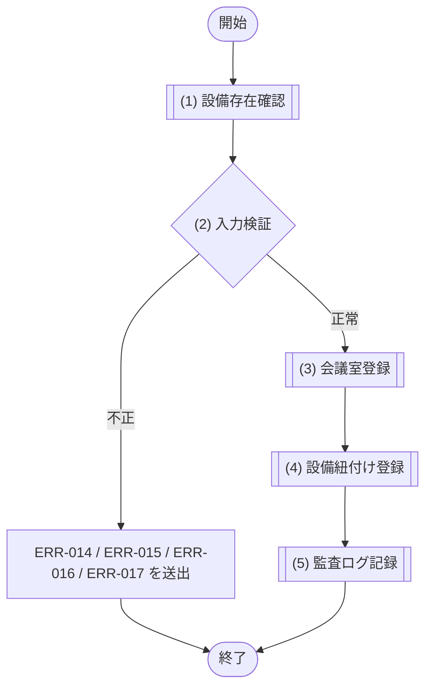
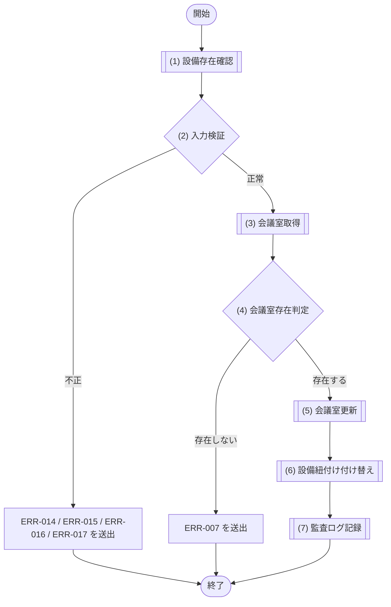
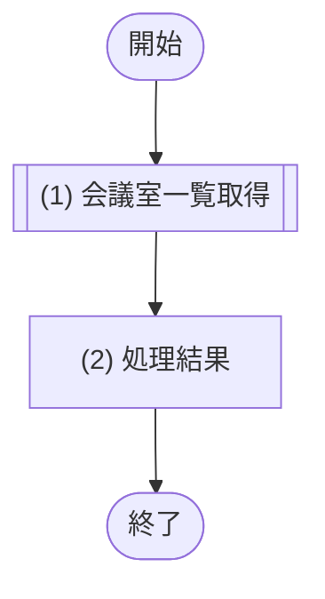
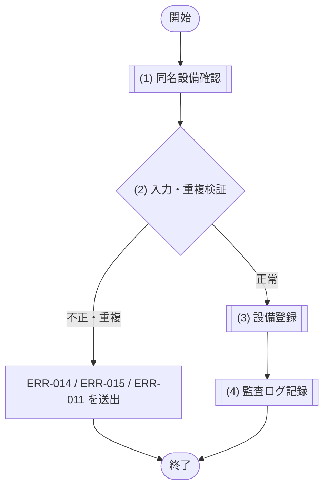
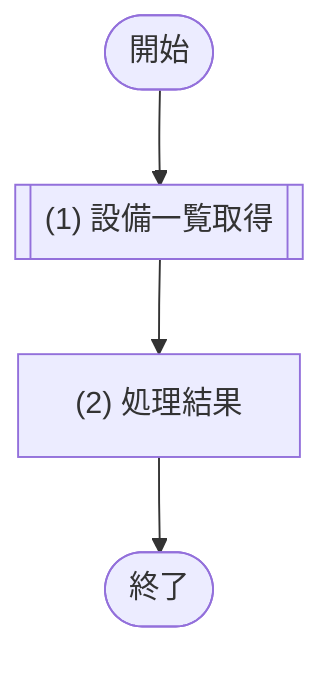
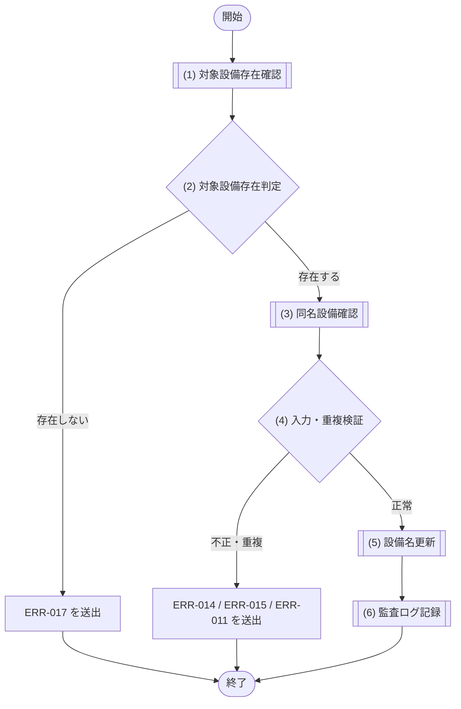

# 1. 基本情報

| 項目 | 内容 |
|---|---|
| モジュールID | MOD-004 |
| モジュール名 | 会議室管理サービス |
| 種別 | Service |
| 概要 | 管理者による会議室(利用単価を含む)と設備紐付けの登録・編集、および設備マスタ一覧の取得を行う |

# 2. 責務

| No | 責務 |
|---|---|
| 1 | 会議室(利用単価 利用単価 を含む)の登録・編集 |
| 2 | 会議室と設備の紐付け(中間テーブル)の登録・付け替え |
| 3 | 設備マスタの一覧取得・登録 |
| 4 | 管理者向け会議室一覧(利用停止を含む全件)の取得 |

# 3. インターフェース

## (1) 会議室登録処理

### 1. 概要

会議室と設備紐付けを登録する処理。

### 2. 入力

| 入力項目 | データ型 | 説明 |
|---|---|---|
| 会議室名 | String | 会議室名 |
| 収容人数 | Integer | 収容人数(1 以上) |
| 設置場所 | String | 設置場所 |
| 利用単価 | Integer | 1 時間あたりの利用単価(0 以上。0=無料) |
| 会議室ステータス | Integer | 会議室ステータス(共通コード定義/CODE-003) |
| 備考 | String | 備考 |
| 設備IDリスト | Integer[] | 紐付ける設備の ID リスト |
| 利用者ID | Integer | 操作を行う管理者の ID(監査ログ記録に使用。API 層で認証済み利用者から設定) |

### 3. 出力

| 出力項目 | データ型 | 説明 |
|---|---|---|
| 会議室 | Object | 登録した会議室 |
| - 会議室ID | Integer | 登録された会議室のID |
| - 会議室名 | String | 会議室の名称 |
| - 収容人数 | Integer | 最大収容人数 |
| - 設置場所 | String | 設置場所 |
| - 1時間あたり利用単価 | Integer | 1時間あたりの利用料金(円) |
| - 会議室ステータス | Integer | 会議室の状態(共通コード定義/CODE-003) |
| - 備考 | String | 会議室の備考 |
| - 設備一覧 | Object[] | 備え付けられている設備(設備ID・設備名)の一覧 |
| -- 設備ID | Integer | 設備のID |
| -- 設備名 | String | 設備の名称 |

### 4. 例外

| エラーID | 説明 |
|---|---|
| ERR-014 | 必須項目(会議室名・収容人数・設置場所・利用単価)が未入力 |
| ERR-015 | 会議室名が桁数上限(50文字)を超過 |
| ERR-016 | 入力値制約違反(収容人数 ＜ 1 または 利用単価 ＜ 0) |
| ERR-017 | 紐付け対象の設備が存在しない |

### 5. 処理フロー

### 6. 処理詳細

#### (1) 設備存在確認処理

入力された設備IDリストの各設備が設備マスタに存在するかを確認する。存在確認結果は (2) 入力検証で判定する。

| SQL-ID | クエリ名 |
|---|---|
| SQL-014 | 設備存在確認 |

| 引数項目 | 値 |
|---|---|
| 設備IDリスト | 引数.設備ID一覧 |

| 項目名 | データ型 | 値 | 説明 |
|---|---|---|---|
| 設備存在結果 | Boolean | SQL-014 設備存在確認の結果。全設備IDが存在すれば true | 返却する設備存在結果 |

#### (2) 入力判定処理

登録前に、入力値がモジュール側の制約を満たすかを検証する(API 層の共通バリデーションとは独立に検証する)。項目種別ごとに次のエラーを送出する。

- 必須項目(会議室名・収容人数・設置場所・利用単価)が未入力の場合は ERR-014({0}=未入力の項目名)を送出する
- 会議室名が50文字を超える場合は ERR-015({0}=会議室名, {1}=50)を送出する
- 収容人数が1未満、または利用単価が0未満の場合は ERR-016({0}=該当項目名)を送出する
- 紐付け対象に存在しない設備IDが含まれる場合は ERR-017({0}=存在しない設備ID)を送出する

##### 条件定義

| No | 判定対象 | 条件 |
|---|---|---|
| 条件(1) | 必須項目(会議室名、収容人数、設置場所、利用単価) | すべて入力されている(未入力の項目がない) |
| 条件(2) | 会議室名 | 文字数 ＜＝ 50 |
| 条件(3) | 収容人数・利用単価 | 収容人数 ＞＝ 1 AND 利用単価 ＞＝ 0 |
| 条件(4) | (1) 設備存在確認の結果 | 全設備IDが存在する(= true) |

##### 条件分岐マトリクス

| 条件・処理 | #1 正常 | #2 必須未入力 | #3 桁数超過 | #4 制約違反 | #5 設備不存在 |
|---|---|---|---|---|---|
| 条件(1) | ◯ | × | ◯ | ◯ | ◯ |
| 条件(2) | ◯ | - | × | ◯ | ◯ |
| 条件(3) | ◯ | - | - | × | ◯ |
| 条件(4) | ◯ | - | - | - | × |
| 処理 |  |  |  |  |  |
| (3) 会議室登録へ進む | ◯ | - | - | - | - |
| ERR-014 を送出する | - | ◯ | - | - | - |
| ERR-015 を送出する | - | - | ◯ | - | - |
| ERR-016 を送出する | - | - | - | ◯ | - |
| ERR-017 を送出する | - | - | - | - | ◯ |

| 項目名 | データ型 | 値 | 説明 |
|---|---|---|---|
| なし | - | - | - |

#### (3) 会議室登録処理

入力内容で会議室を新規登録する。

| SQL-ID | クエリ名 |
|---|---|
| SQL-011 | 会議室登録 |

| 引数項目 | 値 |
|---|---|
| 会議室名 | 引数.名称 |
| 収容人数 | 引数.収容人数 |
| 設置場所 | 引数.設置場所 |
| 利用単価 | 引数.利用単価 |
| 会議室ステータス | 引数.ステータス(未指定時は 共通コード定義/SET-003) |
| 備考 | 引数.備考 |

#### (4) 設備紐付け登録処理

登録した会議室に、指定された設備を紐付けて登録する。登録した会議室を返し COMMIT する。

| SQL-ID | クエリ名 |
|---|---|
| SQL-018 | 会議室設備紐付け登録 |

| 引数項目 | 値 |
|---|---|
| 会議室ID | (3) 会議室登録の結果.ID |
| 設備ID | 引数.設備ID一覧 の各要素(設備ごとに実行) |

| 項目名 | データ型 | 値 | 説明 |
|---|---|---|---|
| 会議室 | Object | (3) 会議室登録処理の結果(登録した会議室データ) | 返却する会議室 |
| - 会議室ID | Integer | (3) 会議室登録処理の結果 | 返却する会議室ID |
| - 会議室名 | String | (3) 会議室登録処理の結果 | 返却する会議室名 |
| - 収容人数 | Integer | (3) 会議室登録処理の結果 | 返却する収容人数 |
| - 設置場所 | String | (3) 会議室登録処理の結果 | 返却する設置場所 |
| - 1時間あたり利用単価 | Integer | (3) 会議室登録処理の結果 | 返却する1時間あたり利用単価 |
| - 会議室ステータス | Integer | (3) 会議室登録処理の結果 | 返却する会議室ステータス |
| - 備考 | String | (3) 会議室登録処理の結果 | 返却する備考 |
| - 設備一覧 | Object[] | 引数.設備IDリスト に対応する設備(設備ID・設備名)の一覧 | 返却する設備一覧 |
| -- 設備ID | Integer | 引数.設備IDリスト | 返却する設備ID |
| -- 設備名 | String | 設備IDに対応する設備名 | 返却する設備名 |

#### (5) 監査ログ記録処理

会議室登録の完了を監査ログに記録する(重要操作の監査証跡。CFR-007)。会議室登録・設備紐付けと同一の更新トランザクション内で MOD-009 に記録を委譲する。

| MOD-ID | 処理名 |
|---|---|
| MOD-009 | 監査ログ記録処理 |

| 引数項目 | 値 |
|---|---|
| 利用者ID | 引数.利用者ID |
| 操作種別 | 会議室管理操作 |
| 操作対象 | (3) 会議室登録処理の結果.会議室ID |
| 操作結果 | 成功 |

## (2) 会議室編集処理

### 1. 概要

会議室と設備紐付けを編集する処理。

### 2. 入力

| 入力項目 | データ型 | 説明 |
|---|---|---|
| 会議室ID | Integer | 編集対象の会議室ID |
| 会議室名 | String | 会議室名 |
| 収容人数 | Integer | 収容人数(1 以上) |
| 設置場所 | String | 設置場所 |
| 利用単価 | Integer | 1 時間あたりの利用単価(0 以上。0=無料) |
| 会議室ステータス | Integer | 会議室ステータス(共通コード定義/CODE-003) |
| 備考 | String | 備考 |
| 設備IDリスト | Integer[] | 紐付ける設備の ID リスト(付け替え) |
| 利用者ID | Integer | 操作を行う管理者の ID(監査ログ記録に使用。API 層で認証済み利用者から設定) |

### 3. 出力

| 出力項目 | データ型 | 説明 |
|---|---|---|
| 会議室 | Object | 更新後の会議室 |
| - 会議室ID | Integer | 会議室のID |
| - 会議室名 | String | 会議室の名称 |
| - 収容人数 | Integer | 最大収容人数 |
| - 設置場所 | String | 設置場所 |
| - 1時間あたり利用単価 | Integer | 1時間あたりの利用料金(円) |
| - 会議室ステータス | Integer | 会議室の状態(共通コード定義/CODE-003) |
| - 備考 | String | 会議室の備考 |
| - 設備一覧 | Object[] | 備え付けられている設備(設備ID・設備名)の一覧 |
| -- 設備ID | Integer | 設備のID |
| -- 設備名 | String | 設備の名称 |

### 4. 例外

| エラーID | 説明 |
|---|---|
| ERR-014 | 必須項目(会議室名・収容人数・設置場所・利用単価)が未入力 |
| ERR-015 | 会議室名が桁数上限(50文字)を超過 |
| ERR-016 | 入力値制約違反(収容人数 ＜ 1 または 利用単価 ＜ 0) |
| ERR-017 | 紐付け対象の設備が存在しない |
| ERR-007 | 指定 ID の会議室が存在しない |

### 5. 処理フロー

### 6. 処理詳細

#### (1) 設備存在確認処理

入力された設備IDリストの各設備が設備マスタに存在するかを確認する。存在確認結果は (2) 入力検証で判定する。

| SQL-ID | クエリ名 |
|---|---|
| SQL-014 | 設備存在確認 |

| 引数項目 | 値 |
|---|---|
| 設備IDリスト | 引数.設備ID一覧 |

| 項目名 | データ型 | 値 | 説明 |
|---|---|---|---|
| 設備存在結果 | Boolean | SQL-014 設備存在確認の結果。全設備IDが存在すれば true | 返却する設備存在結果 |

#### (2) 入力判定処理

会議室登録処理 (2) と同一の制約を、項目種別ごとに検証する(API 層の共通バリデーションとは独立に検証する)。

- 必須項目(会議室名・収容人数・設置場所・利用単価)が未入力の場合は ERR-014({0}=未入力の項目名)を送出する
- 会議室名が50文字を超える場合は ERR-015({0}=会議室名, {1}=50)を送出する
- 収容人数が1未満、または利用単価が0未満の場合は ERR-016({0}=該当項目名)を送出する
- 紐付け対象に存在しない設備IDが含まれる場合は ERR-017({0}=存在しない設備ID)を送出する

##### 条件定義

| No | 判定対象 | 条件 |
|---|---|---|
| 条件(1) | 必須項目(会議室名、収容人数、設置場所、利用単価) | すべて入力されている(未入力の項目がない) |
| 条件(2) | 会議室名 | 文字数 ＜＝ 50 |
| 条件(3) | 収容人数・利用単価 | 収容人数 ＞＝ 1 AND 利用単価 ＞＝ 0 |
| 条件(4) | (1) 設備存在確認の結果 | 全設備IDが存在する(= true) |

##### 条件分岐マトリクス

| 条件・処理 | #1 正常 | #2 必須未入力 | #3 桁数超過 | #4 制約違反 | #5 設備不存在 |
|---|---|---|---|---|---|
| 条件(1) | ◯ | × | ◯ | ◯ | ◯ |
| 条件(2) | ◯ | - | × | ◯ | ◯ |
| 条件(3) | ◯ | - | - | × | ◯ |
| 条件(4) | ◯ | - | - | - | × |
| 処理 |  |  |  |  |  |
| (3) 会議室取得へ進む | ◯ | - | - | - | - |
| ERR-014 を送出する | - | ◯ | - | - | - |
| ERR-015 を送出する | - | - | ◯ | - | - |
| ERR-016 を送出する | - | - | - | ◯ | - |
| ERR-017 を送出する | - | - | - | - | ◯ |

| 項目名 | データ型 | 値 | 説明 |
|---|---|---|---|
| なし | - | - | - |

#### (3) 会議室取得処理

編集対象の会議室が存在するかを確認するため、指定 ID の会議室を取得する。該当が無い場合は NULL を返す。

| SQL-ID | クエリ名 |
|---|---|
| SQL-008 | 会議室取得 |

| 引数項目 | 値 |
|---|---|
| 会議室ID | 引数.会議室ID |

| 項目名 | データ型 | 値 | 説明 |
|---|---|---|---|
| 会議室 | Object | SQL-008 会議室取得の結果。該当が無い場合は NULL | 返却する会議室 |
| - 会議室ID | Integer | 会議室取得の結果 | 返却する会議室ID |
| - 会議室名 | String | 会議室取得の結果 | 返却する会議室名 |
| - 収容人数 | Integer | 会議室取得の結果 | 返却する収容人数 |
| - 設置場所 | String | 会議室取得の結果 | 返却する設置場所 |
| - 1時間あたり利用単価 | Integer | 会議室取得の結果 | 返却する1時間あたり利用単価 |
| - 会議室ステータス | Integer | 会議室取得の結果 | 返却する会議室ステータス |
| - 備考 | String | 会議室取得の結果 | 返却する備考 |

#### (4) 会議室存在判定処理

対象の会議室が存在するかを判定する。

##### 条件定義

| No | 判定対象 | 条件 |
|---|---|---|
| 条件(1) | (3) 会議室取得の結果 | != NULL |

##### 条件分岐マトリクス

| 条件・処理 | #1 存在する | #2 存在しない |
|---|---|---|
| 条件(1) | ◯ | × |
| 処理 |  |  |
| (5) 会議室更新へ進む | ◯ | - |
| ERR-007 を送出する | - | ◯ |

| 項目名 | データ型 | 値 | 説明 |
|---|---|---|---|
| なし | - | - | - |

#### (5) 会議室更新処理

編集対象の会議室情報を更新する。

- 会議室の利用停止(無効化)は、会議室ステータスを利用停止(共通コード定義/CODE-003)へ更新する論理的な無効化として行い、データの物理削除は行わない。

| SQL-ID | クエリ名 |
|---|---|
| SQL-012 | 会議室更新 |

| 引数項目 | 値 |
|---|---|
| 会議室ID | 引数.会議室ID |
| 会議室名 | 引数.名称 |
| 収容人数 | 引数.収容人数 |
| 設置場所 | 引数.設置場所 |
| 利用単価 | 引数.利用単価 |
| 会議室ステータス | 引数.ステータス |
| 備考 | 引数.備考 |

#### (6) 設備紐付け更新処理

対象会議室の設備紐付けを、指定された設備一覧で置き換える(既存の紐付けを削除して登録し直す)。更新後の会議室を返し COMMIT する。

| SQL-ID | クエリ名 |
|---|---|
| SQL-019 | 会議室設備紐付け削除 |
| SQL-018 | 会議室設備紐付け登録 |

| 引数項目 | 値 |
|---|---|
| 会議室ID | 引数.会議室ID |
| 設備ID | 引数.設備ID一覧 の各要素(SQL-018 を設備ごとに実行) |

| 項目名 | データ型 | 値 | 説明 |
|---|---|---|---|
| 会議室 | Object | (5) 会議室更新処理の結果(更新後の会議室データ) | 返却する会議室 |
| - 会議室ID | Integer | (5) 会議室更新処理の結果 | 返却する会議室ID |
| - 会議室名 | String | (5) 会議室更新処理の結果 | 返却する会議室名 |
| - 収容人数 | Integer | (5) 会議室更新処理の結果 | 返却する収容人数 |
| - 設置場所 | String | (5) 会議室更新処理の結果 | 返却する設置場所 |
| - 1時間あたり利用単価 | Integer | (5) 会議室更新処理の結果 | 返却する1時間あたり利用単価 |
| - 会議室ステータス | Integer | (5) 会議室更新処理の結果 | 返却する会議室ステータス |
| - 備考 | String | (5) 会議室更新処理の結果 | 返却する備考 |
| - 設備一覧 | Object[] | 引数.設備IDリスト に対応する設備(設備ID・設備名)の一覧 | 返却する設備一覧 |
| -- 設備ID | Integer | 引数.設備IDリスト | 返却する設備ID |
| -- 設備名 | String | 設備IDに対応する設備名 | 返却する設備名 |

#### (7) 監査ログ記録処理

会議室編集の完了を監査ログに記録する(重要操作の監査証跡。CFR-007)。会議室更新・設備紐付け付け替えと同一の更新トランザクション内で MOD-009 に記録を委譲する。

| MOD-ID | 処理名 |
|---|---|
| MOD-009 | 監査ログ記録処理 |

| 引数項目 | 値 |
|---|---|
| 利用者ID | 引数.利用者ID |
| 操作種別 | 会議室管理操作 |
| 操作対象 | 引数.会議室ID |
| 操作結果 | 成功 |

## (3) 会議室一覧取得処理

### 1. 概要

管理者向けに全会議室(利用停止を含む)を設備一覧付きで取得する処理。

### 2. 入力

| 入力項目 | データ型 | 説明 |
|---|---|---|
| なし | - | 引数なし |

### 3. 出力

| 出力項目 | データ型 | 説明 |
|---|---|---|
| 会議室一覧 | Object[] | 全会議室(利用停止含む)を設備一覧付き・会議室名昇順で取得した一覧 |
| - 会議室ID | Integer | 会議室のID |
| - 会議室名 | String | 会議室の名称 |
| - 収容人数 | Integer | 最大収容人数 |
| - 設置場所 | String | 設置場所 |
| - 1時間あたり利用単価 | Integer | 1時間あたりの利用料金(円) |
| - 会議室ステータス | Integer | 会議室の状態(共通コード定義/CODE-003) |
| - 備考 | String | 会議室の備考 |
| - 設備一覧 | String[] | 備え付けられている設備の名称一覧 |

### 4. 例外

| エラーID | 説明 |
|---|---|
| なし | - |

### 5. 処理フロー

### 6. 処理詳細

管理者向けに、利用停止を含む全会議室を設備一覧付きで取得する。

- 管理者の会議室編集対象選択(SCR-005)に用いる。
- 分岐・エラーはない(認可は API 層で担保)。

| SQL-ID | クエリ名 |
|---|---|
| SQL-010 | 会議室一覧取得(管理者向け・設備名付き) |

| 引数項目 | 値 |
|---|---|
| なし | - |

#### (2) 処理結果

処理結果を返却する。

| 項目名 | データ型 | 値 | 説明 |
|---|---|---|---|
| 会議室一覧 | Object[] | (1) 会議室一覧取得処理の結果で取得した全会議室(利用停止含む)の設備一覧付き・NAME 昇順の一覧 | 返却する会議室一覧 |
| - 会議室ID | Integer | (1) 会議室一覧取得処理の結果 | 返却する会議室ID |
| - 会議室名 | String | (1) 会議室一覧取得処理の結果 | 返却する会議室名 |
| - 収容人数 | Integer | (1) 会議室一覧取得処理の結果 | 返却する収容人数 |
| - 設置場所 | String | (1) 会議室一覧取得処理の結果 | 返却する設置場所 |
| - 1時間あたり利用単価 | Integer | (1) 会議室一覧取得処理の結果 | 返却する1時間あたり利用単価 |
| - 会議室ステータス | Integer | (1) 会議室一覧取得処理の結果 | 返却する会議室ステータス |
| - 備考 | String | (1) 会議室一覧取得処理の結果 | 返却する備考 |
| - 設備一覧 | String[] | (1) 会議室一覧取得処理の結果(JSON配列から文字列配列へ変換) | 返却する設備一覧 |

## (4) 設備登録処理

### 1. 概要

設備を新規登録する処理。

### 2. 入力

| 入力項目 | データ型 | 説明 |
|---|---|---|
| 設備名 | String | 設備名(50 文字以内) |
| 利用者ID | Integer | 操作を行う管理者の ID(監査ログ記録に使用。API 層で認証済み利用者から設定) |

### 3. 出力

| 出力項目 | データ型 | 説明 |
|---|---|---|
| 設備 | Object | 登録した設備(設備ID・設備名) |
| - 設備ID | Integer | 登録された設備のID |
| - 設備名 | String | 登録された設備の名称 |

### 4. 例外

| エラーID | 説明 |
|---|---|
| ERR-014 | 設備名が未入力 |
| ERR-015 | 設備名が桁数上限(50文字)を超過 |
| ERR-011 | 同名の設備が既に存在する |

### 5. 処理フロー

### 6. 処理詳細

#### (1) 同名設備確認処理

登録しようとする設備名と同名の設備が既に存在するかを、設備マスタを参照して確認する。確認結果は (2) 入力・重複検証で判定する。

| SQL-ID | クエリ名 |
|---|---|
| SQL-037 | 設備名重複確認 |

| 引数項目 | 値 |
|---|---|
| 設備名 | 引数.設備名 |

| 項目名 | データ型 | 値 | 説明 |
|---|---|---|---|
| 同名設備存在 | Boolean | SQL-037 設備名重複確認の結果が 1件以上なら true | 返却する同名設備存在 |

#### (2) 入力・重複判定処理

登録前に、入力された設備名が制約を満たすか、および同名設備の重複が無いかを検証する。

- 設備名が未入力の場合は ERR-014({0}=設備名)を送出する
- 設備名が50文字を超える場合は ERR-015({0}=設備名, {1}=50)を送出する
- 同名の設備が既に存在する場合は ERR-011({0}=設備名)を送出する

##### 条件定義

| No | 判定対象 | 条件 |
|---|---|---|
| 条件(1) | 設備名 | 入力されている(未入力でない) |
| 条件(2) | 設備名 | 文字数 ＜＝ 50 |
| 条件(3) | (1) 同名設備確認の結果 | 同名設備が存在しない(= false) |

##### 条件分岐マトリクス

| 条件・処理 | #1 正常 | #2 未入力 | #3 桁数超過 | #4 重複 |
|---|---|---|---|---|
| 条件(1) | ◯ | × | ◯ | ◯ |
| 条件(2) | ◯ | - | × | ◯ |
| 条件(3) | ◯ | - | - | × |
| 処理 |  |  |  |  |
| (3) 設備登録へ進む | ◯ | - | - | - |
| ERR-014 を送出する | - | ◯ | - | - |
| ERR-015 を送出する | - | - | ◯ | - |
| ERR-011 を送出する | - | - | - | ◯ |

| 項目名 | データ型 | 値 | 説明 |
|---|---|---|---|
| なし | - | - | - |

#### (3) 設備登録処理

入力された設備名で設備を新規登録する。登録した設備を返し COMMIT する。

| SQL-ID | クエリ名 |
|---|---|
| SQL-017 | 設備登録 |

| 引数項目 | 値 |
|---|---|
| 設備名 | 引数.名称 |

| 項目名 | データ型 | 値 | 説明 |
|---|---|---|---|
| 設備 | Object | (2) 設備登録の結果(登録した設備データ) | 返却する設備 |
| - 設備ID | Integer | (2) 設備登録の結果 | 返却する設備ID |
| - 設備名 | String | (2) 設備登録の結果 | 返却する設備名 |

#### (4) 監査ログ記録処理

設備登録の完了を監査ログに記録する(重要操作の監査証跡。CFR-007)。設備登録と同一の更新トランザクション内で MOD-009 に記録を委譲する。

| MOD-ID | 処理名 |
|---|---|
| MOD-009 | 監査ログ記録処理 |

| 引数項目 | 値 |
|---|---|
| 利用者ID | 引数.利用者ID |
| 操作種別 | 会議室管理操作 |
| 操作対象 | (3) 設備登録処理の結果.設備ID |
| 操作結果 | 成功 |

## (5) 設備一覧取得処理

### 1. 概要

設備マスタの一覧を取得する処理。

### 2. 入力

| 入力項目 | データ型 | 説明 |
|---|---|---|
| なし | - | 引数なし |

### 3. 出力

| 出力項目 | データ型 | 説明 |
|---|---|---|
| 設備一覧 | Object[] | 設備マスタの全件(設備名昇順) |
| - 設備ID | Integer | 設備のID |
| - 設備名 | String | 設備の名称 |

### 4. 例外

| エラーID | 説明 |
|---|---|
| なし | - |

### 5. 処理フロー

### 6. 処理詳細

設備マスタの全件を設備名昇順で取得して返す。分岐・エラーはない。

| SQL-ID | クエリ名 |
|---|---|
| SQL-016 | 設備一覧取得 |

| 引数項目 | 値 |
|---|---|
| なし | - |

#### (2) 処理結果

処理結果を返却する。

| 項目名 | データ型 | 値 | 説明 |
|---|---|---|---|
| 設備一覧 | Object[] | (1) 設備一覧取得処理の結果で取得した設備マスタの全件(NAME 昇順) | 返却する設備一覧 |
| - 設備ID | Integer | (1) 設備一覧取得処理の結果 | 返却する設備ID |
| - 設備名 | String | (1) 設備一覧取得処理の結果 | 返却する設備名 |

## (6) 設備更新処理

### 1. 概要

既存設備の設備名を更新する処理。

### 2. 入力

| 入力項目 | データ型 | 説明 |
|---|---|---|
| 設備ID | Integer | 更新対象の設備ID |
| 設備名 | String | 更新後の設備名(50 文字以内) |
| 利用者ID | Integer | 操作を行う管理者の ID(監査ログ記録に使用。API 層で認証済み利用者から設定) |

### 3. 出力

| 出力項目 | データ型 | 説明 |
|---|---|---|
| 設備 | Object | 更新後の設備(設備ID・設備名) |
| - 設備ID | Integer | 更新した設備のID |
| - 設備名 | String | 更新後の設備の名称 |

### 4. 例外

| エラーID | 説明 |
|---|---|
| ERR-017 | 更新対象の設備が存在しない |
| ERR-014 | 設備名が未入力 |
| ERR-015 | 設備名が桁数上限(50文字)を超過 |
| ERR-011 | 同名の設備が既に存在する |

### 5. 処理フロー

### 6. 処理詳細

#### (1) 対象設備存在確認処理

更新対象の設備が設備マスタに存在するかを、設備IDで確認する。存在確認結果は (2) 対象設備存在判定で判定する。

| SQL-ID | クエリ名 |
|---|---|
| SQL-014 | 設備存在確認 |

| 引数項目 | 値 |
|---|---|
| 設備IDリスト | 引数.設備ID(1件のリストとして渡す) |

| 項目名 | データ型 | 値 | 説明 |
|---|---|---|---|
| 対象設備存在 | Boolean | SQL-014 設備存在確認の結果(存在件数)が 1 なら true | 返却する対象設備存在 |

#### (2) 対象設備存在判定処理

更新対象の設備が存在するかを判定する。

##### 条件定義

| No | 判定対象 | 条件 |
|---|---|---|
| 条件(1) | (1) 対象設備存在確認の結果 | 対象設備が存在する(= true) |

##### 条件分岐マトリクス

| 条件・処理 | #1 存在する | #2 存在しない |
|---|---|---|
| 条件(1) | ◯ | × |
| 処理 |  |  |
| (3) 同名設備確認へ進む | ◯ | - |
| ERR-017 を送出する | - | ◯ |

| 項目名 | データ型 | 値 | 説明 |
|---|---|---|---|
| なし | - | - | - |

#### (3) 同名設備確認処理

更新後の設備名と同名の設備が既に存在するかを、設備マスタを参照して確認する。確認結果は (4) 入力・重複検証で判定する。

| SQL-ID | クエリ名 |
|---|---|
| SQL-037 | 設備名重複確認 |

| 引数項目 | 値 |
|---|---|
| 設備名 | 引数.設備名 |

| 項目名 | データ型 | 値 | 説明 |
|---|---|---|---|
| 同名設備存在 | Boolean | SQL-037 設備名重複確認の結果が 1件以上なら true | 返却する同名設備存在 |

#### (4) 入力・重複判定処理

更新前に、入力された設備名が制約を満たすか、および同名設備の重複が無いかを検証する。

- 設備名が未入力の場合は ERR-014({0}=設備名)を送出する
- 設備名が50文字を超える場合は ERR-015({0}=設備名, {1}=50)を送出する
- 同名の設備が既に存在する場合は ERR-011({0}=設備名)を送出する

##### 条件定義

| No | 判定対象 | 条件 |
|---|---|---|
| 条件(1) | 設備名 | 入力されている(未入力でない) |
| 条件(2) | 設備名 | 文字数 ＜＝ 50 |
| 条件(3) | (3) 同名設備確認の結果 | 同名設備が存在しない(= false) |

##### 条件分岐マトリクス

| 条件・処理 | #1 正常 | #2 未入力 | #3 桁数超過 | #4 重複 |
|---|---|---|---|---|
| 条件(1) | ◯ | × | ◯ | ◯ |
| 条件(2) | ◯ | - | × | ◯ |
| 条件(3) | ◯ | - | - | × |
| 処理 |  |  |  |  |
| (5) 設備名更新へ進む | ◯ | - | - | - |
| ERR-014 を送出する | - | ◯ | - | - |
| ERR-015 を送出する | - | - | ◯ | - |
| ERR-011 を送出する | - | - | - | ◯ |

| 項目名 | データ型 | 値 | 説明 |
|---|---|---|---|
| なし | - | - | - |

#### (5) 設備名更新処理

入力された設備名で対象設備を更新する。更新した設備を返し COMMIT する。

| SQL-ID | クエリ名 |
|---|---|
| SQL-038 | 設備名更新 |

| 引数項目 | 値 |
|---|---|
| 設備ID | 引数.設備ID |
| 設備名 | 引数.設備名 |

| 項目名 | データ型 | 値 | 説明 |
|---|---|---|---|
| 設備 | Object | (5) 設備名更新の結果(更新した設備データ) | 返却する設備 |
| - 設備ID | Integer | (5) 設備名更新の結果 | 返却する設備ID |
| - 設備名 | String | (5) 設備名更新の結果 | 返却する設備名 |

#### (6) 監査ログ記録処理

設備更新の完了を監査ログに記録する(重要操作の監査証跡。CFR-007)。設備名更新と同一の更新トランザクション内で MOD-009 に記録を委譲する。

| MOD-ID | 処理名 |
|---|---|
| MOD-009 | 監査ログ記録処理 |

| 引数項目 | 値 |
|---|---|
| 利用者ID | 引数.利用者ID |
| 操作種別 | 会議室管理操作 |
| 操作対象 | 引数.設備ID |
| 操作結果 | 成功 |

# 4. トランザクション・排他制御

| 項目 | 内容 |
|---|---|
| トランザクション境界 | 会議室登録処理 は会議室登録〜設備紐付け登録〜監査ログ記録〜COMMIT、会議室更新処理 は会議室更新〜設備紐付け付け替え〜監査ログ記録〜COMMIT、設備登録処理 は設備登録の INSERT〜監査ログ記録〜COMMIT、設備更新処理 は設備名更新の UPDATE〜監査ログ記録〜COMMIT を1トランザクションで行う。監査ログ記録は MOD-009 を同一トランザクション内で呼び出す。会議室一覧取得処理・設備一覧取得処理 は参照のみで更新トランザクションを持たない |
| 排他制御 | なし(D1/SQLite は書き込みを直列化するため明示的な行ロックは行わない) |

# 5. データアクセス

| テーブル | C | R | U | D | 用途 |
|---|---|---|---|---|---|
| TBL-002 | ✓ | ✓ | ✓ |  | 会議室の登録・存在確認・編集・管理者向け全件一覧取得(会議室一覧取得処理、利用停止含む) |
| TBL-004 | ✓ | ✓ | ✓ |  | 設備一覧取得・設備IDの妥当性確認・存在確認・設備の新規登録・設備名の更新 |
| TBL-005 | ✓ | ✓ |  | ✓ | 会議室と設備の紐付けの登録・付け替え(既存削除→再登録)・会議室一覧の設備結合 |

# 6. エラー・例外

| 条件 | エラー | 対応 |
|---|---|---|
| 必須項目未入力(会議室名・収容人数・設置場所・利用単価、設備登録処理では設備名) | ERR-014 | 例外を送出し、トランザクションをロールバックする |
| 桁数超過(会議室名・設備名が50文字を超過) | ERR-015 | 例外を送出し、トランザクションをロールバックする |
| 入力値制約違反(収容人数 ＜ 1 または 利用単価 ＜ 0) | ERR-016 | 例外を送出し、トランザクションをロールバックする |
| 指定 ID の会議室が存在しない(会議室編集処理) | ERR-007 | 例外を送出し、トランザクションをロールバックする |
| 紐付け対象の設備が存在しない(会議室登録・編集処理)、または更新対象の設備が存在しない(設備更新処理) | ERR-017 | 例外を送出し、トランザクションをロールバックする |
| 同名の設備が既に存在する(設備登録・設備更新処理、設備名の一意制約 違反) | ERR-011 | 例外を送出し、トランザクションをロールバックする |

# 7. 利用ライブラリ/基盤

| 利用ライブラリ/基盤 | 用途 | 管理方針 |
|---|---|---|
| なし | - | - |
