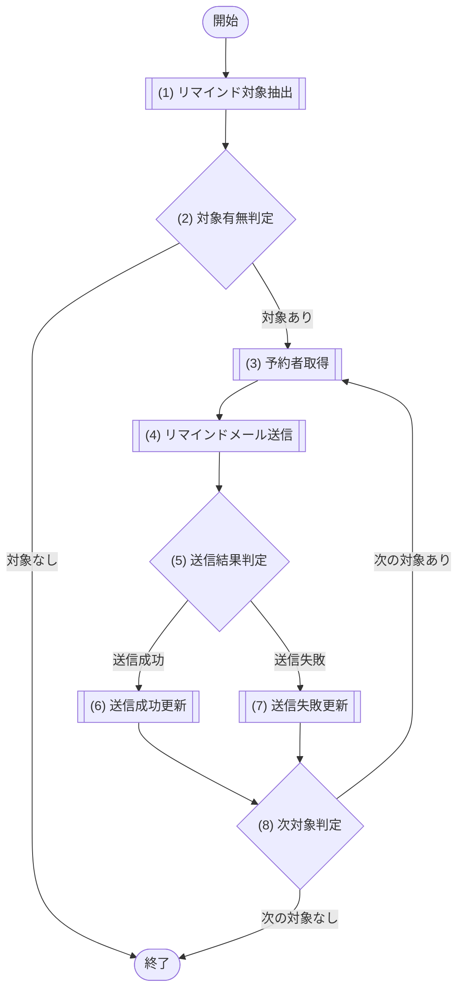

# 1. 基本情報

| 項目 | 内容 |
|---|---|
| モジュールID | MOD-006 |
| モジュール名 | 通知サービス |
| 種別 | Service |
| 概要 | 予約開始前のリマインド対象を抽出し、予約者へ Resend でメール送信して送信状態を更新する |

# 2. 責務

| No | 責務 |
|---|---|
| 1 | リマインド対象予約(開始前・未送信)の抽出 |
| 2 | 予約者へのリマインドメール送信(外部サービス Resend を利用) |
| 3 | 送信結果に応じた予約のリマインド送信状態の更新 |
| 4 | 送信失敗時の再送(最大3回)と、継続失敗時の管理者(共通コード定義/CODE-001)への通知 |

# 3. インターフェース

## (1) リマインド送信処理

### 1. 概要

リマインド対象を抽出しメール送信、送信状態を更新する処理。

### 2. 入力

| 入力項目 | データ型 | 説明 |
|---|---|---|
| リマインド閾値分 | Integer | 現在時刻から何分先までに開始する予約をリマインド対象とするかの閾値(分) |

### 3. 出力

| 出力項目 | データ型 | 説明 |
|---|---|---|
| 送信結果 | Object | 送信済に更新した件数／失敗に更新した件数 |
| - 送信済件数 | Integer | 送信済に更新した件数 |
| - 失敗件数 | Integer | 失敗に更新した件数 |

### 4. 例外

| エラーID | 説明 |
|---|---|
| なし | - |

### 5. 処理フロー

### 6. 処理詳細

#### (1) リマインド対象取得処理

リマインド送信の対象となる、開始時刻が近い予約を抽出する。該当が無い場合は 0件を返す。

- 抽出対象はリマインド通知ステータスが未送信(共通コード定義/SET-008)の予約のみとする。
- 送信済(共通コード定義/SET-009)・失敗(共通コード定義/SET-010)の予約は対象外とし、再送は行わない。

| SQL-ID | クエリ名 |
|---|---|
| SQL-024 | リマインド対象予約抽出 |

| 引数項目 | 値 |
|---|---|
| 基準時刻 | 現在時刻 |
| 閾値時刻 | 現在時刻 ＋ 引数.事前通知分数 |

| 項目名 | データ型 | 値 | 説明 |
|---|---|---|---|
| リマインド対象一覧 | Object[] | SQL-024 リマインド対象予約抽出の結果。該当が無い場合は空配列 | 返却するリマインド対象一覧 |
| - 予約ID | Integer | リマインド対象予約抽出の結果 | 返却する予約ID |
| - ユーザーID | Integer | リマインド対象予約抽出の結果 | 返却するユーザーID |
| - 会議室ID | Integer | リマインド対象予約抽出の結果 | 返却する会議室ID |
| - 利用開始日時 | Datetime | リマインド対象予約抽出の結果 | 返却する利用開始日時 |

#### (2) 対象有無判定処理

リマインド対象の予約が存在するかどうかを判定する。

##### 条件定義

| No | 判定対象 | 条件 |
|---|---|---|
| 条件(1) | (1) リマインド対象抽出の結果 | 件数 ＞ 0 |

##### 条件分岐マトリクス

| 条件・処理 | #1 対象あり | #2 対象なし |
|---|---|---|
| 条件(1) | ◯ | × |
| 処理 |  |  |
| (3) 予約者取得へ進む | ◯ | - |
| 終了する | - | ◯ |

| 項目名 | データ型 | 値 | 説明 |
|---|---|---|---|
| なし | - | - | - |

#### (3) 予約者取得処理

メール送信のため、対象予約の予約者(氏名・メールアドレス)を取得する。該当が無い場合は NULL を返し、当該予約はメール送信をスキップして (5) で失敗として更新する。

| SQL-ID | クエリ名 |
|---|---|
| SQL-004 | ユーザー取得 |

| 引数項目 | 値 |
|---|---|
| ユーザーID | (1) リマインド対象抽出の結果.対象予約.ユーザーID |

| 項目名 | データ型 | 値 | 説明 |
|---|---|---|---|
| 予約者 | Object | SQL-004 ユーザー取得の結果。該当が無い場合は NULL | 返却する予約者 |
| - ユーザーID | Integer | ユーザー取得の結果 | 返却するユーザーID |
| - ユーザー名 | String | ユーザー取得の結果 | 返却するユーザー名 |
| - メールアドレス | String | ユーザー取得の結果 | 返却するメールアドレス |

#### (4) リマインドメール送信処理

予約者へ、外部サービス Resend を用いてリマインドメールを送信し、送信の成否を得る。送信に失敗した場合は一定回数(最大3回)まで再送を試みる。

| 外部サービス | 処理名 |
|---|---|
| Resend | リマインドメール送信 |

| 送信項目 | 値 |
|---|---|
| 宛先メールアドレス | (3) 予約者取得の結果.メールアドレス |
| 宛先ユーザー名 | (3) 予約者取得の結果.名称 |
| 対象予約 | (1) リマインド対象抽出の結果.対象予約(タイトル・会議室ID・開始日時) |

#### (5) 送信結果判定処理

(4) リマインドメール送信の結果をもとに、送信が成功したかを判定する。1件ごとに更新をコミットし、1件の失敗が他の対象に波及しないようにする。

##### 条件定義

| No | 判定対象 | 条件 |
|---|---|---|
| 条件(1) | (4) リマインドメール送信の結果 | 送信成功 |

##### 条件分岐マトリクス

| 条件・処理 | #1 送信成功 | #2 送信失敗 |
|---|---|---|
| 条件(1) | ◯ | × |
| 処理 |  |  |
| (6) 送信成功更新へ進む | ◯ | - |
| (7) 送信失敗更新へ進む | - | ◯ |

| 項目名 | データ型 | 値 | 説明 |
|---|---|---|---|
| なし | - | - | - |

#### (6) 送信成功更新処理

送信に成功した予約のリマインドステータスを送信済(共通コード定義/SET-009)に更新する。

| SQL-ID | クエリ名 |
|---|---|
| SQL-028 | 予約リマインド送信状態更新 |

| 引数項目 | 値 |
|---|---|
| 予約ID | (1) リマインド対象抽出の結果.対象予約.予約ID |
| リマインド通知ステータス | 共通コード定義/SET-009 |

#### (7) 送信失敗更新処理

再送しても送信できなかった予約のリマインドステータスを失敗(共通コード定義/SET-010)に更新し、管理者(共通コード定義/CODE-001)へ失敗を通知する。

| SQL-ID | クエリ名 |
|---|---|
| SQL-028 | 予約リマインド送信状態更新 |

| 引数項目 | 値 |
|---|---|
| 予約ID | (1) リマインド対象抽出の結果.対象予約.予約ID |
| リマインド通知ステータス | 共通コード定義/SET-010 |

#### (8) 次対象判定処理

現在処理中の予約を終えた後、まだ処理すべき予約が残っているか（ループを継続するか）を判定する。

##### 条件定義

| No | 判定対象 | 条件 |
|---|---|---|
| 条件(1) | (1) リマインド対象抽出の結果 | 未処理の対象予約が残っている |

##### 条件分岐マトリクス

| 条件・処理 | #1 次あり | #2 次なし |
|---|---|---|
| 条件(1) | ◯ | × |
| 処理 |  |  |
| (3) 予約者取得へ戻る | ◯ | - |
| 終了する | - | ◯ |

| 項目名 | データ型 | 値 | 説明 |
|---|---|---|---|
| 送信結果 | Object | (6) 送信成功更新・(7) 送信失敗更新でカウントした送信結果(送信済件数 / 失敗件数) | 返却する送信結果 |
| - 送信済件数 | Integer | 共通コード定義/SET-009 に更新した件数 | 返却する送信済件数 |
| - 失敗件数 | Integer | 共通コード定義/SET-010 に更新した件数 | 返却する失敗件数 |

# 4. トランザクション・排他制御

| 項目 | 内容 |
|---|---|
| トランザクション境界 | 対象予約1件ごとに (6) 送信成功更新・(7) 送信失敗更新のみを短いトランザクションでコミットする(全体を1トランザクションにしない) |
| 排他制御 | なし |

# 5. データアクセス

| テーブル | C | R | U | D | 用途 |
|---|---|---|---|---|---|
| TBL-003 |  | ✓ | ✓ |  | リマインド対象の抽出・送信状態の更新 |
| TBL-001 |  | ✓ |  |  | 予約者の氏名・メールアドレスの取得 |

# 6. エラー・例外

| 条件 | エラー | 対応 |
|---|---|---|
| メール送信失敗(再送3回とも失敗)・予約者取得不可 | - | 例外を送出せず、当該予約の リマインドステータス を 共通コード定義/SET-010 に更新し、管理者(共通コード定義/CODE-001)へ通知して次の対象を処理する |
