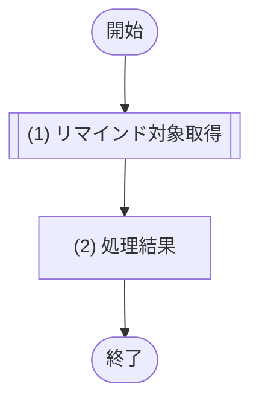
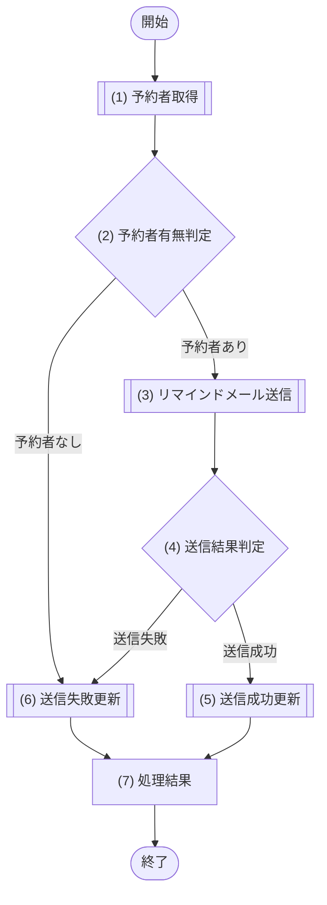

# 1. 基本情報

| 項目 | 内容 |
|---|---|
| モジュールID | MOD-006 |
| モジュール名 | 通知サービス |
| 種別 | Service |
| 概要 | リマインド対象を抽出し、Queueメッセージ1件ごとに予約者へ Resend でメール送信して送信状態を更新する。送信メッセージの再試行・DLQ・管理者アラートは Queue境界と運用が担い、本モジュールは1件の送信と結果反映のみを行う |

# 2. 責務

| No | 責務 |
|---|---|
| 1 | リマインド対象予約(開始前・未送信)の抽出 |
| 2 | Queueメッセージ1件の予約者へのリマインドメール送信(外部サービス Resend を利用) |
| 3 | 送信結果に応じた予約のリマインド送信状態の更新(送信済／失敗) |

※ 送信メッセージの再試行(最大3回)・DLQ・継続失敗時の管理者アラートは Queue境界(CMP-003)と運用が担い、本モジュールの責務ではない。本モジュールは1メッセージにつき1回の送信を行い、成否を返す(送信失敗は Queue が再配送し、再配送で成功すれば送信済へ更新される)。

# 3. インターフェース

## (1) リマインド対象取得処理

### 1. 概要

リマインド対象(開始前・未送信)の予約を抽出し、送信対象の一覧を返す処理。Cron 起動のジョブ(JOB-001)が本処理で対象を取得し、対象ごとの送信メッセージを Queue へ投入する。

### 2. 入力

| 入力項目 | データ型 | 説明 |
|---|---|---|
| リマインド閾値分 | Integer | 現在時刻から何分先までに開始する予約をリマインド対象とするかの閾値(分) |

### 3. 出力

| 出力項目 | データ型 | 説明 |
|---|---|---|
| リマインド対象一覧 | Object[] | 送信対象の予約一覧。該当が無い場合は空配列 |
| - 予約ID | Integer | 対象予約の予約ID |
| - ユーザーID | Integer | 予約者のユーザーID |
| - 会議室ID | Integer | 対象予約の会議室ID |
| - 利用開始日時 | Datetime | 対象予約の利用開始日時 |

### 4. 例外

| エラーID | 説明 |
|---|---|
| なし | - |

### 5. 処理フロー

### 6. 処理詳細

#### (1) リマインド対象取得処理

リマインド送信の対象となる、開始時刻が近い予約を抽出する。該当が無い場合は 0件を返す。

- 抽出対象はリマインド通知ステータスが未送信(共通コード定義/SET-008)の予約のみとする。
- 送信済(共通コード定義/SET-009)・失敗(共通コード定義/SET-010)の予約は対象外とし、再送は行わない。

| SQL-ID | クエリ名 |
|---|---|
| SQL-024 | リマインド対象予約抽出 |

| 引数項目 | 値 |
|---|---|
| 基準時刻 | 現在時刻 |
| 閾値時刻 | 現在時刻 ＋ 引数.リマインド閾値分 |

#### (2) 処理結果

| 項目名 | データ型 | 値 | 説明 |
|---|---|---|---|
| リマインド対象一覧 | Object[] | SQL-024 リマインド対象予約抽出の結果。該当が無い場合は空配列 | 返却するリマインド対象一覧 |
| - 予約ID | Integer | リマインド対象予約抽出の結果 | 返却する予約ID |
| - ユーザーID | Integer | リマインド対象予約抽出の結果 | 返却するユーザーID |
| - 会議室ID | Integer | リマインド対象予約抽出の結果 | 返却する会議室ID |
| - 利用開始日時 | Datetime | リマインド対象予約抽出の結果 | 返却する利用開始日時 |

## (2) リマインド送信処理

### 1. 概要

Queue メッセージ1件(予約1件)について、予約者へ Resend でリマインドメールを1回送信し、送信結果に応じてリマインド送信状態を更新する処理。再試行・DLQ・管理者アラートは呼び出し元の Queue境界・運用が担うため、本処理は再送・管理者通知を行わない。

### 2. 入力

| 入力項目 | データ型 | 説明 |
|---|---|---|
| 予約ID | Integer | 送信対象の予約ID |
| ユーザーID | Integer | 予約者のユーザーID |

### 3. 出力

| 出力項目 | データ型 | 説明 |
|---|---|---|
| 送信結果 | Object | 当該予約1件の送信結果 |
| - 送信状態 | String | 送信済／失敗 |

### 4. 例外

| エラーID | 説明 |
|---|---|
| なし | - |

### 5. 処理フロー

### 6. 処理詳細

#### (1) 予約者取得処理

メール送信のため、対象予約の予約者(氏名・メールアドレス)を取得する。該当が無い場合は NULL を返し、(2) で送信をスキップして失敗として更新する。

| SQL-ID | クエリ名 |
|---|---|
| SQL-004 | ユーザー取得 |

| 引数項目 | 値 |
|---|---|
| ユーザーID | 引数.ユーザーID |

| 項目名 | データ型 | 値 | 説明 |
|---|---|---|---|
| 予約者 | Object | SQL-004 ユーザー取得の結果。該当が無い場合は NULL | 返却する予約者 |
| - ユーザーID | Integer | ユーザー取得の結果 | 返却するユーザーID |
| - ユーザー名 | String | ユーザー取得の結果 | 返却するユーザー名 |
| - メールアドレス | String | ユーザー取得の結果 | 返却するメールアドレス |

#### (2) 予約者有無判定処理

送信先となる予約者を取得できたかを判定する。

##### 条件定義

| No | 判定対象 | 条件 |
|---|---|---|
| 条件(1) | (1) 予約者取得の結果 | != NULL |

##### 条件分岐マトリクス

| 条件・処理 | #1 予約者あり | #2 予約者なし |
|---|---|---|
| 条件(1) | ◯ | × |
| 処理 |  |  |
| (3) リマインドメール送信へ進む | ◯ | - |
| (6) 送信失敗更新へ進む | - | ◯ |

| 項目名 | データ型 | 値 | 説明 |
|---|---|---|---|
| なし | - | - | - |

#### (3) リマインドメール送信処理

予約者へ、外部サービス Resend を用いてリマインドメールを1回送信し、送信の成否を得る。再送は行わない(送信失敗時は Queue が再配送する)。

| 外部サービス | 処理名 |
|---|---|
| Resend | リマインドメール送信 |

| 送信項目 | 値 |
|---|---|
| 宛先メールアドレス | (1) 予約者取得の結果.メールアドレス |
| 宛先ユーザー名 | (1) 予約者取得の結果.ユーザー名 |
| 対象予約 | 引数.予約ID の対象予約(タイトル・会議室ID・開始日時) |

#### (4) 送信結果判定処理

(3) リマインドメール送信の結果をもとに、送信が成功したかを判定する。

##### 条件定義

| No | 判定対象 | 条件 |
|---|---|---|
| 条件(1) | (3) リマインドメール送信の結果 | 送信成功 |

##### 条件分岐マトリクス

| 条件・処理 | #1 送信成功 | #2 送信失敗 |
|---|---|---|
| 条件(1) | ◯ | × |
| 処理 |  |  |
| (5) 送信成功更新へ進む | ◯ | - |
| (6) 送信失敗更新へ進む | - | ◯ |

| 項目名 | データ型 | 値 | 説明 |
|---|---|---|---|
| なし | - | - | - |

#### (5) 送信成功更新処理

送信に成功した予約のリマインドステータスを送信済(共通コード定義/SET-009)に更新する。

| SQL-ID | クエリ名 |
|---|---|
| SQL-028 | 予約リマインド送信状態更新 |

| 引数項目 | 値 |
|---|---|
| 予約ID | 引数.予約ID |
| リマインド通知ステータス | 共通コード定義/SET-009 |

#### (6) 送信失敗更新処理

送信できなかった予約のリマインドステータスを失敗(共通コード定義/SET-010)に更新する。管理者への通知・再送は行わず、失敗結果を呼び出し元へ返す(再配送・DLQ・管理者アラートは Queue境界・運用が担う)。

| SQL-ID | クエリ名 |
|---|---|
| SQL-028 | 予約リマインド送信状態更新 |

| 引数項目 | 値 |
|---|---|
| 予約ID | 引数.予約ID |
| リマインド通知ステータス | 共通コード定義/SET-010 |

#### (7) 処理結果

| 項目名 | データ型 | 値 | 説明 |
|---|---|---|---|
| 送信結果 | Object | (5) 送信成功更新・(6) 送信失敗更新で確定した送信状態 | 返却する送信結果 |
| - 送信状態 | String | 送信済(共通コード定義/SET-009)／失敗(共通コード定義/SET-010) | 当該予約1件の送信状態 |

# 4. トランザクション・排他制御

| 項目 | 内容 |
|---|---|
| トランザクション境界 | 予約1件の (5) 送信成功更新・(6) 送信失敗更新のみを短いトランザクションでコミットする |
| 排他制御 | なし |

# 5. データアクセス

| テーブル | C | R | U | D | 用途 |
|---|---|---|---|---|---|
| TBL-003 |  | ✓ | ✓ |  | リマインド対象の抽出・送信状態の更新 |
| TBL-001 |  | ✓ |  |  | 予約者の氏名・メールアドレスの取得 |

# 6. エラー・例外

| 条件 | エラー | 対応 |
|---|---|---|
| メール送信失敗・予約者取得不可 | - | 例外を送出せず、当該予約の リマインドステータス を 共通コード定義/SET-010 に更新し、失敗結果を返す。再送・DLQ・管理者アラートは Queue境界・運用が担う |
