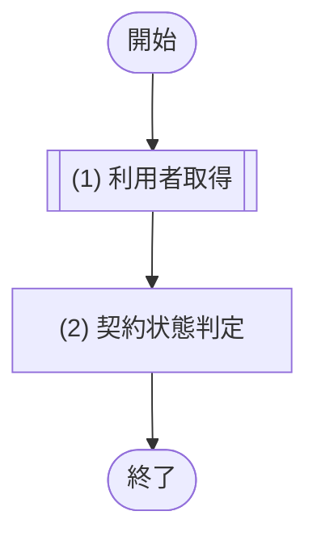
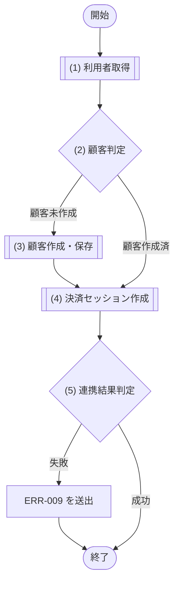
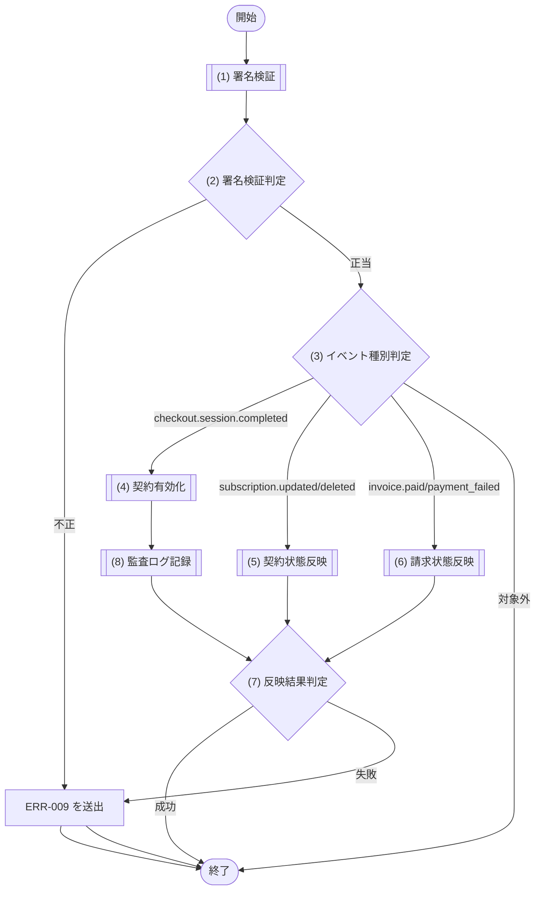
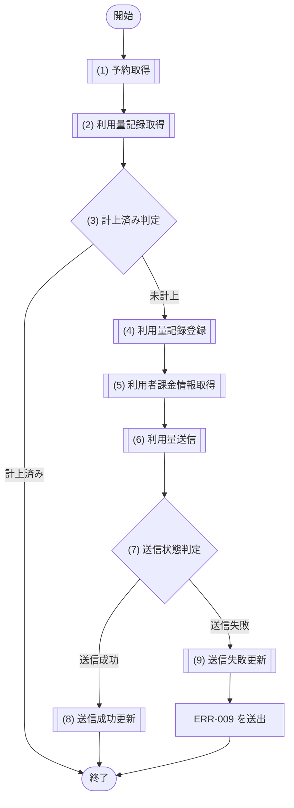
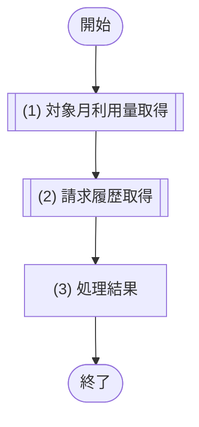
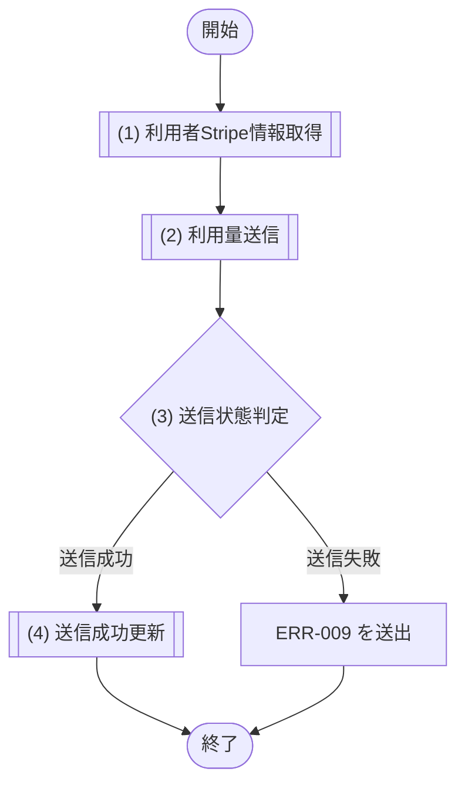

# 1. 基本情報

| 項目 | 内容 |
|---|---|
| モジュールID | MOD-007 |
| モジュール名 | 課金サービス |
| 種別 | Service |
| 概要 | Stripe 従量課金の支払い方法登録、Webhook 処理による契約・請求状態の反映、完了予約の利用量計上(Meter Event 送信)、当月利用量・請求の取得を行う |

# 2. 責務

| No | 責務 |
|---|---|
| 1 | 利用者の課金契約状態が有効かの確認 |
| 2 | 支払い方法登録用の Stripe Checkoutセッションの作成 |
| 3 | Stripe Webhook(署名検証・冪等)の処理と契約状態・請求状態の反映 |
| 4 | 完了した有料予約の利用量記録と Stripe Meter Eventの送信 |
| 5 | 当月の利用量・請求見込みと請求履歴の取得 |
| 6 | Meter Event 送信に失敗した利用量記録の再送 |

# 3. インターフェース

## (1) 課金契約状態確認処理

### 1. 概要

利用者の課金契約が有効かを確認する処理。

### 2. 入力

| 入力項目 | データ型 | 説明 |
|---|---|---|
| ユーザーID | Integer | 確認対象の利用者ID |

### 3. 出力

| 出力項目 | データ型 | 説明 |
|---|---|---|
| なし | - | 戻り値なし(契約が有効なときのみ正常復帰する) |

### 4. 例外

| エラーID | 説明 |
|---|---|
| ERR-008 | 課金契約が有効でない(未契約・停止・利用者不存在) |

### 5. 処理フロー

### 6. 処理詳細

#### (1) 利用者取得処理

契約状態を判定するため、対象の利用者を取得する。該当が無い場合は NULL を返す。

| SQL-ID | クエリ名 |
|---|---|
| SQL-004 | ユーザー取得 |

| 引数項目 | 値 |
|---|---|
| ユーザーID | 引数.ユーザーID |

| 項目名 | データ型 | 値 | 説明 |
|---|---|---|---|
| 利用者 | Object | SQL-004 ユーザー取得の結果。該当が無い場合は NULL | 返却する利用者 |
| - ユーザーID | Integer | ユーザー取得の結果 | 返却するユーザーID |
| - 課金契約ステータス | Integer | ユーザー取得の結果 | 返却する課金契約ステータス |
| - Stripe顧客ID | String | ユーザー取得の結果 | 返却するStripe顧客ID |

#### (2) 契約状態判定処理

利用者の課金契約が有効かを判定する。有効時は何も返さず正常復帰し、有効でない場合は ERR-008 を送出する。

##### 条件定義

| No | 判定対象 | 条件 |
|---|---|---|
| 条件(1) | (1) 利用者取得の結果 | != NULL |
| 条件(2) | (1) 利用者取得の結果.課金ステータス | = 2(有効) |

##### 条件分岐マトリクス

| 条件・処理 | #1 有効 | #2 無効・不存在 |
|---|---|---|
| 条件(1) | ◯ | × |
| 条件(2) | ◯ | × |
| 処理 |  |  |
| 正常復帰する | ◯ | - |
| ERR-008 を送出する | - | ◯ |

| 項目名 | データ型 | 値 | 説明 |
|---|---|---|---|
| なし | - | - | - |

## (2) 支払い方法登録セッション作成処理

### 1. 概要

支払い方法登録用の Checkout セッションを作成する処理。

### 2. 入力

| 入力項目 | データ型 | 説明 |
|---|---|---|
| ユーザーID | Integer | セッションを作成する利用者ID |

### 3. 出力

| 出力項目 | データ型 | 説明 |
|---|---|---|
| Checkoutセッション | String | 生成した Checkout セッションのURL |

### 4. 例外

| エラーID | 説明 |
|---|---|
| ERR-009 | Stripe 連携の失敗(顧客作成・セッション作成) |

### 5. 処理フロー

### 6. 処理詳細

#### (1) 利用者取得処理

Stripe 顧客の作成要否とセッション作成に必要な利用者情報を取得する。該当が無い場合は NULL を返す。

| SQL-ID | クエリ名 |
|---|---|
| SQL-004 | ユーザー取得 |

| 引数項目 | 値 |
|---|---|
| ユーザーID | 引数.ユーザーID |

| 項目名 | データ型 | 値 | 説明 |
|---|---|---|---|
| 利用者 | Object | SQL-004 ユーザー取得の結果。該当が無い場合は NULL | 返却する利用者 |
| - ユーザーID | Integer | ユーザー取得の結果 | 返却するユーザーID |
| - メールアドレス | String | ユーザー取得の結果 | 返却するメールアドレス |
| - Stripe顧客ID | String | ユーザー取得の結果 | 返却するStripe顧客ID |
| - 課金契約ステータス | Integer | ユーザー取得の結果 | 返却する課金契約ステータス |

#### (2) Stripe顧客判定処理

利用者に対応する Stripe 顧客が作成済みかを判定し、新規作成の要否を決める。

##### 条件定義

| No | 判定対象 | 条件 |
|---|---|---|
| 条件(1) | (1) 利用者取得の結果.Stripe顧客ID | != NULL |

##### 条件分岐マトリクス

| 条件・処理 | #1 顧客作成済 | #2 顧客未作成 |
|---|---|---|
| 条件(1) | ◯ | × |
| 処理 |  |  |
| (3) Stripe顧客作成・保存を実行する | - | ◯ |
| (4) Checkoutセッション作成へ進む | ◯ | ◯ |

| 項目名 | データ型 | 値 | 説明 |
|---|---|---|---|
| なし | - | - | - |

#### (3) Stripe顧客登録処理

利用者に対応する Stripe 顧客を新規作成し、生成された顧客IDを利用者に保存する。Stripe 連携に失敗した場合は ERR-009 を送出する。

| SQL-ID | クエリ名 |
|---|---|
| SQL-005 | ユーザーStripe顧客ID更新 |

| 引数項目 | 値 |
|---|---|
| ユーザーID | 引数.ユーザーID |
| Stripe顧客ID | Stripe が生成した顧客ID |

#### (4) Checkoutセッション取得処理

支払い方法登録用の Checkout セッション(従量課金サブスクリプション)を作成し、生成されたセッションURL(または連携失敗)を返す。連携の成否は (5) 連携結果判定で判定する。

| 外部サービス | 処理名 |
|---|---|
| Stripe | Checkoutセッション作成 |

| 送信項目 | 値 |
|---|---|
| Stripe顧客ID | (1) 利用者取得の結果.Stripe顧客ID または (3) の保存値 |

| 項目名 | データ型 | 値 | 説明 |
|---|---|---|---|
| Checkoutセッション | String | (4) で生成した Checkout セッションのURL | 返却するCheckoutセッション |

#### (5) 連携結果判定処理

(4) 決済セッション作成の結果をもとに、Stripe 連携が成功したかを判定する。

##### 条件定義

| No | 判定対象 | 条件 |
|---|---|---|
| 条件(1) | (4) 決済セッション作成の結果 | != NULL(セッション作成成功) |

##### 条件分岐マトリクス

| 条件・処理 | #1 成功 | #2 失敗 |
|---|---|---|
| 条件(1) | ◯ | × |
| 処理 |  |  |
| Checkoutセッションを返す | ◯ | - |
| ERR-009 を送出する | - | ◯ |

## (3) Webhook反映処理

### 1. 概要

Stripe Webhook を検証し契約・請求状態を反映する処理。

### 2. 入力

| 入力項目 | データ型 | 説明 |
|---|---|---|
| 署名 | String | Stripe-Signature 署名 |
| ペイロード | String | Webhook の生ペイロード |

### 3. 出力

| 出力項目 | データ型 | 説明 |
|---|---|---|
| なし | - | 戻り値なし(契約・請求状態の反映のみ) |

### 4. 例外

| エラーID | 説明 |
|---|---|
| ERR-009 | Stripe 連携の失敗(署名検証・状態反映) |

### 5. 処理フロー

### 6. 処理詳細

#### (1) 署名検証処理

Webhook が Stripe からの正当な要求かを署名検証で確認し、成功時はイベント(種別・データ)を取り出す。検証結果は (2) 署名検証判定で判定する。

| 外部サービス | 処理名 |
|---|---|
| Stripe | Webhook署名検証 |

| 検証項目 | 値 |
|---|---|
| 署名 | 引数.署名 |
| ペイロード | 引数.ペイロード |

| 項目名 | データ型 | 値 | 説明 |
|---|---|---|---|
| 署名検証結果 | Object | Stripe Webhook署名検証の結果(正当/不正、およびイベント種別・データ) | 返却する署名検証結果 |

#### (2) 署名検証判定処理

(1) 署名検証の結果をもとに、Webhook が正当かを判定する。不正な場合は ERR-009 を送出する。

##### 条件定義

| No | 判定対象 | 条件 |
|---|---|---|
| 条件(1) | (1) 署名検証の結果 | 署名が正当である |

##### 条件分岐マトリクス

| 条件・処理 | #1 正当 | #2 不正 |
|---|---|---|
| 条件(1) | ◯ | × |
| 処理 |  |  |
| (3) イベント種別判定へ進む | ◯ | - |
| ERR-009 を送出する | - | ◯ |

| 項目名 | データ型 | 値 | 説明 |
|---|---|---|---|
| なし | - | - | - |

#### (3) イベント種別判定処理

(1) 署名検証の結果のイベント種別で処理を振り分ける。対象外の種別は何もせず正常復帰する(冪等)。

##### 条件分岐マトリクス

| 条件・処理 | #1 契約有効化 | #2 契約状態変更 | #3 請求状態変更 | #4 対象外 |
|---|---|---|---|---|
| event.type = checkout.session.completed | ◯ | - | - | - |
| event.type = customer.subscription.updated / deleted | - | ◯ | - | - |
| event.type = invoice.paid / invoice.payment_failed | - | - | ◯ | - |
| 上記以外 | - | - | - | ◯ |
| 処理 |  |  |  |  |
| (4) 契約有効化を実行する | ◯ | - | - | - |
| (5) 契約状態反映を実行する | - | ◯ | - | - |
| (6) 請求状態反映を実行する | - | - | ◯ | - |
| 何もせず正常復帰する | - | - | - | ◯ |

| 項目名 | データ型 | 値 | 説明 |
|---|---|---|---|
| なし | - | - | - |

#### (4) 契約有効化更新処理

支払い方法の登録完了を受けて、対応する利用者の課金契約を有効化する。処理の成否は (7) 反映結果判定で判定する。

| SQL-ID | クエリ名 |
|---|---|
| SQL-006 | ユーザー課金契約有効化 |

| 引数項目 | 値 |
|---|---|
| Stripe顧客ID | (1) 署名検証の結果.顧客ID |
| StripeサブスクリプションID | (1) 署名検証の結果.サブスクリプションID |

| 項目名 | データ型 | 値 | 説明 |
|---|---|---|---|
| 利用者(TBL-001) | - | 共通コード定義/SET-001 / サブスクリプションID | 返却する利用者(TBL-001) |

#### (5) 契約状態更新処理

サブスクリプションの状態変更に応じて、対応する利用者の課金契約状態を反映する。処理の成否は (7) 反映結果判定で判定する。

| SQL-ID | クエリ名 |
|---|---|
| SQL-007 | ユーザー課金契約状態更新 |

##### 条件分岐マトリクス

| 条件・処理 | #1 有効 | #2 停止 |
|---|---|---|
| サブスクリプション状態 = active | ◯ | - |
| サブスクリプション状態 = deleted / 支払い不能・解約 | - | ◯ |
| 処理 |  |  |
| 課金ステータスを 共通コード定義/SET-001 に更新する | ◯ | - |
| 課金ステータスを 共通コード定義/SET-002 に更新する | - | ◯ |

| 項目名 | データ型 | 値 | 説明 |
|---|---|---|---|
| 利用者(TBL-001) | - | サブスクリプション状態に応じた 共通コード定義/CODE-002 | 返却する利用者(TBL-001) |

#### (6) 請求状態更新処理

Stripe の請求(インボイス)の支払い結果を請求記録に反映する。

- 同一請求は冪等に処理する。
- 処理の成否は (7) 反映結果判定で判定する。

| SQL-ID | クエリ名 |
|---|---|
| SQL-035 | 請求UPSERT |

##### 条件分岐マトリクス

| 条件・処理 | #1 支払済 | #2 支払失敗 |
|---|---|---|
| event.type = invoice.paid | ◯ | - |
| event.type = invoice.payment_failed | - | ◯ |
| 処理 |  |  |
| 共通コード定義/SET-014 で UPSERT する | ◯ | - |
| 共通コード定義/SET-015 で UPSERT する | - | ◯ |

| 項目名 | データ型 | 値 | 説明 |
|---|---|---|---|
| 請求(TBL-008) | - | イベント種別に応じた 共通コード定義/CODE-007 | 返却する請求(TBL-008) |

#### (7) 反映結果判定処理

(4) 契約有効化・(5) 契約状態反映・(6) 請求状態反映のいずれかの結果をもとに、状態反映が成功したかを判定する。

##### 条件定義

| No | 判定対象 | 条件 |
|---|---|---|
| 条件(1) | (4)〜(6) の実行結果 | 反映成功である |

##### 条件分岐マトリクス

| 条件・処理 | #1 成功 | #2 失敗 |
|---|---|---|
| 条件(1) | ◯ | × |
| 処理 |  |  |
| 正常復帰する | ◯ | - |
| ERR-009 を送出する | - | ◯ |

#### (8) 監査ログ記録処理

支払い方法登録の完了(契約有効化)を監査ログに記録する(重要操作の監査証跡。CFR-007)。契約有効化(checkout.session.completed)のときのみ実行し、契約有効化と同一の更新トランザクション内で MOD-009 に記録を委譲する。反映結果判定(7)が失敗を検出した場合は、監査ログの記録も含めトランザクションをロールバックする。

| MOD-ID | 処理名 |
|---|---|
| MOD-009 | 監査ログ記録処理 |

| 引数項目 | 値 |
|---|---|
| 利用者ID | (4) 契約有効化更新処理の結果.利用者ID |
| 操作種別 | 課金操作 |
| 操作対象 | (4) 契約有効化更新処理の結果.利用者ID(課金契約) |
| 操作結果 | 成功 |

## (4) 利用量計上処理

### 1. 概要

完了した有料予約の利用量を計上し Meter Event を送信する処理。

### 2. 入力

| 入力項目 | データ型 | 説明 |
|---|---|---|
| 予約ID | Integer | 計上対象の予約ID |
| 適用単価 | Integer | 利用時点の会議室単価(1 時間あたり) |

### 3. 出力

| 出力項目 | データ型 | 説明 |
|---|---|---|
| 利用量記録 | Object | 登録・更新した利用量記録 |
| - 利用量記録ID | Integer | 利用量記録の一意なID |
| - 予約ID | Integer | 対象の予約ID |
| - ユーザーID | Integer | 対象のユーザーID |
| - 会議室ID | Integer | 対象の会議室ID |
| - 利用時間分 | Integer | 利用時間(分) |
| - 適用単価 | Integer | 円/時。利用時点の会議室単価 |
| - 金額 | Integer | 円(参考値)。利用時間(分) ÷ 60 × 適用単価 |
| - Stripe Meter Event ID | String | Stripe への送信成功後に記録 |
| - 計上ステータス | Integer | 計上ステータス(共通コード定義/CODE-006) |

### 4. 例外

| エラーID | 説明 |
|---|---|
| ERR-009 | Stripe 連携の失敗(Meter Event 送信) |

### 5. 処理フロー

### 6. 処理詳細

#### (1) 予約取得処理

利用量計上の対象となる予約を取得する。該当が無い場合は NULL を返す。

| SQL-ID | クエリ名 |
|---|---|
| SQL-021 | 予約取得 |

| 引数項目 | 値 |
|---|---|
| 予約ID | 引数.予約ID |

| 項目名 | データ型 | 値 | 説明 |
|---|---|---|---|
| 予約 | Object | SQL-021 予約取得の結果。該当が無い場合は NULL | 返却する予約 |
| - 予約ID | Integer | 予約取得の結果 | 返却する予約ID |
| - ユーザーID | Integer | 予約取得の結果 | 返却するユーザーID |
| - 会議室ID | Integer | 予約取得の結果 | 返却する会議室ID |
| - 利用開始日時 | Datetime | 予約取得の結果 | 返却する利用開始日時 |
| - 利用終了日時 | Datetime | 予約取得の結果 | 返却する利用終了日時 |

#### (2) 利用量記録取得処理

二重計上を防ぐため、対象予約の利用量記録が既に存在するかを確認する。

| SQL-ID | クエリ名 |
|---|---|
| SQL-031 | 利用量記録存在確認 |

| 引数項目 | 値 |
|---|---|
| 予約ID | 引数.予約ID |

| 項目名 | データ型 | 値 | 説明 |
|---|---|---|---|
| 利用量記録確認 | Object | SQL-031 利用量記録存在確認の結果 | 返却する利用量記録確認 |
| - 記録件数 | Integer | 利用量記録存在確認の結果 | 返却する記録件数 |

#### (3) 計上済み判定処理

(2) 利用量記録取得の結果で、同一予約が既に計上済みかを判定し二重計上を防止する。既存があれば何もせず正常復帰する(冪等)。

##### 条件定義

| No | 判定対象 | 条件 |
|---|---|---|
| 条件(1) | (2) 利用量記録取得の結果.記録件数 | 件数 = 0 |

##### 条件分岐マトリクス

| 条件・処理 | #1 未計上 | #2 計上済み |
|---|---|---|
| 条件(1) | ◯ | × |
| 処理 |  |  |
| (4) 利用量記録登録へ進む | ◯ | - |
| 正常復帰する | - | ◯ |

| 項目名 | データ型 | 値 | 説明 |
|---|---|---|---|
| なし | - | - | - |

#### (4) 利用量記録登録処理

予約の利用時間(分)と金額を算出し、利用量記録として登録する。

| SQL-ID | クエリ名 |
|---|---|
| SQL-032 | 利用量記録登録 |

| 引数項目 | 値 |
|---|---|
| 予約ID | 引数.予約ID |
| ユーザーID | (1) 予約取得の結果.ユーザーID |
| 会議室ID | (1) 予約取得の結果.会議室ID |
| 利用時間分 | (1) 予約取得の結果から算出した利用時間(分) |
| 適用単価 | 引数.適用単価 |
| 金額 | 利用時間 ÷ 60 × 引数.適用単価 |

#### (5) 利用者Stripe情報取得処理

Meter Event 送信に必要な利用者の Stripe 情報を取得する。

| SQL-ID | クエリ名 |
|---|---|
| SQL-004 | ユーザー取得 |

| 引数項目 | 値 |
|---|---|
| ユーザーID | (1) 予約取得の結果.ユーザーID |

| 項目名 | データ型 | 値 | 説明 |
|---|---|---|---|
| 利用者Stripe情報 | Object | SQL-004 ユーザー取得の結果 | 返却する利用者Stripe情報 |
| - ユーザーID | Integer | ユーザー取得の結果 | 返却するユーザーID |
| - Stripe顧客ID | String | ユーザー取得の結果 | 返却するStripe顧客ID |

#### (6) Meter Event送信処理

利用者の利用量を Stripe に Meter Event として送信する。送信の成否(成功/失敗)を得る。

| 外部サービス | 処理名 |
|---|---|
| Stripe | Meter Event送信 |

| 送信項目 | 値 |
|---|---|
| Stripe顧客ID | (5) 利用者Stripe情報取得の結果.Stripe顧客ID |
| 利用量 | (4) 利用量記録登録の利用時間(分) |

#### (7) 送信状態判定処理

(6) Meter Event送信の結果をもとに、送信の成否を判定する。

##### 条件定義

| No | 判定対象 | 条件 |
|---|---|---|
| 条件(1) | (6) Meter Event送信の結果 | 送信成功 |

##### 条件分岐マトリクス

| 条件・処理 | #1 送信成功 | #2 送信失敗 |
|---|---|---|
| 条件(1) | ◯ | × |
| 処理 |  |  |
| (8) 送信成功更新へ進む | ◯ | - |
| (9) 送信失敗更新へ進む | - | ◯ |

| 項目名 | データ型 | 値 | 説明 |
|---|---|---|---|
| なし | - | - | - |

#### (8) 送信成功更新処理

Meter Event の送信成功を受けて、Stripe Meter Event ID を保存し利用量記録の計上ステータスを計上済み(共通コード定義/SET-012)に更新する。更新後の利用量記録を返す。

| SQL-ID | クエリ名 |
|---|---|
| SQL-033 | 利用量記録Meter送信状態更新 |

| 引数項目 | 値 |
|---|---|
| 利用量記録ID | (4) 利用量記録登録の結果.利用量記録ID |
| Stripe Meter Event ID | (6) Meter Event送信の結果.Meter Event ID |
| 計上ステータス | 共通コード定義/SET-012 |

| 項目名 | データ型 | 値 | 説明 |
|---|---|---|---|
| 利用量記録 | Object | (4) 利用量記録登録・本処理で更新した利用量記録 | 返却する利用量記録 |
| - 利用量記録ID | Integer | (4) の結果 | 返却する利用量記録ID |
| - 予約ID | Integer | (4) の結果 | 返却する予約ID |
| - ユーザーID | Integer | (4) の結果 | 返却するユーザーID |
| - 会議室ID | Integer | (4) の結果 | 返却する会議室ID |
| - 利用時間分 | Integer | (4) の結果 | 返却する利用時間分 |
| - 適用単価 | Integer | (4) の結果 | 返却する適用単価 |
| - 金額 | Integer | (4) の結果 | 返却する金額 |
| - Stripe Meter Event ID | String | 本処理で保存した Meter Event ID | 返却するStripe Meter Event ID |
| - 計上ステータス | Integer | 本処理で更新した計上ステータス(共通コード定義/SET-012) | 返却する計上ステータス |

#### (9) 送信失敗更新処理

Meter Event の送信失敗を受けて、利用量記録の計上ステータスを送信失敗(共通コード定義/SET-013)に更新する。記録は残し JOB での再送対象とし、更新後に ERR-009 を送出する。

| SQL-ID | クエリ名 |
|---|---|
| SQL-033 | 利用量記録Meter送信状態更新 |

| 引数項目 | 値 |
|---|---|
| 利用量記録ID | (4) 利用量記録登録の結果.利用量記録ID |
| 計上ステータス | 共通コード定義/SET-013 |

## (5) 利用量・請求取得処理

### 1. 概要

対象月(未指定時は当月)の利用量・請求見込みと請求履歴を取得する処理。

### 2. 入力

| 入力項目 | データ型 | 説明 |
|---|---|---|
| ユーザーID | Integer | 取得対象の利用者ID |
| 対象月 | String | 取得対象月('YYYY-MM'。未指定時は当月。Asia/Tokyo 基準) |
| ページ | Integer | 請求履歴の取得ページ番号 |
| 取得件数 | Integer | 請求履歴の 1 ページあたり取得件数 |

### 3. 出力

| 出力項目 | データ型 | 説明 |
|---|---|---|
| 課金利用状況 | Object | 対象月利用量・請求見込み・請求履歴一覧・請求履歴総件数 |
| - 当月利用分数 | Integer | 当月の利用合計分数 |
| - 当月請求見込み | Integer | 当月の請求見込み額 |
| - 請求履歴一覧 | Object[] | 請求履歴のリスト(ページネーション適用) |
| -- 請求ID | Integer | 請求の一意なID |
| -- 請求対象月 | String | 請求対象月('YYYY-MM') |
| -- 請求金額 | Integer | 請求金額(円) |
| -- 請求ステータス | Integer | 請求の状態(共通コード定義/CODE-007) |
| - 請求履歴総件数 | Integer | 請求履歴の全体件数 |

### 4. 例外

| エラーID | 説明 |
|---|---|
| なし | - |

### 5. 処理フロー

### 6. 処理詳細

#### (1) 対象月利用量取得処理

対象月の利用量(合計利用時間)と請求見込み(合計金額)を集計する。利用は予約の利用月(利用開始日時を Asia/Tokyo 基準で判定)に帰属する。

| SQL-ID | クエリ名 |
|---|---|
| SQL-034 | 月次利用量集計 |

| 引数項目 | 値 |
|---|---|
| ユーザーID | 引数.ユーザーID |
| 対象月 | 引数.対象月(未指定時は当月。Asia/Tokyo 基準) |

| 項目名 | データ型 | 値 | 説明 |
|---|---|---|---|
| 対象月利用量 | Object | SQL-034 月次利用量集計の結果 | 返却する対象月利用量 |
| - 当月利用分数 | Integer | 月次利用量集計の結果 | 返却する当月利用分数 |
| - 当月請求見込み | Integer | 月次利用量集計の結果 | 返却する当月請求見込み |

#### (2) 請求履歴取得処理

利用者の請求履歴をページネーション(API-COM §5)して取得し、対象月の利用量・請求見込みと請求履歴・総件数をまとめて返す。分岐・エラーは持たない。

| SQL-ID | クエリ名 |
|---|---|
| SQL-036 | 請求履歴取得 |

| 引数項目 | 値 |
|---|---|
| ユーザーID | 引数.ユーザーID |
| ページ | 引数.ページ |
| 取得件数 | 引数.取得件数 |

| 項目名 | データ型 | 値 | 説明 |
|---|---|---|---|
| 請求履歴 | Object | SQL-036 請求履歴取得の結果 | 返却する請求履歴 |
| - 請求履歴一覧 | Object[] | 請求履歴取得の結果 | 返却する請求履歴一覧 |
| - 請求履歴総件数 | Integer | 請求履歴取得の結果 | 返却する請求履歴総件数 |

#### (3) 処理結果

処理結果を返却する。

| 項目名 | データ型 | 値 | 説明 |
|---|---|---|---|
| 課金利用状況 | Object | 対象月利用量・請求見込み((1) の結果)と請求履歴一覧・総件数((2) の結果) | 返却する課金利用状況 |
| - 当月利用分数 | Integer | (1) 対象月利用量取得処理の結果 | 返却する当月利用分数 |
| - 当月請求見込み | Integer | (1) 対象月利用量取得処理の結果 | 返却する当月請求見込み |
| - 請求履歴一覧 | Object[] | (2) 請求履歴取得処理の結果 | 返却する請求履歴一覧 |
| - 請求履歴総件数 | Integer | (2) 請求履歴取得処理の結果(全体件数) | 返却する請求履歴総件数 |

## (6) 利用量再送処理

### 1. 概要

Meter Event 送信に失敗した既存の利用量記録を対象に、Stripe へ Meter Event を再送する処理。

### 2. 入力

| 入力項目 | データ型 | 説明 |
|---|---|---|
| 利用量記録 | Object | 再送対象の利用量記録(予約ID・ユーザーID・利用時間(分)を含む) |

### 3. 出力

| 出力項目 | データ型 | 説明 |
|---|---|---|
| 利用量記録 | Object | 再送後の利用量記録 |
| - 利用量記録ID | Integer | 利用量記録の一意なID |
| - Stripe Meter Event ID | String | 送信成功後に記録 |
| - 計上ステータス | Integer | 計上ステータス(共通コード定義/CODE-006) |

### 4. 例外

| エラーID | 説明 |
|---|---|
| ERR-009 | Stripe 連携の失敗(Meter Event 再送) |

### 5. 処理フロー

### 6. 処理詳細

#### (1) 利用者Stripe情報取得処理

Meter Event 再送に必要な利用者の Stripe 情報を取得する。

| SQL-ID | クエリ名 |
|---|---|
| SQL-004 | ユーザー取得 |

| 引数項目 | 値 |
|---|---|
| ユーザーID | 引数.利用量記録.ユーザーID |

| 項目名 | データ型 | 値 | 説明 |
|---|---|---|---|
| 利用者Stripe情報 | Object | SQL-004 ユーザー取得の結果 | 返却する利用者Stripe情報 |
| - ユーザーID | Integer | ユーザー取得の結果 | 返却するユーザーID |
| - Stripe顧客ID | String | ユーザー取得の結果 | 返却するStripe顧客ID |

#### (2) Meter Event送信処理

利用者の利用量を Stripe に Meter Event として再送する。送信の成否(成功/失敗)を得る。

| 外部サービス | 処理名 |
|---|---|
| Stripe | Meter Event送信 |

| 送信項目 | 値 |
|---|---|
| Stripe顧客ID | (1) 利用者Stripe情報取得の結果.Stripe顧客ID |
| 利用量 | 引数.利用量記録.利用時間(分) |

#### (3) 送信状態判定処理

(2) Meter Event送信の結果をもとに、再送の成否を判定する。送信失敗時は計上ステータスを維持したまま ERR-009 を送出し、次回実行で再び再送対象とする。

##### 条件定義

| No | 判定対象 | 条件 |
|---|---|---|
| 条件(1) | (2) Meter Event送信の結果 | 送信成功 |

##### 条件分岐マトリクス

| 条件・処理 | #1 送信成功 | #2 送信失敗 |
|---|---|---|
| 条件(1) | ◯ | × |
| 処理 |  |  |
| (4) 送信成功更新へ進む | ◯ | - |
| ERR-009 を送出する | - | ◯ |

| 項目名 | データ型 | 値 | 説明 |
|---|---|---|---|
| なし | - | - | - |

#### (4) 送信成功更新処理

Meter Event の再送成功を受けて、Stripe Meter Event ID を保存し利用量記録の計上ステータスを計上済み(共通コード定義/SET-012)に更新する。更新後の利用量記録を返す。

| SQL-ID | クエリ名 |
|---|---|
| SQL-033 | 利用量記録Meter送信状態更新 |

| 引数項目 | 値 |
|---|---|
| 利用量記録ID | 引数.利用量記録.利用量記録ID |
| Stripe Meter Event ID | (2) Meter Event送信の結果.Meter Event ID |
| 計上ステータス | 共通コード定義/SET-012 |

| 項目名 | データ型 | 値 | 説明 |
|---|---|---|---|
| 利用量記録 | Object | 引数.利用量記録・本処理で更新した利用量記録 | 返却する利用量記録 |
| - 利用量記録ID | Integer | 引数.利用量記録 | 返却する利用量記録ID |
| - Stripe Meter Event ID | String | (2) Meter Event送信の結果 | 返却するStripe Meter Event ID |
| - 計上ステータス | Integer | 本処理で更新した計上ステータス(共通コード定義/SET-012) | 返却する計上ステータス |

# 4. トランザクション・排他制御

| 項目 | 内容 |
|---|---|
| トランザクション境界 | Checkoutセッション取得処理 の Stripe顧客IDの保存、Webhook処理 の各イベント反映(契約有効化のときは契約有効化〜監査ログ記録(MOD-009)を同一トランザクションで実行)、利用量計上処理 の利用量記録登録〜Meter Event送信状態更新を、それぞれ短いトランザクションでコミットする。課金契約確認処理・利用量・請求取得処理 は参照のみで更新トランザクションを持たない |
| 排他制御 | なし(利用量計上処理 は 利用量記録の一意制約、Webhook処理 の請求は 請求の一意制約 の一意制約で二重計上・二重処理を冪等に防止する) |

# 5. データアクセス

| テーブル | C | R | U | D | 用途 |
|---|---|---|---|---|---|
| TBL-001 |  | ✓ | ✓ |  | 課金契約状態・Stripe顧客/サブスクリプションIDの確認・更新 |
| TBL-003 |  | ✓ |  |  | 完了予約(利用時間算出)の取得 |
| TBL-007 | ✓ | ✓ | ✓ |  | 利用量記録の登録・Meter Event 送信状態の更新・当月利用量の集計 |
| TBL-008 | ✓ | ✓ | ✓ |  | 請求の登録・請求状態の反映・請求履歴の取得 |

# 6. エラー・例外

| 条件 | エラー | 対応 |
|---|---|---|
| 有料会議室の利用で課金契約が有効でない | ERR-008 | 例外を送出する(呼び出し元 MOD-003 で予約をロールバック) |
| Stripe 連携の失敗(Checkout 作成・Webhook 署名検証/反映・Meter Event 送信) | ERR-009 | 例外を送出しトランザクションをロールバックする。Meter Event 送信失敗時は TBL-007 の 共通コード定義/SET-013を記録して再送対象とする |

# 7. 利用ライブラリ/基盤

| 利用ライブラリ/基盤 | 用途 | 管理方針 |
|---|---|---|
| なし | - | - |
