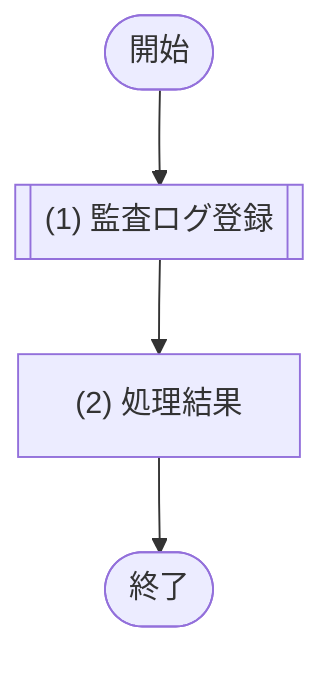

# 1. 基本情報

| 項目 | 内容 |
|---|---|
| モジュールID | MOD-009 |
| モジュール名 | 監査ログサービス |
| 種別 | Service |
| 概要 | 予約・課金・会議室管理などの重要操作の記録を監査ログに追記する。呼び出し元の業務トランザクション内で記録し、記録後は追記のみで更新・削除しない(CFR-007／NFR-006)。 |

# 2. 責務

| No | 責務 |
|---|---|
| 1 | 重要操作(予約・課金・会議室管理)の監査ログ記録 |

# 3. インターフェース

## (1) 監査ログ記録処理

### 1. 概要

重要操作の記録(操作日時・利用者・操作種別・操作対象・操作結果)を監査ログに1件追記する。呼び出し元(業務モジュール)の更新トランザクション内で実行する。

### 2. 入力

| 入力項目 | データ型 | 説明 |
|---|---|---|
| 利用者ID | Integer | 操作を行った利用者の ID |
| 操作種別 | String | 記録対象の操作の種別(予約操作／課金操作／会議室管理操作 など) |
| 操作対象 | String | 操作の対象となった情報の識別(対象の種別＋対象ID等) |
| 操作結果 | String | 操作の結果(成功／失敗) |

### 3. 出力

| 出力項目 | データ型 | 説明 |
|---|---|---|
| 監査ログ | Object | 追記した監査ログ |
| - 監査ログID | Integer | 採番された監査ログの ID |
| - 操作日時 | String | 記録した操作日時(ISO8601形式) |

### 4. 例外

| エラーID | 説明 |
|---|---|
| なし | 記録の失敗は DB 例外として呼び出し元へ伝播し、呼び出し元の業務トランザクションをロールバックする |

### 5. 処理フロー

### 6. 処理詳細

#### (1) 監査ログ登録処理

重要操作の記録を監査ログに1件追記する。操作日時は現在日時を設定する。呼び出し元の業務トランザクション内で実行し、独自のトランザクション境界は設けない。

| SQL-ID | クエリ名 |
|---|---|
| SQL-039 | 監査ログ登録 |

| 引数項目 | 値 |
|---|---|
| 操作日時 | 現在日時 |
| 利用者ID | 引数.利用者ID |
| 操作種別 | 引数.操作種別 |
| 操作対象 | 引数.操作対象 |
| 操作結果 | 引数.操作結果 |

#### (2) 処理結果

処理結果を返却する。

| 項目名 | データ型 | 値 | 説明 |
|---|---|---|---|
| 監査ログ | Object | (1) 監査ログ登録処理の結果 | 返却する監査ログ |
| - 監査ログID | Integer | (1) 監査ログ登録処理の結果 | 返却する監査ログID |
| - 操作日時 | String | (1) 監査ログ登録処理の結果 | 返却する操作日時 |

# 4. トランザクション・排他制御

| 項目 | 内容 |
|---|---|
| トランザクション境界 | 独自の境界は設けず、呼び出し元(業務モジュール)の更新トランザクションに参加する。監査ログ登録が失敗した場合は呼び出し元トランザクションとともにロールバックする |
| 排他制御 | なし(追記のみ) |

# 5. データアクセス

| テーブル | C | R | U | D | 用途 |
|---|---|---|---|---|---|
| TBL-009 | ✓ |  |  |  | 重要操作の監査ログ追記(追記のみ。更新・削除は行わない) |

# 6. エラー・例外

| 条件 | エラー | 対応 |
|---|---|---|
| 監査ログの登録に失敗 | なし(DB例外) | DB 例外として呼び出し元へ伝播し、呼び出し元の業務トランザクションをロールバックする |

# 7. 利用ライブラリ/基盤

| 利用ライブラリ/基盤 | 用途 | 管理方針 |
|---|---|---|
| なし | - | - |
