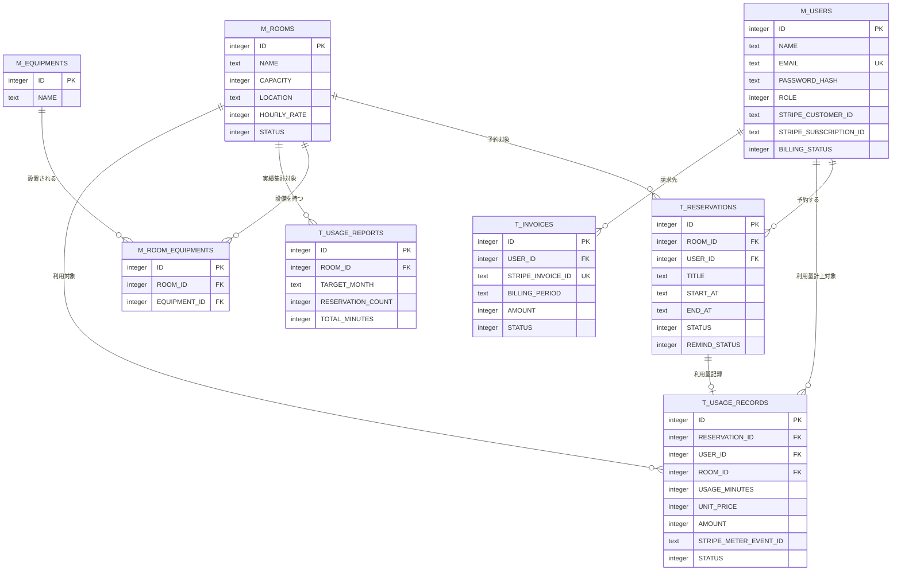

# 1. 概要

MeetRoom の全テーブル間のリレーションを示す。

- 各テーブルのカラム定義の正本は 07_データベース設計/ 配下の各 TBL 文書(共通カラムは 共通カラム.md)であり、本図には主要カラムのみ記載する。
- 型は Cloudflare D1(SQLite)方針(INTEGER / TEXT)。

# 2. ER図

# 3. リレーション一覧

| 親 | 子 | 関係 | 説明 |
|---|---|---|---|
| M_USERS(TBL-001) | T_RESERVATIONS(TBL-003) | 1 : N | ユーザーは複数の予約を持つ(T_RESERVATIONS.USER_ID) |
| M_ROOMS(TBL-002) | T_RESERVATIONS(TBL-003) | 1 : N | 会議室は複数の予約を持つ(T_RESERVATIONS.ROOM_ID) |
| M_ROOMS(TBL-002) | M_ROOM_EQUIPMENTS(TBL-005) | 1 : N | 会議室と設備の中間テーブル(M_ROOM_EQUIPMENTS.ROOM_ID) |
| M_EQUIPMENTS(TBL-004) | M_ROOM_EQUIPMENTS(TBL-005) | 1 : N | 設備と会議室の中間テーブル(M_ROOM_EQUIPMENTS.EQUIPMENT_ID) |
| M_ROOMS(TBL-002) | T_USAGE_REPORTS(TBL-006) | 1 : N | 会議室×月の利用実績集計(T_USAGE_REPORTS.ROOM_ID) |
| M_USERS(TBL-001) | T_USAGE_RECORDS(TBL-007) | 1 : N | ユーザーは複数の利用量記録を持つ(T_USAGE_RECORDS.USER_ID) |
| M_ROOMS(TBL-002) | T_USAGE_RECORDS(TBL-007) | 1 : N | 会議室は複数の利用量記録を持つ(T_USAGE_RECORDS.ROOM_ID) |
| T_RESERVATIONS(TBL-003) | T_USAGE_RECORDS(TBL-007) | 1 : 0..1 | 完了予約ごとに利用量記録を1件計上(T_USAGE_RECORDS.RESERVATION_ID、UNIQUE) |
| M_USERS(TBL-001) | T_INVOICES(TBL-008) | 1 : N | ユーザーは複数の請求を持つ(T_INVOICES.USER_ID) |
