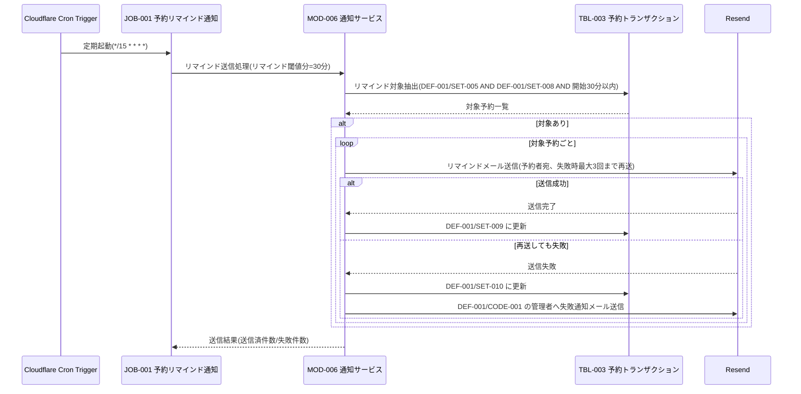

# 1. 基本情報

| 項目 | 内容 |
|---|---|
| シーケンスID | SEQ-002 |
| シーケンス名 | 予約リマインド通知シーケンス |
| 概要 | 定期実行(Cron)で通知サービス(MOD-006)を起動し、通知サービスが開始間近のリマインド未送信予約を抽出し、Resend を用いて予約者へリマインドメールを送信して送信状態を更新する。送信失敗は再送し、継続失敗は管理者へ通知する。 |
| 契機 | 定期(Cloudflare Cron Trigger) |
| 関連要素 | JOB-001, MOD-006, TBL-003, Cloudflare Cron Trigger, Resend |

# 2. 登場要素

| 要素 | 種別 | ID/参照 | 役割 |
|---|---|---|---|
| Cron Trigger | 外部サービス | Cloudflare Cron Trigger | ジョブの定期起動 |
| リマインド通知ジョブ | ジョブ | JOB-001 | 通知サービスの定期起動 |
| 通知サービス | モジュール | MOD-006 | 対象抽出・リマインドメール送信(再送)・送信状態更新・失敗時の管理者通知 |
| 予約トランザクション | テーブル | TBL-003 | リマインド未送信予約の抽出・リマインドステータス 更新 |
| Resend | 外部サービス | Resend | メール送信 |

# 3. シーケンス図

# 4. ステップ説明

| No | 送信元 → 送信先 | 内容 |
|---|---|---|
| 1 | Cron Trigger → JOB-001 | スケジュール(15分毎)でリマインドジョブを起動する |
| 2 | JOB-001 → MOD-006 | 通知サービスのリマインド送信処理を呼び出す(リマインド閾値分=30分) |
| 3 | MOD-006 → TBL-003 | DEF-001/SET-005・未送信(DEF-001/SET-008)・開始30分以内の予約を抽出する |
| 4 | MOD-006 → Resend | 予約者へリマインドメールを送信する(失敗時最大3回まで再送) |
| 5 | MOD-006 → TBL-003 | 送信成功は DEF-001/SET-009、再送しても失敗は DEF-001/SET-010 に更新する |
| 6 | MOD-006 → Resend | 再送しても失敗した予約は管理者へ失敗通知メールを送信する |
| 7 | MOD-006 → JOB-001 | 送信結果(送信済件数/失敗件数)を返す |

# 5. 例外・代替

| 分岐 | 分岐後の流れ |
|---|---|
| 対象予約が0件 | MOD-006 は送信を行わず、JOB-001 は正常終了する(冪等) |
| メール送信失敗(再送上限) | MOD-006 が DEF-001/SET-010 に更新し、管理者へ失敗を通知して次の予約へ継続する |
| 再実行(同一予約が再抽出) | DEF-001/SET-008 のみ抽出するため二重送信しない |
