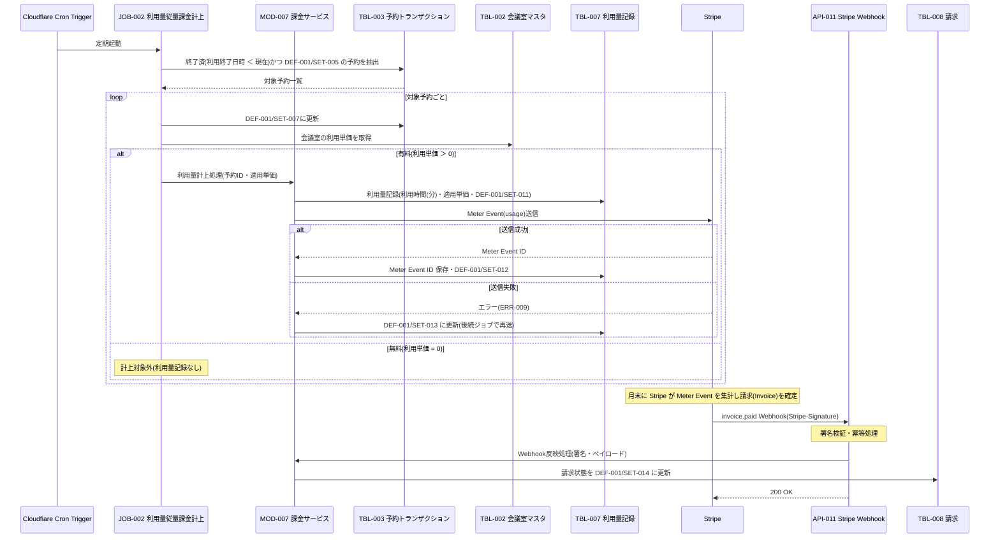

# 1. 基本情報

| 項目 | 内容 |
|---|---|
| シーケンスID | SEQ-003 |
| シーケンス名 | 利用量の従量課金計上シーケンス |
| 概要 | 定期実行(Cron)で終了済みの予約を完了に更新し、有料会議室の利用時間を利用量として記録して Stripe に Meter Event を送信する。月末に Stripe が集計・請求し、支払結果を Webhook で受けて請求状態を更新する。 |
| 契機 | 定期(Cloudflare Cron Trigger)／ 月末の Stripe 請求確定・Webhook 受信 |
| 関連要素 | JOB-002, MOD-007, API-011, TBL-002, TBL-003, TBL-007, TBL-008, Cloudflare Cron Trigger, Stripe |

# 2. 登場要素

| 要素 | 種別 | ID/参照 | 役割 |
|---|---|---|---|
| Cron Trigger | 外部サービス | Cloudflare Cron Trigger | 計上ジョブの定期起動 |
| 従量課金計上ジョブ | ジョブ | JOB-002 | 完了予約検出・利用量計上の起動 |
| 課金サービス | モジュール | MOD-007 | 利用量記録・Meter Event 送信・請求状態管理 |
| Stripe Webhook | API | API-011 | Stripe からの請求結果通知の受信(署名検証・冪等) |
| 会議室マスタ | テーブル | TBL-002 | 有料判定・適用単価の取得 |
| 予約トランザクション | テーブル | TBL-003 | 終了済み予約の検出・STATUS 更新 |
| 利用量記録 | テーブル | TBL-007 | 利用時間・単価・Meter Event の記録 |
| 請求 | テーブル | TBL-008 | Stripe 請求(Invoice)の状態管理 |
| Stripe | 外部サービス | Stripe | Meter Event 集計・月次請求・Webhook 通知 |

# 3. シーケンス図

# 4. ステップ説明

| No | 送信元 → 送信先 | 内容 |
|---|---|---|
| 1 | Cron Trigger → JOB-002 | スケジュールで従量課金計上ジョブを起動する |
| 2 | JOB-002 → TBL-003 | 終了済み(利用終了日時 ＜ 現在)かつ DEF-001/SET-005 の予約を抽出する |
| 3 | JOB-002 → TBL-003 | 対象予約を DEF-001/SET-007 に更新する |
| 4 | JOB-002 → TBL-002 | 会議室の利用単価を取得し有料/無料を判定する |
| 5 | JOB-002 → MOD-007 | 有料の場合、予約IDと適用単価で利用量計上処理を呼ぶ(利用時間は MOD-007 が内部算出) |
| 6 | MOD-007 → TBL-007 | 利用時間(分)・適用単価・金額を DEF-001/SET-011で記録する |
| 7 | MOD-007 → Stripe | Stripe に Meter Event(usage)を送信する |
| 8 | MOD-007 → TBL-007 | 送信成功で Meter Event ID を保存し DEF-001/SET-012 に更新する |
| 9 | Stripe → API-011 | 月末の請求確定・支払後、invoice.paid Webhook を送信する |
| 10 | API-011 → MOD-007 → TBL-008 | Webhook反映処理が署名検証・冪等処理のうえ請求状態を DEF-001/SET-014 に更新する |

# 5. 例外・代替

| 分岐 | 分岐後の流れ |
|---|---|
| 無料会議室(利用単価 = 0) | 完了に更新するのみで利用量計上は行わない(TBL-007 記録なし) |
| Meter Event 送信失敗 | MOD-007 が TBL-007 を DEF-001/SET-013 に更新し ERR-009 として扱う。後続の JOB-002 実行が MOD-007 の利用量再送処理で再送する(冪等・予約単位で重複計上しない) |
| invoice.payment_failed Webhook 受信 | API-011 が署名検証のうえ TBL-008 を DEF-001/SET-015 に更新する |
| 同一 Webhook の再送 | Stripe イベントを冪等に処理し、状態を二重更新しない |
