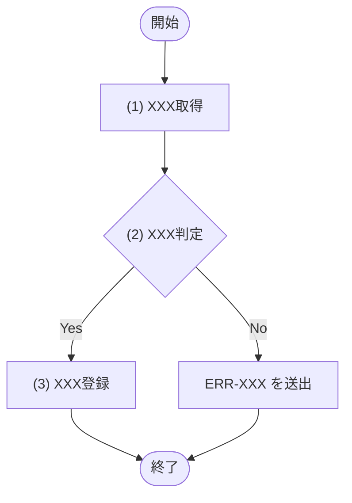

<!-- コピーして 02_機能設計/05_モジュール設計/MOD-XXX_モジュール名.md として使用。index.md への行追加を先に行うこと -->
<!-- エラーは ERR ID＋発生条件を記載する。ERR の定義(エラー名/HTTPステータス/文言)は、利用する API 文書のインライン定義、または共通エラーの API-COM_共通設計.md を参照し、本文書に再記載しない -->
<!-- 各見出し(##/###/####)直上のコメントに「定義内容(そのセクションの意味)」「定義する条件」「項目説明(各列・各項目の意味)」「定義ルール」をセットで記載する。子セクションを持つセクションは、親コメントにセクション全体の定義内容・共通ルールを、各子セクションのコメントにその子の項目説明を記載する。編集時はコメントを読んでから該当セクションを埋める -->

<!--
【1. 基本情報】
定義内容: このモジュールの識別情報と属性(ID・名称・種別・概要・状態など)を一覧で示す。
定義する条件: 全モジュールで必須。
項目説明:
- モジュールID: このモジュールの識別子(MOD-XXX 連番)。
- モジュール名: モジュールの日本語名称(論理名)。
- 種別: モジュールの分類(Service / Repository / Utility / Domain)。
- 概要: モジュールの目的(1〜3行)。
定義ルール:
- モジュールID は MOD-XXX の連番。採番は一覧の最大値+1、欠番の再利用は禁止。
- 種別は Service / Repository / Utility / Domain のいずれか。
-->
## 1. 基本情報

| 項目 | 内容 |
|---|---|
| モジュールID | MOD-XXX |
| モジュール名 |  |
| 種別 | Service / Repository / Utility / Domain |
| 概要 | (1〜3行) |

<!--
【2. 責務】
定義内容: このモジュールが担う責務を一覧で示す。
定義する条件: 全モジュールで必須。担う責務を1件以上定義する。
項目説明:
- No: 責務の連番。
- 責務: このモジュールが受け持つ役割・処理範囲(1件1行)。
定義ルール:
- 1責務1行で記載し、No は 1 からの連番とする。
- API入出力仕様・画面仕様など他文書の責務は書かない(モジュール内部の責務のみ)。
-->
## 2. 責務

| No | 責務 |
|---|---|
| 1 |  |

<!--
【3. 公開インターフェース】
定義内容: このモジュールが外部に公開するメソッドの一覧と、各メソッドの入出力・エラーを示す(API のリクエスト／レスポンスに相当)。
定義する条件: 全モジュールで必須。外部から呼び出せる公開メソッドを定義する。
項目説明:
- メソッド名: 公開メソッドの名称(実装キー)。
- 概要: メソッドの目的(1行)。
- 入力: 引数の項目・型(論理名:型)。
- 出力: 戻り値の項目・型(論理名:型)。
- 例外・エラー: 送出しうるエラー(ERR-XXX。定義は該当API文書のインライン定義／共通エラーは API-COM_共通設計.md を参照)。
定義ルール:
- 例外・エラーは ERR ID で参照する(HTTPステータス・文言は再記載しない)。
- 入力・出力は論理名＋型を明記する(論理名=日本語の表示名、物理名=実装キー)。
- 各メソッドの内部フローは §4、内部処理の手順は §5 に定義する。
-->
## 3. 公開インターフェース

| メソッド名 | 概要 | 入力 | 出力 | 例外・エラー |
|---|---|---|---|---|
|  |  |  |  |  |

<!--
【4. 処理フロー】
定義内容: 公開メソッドごとに、内部処理の流れ(開始から戻り値／例外の返却まで、分岐と各処理の順序)を mermaid フローチャートで俯瞰する。
定義する条件: 内部処理に分岐・複数ステップがある公開メソッドで定義する。単純委譲のみのメソッドは「なし」とし §5 で1行記載してよい。
構成: 公開メソッドごとに ### メソッド名 の見出しでフローを定義する。各フローの定義内容は直下のコメントを参照する。
-->
## 4. 処理フロー

公開メソッドごとに、内部処理の基本フローをフローチャートで定義する。

<!--
【### メソッド名】(処理フロー)
定義内容: 1つの公開メソッドの内部処理フローを mermaid フローチャートで定義する。
定義する条件: 分岐・複数ステップを持つ公開メソッドごとに定義する。
項目説明(フロー要素):
- 開始 / 終了: メソッドの開始と、戻り値／例外の返却。
- 処理ノード ["(n) 処理名"]: §5 処理詳細と対応する連番付きの処理。
- 判定ノード {"(n) 判定名"}: 連番付きの分岐。分岐条件・パターンは §5 の条件分岐マトリクスで定義する。
- エッジラベル: 判定の分岐結果と、例外送出(ERR-XXX を送出)の経路。
定義ルール:
- 各処理は (1)(2)… の連番で表し、§5 処理詳細と対応させる。
- 他モジュール呼び出しは MOD-ID、データアクセスは TBL-ID を処理名に添える。
- 例外送出(ロールバック)経路もフローに表す。
-->
### メソッド名

<!--
【5. 処理詳細】
定義内容: §4 処理フローの各処理((1)(2)…)について、呼び出すモジュール・引数・取得内容・条件分岐・戻り値/出力など具体的な処理内容を、公開メソッドごとに定義する。
定義する条件: §3 公開インターフェースの各メソッドについて、内部処理の手順を定義する。
構成: 公開メソッドごとに ### メソッド名 の見出しを作り、各処理を #### (n) 処理名 で展開する。条件定義・条件分岐マトリクスは見出しではなくキャプション行(「条件定義:」「条件分岐マトリクス:」)で示す。各見出し・各表の定義内容は直下のコメントを参照する。
定義ルール(セクション共通):
- データを取得して判定する場合は、判定の前に取得処理を独立した処理として定義し、判定はその取得結果を参照する。
- 取得結果を参照する箇所(引数・判定対象など)は必ず「(x) 処理名の結果」の形で取得元を明記する。
-->
## 5. 処理詳細

公開メソッドごとに、各処理の内容を定義する。

<!--
【### メソッド名】(処理詳細)
定義内容: 1つの公開メソッドの内部処理を、各処理 #### (n) 処理名 に展開して定義する。
定義する条件: §3 の公開メソッドごとに定義する。
項目説明:
- 見出しは公開メソッド名(実装キー)とし、その内部処理を #### (n) 処理名 で並べる。
-->
### メソッド名

<!--
【#### (1) XXX処理】(処理型ステップ)
定義内容: モジュール呼び出し・データ取得を行う1つの処理(§4 の処理ノードに対応)。呼び出すモジュールと引数を定義する。
定義する条件: モジュール呼び出し・データ取得を行う処理で用いる。
項目説明:
- 見出し直後の説明文: この処理で行う内容(1〜2行)。取得系は「該当が無い場合は NULL を返す」旨も記載する。
- 呼び出しモジュール表: MOD-ID=呼び出す他モジュールのID／処理名=メソッドの和名(呼び出しが無ければ「なし」)。
- 引数表: 引数項目=渡す引数／値=渡す値(メソッド引数や「(x) 処理名の結果」)。
定義ルール:
- 呼び出しモジュールの処理名はメソッドの和名で記載する。
- データ取得処理は、該当が無い場合に NULL を返す旨を定義する。
-->
#### (1) XXX処理

XXXXXを行う。

| MOD-ID | 処理名 |
|---|---|
| なし | - |

| 引数項目 | 値 |
|---|---|
| なし | - |

<!--
【#### (2) XXX判定】(判定型ステップ)
定義内容: 条件分岐を行う1つの処理(§4 の判定ノードに対応)。条件定義と条件分岐マトリクスで分岐を定義する。
定義する条件: 内部処理に判定・分岐がある場合に用いる。
項目説明:
- 見出し直後の説明文: この判定で行う内容(1行)。取得結果・件数など、判定に用いる条件のみを定義する。
- 条件定義表(キャプション「条件定義:」): No=条件番号(条件(x))／判定対象=評価する対象／条件=成立とみなす条件(比較記号・!= NULL・件数=0 等で表記)。
- 条件分岐マトリクス(キャプション「条件分岐マトリクス:」): 縦=条件・処理／横=パターン#x。条件は ◯満たす・×満たさない・-判定しない、処理は ◯実行・-非実行。
- 戻り値・出力表: 戻り値を返す処理では、論理名／物理名=返す項目または更新する TBL／設定値=戻り値や書き込む値(取得元を「(x) 処理名の結果」で明記)を末尾に付す。返却・出力を伴わない処理では「なし」とする。
定義ルール:
- 条件の記法: 大小・前後の比較は ＜/＜＝/＞/＞＝、存在(取得結果あり)判定は != NULL で表す。「〜が無ければ」等の文章表現にしない。
- 条件分岐が発生する処理は、条件分岐マトリクス(縦軸=条件・処理、横軸=パターン#x)で表す。処理は各行に展開し、パターン列ごとに ◯=実行／-=実行しない を記す。
-->
#### (2) XXX判定

条件分岐をマトリクス形式で定義する。取得結果・件数など、判定に用いる条件のみを定義する。

条件定義:

| No | 判定対象 | 条件 |
|---|---|---|
| 条件(1) | (x) XXX処理の結果 | != NULL |

条件分岐マトリクス:

| 条件・処理 | #1 | #2 |
|---|---|---|
| 条件(1) | ◯ | × |
| 処理 |  |  |
| 次の処理へ進む | ◯ | - |
| ERR-XXX を送出する | - | ◯ |

戻り値を返す処理では、戻り値・出力の内容を定義する。返却・出力を伴わない処理では「なし」とする。

| 論理名 | 物理名 | 設定値 |
|---|---|---|
| なし | - | - |

<!--
【6. トランザクション・排他制御】
定義内容: このモジュールのトランザクション境界と排他制御方式を示す。
定義する条件: DB 更新を伴うモジュールで定義する。該当しない場合は各行に「なし」を記載する。
項目説明:
- トランザクション境界: トランザクションの開始・終了範囲(どのメソッドのどこからどこまでか)。
- 排他制御: ロック方式・対象(不要なら「なし」)。
定義ルール:
- トランザクション境界は対象メソッドと範囲を明記する。
- 排他制御はロック方式(悲観 / 楽観)と対象テーブルを記載し、不要なら「なし」とする。
-->
## 6. トランザクション・排他制御

| 項目 | 内容 |
|---|---|
| トランザクション境界 | (どのメソッドのどこからどこまでか) |
| 排他制御 | (ロック方式・対象。不要なら「なし」) |

<!--
【7. データアクセス】
定義内容: このモジュールがアクセスするテーブルと、CRUD 操作・用途を示す。
定義する条件: DB アクセスを伴うモジュールで定義する。
項目説明:
- テーブル: アクセス対象のテーブル(TBL-XXX。正本は データベース設計)。
- C / R / U / D: 実施する操作に ✓ を付す(Create / Read / Update / Delete)。
- 用途: そのテーブルへのアクセス目的。
定義ルール:
- テーブルは TBL-ID で参照する(カラム定義は再記載しない)。
- 実施する操作の列に ✓ を付す。
-->
## 7. データアクセス

| テーブル | C | R | U | D | 用途 |
|---|---|---|---|---|---|
| TBL-XXX |  | ✓ |  |  |  |

<!--
【8. エラー・例外】
定義内容: このモジュールが送出するエラー・例外を、発生条件と対応で一覧化する。
定義する条件: エラー・例外を送出するモジュールで定義する。
項目説明:
- 条件: エラーが発生する条件(どの処理・判定で発生するか)。
- エラー: エラーコード(ERR-XXX。定義は該当API文書のインライン定義／共通エラーは API-COM_共通設計.md を参照)。
- 対応: 発生時のモジュールの振る舞い(送出・ロールバックなど)。
定義ルール:
- エラーは ERR ID で参照する(HTTPステータス・文言は再記載しない)。
- 各行に発生条件と対応を明記する。
-->
## 8. エラー・例外

| 条件 | エラー | 対応 |
|---|---|---|
|  | ERR-XXX |  |
