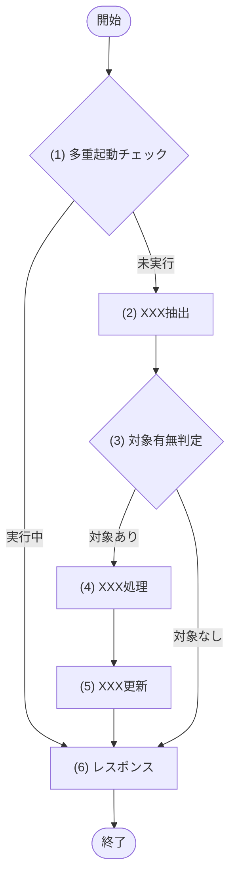

<!-- コピーして 02_機能設計/04_JOB設計/JOB-XXX_ジョブ名.md として使用。index.md への行追加を先に行うこと -->
<!-- エラーは ERR ID＋発生条件を記載する。ERR の定義(エラー名/HTTPステータス/文言)は、利用する API 文書のインライン定義、または共通エラーの API-COM_共通設計.md を参照し、本文書に再記載しない -->
<!-- 各見出し(##/###/####)直上のコメントに「定義内容(そのセクションの意味)」「定義する条件」「項目説明(各列・各項目の意味)」「定義ルール」をセットで記載する。子セクションを持つセクションは、親コメントにセクション全体の定義内容・共通ルールを、各子セクションのコメントにその子の項目説明を記載する。編集時はコメントを読んでから該当セクションを埋める -->

<!--
【1. 基本情報】
定義内容: このジョブの識別情報と実行属性(ID・実行契機・スケジュール・多重起動・冪等性・リトライ・処理規模・トレース元・状態など)を一覧で示す。
定義する条件: 全ジョブで必須。
項目説明:
- ジョブID: このジョブの識別子(JOB-XXX 連番)。
- ジョブ名: ジョブの日本語名称。
- 実行契機: 起動のきっかけ(定期 / 手動 / イベント)。
- スケジュール: 実行タイミング(cron式 または トリガイベント)。
- 多重起動: 同時多重実行の可否(禁止 / 許可。禁止の場合は制御方式を記載)。
- 冪等性: 再実行時の安全性(あり / なし。再実行可否とその根拠)。
- リトライ方針: 失敗時の再試行(回数・間隔)。
- 想定処理件数 / 時間: 処理規模と処理時間の見積り。
- トレース元: このジョブの実現元 FR-ID。
- 概要: ジョブの目的(1〜3行)。
定義ルール:
- ジョブID は JOB-XXX の連番。採番は一覧の最大値+1、欠番の再利用は禁止。
- 実行契機が「定期」の場合はスケジュールに cron式、「イベント」の場合はトリガイベントを記載する。
- トレース元に対応する FR-ID を記載する。
-->
# 1. 基本情報

| 項目 | 内容 |
|---|---|
| ジョブID | JOB-XXX |
| ジョブ名 |  |
| 実行契機 | 定期 / 手動 / イベント |
| スケジュール | (cron式 または トリガイベント) |
| 多重起動 | 禁止 / 許可(禁止の場合は制御方式を記載) |
| 冪等性 | あり / なし(再実行可否とその根拠) |
| リトライ方針 | (回数・間隔。例: 3回・5分間隔) |
| 想定処理件数 / 時間 | (例: 最大1000件・5分以内) |
| トレース元 | FR-XXX |
| 概要 | (1〜3行) |

<!--
【2. 起動パラメータ】
定義内容: ジョブ起動時に受け取る入力パラメータの一覧と各項目の意味・制約を示す(API のリクエストに相当)。
定義する条件: 手動起動・イベント起動でパラメータを受け取る場合に定義する。定期実行のみでパラメータが無ければ行に「なし」を記載する。
項目説明:
- 項目名: 項目の日本語表示名。
- 型: 値の型(int / string / date / boolean など)。
- 必須: 必須かどうか(Yes / No)。
- 説明・制約: 値の意味・範囲・形式・既定値。省略時の挙動もここに記載する。
定義ルール:
- パラメータの構文チェック(型・形式・範囲)は本表の説明・制約に記載する。ジョブは共通APIバリデーションフローを通らないため、ジョブ本体で検証する。
- 既定値がある場合は「省略時は○○」の形で明記する。
-->
# 2. 起動パラメータ

| 項目名 | 型 | 必須 | 説明・制約 |
|---|---|---|---|
|  |  | Yes / No |  |

<!--
【3. 処理対象】
定義内容: このジョブが処理するデータの対象テーブルと、その抽出条件を一覧で示す。
定義する条件: 処理対象となるテーブル・データがある場合に定義する。対象が無ければ行に「なし」を記載する。
項目説明:
- 対象: 処理対象のテーブルID(TBL-XXX。正本は データベース設計)。
- 抽出条件: そのテーブルから処理対象を絞り込む条件。
定義ルール:
- 対象は TBL-ID で参照し、テーブル構造・カラム定義は再記載しない。
- 抽出条件は状態・日時などの絞り込み条件を具体的に記載する。
-->
# 3. 処理対象

| 対象 | 抽出条件 |
|---|---|
| TBL-XXX |  |

<!--
【4. 処理フロー】
定義内容: このジョブの処理の流れ(開始から終了まで、多重起動制御・分岐・各処理の順序)を mermaid フローチャートで俯瞰する。
定義する条件: 全ジョブで必須。ジョブの基本フローを mermaid フローチャートで定義する。
項目説明(フロー要素):
- 開始 / 終了: ジョブの開始・終了ノード([開始] / [終了])。
- 処理ノード ["(n) 処理名"]: §5 処理詳細と対応する連番付きの処理(Step)。
- 判定ノード {"(n) 判定名"}: 連番付きの分岐(多重起動チェック・対象有無・件数など)。分岐条件・パターンは §5 の条件分岐マトリクスで定義する。
- エッジラベル: 判定の分岐結果と、エラー時の経路(スキップして継続 / ジョブ中断)。
定義ルール:
- 多重起動が「禁止」の場合は、フロー先頭に多重起動チェック(ロック取得)を含める。
- 各処理は (1)(2)… の連番で表し、§5 処理詳細と対応させる。
- フローチャートのノード(処理名・判定名)には設計ID(MOD-ID・TBL-ID・SQL-ID 等)を添えない。ノードは処理名・判定名のみで記載し、対応するモジュール・テーブル等のIDは §5 処理詳細で対応付ける(例: 「(2) 月次利用実績集計(MOD-005)」ではなく「(2) 月次利用実績集計」)。例外送出ノード「ERR-XXX を送出」は設計IDの補足ではないため対象外。
- エラー時の中断・継続の分岐もフローに表す。
- 取得処理を含むジョブでは、フローチャートの末尾に「レスポンス」ブロックを配置し、ジョブの実行結果・出力として返却/記録する項目を §5 処理詳細で定義する。
-->
# 4. 処理フロー

このジョブの基本フローをフローチャートで定義する。

<!--
【5. 処理詳細】
定義内容: §4 処理フローの各処理((1)(2)…)について、呼び出すモジュール・引数・取得内容・条件分岐・出力(DB更新)など具体的な処理内容を定義する。
定義する条件: §4 処理フローの各処理について、行う内容を定義する。
構成: 各処理を ### (n) 処理名 の見出しで展開する。処理には「処理型」(モジュール呼び出し・引数)と「判定型」(#### 条件定義 ＋ #### 条件分岐マトリクス)があり、各見出し・各表の定義内容は直下のコメントを参照する。
定義ルール(セクション共通):
- 各処理は (1)(2)… の連番で表し、§4 処理フローと対応させる。
- データを取得して判定する場合は、判定の前に取得処理を独立した Step として定義し、判定はその取得結果を参照する。
- 取得結果を参照する箇所(引数・判定対象など)は必ず「(x) 処理名の結果」の形で取得元 Step を明記する。
- 大量データを扱う Step は、バッチ単位・コミット単位を明記する。
- 取得処理では、呼び出し表・引数表の後に | 項目名 | データ型 | 設定値 | 表を置き、返却する項目を定義する。
- フロー末尾のレスポンス処理では、§6 実行結果・出力と同じ粒度で返却/記録する項目を | 項目名 | データ型 | 設定値 | 表に定義する。
- 見出し直後の説明文は、その処理の**目的**(何のために行うか)を1〜2行で記載する。抽出条件・カラム比較・区分値などの具体的な判定ロジックは説明文に書かない(抽出条件は §3 処理対象、条件・区分値は #### 条件定義・#### 条件分岐マトリクス・引数表、および参照先の正本(MOD-XXX / TBL-XXX)で定義する)。
- 処理に複数のパターン・分岐がある場合は、説明文に「・〜の場合は〜する」の箇条書きで記載する。
-->
# 5. 処理詳細

処理フローの各処理で行う内容を定義する。

<!--
【(1) XXX処理】(処理型ステップ)
定義内容: モジュール呼び出し・データ取得を行う1つの処理 Step(§4 の処理ノードに対応)。呼び出すモジュールと引数を定義する。
定義する条件: モジュール呼び出し・データ取得を行う処理で用いる。
項目説明:
- 見出し直後の説明文: この処理の**目的**(何のために行うか)を1〜2行で記載する。具体的な判定ロジック(抽出条件・カラム比較・区分値・パラメータ束縛)は書かず、条件・パターンがある場合は「・〜の場合は〜する」の箇条書きで示す。取得系は「該当が無い場合は NULL(0件)を返す」旨も記載する。
- 呼び出しモジュール表: MOD-ID=モジュールID／処理名=呼び出すメソッドの和名。呼び出しモジュールがある場合にのみ記載する。
- 呼び出し外部ライブラリ表: LIB-ID=外部ライブラリ処理ID／処理名=呼び出す内部処理の和名。外部ライブラリ・標準実行基盤APIを利用する場合にのみ記載する。
- 引数表: 引数項目=呼び出し先に渡す引数／値=渡す値(起動パラメータや「(x) 処理名の結果」)。呼び出しモジュール表または LIB-ID 表を記載する場合にのみ記載する。
定義ルール:
- 呼び出しモジュールの処理名はメソッドの和名で記載する。
- 外部ライブラリ・標準実行基盤APIを直接呼び出すことは禁止し、02_機能設計/10_外部ライブラリ設計/ の LIB-ID 表で内部処理を呼び出す。
- 呼び出しモジュール・外部ライブラリ処理がない内部処理では、MOD-ID 表・LIB-ID 表・引数表を記載しない。
- 呼び出しモジュールがなく、処理内で参照する起動時刻・前段処理結果などを明示する必要がある場合は、引数表ではなく | 参照項目 | 値 | 表を用いる。
- クエリ(SQL-XXX)を直接実行する処理では、MOD-ID 表ではなく | SQL-ID | クエリ名 | 表を用いる。
- データ取得処理は、該当が無い場合に NULL(0件)を返す旨を定義する。
-->
## (1) XXX処理

XXX のために XXX する。(処理の目的を記載する。判定ロジックは書かず、分岐がある場合は「・〜の場合は〜する」で記載する)

| MOD-ID | 処理名 |
|---|---|
| MOD-XXX | XXX処理 |

| 引数項目 | 値 |
|---|---|
| XXX | 起動パラメータ.XXX |

<!--
【(2) XXX判定】(判定型ステップ)
定義内容: 条件分岐を行う1つの処理 Step(§4 の判定ノードに対応)。#### 条件定義 と #### 条件分岐マトリクス で分岐を定義する。
定義する条件: 処理フローに判定・分岐がある場合に用いる。
項目説明:
- 見出し直後の説明文: この判定の**目的**(何を判定するか)を1行で記載する。具体的な条件・比較・区分値は説明文に書かず、#### 条件定義／#### 条件分岐マトリクスで定義する。
- #### 条件定義／#### 条件分岐マトリクス: 判定を構成する2つの表(各定義は直下のコメントを参照)。
- 出力・更新表: DB を更新する処理では、対象=更新する TBL-ID／更新内容=書き込む値・条件を末尾に付す。更新を伴わない処理では「なし」とする。
定義ルール:
- 判定内容は #### 条件定義 と #### 条件分岐マトリクス に分けて定義する。
-->
## (2) XXX判定

条件分岐をマトリクス形式で定義する。取得結果や件数など、判定に用いる条件のみを定義する。

<!--
【### 条件定義】
定義内容: この判定に用いる各条件を1つずつ定義する。
定義する条件: 判定型ステップで必須。
項目説明:
- No: 条件番号(条件(x))。
- 判定対象: 評価する対象(起動パラメータや「(x) 処理名の結果」)。
- 条件: 成立とみなす条件(比較記号・!= NULL・件数=0 等で表記)。
定義ルール:
- 条件の記法: 大小・前後の比較は ＜/＜＝/＞/＞＝、存在(取得結果あり)判定は != NULL、件数は 件数 = 0 等で表す。「〜が無ければ」等の文章表現にしない。
- 1つの条件では、1つの判定だけを定義する。複数の値を比較する場合も、判定内容は1つにする。
-->
### 条件定義

| No | 判定対象 | 条件 |
|---|---|---|
| 条件(1) | (x) XXX処理の結果 | != NULL |

<!--
【### 条件分岐マトリクス】
定義内容: 条件の成否の組合せ(パターン)ごとに、実行する処理を定義する。
定義する条件: 判定型ステップで必須。
項目説明:
- 縦軸=条件・処理、横軸=パターン#x。
- 条件行: ◯=満たす・×=満たさない・-=判定しない。
- 処理行: ◯=そのパターンで実行・-=実行しない。
定義ルール:
- 条件分岐が発生する処理は、条件分岐マトリクス(縦軸=条件・処理、横軸=パターン#x)で表す。処理は各行に展開し、パターン列ごとに ◯=実行／-=実行しない を記す。
- 各パターン列には内容を表す短い見出し(#1 対象あり など)を付ける。
-->
### 条件分岐マトリクス

縦軸に条件・処理、横軸にパターン(#x)を配置する。条件は ◯=満たす・×=満たさない・-=判定しない、処理は ◯=そのパターンで実行・-=実行しない で表す。

| 条件・処理 | #1 対象あり | #2 対象なし |
|---|---|---|
| 条件(1) | ◯ | × |
| 処理 |  |  |
| 次の処理へ進む | ◯ | - |
| ジョブを正常終了する | - | ◯ |

DB を更新する処理では、更新対象と更新内容を定義する。更新を伴わない処理では「なし」とする。

| 対象 | 更新内容 |
|---|---|
| なし | - |

## (6) レスポンス

ジョブの実行結果として返却・記録する項目を定義する。

| 項目名 | データ型 | 設定値 |
|---|---|---|
| 対象件数 | Integer | (2) XXX抽出の結果の件数 |
| 成功件数 | Integer | (5) XXX更新で成功した件数 |
| 失敗件数 | Integer | 失敗した件数 |
| 実行ログ | Object | 開始・終了時刻、各件数、失敗明細 |

<!--
【6. 実行結果・出力】
定義内容: このジョブが実行後に残す結果(処理件数・生成物・ログ項目)を定義する(API のレスポンスに相当)。
定義する条件: 全ジョブで必須。実行結果として記録・出力する項目を定義する。
項目説明:
- 項目名: 出力・ログ項目の日本語表示名。
- 内容: 記録・出力する値や条件(件数は「(x) 処理名の結果の件数」で取得元を明記)。
定義ルール:
- 少なくとも 対象件数・成功件数・失敗件数・スキップ件数 を記録する。
- 生成物(ファイル・通知など)がある場合は出力先を明記する。
- 実行ログには 開始・終了時刻、各件数、失敗明細 を残す。
-->
# 6. 実行結果・出力

| 項目名 | 内容 |
|---|---|
| 対象件数 |  |
| 成功件数 |  |
| 失敗件数 |  |
| 実行ログ |  |

<!--
【7. エラー時の対応】
定義内容: このジョブの実行中に発生しうるエラーについて、発生条件・エラーコード・対応方針・リトライ・通知要否を一覧で示す。
定義する条件: 処理中に発生しうるエラーがある場合に定義する。エラーが無ければ行に「なし」を記載する。
項目説明:
- エラー条件: そのエラーが発生する条件。
- エラー: エラーコード(ERR-XXX。定義は該当API文書のインライン定義／共通エラーは API-COM_共通設計.md を参照)。
- 対応: エラー発生時の処理方針(スキップして継続 / ジョブ中断)。
- 通知: 管理者等への通知の要否(要 / 不要)。
定義ルール:
- エラーは ERR ID＋発生条件のみ記載する(エラー名・HTTPステータス・文言の定義は該当API文書のインライン定義／API-COM_共通設計.md を参照)。
- 対応は スキップして継続 / ジョブ中断 のいずれかを明記する。中断時は §1 のリトライ方針に従い再実行される旨も踏まえる。
- 1件単位で処理するジョブは、1件のエラーで全体を止めるか(中断)／その件をスキップするか(継続)を必ず定める。
-->
# 7. エラー時の対応

| エラー条件 | エラー | 対応 | 通知 |
|---|---|---|---|
|  | ERR-XXX | スキップして継続 / ジョブ中断 | 要 / 不要 |
