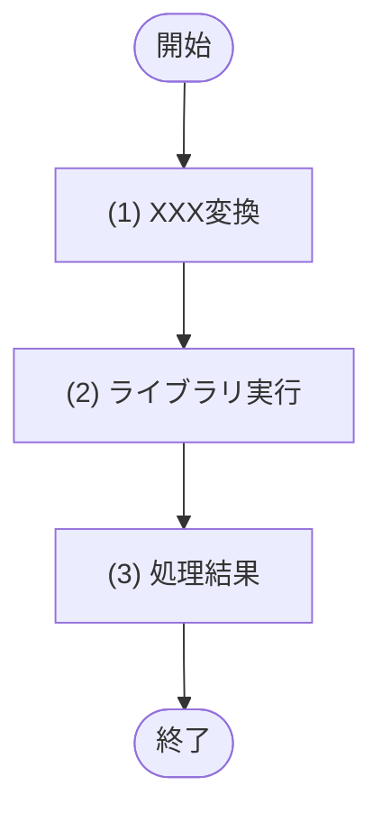

<!-- コピーして 02_機能設計/10_外部ライブラリ設計/LIB-XXX_処理名.md として使用。index.md への行追加を先に行うこと -->
<!-- 外部ライブラリ・標準実行基盤APIの物理名は本文書でのみ定義する。API・JOB・モジュールから外部ライブラリを直接呼び出すことは禁止し、本文書の LIB-ID 処理を呼び出す -->
<!-- モジュール設計書のフォーマットを流用し、外部ライブラリ処理の責務・公開インターフェース・処理フロー・処理詳細・利用ライブラリを定義する -->

<!--
【1. 基本情報】
定義内容: 外部ライブラリ処理の識別情報と属性を一覧で示す。
定義する条件: 全外部ライブラリ設計で必須。
項目説明:
- 外部ライブラリID: この外部ライブラリ処理の識別子(LIB-XXX 連番)。
- 処理名: 外部ライブラリ処理の日本語名称(論理名)。必ず「XXX処理」とする。
- 種別: 処理の分類(Utility / Adapter / Runtime)。
- 概要: 処理の目的(1〜3行)。
- 対象ライブラリ/基盤: 利用対象の外部ライブラリ・標準実行基盤API。物理名以外に定義する術がない場合のみ最小限の物理名を記載する。
定義ルール:
- 外部ライブラリID は LIB-XXX の連番。採番は一覧の最大値+1、欠番の再利用は禁止。
- API・JOB・モジュールから対象ライブラリ/基盤を直接呼び出すことは禁止し、本文書のインターフェースを経由する。
-->
# 1. 基本情報

| 項目 | 内容 |
|---|---|
| 外部ライブラリID | LIB-XXX |
| 処理名 | XXX処理 |
| 種別 | Utility / Adapter / Runtime |
| 概要 | (1〜3行) |
| 対象ライブラリ/基盤 |  |

<!--
【2. 責務】
定義内容: この外部ライブラリ処理が担う責務を一覧で示す。
定義する条件: 全外部ライブラリ設計で必須。担う責務を1件以上定義する。
項目説明:
- No: 責務の連番。
- 責務: この外部ライブラリ処理が受け持つ役割・処理範囲。
定義ルール:
- 1責務1行で記載し、No は 1 からの連番とする。
- 業務ロジックは書かず、外部ライブラリ呼び出しの抽象化・入出力正規化・例外変換に限定する。
-->
# 2. 責務

| No | 責務 |
|---|---|
| 1 |  |

<!--
【3. インターフェース】
定義内容: この外部ライブラリ処理が公開する内部処理ごとに、概要・入出力・処理フロー・処理詳細をまとめて定義する。
定義する条件: 全外部ライブラリ設計で必須。API・JOB・モジュールから呼び出せる公開インターフェースを定義する。
構成: インターフェースごとに ## (n) 処理名 の見出しを作り、その配下に ### 1. 概要、### 2. 入力、### 3. 出力、### 4. 例外、### 5. 処理フロー、### 6. 処理詳細 を配置する。
定義ルール:
- 処理名は「XXXX取得処理」「XXXX登録処理」「XXXX更新処理」「XXXX削除処理」「XXXX判定処理」のいずれかで終わる形に統一する。上記に当てはまらない処理(署名・検証・照合・発行など)は末尾に「処理」を付ける。
- 利用対象ライブラリの物理名、関数名、オプション名は本文書にのみ記載できる。API・JOB・モジュールには再記載しない。
- 例外がない場合は「なし」と「-」のみを記載し、説明文は書かない。例外ではない無効・不一致などの結果は ### 6. 処理詳細 の「処理結果」に定義する。
- ### 6. 処理詳細 には必ず最後に「処理結果」セクションを作り、フローにも同名ブロックを置く。処理結果は | 項目名 | データ型 | 値 | 説明 | の形式で返却内容を定義する。
-->
# 3. インターフェース

## (1) XXX処理

### 1. 概要

XXXXをXXXXする処理。

### 2. 入力

| 入力項目 | データ型 | 説明 |
|---|---|---|
|  |  |  |

### 3. 出力

| 出力項目 | データ型 | 説明 |
|---|---|---|
|  |  |  |

### 4. 例外

| エラーID | 説明 |
|---|---|
|  |  |

### 5. 処理フロー

### 6. 処理詳細

#### (1) XXX変換処理

外部ライブラリへ渡す値を整形する。

| 参照項目 | 値 |
|---|---|
| XXX | 引数.XXX |

#### (2) ライブラリ実行処理

利用対象の外部ライブラリ・標準実行基盤APIを実行する。

| 利用ライブラリ/基盤 | 用途 |
|---|---|
|  |  |

| 引数項目 | 値 |
|---|---|
| XXX | (1) XXX変換の結果 |

#### (3) 処理結果

呼び出し元へ返す項目を定義する。

| 項目名 | データ型 | 値 | 説明 |
|---|---|---|---|
| 戻り値 | Object | (2) ライブラリ実行の結果 | 呼び出し元へ返す結果 |

<!--
【4. 利用ルール】
定義内容: この外部ライブラリ処理の利用制約、禁止事項、例外変換方針を示す。
定義する条件: 全外部ライブラリ設計で必須。
定義ルール:
- API・JOB・モジュールは対象ライブラリ/基盤を直接呼び出さず、LIB-ID と処理名で参照する。
- 外部ライブラリ由来の例外は本文書で定義した戻り値または ERR-ID に変換する。
-->
# 4. 利用ルール

| 項目 | 内容 |
|---|---|
| 直接呼び出し | API・JOB・モジュールからの直接呼び出しは禁止 |
| 例外変換 | 外部ライブラリ由来の例外は本文書の戻り値または ERR-ID に変換する |

<!--
【5. 利用ライブラリ/基盤】
定義内容: 利用対象の外部ライブラリ・標準実行基盤APIを一覧で示す。
定義する条件: 全外部ライブラリ設計で必須。
項目説明:
- 利用ライブラリ/基盤: 物理名以外に定義する術がない場合のみ最小限の物理名を記載する。
- 用途: 利用目的。
- 管理方針: バージョン固定、秘密鍵管理、設定値管理など。
-->
# 5. 利用ライブラリ/基盤

| 利用ライブラリ/基盤 | 用途 | 管理方針 |
|---|---|---|
|  |  |  |
