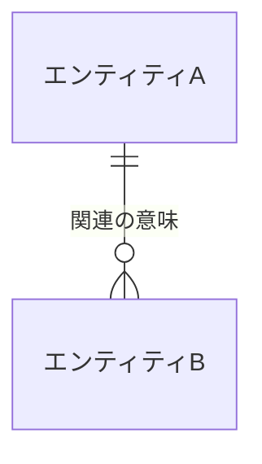

<!-- コピーして 02_要件定義/03_データモデル/概念ER図.md として使用 -->
<!-- 概念ER図はSEQより上流の要件成果物。SEQで新しいエンティティ関連が必要と判明した場合は、要件変更として各MDLと本図を更新してから関連SEQを再レビューする -->
<!-- 全エンティティ間の関連を概念レベル(論理名)で俯瞰する図。各エンティティ・属性・関連の正本は各 MDL 文書であり、本図は主要エンティティと関連のみを示す。物理名(英語)・物理型・外部キー・カラムは書かない -->
<!-- 各見出し(# )直上のコメントに「定義内容」「定義する条件」「項目説明」「定義ルール」をセットで記載する。編集時はコメントを読んでから該当セクションを埋める -->

<!--
【1. 概要】
定義内容: この概念ER図が俯瞰する対象(システムが取り扱う全エンティティと関連)を要約する。
定義する条件: 必須。冒頭に1〜3行で記載する。
定義ルール:
- 1〜3行で簡潔に記載する。各エンティティの属性・状態などの詳細は書かない(各 MDL 文書が正本)。
-->
# 1. 概要

(このシステムが取り扱う全エンティティと関連の俯瞰を1〜3行で記載)

<!--
【2. 概念ER図】
定義内容: 全エンティティ(業務概念)と、その間の関連・多重度を Mermaid erDiagram で表す。
定義する条件: 必須。
項目説明:
- エンティティ: 論理名(日本語)で記載する。各エンティティは MDL 文書のエンティティと対応する。
- 関連: エンティティ間の線と、関連の意味(ラベル)。
- 多重度: Mermaid の記法(||--o{ = 1:N、}o--o{ = M:N、||--o| = 1:0..1 など)で表す。
定義ルール:
- エンティティ名は論理名(日本語)で記載し、物理名(英語テーブル名)を書かない。
- 属性ブロック・物理型は記載せず、エンティティと関連のみを示す(概念レベル・関連中心)。属性の詳細は各 MDL 文書の §2 を正本とする。
- 関連の詳細(親子・多重度・意味・対応 MDL-ID)は §3 関連一覧に記載する。
-->
# 2. 概念ER図



<!--
【3. 関連一覧】
定義内容: 全エンティティ間の親子関係(関連)を、親エンティティごとのツリー形式で示す。
定義する条件: 必須。
項目説明:
- 最上位: 親エンティティ(関連の 1 側)の論理名＋対応 MDL-XXX。
- 子: その親に従属する子(N 側)のエンティティを ├─ / └─ でぶら下げ、論理名＋対応 MDL-XXX を記載する。
- 各子の末尾に「… <多重度>（<説明>）」で多重度(親→子: 1:N / M:N / 1:0..1 等)と関連の意味(1行)を添える。
定義ルール:
- 親エンティティごとにブロックを分ける。1つの子が複数の親に従属する場合は各親のツリーに現れてよい(概念上は有向非巡回)。
- 各関連は各 MDL 文書のデータ項目(他エンティティを参照する項目=外部キー相当)と整合させる。矛盾があれば MDL 文書側を正とする。
- 物理的な外部キー・結合カラムは書かない。
-->
# 3. 関連一覧

親エンティティごとに、従属する子エンティティをツリーで示す。各子の末尾に多重度と関連の意味を添える。

```text
<親エンティティ>(MDL-XXX)
├─ <子エンティティ>(MDL-XXX) … <多重度>（<説明>）
└─ <子エンティティ>(MDL-XXX) … <多重度>（<説明>）
```
