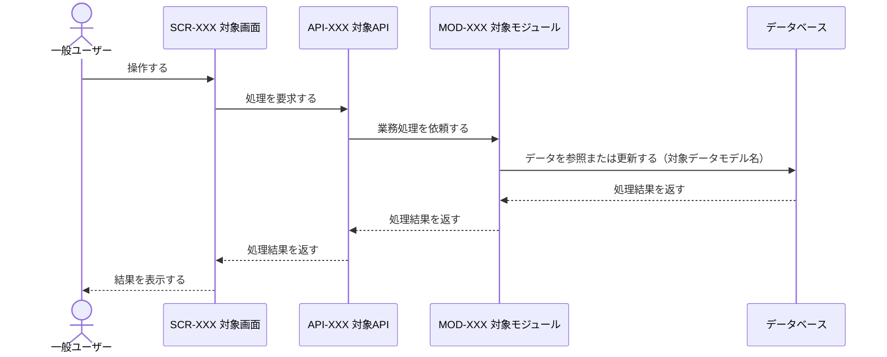
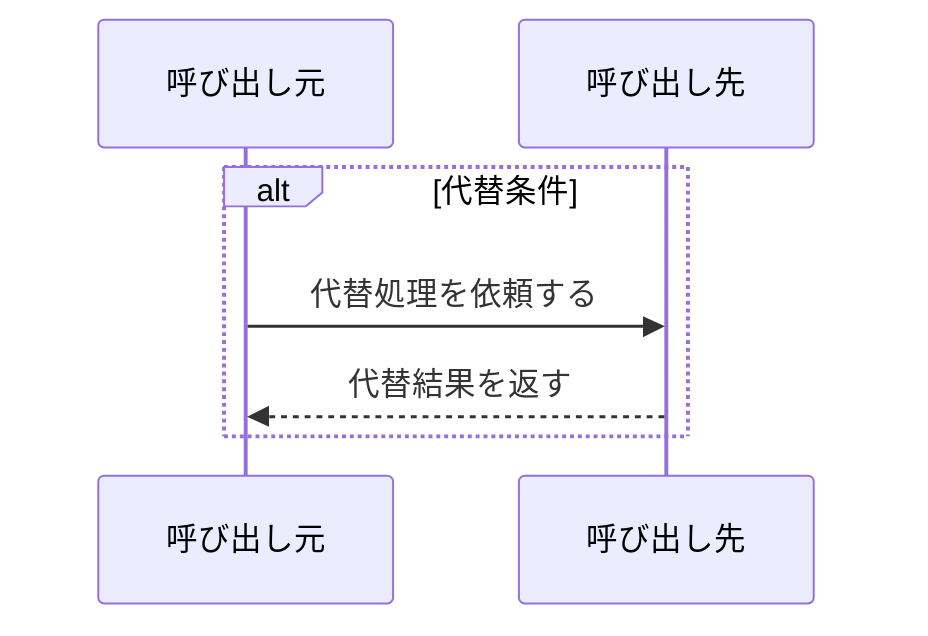
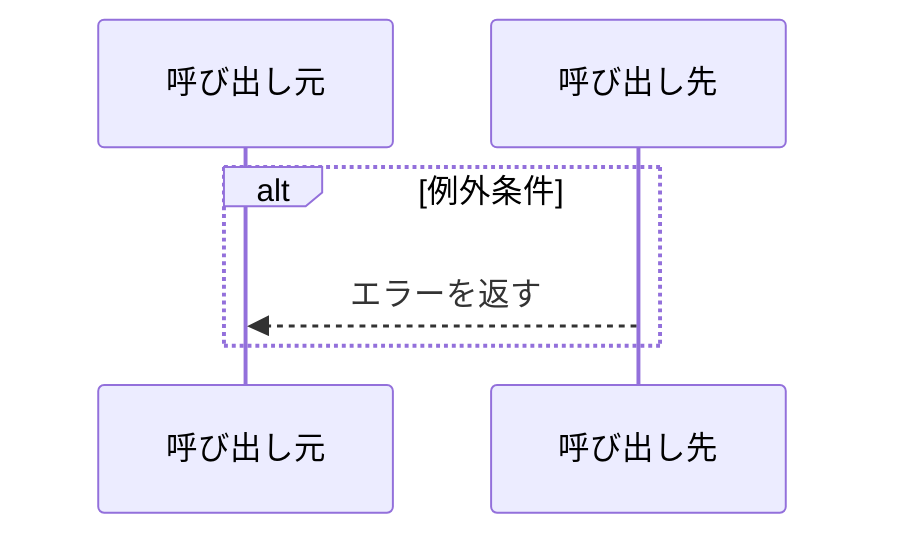

<!-- コピーして docs/03_機能設計/02_シーケンス設計/SEQ-XXX_シーケンス名.md として使用。index.md への行追加を先に行うこと -->
<!-- シーケンスは連携順序・受け渡し・条件分岐・結果返却の正本。各要素の詳細仕様は個別設計を正本とし再記載しない -->
<!-- DBは単一のparticipant「データベース」(alias DB)に集約し、往路(→DB)の依頼メッセージ末尾に参照データモデル名を全角括弧で列挙する。MDL-ID・TBL-ID・SQL文は図に書かない。概念データモデル(MDL)は§2・§4.2で参照し、物理テーブル(TBL)・SQLはSEQに記載せず11_トレーサビリティ・07/08で管理する -->
<!-- 下位設計が未作成の場合は、SCR/API/JOB/MOD/TBL/SQL IDを対応index.mdへ状態「未着手」で予約してから本文へ記載する。「未採番」のまま確定しない -->

<!--
【1. 基本情報】
定義内容: シーケンスの識別情報、目的、範囲、上位根拠、開始前後の状態を示す。
定義する条件: 全SEQで必須。
項目説明:
- 対象範囲: 開始点と終了点を「開始: ... / 終了: ...」で記載する。
- 作成単位: 機能要件 / UC / 画面主要操作 / API / JOB / 外部連携。複数可。
- 関連UC: 完全修飾ID。UCがないFR単位の処理は「-」と理由を記載する。
- 事前条件 / 事後条件: シーケンス開始前に満たす状態 / 正常終了時に保証する状態。
- 状態: 未着手 / 作成中 / レビュー中 / 確定 / 廃止。
定義ルール:
- IDはSEQ-XXX。一覧の最大値+1で採番し、欠番を再利用しない。
- SEQは機能要件(FR/CFR)・ユースケース(UC)を根拠・入力とし、要求(RQ)は紐付けない(RQ→FRの対応は要件定義層のトレーサビリティで管理する)。
- 上位要件にない振る舞いを追加しない。
- 関連UCは UCシーケンストレーサビリティ と一致させる。システム自動処理(JOB/Webhook)でも対応するUCが存在する場合は必ず完全修飾で紐付ける(「-」はUCが真に無いFR単位処理に限り、その省略理由をtrace表・index・本文で一致させる)。SEQ本文・indexとtrace表の関連UCを食い違わせない。
- 責務・再試行主体・冪等/DLQ/管理者アラートの主体は Step5 CMP責務・Step6 IFC契約と一致させ、SEQ内で新たな責務・主体・下流IDを発明しない(不足・矛盾は Step5/6 へ差し戻す。例: 通知の再試行・DLQ主体はQueue境界であり通知MODではない)。外部イベント(Webhook等)は概念の受信台帳(Inbox/Event ID一意受付)を図・§4.2に表現し、同種の外部連携SEQ間で表現を統一する。
-->
# 1. 基本情報

| 項目 | 内容 |
|---|---|
| シーケンスID | SEQ-XXX |
| シーケンス名 |  |
| 目的 |  |
| 対象範囲 | 開始:  / 終了:  |
| 作成単位 |  |
| 契機 |  |
| 関連機能要件ID | FR-XXX |
| 関連ユースケースID | FR-XXX/UC-01 |
| 事前条件 |  |
| 事後条件 |  |
| 状態 | 未着手 |

<!--
【2. 構成要素】
定義内容: 図に登場するアクター、UI、API、モジュール、JOB、データモデル、外部サービスを列挙する。
定義する条件: 全SEQで必須。
定義ルール:
- ロール差がある場合、アクターは「ユーザー」でなく具体的なロール名にする。
- UI/API/MOD/JOBには実在または各index.mdへ「未着手」で予約済みの設計IDを付ける。
- データベースは単一の「データベース」要素(種別=DB)に集約し、ID/参照欄に参照する全データモデルのMDL-IDを列挙する。データモデルごとに要素を分けない。
- 物理テーブル(TBL-XXX)は構成要素・シーケンス図・§4.2に記載せず、11_トレーサビリティおよび07_データベース設計で管理する(SEQは概念データモデルまでを扱う)。
- 役割はこのシーケンスでの連携責務だけを記載する。
-->
# 2. 構成要素

| 要素 | 種別 | ID/参照 | このシーケンスでの役割 |
|---|---|---|---|
| 一般ユーザー | アクター | - |  |
| 対象画面 | UI | SCR-XXX |  |
| 対象API | API | API-XXX |  |
| 対象モジュール | モジュール | MOD-XXX |  |
| データベース | DB | MDL-XXX, MDL-YYY | 参照・更新する各データモデルを保持する |

<!--
【3. シーケンス】
定義内容: 冒頭に本シーケンスの概要説明と、網羅する状態パターン(SP-x)の一覧表を置き、続けて正常系・代替系・例外系をMermaid sequenceDiagramで時系列に定義する。
定義する条件: 概要説明・状態パターン網羅表・正常系は必須。代替系・例外系は該当がなければ理由を記載する。
項目説明:
- 概要説明: 本シーケンスが扱う処理の概要(1〜3行)。
- 状態パターン網羅表: 対象UCの状態パターンを、本シーケンスのどの系(正常/代替/例外)で表現するかを対応づける表。列は | パターンID | 状態パターン(条件) | 本シーケンスでの表現 |。
定義ルール:
- 概要説明は処理概要を1〜3行で述べ、続く「状態パターン網羅」表に各SPの表現箇所を記す。パターンIDは完全修飾(FR-XXX/UC-01/SP-x)で記載し、UCを持たないFR単位の根拠はその根拠(FR-XXX 業務ルール等)を記す。
- 状態パターン網羅表は §4.1 条件分岐・§3 の図と整合させ、対象UCの全SPを漏れなく載せる。SEQの対象範囲外のSP(別シーケンスで扱う場面)は概要説明(説明部分)に対象外である旨と対象シーケンスを記載する。
- データベースは単一のparticipant「データベース」(alias DB)に集約し、データモデルごとにparticipantを分けない。
- データベースへ向かう依頼メッセージ(往路)の末尾に、参照するデータモデル名を全角括弧で列挙する(例: 会議室を参照する（会議室）、複数時は（会議室, 利用者）)。データベースからの返却メッセージ(復路)には付けない。MDL-ID・TBL-IDは図に書かない(概念MDLは§2・§4.2、物理TBLは11_トレーサビリティ・07で管理)。
- メッセージは業務上の処理内容が分かる動詞形式にし、単なるメソッド名・変数操作・具体的SQLを書かない。
- 条件分岐はalt、任意処理はopt、繰り返しはloopを使う。非同期通知は同期呼び出しと区別する。
- 対象UC(FR-XXX/UC-01)の状態パターン(SP-x)を、正常系(3.1)・代替系(3.2)・例外系(3.3)の分岐として過不足なく網羅し、冒頭の状態パターン網羅表に各SPの表現箇所を記す。1つのSPに1つの分岐を対応させ、束ね表現(「または」で複数条件を1分岐に)を避ける。
- エラー・メッセージは責務レベルで記述し(例: 入力エラーを返す／登録完了を表示する)、具体的なERR-ID・MSG-ID・文言・HTTPステータスは図に書かない(採番・文言は後続のエラー設計・画面設計で定義し、11_トレーサビリティで対応付ける)。
-->
# 3. シーケンス

本シーケンスが扱う処理の概要と、網羅する状態パターン(SP-x)を示す。各パターンは正常系・代替系・例外系のいずれかで表現する。

| パターンID | 状態パターン(条件) | 本シーケンスでの表現 |
|---|---|---|
| FR-XXX/UC-01/SP-1 |  | 3.1 正常系 |

## 3.1 正常系シーケンス

## 3.2 代替系シーケンス

## 3.3 例外系シーケンス

<!--
【4. 連携定義】
定義内容: 図の判定条件、データアクセス、トランザクション、補足を表で確認可能にする。
定義する条件: 全SEQで必須。該当なしは理由付きで「なし」。
定義ルール:
- 4.2 データ参照・更新は概念データモデル(MDL)で記載する。物理テーブル(TBL)・SQLは後続設計(07データベース設計・08クエリ設計)で具体化するためSEQには記載しない。
- 4.1 条件分岐は状態軸ごとに1条件へ分割し、各行の根拠列に対応する状態パターンを完全修飾(FR-XXX/UC-01/SP-x)で併記する。対象UCの全SPと条件分岐・図の分岐が1対1で対応することを確認できるようにする。
-->
# 4. 連携定義

## 4.1 条件分岐

| 条件ID | 判定箇所 | 条件 | 成立時 | 不成立時 | 根拠 |
|---|---|---|---|---|---|
| COND-01 | MOD-XXX |  |  |  | FR-XXX/UC-01/SP-1 |

## 4.2 データ参照・更新

| データモデル | CRUD | 目的 | 実行主体 |
|---|---|---|---|
| MDL-XXX | R / C / U / D |  | MOD-XXX |

## 4.3 トランザクション境界

| 境界ID | 開始 | 終了 | 対象更新 | ロールバック条件 | 管理主体 |
|---|---|---|---|---|---|
| TX-01 |  | COMMIT |  |  | MOD-XXX |

## 4.4 補足事項

| 観点 | 内容 |
|---|---|
| 同期/非同期 |  |
| 冪等性・再試行 |  |
| 排他制御 |  |
| 外部連携 |  |
