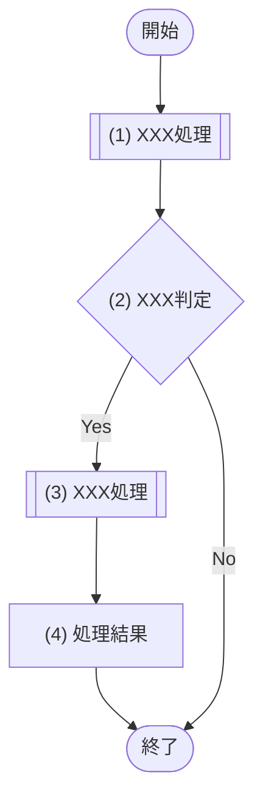

<!-- コピーして 03_機能設計/03_API設計/API-XXX_API名.md として使用。index.md への行追加を先に行うこと -->
<!-- 認証方式・エラーレスポンス封筒・ページネーション等は API-COM_共通設計.md が正本。本文書には差分のみ記載し、共通事項への言及・「〜準拠」等の記載も書かない -->
<!-- 本 API の固有エラーは本文書 §7 にインライン定義する(ERR ID/エラー名/HTTPステータス/発生条件/開発者向けメッセージ)。認証・認可・バリデーション等の共通エラーは API-COM_共通設計.md に定義済みのため再記載せず ERR ID で参照する -->
<!-- 各見出し(##/###/####)直上のコメントに「定義内容(そのセクションの意味)」「定義する条件」「項目説明(各列・各項目の意味)」「定義ルール」をセットで記載する。子セクションを持つセクションは、親コメントにセクション全体の定義内容・共通ルールを、各子セクションのコメントにその子の項目説明を記載する。編集時はコメントを読んでから該当セクションを埋める -->

<!--
【1. 基本情報】
定義内容: この API の識別情報と属性(ID・メソッド・パス・認証/認可・冪等性・トレース元・状態など)を一覧で示す。
定義する条件: 全 API で必須。
項目説明:
- API ID: この API の識別子(API-XXX 連番)。
- API名: API の日本語名称。
- メソッド: HTTP メソッド(GET / POST / PUT / PATCH / DELETE)。
- パス: エンドポイントの URL パス。
- 認証: 認証の要否(要 / 不要)。
- 認可: 呼び出しを許可するロールと可否。
- 冪等性: 同一リクエスト再送時の安全性(あり / なし。POST は考慮点も記載)。
- トレース元: この API の実現元システムユースケースの完全修飾ID(FR-XXX/UC-01・CFR-XXX/UC-01)。
- 概要: API の目的(1〜3行)。
定義ルール:
- API ID は API-XXX の連番。メソッド・パスは実装と一致させる。
- 認可はロールごとの可否を明記する(例: 一般=可, 管理者=可)。
- トレース元に対応するシステムユースケースを完全修飾ID(FR-XXX/UC-01)で記載する。
-->
# 1. 基本情報

| 項目 | 内容 |
|---|---|
| API ID | API-XXX |
| API名 |  |
| メソッド | GET / POST / PUT / PATCH / DELETE |
| パス |  |
| 認証 | 要 / 不要 |
| 認可 | (ロールごとの可否。例: 一般=可、管理者=可) |
| 冪等性 | あり / なし(POSTの場合は考慮点を記載) |
| トレース元 | FR-XXX/UC-01 |
| 概要 | (1〜3行) |

<!--
【2. リクエスト】
定義内容: クライアントがこの API に渡す入力項目(ボディ・クエリ・パス)の一覧と各項目の意味・制約を示す。
定義する条件: リクエストボディ・クエリ・パスに受け取る項目がある場合に定義する。項目が無ければ行に「なし」を記載する。
項目説明:
項目説明:
- 項目名: 項目の日本語表示名。
- 型: 値の型(int / string など)。
- 必須: 必須かどうか(Yes / No)。
- 説明・制約: 項目の意味・値の範囲・形式など。
定義ルール:
- 必須は Yes / No。
- 説明・制約には型・範囲・形式などの意味を記載する。構文チェックの成立条件は §6 バリデーションで定義する。
-->
# 2. リクエスト

| 項目名 | 型 | 必須 | 説明・制約 |
|---|---|---|---|
|  |  | Yes / No |  |

<!--
【3. レスポンス】
定義内容: 処理が成功したときに返す HTTPステータスとレスポンスボディの項目構造を示す。
定義する条件: 成功時にボディを返す場合に定義する。204 等でボディが無い場合は HTTPステータスのみ記載する。
項目説明:
項目説明:
- HTTPステータス: 成功時に返すステータスコード(200 / 201 / 204)。
- 項目名: レスポンス項目の日本語表示名。
- 型: 値の型(int / string / array など)。
- 説明: 項目の意味。
定義ルール:
- 配列・ネストは XXX一覧[].YYY の形で階層を表す。
-->
# 3. レスポンス

| 項目 | 内容 |
|---|---|
| HTTPステータス | 200 / 201 / 204 |

| 項目名 | 型 | 説明 |
|---|---|---|
|  |  |  |

<!--
【4. 処理フロー】
定義内容: この API の業務処理の流れ(開始から終了まで、分岐と各処理の順序)を mermaid フローチャートで俯瞰する。
定義する条件: 全 API で必須。この API の基本フローを mermaid フローチャートで定義する。
項目説明(フロー要素):
- 開始 / 終了: フローの開始・終了ノード([開始] / [終了])。
- 呼び出しノード [["(n) 処理名"]]: モジュール(MOD)・クエリ(SQL)・外部サービスを呼び出す(委譲する)処理。§5 処理詳細で `| MOD-ID | 処理名 |`・`| SQL-ID | クエリ名 |`・`| 外部サービス | 処理名 |` のいずれかの表を持つ処理は、関数呼び出しを表す二重角括弧 [[ ]](サブルーチン形状)で記す。
- 処理ノード ["(n) 処理名"]: 委譲を伴わない内部処理、および末尾の「処理結果」ブロック。§5 処理詳細で上記の呼び出し表を持たない処理は矩形 [ ] で記す。
- 判定ノード {"(n) 判定名"}: 連番付きの分岐。分岐条件・パターンは §5 の条件分岐マトリクスで定義する。
- エッジラベル: 判定の分岐結果(Yes / No など)と、エラー返却(ERR-XXX を返却)の経路。
定義ルール:
- 認証・認可・入力バリデーション(必須・型・形式・単項目制約・項目間相関)は共通処理フローで実施するため本フローには記載しない。
- 業務処理から開始し、存在確認・重複など DB 参照・業務ルールを伴う判定のみを含める。
- 各処理は (1)(2)… の連番で表し、§5 処理詳細と対応させる。
- 処理ノードは、§5 処理詳細で他の定義単位を呼び出す(委譲する)処理 —— `| MOD-ID | 処理名 |`・`| SQL-ID | クエリ名 |`・`| 外部サービス | 処理名 |` のいずれかの表を持つ処理 —— を二重角括弧 [["(n) 処理名"]](関数呼び出しブロック=サブルーチン形状)で、それ以外の内部処理・「処理結果」ブロックを矩形 ["(n) 処理名"] で記す。判定ノードは {"(n) 判定名"}、エラー返却ノード ["ERR-XXX を返却"] は矩形のままとする。
- フローチャートのノードとエッジラベルには処理名・判定結果だけを短く記載し、呼び出し先、外部サービス名、リトライ回数、ステータス値、通知内容などの詳細を書かない。詳細は §5 処理詳細に定義する。
-->
# 4. 処理フロー

この API の基本フローをフローチャートで定義する。

<!--
【5. 処理詳細】
定義内容: §4 処理フローの各処理((1)(2)…)について、呼び出すモジュール・引数・取得内容・条件分岐・処理結果など具体的な処理内容を定義する。
定義する条件: §4 処理フローの各処理について、行う内容を定義する。
構成: 各処理を ### (n) 処理名 の見出しで展開する。処理には「処理型」(モジュール呼び出し・引数)と「判定型」(#### 条件定義 ＋ #### 条件分岐マトリクス)があり、各見出し・各表の定義内容は直下のコメントを参照する。個別処理フローでエラーを返却する場合は、§5 末尾に「エラー結果」ブロック(## エラー結果)を配置する。
定義ルール(セクション共通):
- 各処理は (1)(2)… の連番で表し、§4 処理フローと対応させる。
- データを取得して判定する場合は、判定の前に取得処理を独立したステップとして定義し、判定はその取得結果を参照する。
- 取得結果を参照する箇所(値・判定対象など)は必ず「(x) 処理名の結果」の形で取得元ステップを明記する。
- 取得APIを含め、レスポンスを返すAPIでは、フローチャートの末尾に「処理結果」ブロックを配置し、返却する項目を処理結果の表で定義する。
- 処理結果は | 項目名 | データ型 | 値 | 説明 | の形式で定義する。
- 個別処理フロー(§4)に「ERR-XXX を返却」ノードがある場合、§5 末尾に「エラー結果」ブロック(## エラー結果)を配置し、返却するエラーレスポンスの各項目に設定する値を | 項目名 | データ型 | 値 | 説明 | の形式で定義する。エラーレスポンス封筒の構造は API-COM §4 が正本のため再記載せず、設定値のみを正本参照で定義する。共通処理フロー(認証・認可・入力バリデーション)で返すエラーはここに定義せず、個別処理フローで返すエラーのみ定義する(API-001 のログイン失敗のように共通エラーコードを個別フローで返す場合を含む)。
- 見出し直後の説明文は、その処理の**目的**(何のために行うか)を1〜2行で記載する。カラム比較・区分値・パラメータ束縛などの具体的な判定ロジックは説明文に書かない(条件・区分値は #### 条件定義・#### 条件分岐マトリクス・引数表、および参照先の正本(MOD-XXX / TBL-XXX)で定義する)。
- 処理に複数のパターン・分岐がある場合は、説明文に「・〜の場合は〜する」の箇条書きで記載する。
-->
# 5. 処理詳細

処理フローの各処理で行う内容を定義する。

<!--
【(1) XXX処理】(処理型ステップ)
定義内容: モジュール呼び出し・データ取得を行う1つの処理ステップ(§4 の処理ノードに対応)。呼び出すモジュールと引数を定義する。
定義する条件: モジュール呼び出し・データ取得を行う処理で用いる。
項目説明:
- 見出し直後の説明文: この処理の**目的**(何のために行うか)を1〜2行で記載する。具体的な判定ロジック(カラム比較・区分値・パラメータ束縛)は書かず、条件・パターンがある場合は「・〜の場合は〜する」の箇条書きで示す。取得系は「該当が無い場合は NULL を返す」旨も記載する。
- 呼び出しモジュール表: MOD-ID=モジュールID／処理名=呼び出すメソッドの和名。呼び出しモジュールがある場合にのみ記載する。
- 引数表: 引数項目=呼び出し先に渡す引数／値=渡す値(リクエスト項目や「(x) 処理名の結果」)。呼び出しモジュール表を記載する場合にのみ記載する。
定義ルール:
- 呼び出しモジュールの処理名はメソッドの和名で記載する。
- API から外部ライブラリ・標準実行基盤APIを直接呼び出すことは禁止し、必要な場合は外部ライブラリ利用専用モジュールに定義された処理を MOD-ID 表で呼び出す。
- 呼び出しモジュールがない内部処理では、MOD-ID 表・引数表を記載しない。
- 呼び出しモジュールがなく、処理内で参照する入力・前段処理結果を明示する必要がある場合は、引数表ではなく | 参照項目 | 値 | 表を用いる。
- 外部サービスを直接呼び出す場合は、MOD-ID 表ではなく | 外部サービス | 処理名 | 表を用い、渡す値は | 送信項目 | 値 | 表で定義する。
- 外部サービス側のAPI項目名・イベント名・ヘッダ名など、物理名以外に定義する術がない場合は例外として最小限の物理名記載を許可する。
- データ取得処理は、該当が無い場合に NULL を返す旨を定義する。
-->
## (1) XXX処理

XXX のために XXX する。(処理の目的を記載する。判定ロジックは書かず、分岐がある場合は「・〜の場合は〜する」で記載する)

| MOD-ID | 処理名 |
|---|---|
| MOD-XXX | XXX処理 |

| 引数項目 | 値 |
|---|---|
| XXX | リクエスト.XXX |

<!--
【(2) XXX判定】(判定型ステップ)
定義内容: 条件分岐を行う1つの処理ステップ(§4 の判定ノードに対応)。#### 条件定義 と #### 条件分岐マトリクス で分岐を定義する。
定義する条件: 処理フローに判定・分岐がある場合に用いる。
項目説明:
- 見出し直後の説明文: この判定の**目的**(何を判定するか)を1行で記載する。具体的な条件・比較・区分値は説明文に書かず、#### 条件定義／#### 条件分岐マトリクスで定義する。
- #### 条件定義／#### 条件分岐マトリクス: 判定を構成する2つの表(各定義は直下のコメントを参照)。
- 処理結果表: レスポンスを返却する処理では、項目名=返す項目、値=設定する値(取得元を「(x) 処理名の結果」で明記)、説明=呼び出し元へ返す意味を末尾に付す。処理結果以外の処理では「なし」とする。
定義ルール:
- 判定内容は #### 条件定義 と #### 条件分岐マトリクス に分けて定義する。
-->
## (2) XXX判定

条件分岐をマトリクス形式で定義する。

<!--
【### 条件定義】
定義内容: この判定に用いる各条件を1つずつ定義する。
定義する条件: 判定型ステップで必須。
項目説明:
- No: 条件番号(条件(x))。
- 判定対象: 評価する対象(リクエスト項目や「(x) 処理名の結果」)。
- 条件: 成立とみなす条件(比較記号・!= NULL で表記)。
定義ルール:
- 条件の記法: 大小・前後の比較は ＜/＜＝/＞/＞＝、存在(取得結果あり)判定は != NULL で表す。「〜より過去でない」等の文章表現にしない。
- 1つの条件では、1つの判定だけを定義する。複数の値を比較する場合も、判定内容は1つにする。
- 条件は後続の判定に必要な前提から順に定義する。認証・認可・入力構文チェック(観点1〜5)は共通フローで実施済みのため、存在確認・業務ルール(観点6〜7)など DB 参照・業務に関わる条件のみを定義する。
| 順序 | 観点 | 定義する条件 | 定義場所 |
|---:|---|---|---|
| 1 | 指定有無 | 値が必要な項目、または任意項目が指定されているかを定義する | 共通フロー |
| 2 | 型 | 値の型が正しいかを定義する | 共通フロー |
| 3 | 形式 | 日付、時刻、コードなどの形式が正しいかを定義する | 共通フロー |
| 4 | 単項目の値 | 文字数、数値範囲、許可値など、1項目で判定できる条件を定義する | 共通フロー |
| 5 | 項目間の関係 | 開始日時＜終了日時など、複数項目を比較する条件を定義する | 共通フロー |
| 6 | 存在確認 | IDに紐づくデータが存在するかを定義する | 個別フロー(本判定) |
| 7 | 業務ルール | 重複不可、有効期間など、業務上守る条件を定義する | 個別フロー(本判定) |
-->
### 条件定義

| No | 判定対象 | 条件 |
|---|---|---|
| 条件(1) | リクエスト.XXX | 値が指定されている |
| 条件(2) | リクエスト.XXX | YYY形式である |
| 条件(3) | リクエスト.ZZZ | 値が指定されている |

<!--
【### 条件分岐マトリクス】
定義内容: 条件の成否の組合せ(パターン)ごとに、実行する処理を定義する。
定義する条件: 判定型ステップで必須。
項目説明:
- 縦軸=条件・処理、横軸=パターン#x。
- 条件行: ◯=満たす・×=満たさない・-=判定しない。
- 処理行: ◯=そのパターンで実行・-=実行しない。
定義ルール:
- 条件分岐が発生する処理は、条件分岐マトリクス(縦軸=条件・処理、横軸=パターン#x)で表す。処理は各行に展開し、パターン列ごとに ◯=実行／-=実行しない を記す。
- 各パターン列には内容を表す短い見出し(#1 正常 など)を付ける。
-->
### 条件分岐マトリクス

縦軸に条件・処理、横軸にパターン(#x)を配置する。条件は ◯=満たす・×=満たさない・-=判定しない、処理は ◯=そのパターンで実行・-=実行しない で表す。

| 条件・処理 | #1 正常 | #2 入力不正 | #3 業務エラー |
|---|---|---|---|
| 条件(1) | ◯ | × | ◯ |
| 条件(2) | ◯ | × | ◯ |
| 条件(3) | ◯ | - | × |
| 処理 |  |  |  |
| 次の処理へ進む | ◯ | - | - |
| ERR-XXX を返却する | - | ◯ | - |
| ERR-YYY を返却する | - | - | ◯ |

レスポンスを返却する処理では、各項目に設定する内容を定義する。処理結果以外の処理では「なし」とする。

| 項目名 | データ型 | 値 | 説明 |
|---|---|---|---|
| なし | - | - | - |

<!--
【エラー結果】
定義内容: 個別処理フロー(§4/§5)でエラーを返却する各経路(「ERR-XXX を返却」)について、返却するエラーレスポンスの各項目に設定する値を定義する。成功時の「処理結果」ブロックと対をなす、§5 末尾のブロック。
定義する条件: §4 処理フローに「ERR-XXX を返却」ノードがある(個別処理フローでエラーを返す)場合に定義する。共通処理フロー(認証・認可・入力バリデーション)で返すエラーはここに定義しない(個別処理フローで返す場合のみ。API-001 のログイン失敗のように共通エラーコードを個別フローで返す場合を含む)。
項目説明:
- 項目名: 返却するエラーレスポンスの項目。論理名(エラーコード／開発者向けメッセージ／エラー明細)で表す。
- データ型: 項目の型。
- 値: 設定する値。エラーコードは §5 条件分岐マトリクスで返却する ERR ID、開発者向けメッセージは §7 エラー(共通エラーは API-COM §4.1)を参照する。エラー明細を持たないエラーは「空配列(明細なし)」とする。
- 説明: 呼び出し元へ返す意味。
定義ルール:
- エラーレスポンス封筒の構造(項目構成)は API-COM §4 が正本のため再記載せず、本ブロックは各項目に設定する値のみを正本参照で定義する。
- 封筒のフィールド名(物理名)は記載せず、論理名(エラーコード／開発者向けメッセージ／エラー明細)で表す。
- エラーコードの値は §5 条件分岐マトリクスで返す ERR ID を指す。個別処理フローで複数のエラーを返す場合は、返す ERR ID を(返却する判定を添えて)列挙する。
- 開発者向けメッセージは §7 エラー(共通エラーは API-COM §4.1)を参照する。
-->
## エラー結果

個別処理フローで返却するエラーレスポンスの各項目に設定する値を定義する。封筒構造は API-COM §4 エラーレスポンスが正本。

| 項目名 | データ型 | 値 | 説明 |
|---|---|---|---|
| エラーコード | String | 条件分岐マトリクスで返却する ERR ID(ERR-XXX) | 返却するエラーコード |
| 開発者向けメッセージ | String | 返却する ERR の開発者向けメッセージ(§7 エラー、共通エラーは API-COM §4.1) | 返却する開発者向けメッセージ |
| エラー明細 | Array | 空配列(明細なし) | 返却するエラー明細 |

<!--
【6. バリデーション】
定義内容: 共通処理フローで検証する入力の構文ルール(必須・型・形式・単項目制約・項目間相関)を、項目ごとの成立条件として定義する。
定義する条件: 入力に構文チェック(必須・型・形式・単項目制約・項目間相関)が必要な項目がある場合に定義する。
項目説明:
項目説明:
- 項目名: 対象項目の日本語表示名。
- 成立条件: 正常とみなす条件(AND / OR の論理式)。
- エラー: 成立条件を満たさない場合のエラーコード(ERR-006)。
- メッセージ: details[].message に設定する違反時の文言。
定義ルール:
- 成立条件は AND / OR の論理式で表す(記号 ＆/｜ は使わない)。
- 任意項目は「指定なし OR(指定あり AND 制約)」の形で表す。
- 成立条件を満たさない場合のエラーは ERR-006。違反項目ごとに details[] へ {field=項目名, message=メッセージ列} を設定する。
- DB 参照・業務ルールを伴う判定(存在確認・重複など)はここに書かず §5 個別処理フローに定義する。
-->
# 6. バリデーション

入力バリデーションの構文ルールを、成立条件(AND / OR の論理式)で定義する。成立条件を満たさない場合、エラー列のコードを返し、違反項目ごとに details[] へ {field=項目名, message=メッセージ列} を設定する。任意項目は「指定なし OR(指定あり AND 制約)」の形で表す。DB 参照・業務ルールを伴う判定は §5 個別処理フローに定義する。

| 項目名 | 成立条件 | エラー | メッセージ |
|---|---|---|---|
|  |  | ERR-XXX |  |

<!--
【7. エラー】
定義内容: この API の固有エラー(存在確認・重複・業務ルール違反など、個別処理フローで返すエラー)を、本文書にインライン定義する。
定義する条件: 本 API の個別処理フローで返す固有エラーがある場合に定義する。
項目説明:
- エラー: エラーコード(ERR-XXX)。
- エラー名: エラーの日本語名称。
- HTTPステータス: このエラーで返す HTTP ステータスコード(400 / 403 / 404 / 409 など)。
- この API での発生条件: そのエラーを返す条件(どの処理・判定で発生するか)。
- 開発者向けメッセージ: レスポンス封筒に設定する開発者向けの説明文。
定義ルール:
- 入力バリデーション(ERR-006)などの共通エラーは共通処理フローで返し、定義は API-COM_共通設計.md にあるため本文書に再記載せず ERR ID で参照する。
- 本 API の固有エラーは本文書にインライン定義する(ERR ID/エラー名/HTTPステータス/発生条件/開発者向けメッセージ)。ERR ID の採番は全文書横断で最大値+1、欠番の再利用は禁止。
-->
# 7. エラー

| エラー | エラー名 | HTTPステータス | この API での発生条件 | 開発者向けメッセージ |
|---|---|---|---|---|
| ERR-XXX |  | 400 / 403 / 404 / 409 |  |  |
