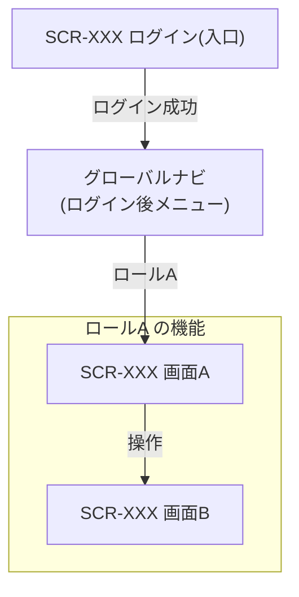

<!-- コピーして docs/03_機能設計/03_画面設計/index.md として使用(画面遷移図を持つ画面設計固有の index) -->
<!-- 本種別の文書を作成・更新する前に 11_トレーサビリティ/シーケンス設計トレーサビリティ.md で関連SEQを確認する -->
<!-- 一覧はID・名称・状態を管理する。設計間の網羅的な対応は専用トレーサビリティ表を正本とし、一覧へ重複記載しない。文書の作成・更新と同時に行を更新する -->
<!-- 各セクション直上のコメントに「定義内容(そのセクションの意味)」「定義する条件」「項目説明(各列・各項目の意味)」「定義ルール」をセットで記載する。編集時はコメントを読んでから該当セクションを埋める -->

<!--
【1. 概要】
定義内容: この index.md が属するディレクトリ(文書種別)で管理する対象と範囲を要約する。
定義する条件: 全 index.md で必須。冒頭に 1〜3 行で記載する。
項目説明:
- 概要本文: このディレクトリで定義・管理する文書種別と目的(1〜3行)。
定義ルール:
- 1〜3行で簡潔に記載する。個別文書の仕様や一覧独自の情報は書かない。
- 管理対象の文書種別(API / SCR / MOD など)とその役割を示す。
-->
# 1. 概要

(このディレクトリで定義する内容を1〜3行で記載)

<!--
【2. 画面遷移図】
定義内容: このディレクトリで管理する画面(SCR-XXX)間の遷移を1枚の図で俯瞰する。各画面の入口・主要な業務遷移・外部サービスとの往復・ログイン後の共通ナビゲーションを示す。
定義する条件: 画面が2つ以上あり画面間の遷移がある場合に定義する。遷移の正本は各SCR文書の「画面遷移」節とし、本図はその集約として全体像を示す(遷移がなければセクションごと省略してよい)。
項目説明:
- ノード: 画面(SCR-XXX+画面名)。ログイン後の共通ナビゲーション(グローバルナビ)・外部サービスもノードとして表せる。
- エッジ: 画面間の遷移。ラベルには遷移の契機(業務操作)を短く記す。
- サブグラフ: ロール(一般/管理者)・外部サービスなどの区分でノードをグループ化する。
定義ルール:
- Mermaid flowchart で記述する。ノードは SCR-XXX と画面名で表し、SCR-ID は「一覧」節と一致させる。
- 遷移(エッジ)とトリガの正本は各SCR文書「画面遷移」「画面イベント」節とし、本図はその集約とする。詳細(EVT-ID・条件・引き継ぎ項目・エラー時表示)は本図に再掲しない。
- 全画面に共通する遷移(認証失敗・未認証時のログイン画面遷移など)は、個別エッジを引かず図の下に注記でまとめ、図の可読性を保つ。
- ログイン後にメニューから到達する画面が各SCRの遷移に現れない場合は、グローバルナビ(ログイン後メニュー)ノードを置いて到達性を示す。
- ロール・外部サービスはサブグラフでグループ化してよい。権限そのものの定義は本図で行わず、各SCR・CFR-002 を正本とする。
-->
# 2. 画面遷移図

(画面間の遷移を Mermaid flowchart で俯瞰する。SCR-ID は「一覧」節と一致させる)

- (注記) 全画面共通の遷移(認証失敗・未認証時のログイン画面遷移など)は個別エッジを引かず、図の下にまとめて記載する。

<!--
【3. 一覧】
定義内容: このディレクトリ配下の各文書または予約済みIDを1行ずつ一覧化し、ID・名称・概要・状態を管理する。
定義する条件: 全 index.md で必須。文書を作成・更新したら同一作業内で該当行を更新する。
項目説明:
- ID: 文書の識別子(種別ごとの連番。例: API-XXX / SCR-XXX / MOD-XXX)。
- 名称: 文書の名称(各文書の基本情報から転記)。
- 概要: 文書の目的(各文書の概要から転記。1〜3行)。
- 直接根拠: 本文書が直接使用した上位ID。網羅的な対応は専用トレーサビリティ表へ記載する。
- 主要依存: 実装理解に必要な直接の呼び出し先ID。利用元の逆引き一覧は記載しない。
- 状態: 未着手 / 作成中 / レビュー中 / 確定 / 廃止。
定義ルール:
- 設計間の対応関係は 02_要件定義/04_トレーサビリティ または 03_機能設計/11_トレーサビリティ の専用表を正本とし、一覧には網羅的な対応を重複記載しない。
- ID採番は一覧の最大値 +1。欠番の再利用は禁止。廃止は行を削除せず状態を「廃止」にして残す。
- SEQ作成時に下位設計IDが未作成の場合、ID・名称・概要(予定責務)・状態「未着手」を先に登録して予約する。予約行は削除・別用途へ流用しない。
- 標準列のうち ID・名称・概要 は必須。文書種別に応じて固有列を追加・置換してよい(SCR: URL / API: メソッド・パス / JOB: 実行契機 / MOD: 種別 / TBL: 物理名 / SQL: 使用元・対象テーブル / NFR: 分類・対象範囲 / SEQ: 契機・関連要素 など)。
- 直接根拠・主要依存列は文書種別に応じて省略・固有列へ置換してよい。FR/UC→SEQ、SEQ→各設計の網羅的な対応は専用表だけに記載する。
- 文書の作成・更新と同時に該当行を更新する。
-->
# 3. 一覧

<!-- 標準列。ID・名称・概要・状態は必須。直接根拠・主要依存は必要な文書種別のみ使用する。該当なしは「-」 -->
<!-- 文書種別に応じて固有列を追加・置換してよい(SEQ: 作成単位・関連FR/UC・作成要否・省略理由 / SCR: URL / API: メソッド・パス / JOB: 実行契機 / MOD: 種別 / TBL: 物理名 など) -->

| ID | 名称 | 概要 | 直接根拠 | 主要依存 | 状態 |
|---|---|---|---|---|---|
| XXX-001 |  |  | - | - | 未着手 |
