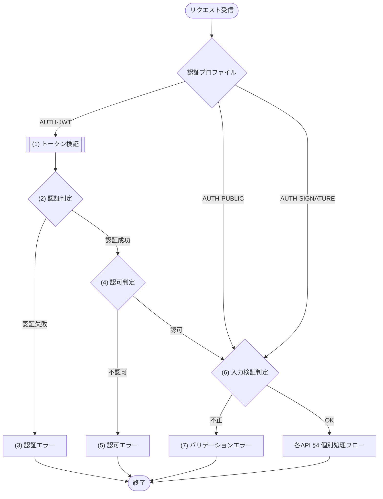

<!-- コピーして 03_機能設計/04_API設計/API-COM_共通設計.md として使用。index.md への行追加を先に行うこと -->
<!-- 本書は全 REST API に適用される共通仕様の正本(認証・共通ヘッダ・エラーレスポンス封筒・ページネーション・共通処理フロー・相関ID・冪等受付・版管理・タイムアウト)。各 API 文書には本書との差分のみを記載させ、共通事項を再記載させない -->
<!-- 論理契約は 01_概要設計 の論理インターフェース契約(IFC-XXX)を入力とする。認証・認可・冪等・再試行・タイムアウトの論理定義を物理仕様へ具体化する -->
<!-- エラーコード(ERR-XXX)の定義(エラー名・HTTPステータス・開発者向けメッセージ・プレースホルダ)は エラーメッセージ一覧.md が正本(システム全体を通した連番で一元管理)。本書は定義を再掲せず、エラーコードで参照する。共通エラー(区分=共通)の発生条件は §7 共通処理フローで、固有エラーは各 API 文書で表現する。本書は ERR を新規定義しないため エラーメッセージ一覧.md への行追加は不要 -->
<!-- 権限(認可条件)は CFR-XXX(認可・権限制御)、区分値(ユーザーロール等)は 共通コード定義/CODE-XXX、認証暗号・署名検証は MOD-XXX が正本。本書は ID 参照とし内容を再記載しない -->
<!-- 各見出し(#/##/###)直上のコメントに「定義内容(そのセクションの意味)」「定義する条件」「項目説明(各列・各項目の意味)」「定義ルール」をセットで記載する。子セクションを持つセクションは、親コメントにセクション全体の定義内容・共通ルールを、各子セクションのコメントにその子の項目説明を記載する。編集時はコメントを読んでから該当セクションを埋める -->
<!-- MeetRoom等の固有名・外部サービス名・具体値はプレースホルダ({XXX})または汎用例へ置き換える。物理HTTPパス・タイムゾーン・有効期限・タイムアウト秒数・保持期間・署名方式等の具体値は {} で示し、構造・セクション・列・記法は保持する -->

<!--
【1. 概要】
定義内容: 本書が全 REST API に共通で定める仕様の範囲と、上位入力(論理インターフェース契約)、各 API 文書との関係を示す。
定義する条件: 必須。
項目説明:
- 対象範囲: 本書が定める共通仕様の列挙(認証・共通ヘッダ・エラー封筒・ページネーション・相関ID・冪等受付・版管理・タイムアウト等)。
- 入力: 本書の根拠とする上位成果物(01_概要設計の論理インターフェース契約 IFC-XXX)。
- 各 API 文書との関係: 各 API は本書との差分のみを記載し、共通事項を再記載しない旨。
定義ルール:
- 共通仕様の正本は本書1箇所とし、各 API 文書・他設計での再記載を禁止する(ID/本書参照のみ)。
-->
# 1. 概要

{対象システム} の全 REST API に適用される共通仕様(認証プロファイル・共通ヘッダ・エラーレスポンス封筒・ページネーション・相関ID・冪等受付・版管理・タイムアウト)の正本。論理契約は 01_概要設計 の論理インターフェース契約(IFC-XXX)を入力とする。
各 API 文書には本書との差分のみを記載する(再記載は禁止)。

<!--
【2. 認証】
定義内容: 全 API に共通する認証方式・トークン取得元・有効期限などの基本仕様と、JWT仕様(§2.1)・認証プロファイル(§2.2)を定義する。
定義する条件: 必須。
項目説明:
- 方式: 認証方式(例: Bearer トークン)。
- トークン取得: トークンを発行する API(API-XXX)。
- 有効期限: トークンの有効期間。
定義ルール:
- 認証方式・秘密情報の扱いはここに集約し、各 API では方式名の参照のみとする。
- 秘密鍵・署名鍵などの秘密情報は実行基盤の秘密情報として管理し、コード・リポジトリに含めない。
-->
# 2. 認証

| 項目 | 内容 |
|---|---|
| 方式 | {認証方式(例: Bearer トークン)} |
| トークン取得 | API-XXX で取得 |
| 有効期限 | {有効期限(例: 24時間)} |

<!--
【2.1 JWT仕様】(または採用する認証トークン仕様)
定義内容: 認証トークン(例: JWT)の発行・検証仕様を定義する。
定義する条件: トークンベース認証を採用する場合に定義する。
項目説明:
- 署名方式: トークンの署名アルゴリズム。
- 発行・検証方法: 発行・検証を委譲するモジュール(MOD-XXX)とその処理名。
- 外部ライブラリ直接利用: 外部ライブラリ利用専用モジュール以外からの直接利用可否(CLAUDE §8-14)。
- 秘密鍵: 署名に用いる秘密情報の管理方針。
- 必須情報: トークンに含める必須クレーム(ユーザーID・ロール・発行日時・有効期限等)。
- 認証主体ロール: ロール値の正本(共通コード定義/CODE-XXX)。
- 認可判定: ロールを照合する権限定義(CFR-XXX)。
- 有効期限判定: 有効性の判定条件。
定義ルール:
- 署名・検証は外部ライブラリを直接呼ばず MOD-XXX(認証暗号サービス)へ委譲する(CLAUDE §8-14)。
- 秘密情報はコード・リポジトリに含めず実行基盤の秘密情報として管理する。
-->
## 2.1 JWT仕様

認証トークンの発行・検証仕様を定義する。秘密鍵は実行基盤の秘密情報として管理し、コード・リポジトリには含めない。

| 項目 | 内容 |
|---|---|
| 署名方式 | {署名方式(例: HS256)} |
| 発行・検証方法 | MOD-XXX 認証暗号サービスの トークン発行処理・トークン検証処理を利用する |
| 外部ライブラリ直接利用 | 外部ライブラリ利用専用モジュール以外の API・JOB・モジュールからの直接利用は禁止 |
| 秘密鍵 | 実行基盤の秘密情報として管理する署名秘密鍵 |
| 必須情報 | ユーザーID、ロール、発行日時、有効期限 |
| 認証主体ロール | 共通コード定義/CODE-XXX のユーザーロールを設定する |
| 認可判定 | 認証主体ロールを CFR-XXX の権限マトリクス(機能×ロール)に照合して判定する |
| 有効期限判定 | 現在時刻が有効期限以下であること |

<!--
【2.2 認証プロファイル】
定義内容: API ごとに適用する認証・共通前処理・認可の型(プロファイル)を分類し、それぞれの対象・前処理・認可を定義する。
定義する条件: 必須。認証要否や前処理が API 群で異なる場合にプロファイルを分けて定義する。
項目説明:
- プロファイル: プロファイル名(例: AUTH-JWT=トークン認証、AUTH-PUBLIC=認証前、AUTH-SIGNATURE=外部署名検証)。
- 対象: そのプロファイルを適用する API 群。
- 共通前処理: 個別処理フローの前に行う共通処理。
- 認可: 認可判定の根拠(各 API §1 と CFR-XXX)。
定義ルール:
- 「認証不要」は共通前処理自体を省略する意味ではない。認証前プロファイルは入力検証、署名検証プロファイルは署名検証を必ず行う。
- トークン失効方式を用いる場合は一意識別子を失効情報と照合し、KVストア障害時は認証失敗ではなく依存先停止(ERR-XXX)として扱う。
-->
## 2.2 認証プロファイル

| プロファイル | 対象 | 共通前処理 | 認可 |
|---|---|---|---|
| AUTH-JWT | {認証が必要な API 群} | Bearer トークン検証後、ロールと本人条件を検証する | 各API §1とCFR-XXX |
| AUTH-PUBLIC | {認証前の API(例: ログイン)} | トークン検証を行わず、入力検証とレート制御を行う | 認証前のため不要 |
| AUTH-SIGNATURE | {外部サービスからのWebhook受信 API} | トークン検証を行わず、生payloadを保持してMOD-XXXへ渡し、署名を検証する | 署名検証成功時だけ反映 |

- 「認証不要」は共通前処理自体を省略する意味ではない。AUTH-PUBLIC は入力検証、AUTH-SIGNATURE は署名検証を必ず行う。
- トークン失効方式を使用する場合は一意識別子をKVストアの失効情報と照合する。KVストア障害時の扱いは認証失敗ではなく依存先停止(ERR-XXX)とする。

<!--
【3. 共通リクエストヘッダ】
定義内容: 全 API または特定条件で共通に受け取る/付与するリクエストヘッダと、その値・対象を定義する。
定義する条件: 必須。
項目説明:
- ヘッダ: ヘッダ名(認証・相関ID・版・冪等キー等)。
- 値: 設定する値の説明。
- 対象: そのヘッダを適用する API の範囲。
定義ルール:
- ヘッダ名など通信プロトコル・外部規約上の名称は物理名禁止の例外として最小限記載してよい(CLAUDE §8-13)。
- 相関ID(X-Request-ID 等)は全レスポンスへ返す方針をここに集約する。
-->
# 3. 共通リクエストヘッダ

| ヘッダ | 値 | 対象 |
|---|---|---|
| Authorization | Bearer {token} | 認証「要」の API |
| Content-Type | application/json | 全 API |
| X-Request-ID | 呼出元が生成した相関ID。未指定時は実行基盤が生成 | 全 API |
| X-API-Version | `1`。未指定時もv1として扱う | 全 API |
| Idempotency-Key | 呼出元が生成した一意キー | 副作用を持つPOST(登録・更新・キャンセル等) |

全レスポンスに `X-Request-ID` を返す。外部連携の受信では外部サービスのイベントIDも相関属性として記録するが、X-Request-IDの代替にはしない。

<!--
【4. エラーレスポンス】
定義内容: 全 API のエラー返却形式(封筒構造)と各項目の意味を定義する。ERR コード自体の定義は エラーメッセージ一覧.md が正本。
定義する条件: 必須。
項目説明:
- error.code: トップレベルのエラーコード。
- error.message: 開発者向けメッセージ(エラーメッセージ一覧.md が正本)。
- error.request_id: 相関に使う X-Request-ID と同じ値。
- error.details[]: 項目単位のエラー明細(field/code/message)。
- error.details[].code: 違反の粒度サブコード(必須欠落/桁数超過/範囲制約違反/形式不正)。エラーメッセージ一覧.md が正本。
定義ルール:
- ERR-XXX の定義(エラー名・HTTPステータス・開発者向けメッセージ)は再掲せず、コードで参照する。
- バリデーションエラーはトップレベルを共通バリデーションコードとし、違反項目ごとに details[] を1件ずつ設定する。
- details[] を持たないエラーは details を空配列 [] とする。単一項目に閉じない業務起因の検証はトップレベル固有コードで返す。
-->
# 4. エラーレスポンス

全 API のエラーは以下の封筒形式で返す。message は エラーメッセージ一覧.md で定義する開発者向けメッセージを設定する。
ERR-XXX の定義(エラー名・HTTPステータス・開発者向けメッセージ)は エラーメッセージ一覧.md が正本(システム全体を通した連番で一元管理)。本書・各 API 文書は再掲せずエラーコードで参照する。エラーの発生条件は定義側に持たせず、共通エラー(区分=共通)は §7 共通処理フロー、API 固有エラー(区分=固有)は各 API 文書 §4/§5 個別処理フローで表現する。

```json
{
  "error": {
    "code": "ERR-XXX",
    "message": "(開発者向けメッセージ)",
    "request_id": "req-...",
    "details": [
      { "field": "(対象項目)", "code": "ERR-XXX", "message": "(利用者向けメッセージ)" }
    ]
  }
}
```

| 項目 | 内容 |
|---|---|
| error.code | エラーコード |
| error.message | 開発者向けメッセージ(エラーメッセージ一覧.md で定義) |
| error.request_id | 問い合わせ・ログ相関に使用するX-Request-IDと同じ値 |
| error.details[] | 項目単位のエラー明細。どの項目のどのルールに反したかを判別できるようにする |
| error.details[].field | 対象項目のパラメータ名(各 API §2 リクエストのパラメータ名) |
| error.details[].code | 違反の粒度サブコード(区分=詳細: 必須項目未入力 / 桁数超過 / 入力値制約違反 / 形式不正 に対応する ERR-XXX)。エラーメッセージ一覧.md が正本 |
| error.details[].message | 違反したルールの内容(各 API §6 バリデーションのエラーメッセージ列で定義) |

バリデーションエラーは、トップレベル error.code をバリデーション共通コード(ERR-XXX)とし、違反した項目ごとに details[] を1件ずつ設定する。各 details[] には field と粒度サブコード code(必須欠落/桁数超過/範囲・制約違反/形式不正)を持たせ、1リクエストの複数項目違反を1レスポンスで表現する。details[] を持たないエラーは details を空配列 [] とする。項目間相関(開始≥終了など)など単一項目に閉じない業務起因の検証はトップレベル固有コードで返す。

<!--
【4.1 共通エラー一覧】
定義内容: 共通処理フロー(§7)で全 API 共通に発生するエラー(区分=共通)を、コードと共通フロー上の発生箇所で一覧化する。
定義する条件: 共通処理フローまたは共通基盤(タイムアウト・レート制限・依存先停止等)で発生するエラーがある場合に定義する。
項目説明:
- エラーコード: 共通で発生する ERR-XXX。
- 発生箇所: 共通処理フローのステップ番号、または発生条件の要約。
定義ルール:
- 定義(エラー名・HTTPステータス・開発者向けメッセージ)は再掲せず、コードと発生箇所のみを示す。
- 各エラーの発生条件は §7 共通処理フローで表現する。
-->
## 4.1 共通エラー一覧

共通処理フロー(§7)で全 API 共通に発生するエラー(区分=共通)。定義(エラー名・HTTPステータス・開発者向けメッセージ)は エラーメッセージ一覧.md が正本のため再掲せず、本書は該当エラーコードと共通処理フロー上の発生箇所のみを示す。各エラーの発生条件は §7 共通処理フローで表現する。

| エラーコード | 発生箇所 |
|---|---|
| ERR-XXX(認証失敗) | (2) 認証判定 |
| ERR-XXX(認可失敗) | (4) 認可判定 |
| ERR-XXX(バリデーション) | (6) 入力検証判定 |
| ERR-XXX(内部障害) | 予期しない内部障害。詳細をレスポンスへ露出せずX-Request-IDで追跡する |
| ERR-XXX(タイムアウト) | APIまたは依存先のタイムアウト |
| ERR-XXX(レート制限) | レート制限超過。Retry-Afterを返す |
| ERR-XXX(依存先停止) | データストア/KVストア/外部依存先の一時停止 |
| ERR-XXX(冪等競合) | 同じIdempotency-Keyに異なるリクエスト内容を指定 |
| ERR-XXX(状態競合) | 期待状態不一致・同時更新による競合 |

<!--
【5. ページネーション】
定義内容: 一覧系 API 共通のページングパラメータとレスポンス形式を定義する。
定義する条件: 一覧系 API がある場合に定義する。
項目説明:
- パラメータ: ページング用パラメータ(page / limit 等)。
- 配置: パラメータの配置(query 等)。
- 型/既定値/制約: 値の型・デフォルト・上限などの制約。
定義ルール:
- 既定値・上限は具体値を明示し、各一覧 API では本形式を参照して差分のみ記載する。
-->
# 5. ページネーション

一覧系 API は以下のクエリパラメータとレスポンス形式を用いる。

| パラメータ | 配置 | 型 | 既定値 | 制約 |
|---|---|---|---|---|
| page | query | int | 1 | 1始まり |
| limit | query | int | {既定値(例: 20)} | {上限(例: 最大100)} |

```json
{ "items": [...], "page": n, "limit": n, "total": n }
```

<!--
【6. 共通規約】
定義内容: 日時形式・文字コード・認証/認可エラー・版・クライアントタイムアウトなど、全 API 横断の規約を定義する。
定義する条件: 必須。
項目説明:
- 項目: 規約の対象(日時形式・文字コード・認証エラー・内部API版・タイムアウト等)。
- 規約: その規約の内容。
定義ルール:
- 具体値(タイムゾーン・秒数・版)は {} で示し、破壊的変更時の版方針もここに集約する。
-->
# 6. 共通規約

| 項目 | 規約 |
|---|---|
| 日時形式 | ISO 8601(保存UTC・表示 {タイムゾーン(例: Asia/Tokyo)}) |
| 文字コード | UTF-8 |
| 認証エラー | 全APIで ERR-XXX(認証失敗) |
| 認可エラー | 全APIで ERR-XXX(認可失敗) |
| 内部API版 | 現行はv1。X-API-Version未指定もv1。破壊的変更は `{APIベースパス}/v2` とし、v1内は任意項目追加等の後方互換変更だけを行う |
| クライアントタイムアウト | UIからAPIへの要求は{タイムアウト秒数(例: 10秒)}。タイムアウト後の副作用API再送は同じIdempotency-Keyを使用する |

<!--
【7. 共通処理フロー】
定義内容: 各 API の個別処理フローに入る前に共通で行う処理(認証プロファイル選択・トークン検証・認証/認可判定・入力バリデーション・相関ID付与・一般例外変換)の流れと詳細を定義する。
定義する条件: 必須。
項目説明(フロー要素): §4 個別処理フローと同一の記法。呼び出しノード [["(n) 処理名"]]、内部処理・結果ブロック ["(n) 処理名"]、判定 {"(n) 判定名"}、エラーノード ["(n) XXXエラー"]、エッジラベル=分岐結果。
定義ルール:
- 認証プロファイルにより通過するステップが異なる(トークン認証のみ認証・認可を通過、認証前・署名検証は入力検証へ進む)。
- 取得・検証・整形の結果を判定する場合、その処理を独立したステップとして先に定義し、判定はその結果を参照する(処理と判定を分ける。CLAUDE §8-19)。
- 各判定は失敗すると §4 の封筒でエラーを返し、成功すると次の処理(最後は各 API §4 個別処理フロー)へ進む。
- ノードとエッジラベルには処理名・判定結果だけを短く記載し、呼び出し先・外部サービス名・ステータス値等の詳細は書かない(CLAUDE §8-16)。
-->
# 7. 共通処理フロー

全 REST API は、各 API 文書 §4 の個別処理フローに入る前に認証プロファイルを選択する。トークン検証・ロール認可はAUTH-JWTだけに適用し、AUTH-PUBLICとAUTH-SIGNATUREへ誤適用しない。入力バリデーション、相関ID、一般例外変換は全プロファイルに適用する。



<!--
【共通処理詳細】
定義内容: 共通処理フローの各処理((1)〜(7))で行う内容を、個別 API の §5 処理詳細と同じ形式(処理型・判定型・エラー型)で定義する。
定義する条件: §7 共通処理フローの各処理について定義する。
項目説明: 各処理を ### (n) 処理名 の見出しで展開する。処理型=モジュール呼び出し・引数、判定型=条件定義＋条件分岐マトリクス(＋処理結果表)、エラー型=エラーコード・引数の値。
定義ルール:
- (1)〜(5)はトークン認証プロファイルだけが通過し、認証前・署名検証プロファイルは(6)へ進む。
- 処理と判定を分け、判定は「(x) 処理名の結果」を参照する(CLAUDE §8-19)。
- 処理結果以外の処理では処理結果表を「なし」とする(CLAUDE §8-15)。
-->
## 共通処理詳細

共通処理フローの各処理((1)〜(7))で行う内容を、個別 API の §5 処理詳細と同じ形式で定義する。(1)〜(5)はAUTH-JWTだけが通過し、AUTH-PUBLIC/AUTH-SIGNATUREは(6)へ進む。

- 取得・検証・整形(トークン検証)の結果を判定する段階は、その取得・検証・整形処理を独立したステップとして先に定義し、判定はその結果を参照する。
- 各判定は、失敗すると §4 エラーレスポンスの封筒でエラーを返す。
- 各判定は、成功すると次の処理(最後は各 API §4 個別処理フロー)へ進む。

<!--
【(1) トークン検証】(処理型ステップ)
定義内容: 認証ヘッダのトークンを検証し、認証主体(ユーザーID・ロール)と有効性を得る処理。
定義する条件: トークン認証プロファイルで必須。
項目説明:
- 見出し直後の説明文: 処理の目的を1〜2行で記載する。
- 呼び出しモジュール表: MOD-ID=検証を委譲するモジュール、処理名=呼び出すメソッドの和名。
- 引数表: 呼び出し先へ渡す引数と値。
定義ルール:
- 署名・有効期限・必須クレームの検証は §2 認証・§2.1 に従い MOD-XXX(認証暗号サービス)へ委譲する(外部ライブラリ直接利用禁止。CLAUDE §8-14)。
- トークンが無い・不正な場合も含め、検証結果を (2) 認証判定へ渡す(処理と判定を分ける)。
-->
### (1) トークン検証

認証ヘッダの Bearer トークンを検証し、認証主体(ユーザーID・ロール)と有効性を得る。

- 署名・有効期限・必須クレームの検証は §2 認証・§2.1 に従い MOD-XXX 認証暗号サービスに委譲する。
- トークンが無い・不正な場合も含め、検証結果を (2) 認証判定へ渡す。

| MOD-ID | 処理名 |
|---|---|
| MOD-XXX | トークン検証処理 |

| 引数項目 | 値 |
|---|---|
| トークン | Authorization ヘッダの Bearer トークン |

<!--
【(2) 認証判定】(判定型ステップ)
定義内容: (1) トークン検証の結果が有効かを判定し、認証の成否を決める。
定義する条件: トークン認証プロファイルで必須。
項目説明:
- ### 条件定義/### 条件分岐マトリクス: 判定を構成する2表。
- 処理結果表: 処理結果以外の処理のため「なし」とする。
定義ルール:
- 判定対象は「(1) トークン検証の結果」を参照する。トークン未指定・無効・期限切れは認証失敗エラー(ERR-XXX)へ進む。
- 条件記法: 存在判定は != NULL、有効性は = true で表す。
-->
### (2) 認証判定

(1) トークン検証の結果が有効かを判定し、認証の成否を決める。トークン未指定・無効・期限切れの場合は ERR-XXX(認証失敗) を返す。

#### 条件定義

| No | 判定対象 | 条件 |
|---|---|---|
| 条件(1) | Authorization ヘッダの Bearer トークン | != NULL |
| 条件(2) | (1) トークン検証の結果.有効 | = true |

#### 条件分岐マトリクス

条件は ◯=満たす・×=満たさない・-=判定しない、処理は ◯=そのパターンで実行・-=実行しない で表す。

| 条件・処理 | #1 認証成功 | #2 トークンなし | #3 検証失敗 |
|---|---|---|---|
| 条件(1) | ◯ | × | ◯ |
| 条件(2) | ◯ | - | × |
| 処理 |  |  |  |
| (4) 認可判定へ進む | ◯ | - | - |
| (3) 認証エラーへ進む | - | ◯ | ◯ |

処理結果以外の処理のため、処理結果は「なし」とする。

| 項目名 | データ型 | 値 | 説明 |
|---|---|---|---|
| なし | - | - | - |

<!--
【(3) 認証エラー】(エラー型ステップ)
定義内容: 認証に失敗した場合のエラーレスポンスを返す終端ステップ。
定義する条件: (2) 認証判定で失敗経路がある場合に定義する。
項目説明: | エラーコード | 引数 | 値 | 表で、返す ERR-XXX とメッセージのプレースホルダへ束縛する値を定義する。
定義ルール:
- 封筒構造は §4、メッセージ本文・プレースホルダは エラーメッセージ一覧.md が正本のため再記載しない。
- プレースホルダのないエラーは引数・値を「なし」/「―」とする。
-->
### (3) 認証エラー

認証に失敗した(トークン未指定・無効・期限切れ)場合のエラーレスポンスを返却する。

| エラーコード | 引数 | 値 |
|---|---|---|
| ERR-XXX(認証失敗) | なし | ― |

<!--
【(4) 認可判定】(判定型ステップ)
定義内容: 認証主体のロールが当該 API に許可された操作かを判定する。
定義する条件: トークン認証プロファイルで必須。
項目説明:
- ### 条件定義/### 条件分岐マトリクス: 判定を構成する2表。
- 処理結果表: 処理結果以外の処理のため「なし」とする。
定義ルール:
- 判定は各 API §1 基本情報の認可と CFR-XXX の権限マトリクスに従う。許可されない場合は認可エラー(ERR-XXX)へ進む。
-->
### (4) 認可判定

認証主体のロールが、当該 API に許可された操作かを判定する。

- 判定は各 API 文書 §1 基本情報の認可と CFR-XXX の権限マトリクスに従う。
- 許可されない場合は ERR-XXX(認可失敗) を返す。

#### 条件定義

| No | 判定対象 | 条件 |
|---|---|---|
| 条件(1) | (1) トークン検証の結果.ロール | 当該 API の認可(各 API §1 基本情報)で許可される(CFR-XXX) |

#### 条件分岐マトリクス

条件は ◯=満たす・×=満たさない、処理は ◯=そのパターンで実行・-=実行しない で表す。

| 条件・処理 | #1 認可 | #2 不認可 |
|---|---|---|
| 条件(1) | ◯ | × |
| 処理 |  |  |
| (6) 入力検証判定へ進む | ◯ | - |
| (5) 認可エラーへ進む | - | ◯ |

処理結果以外の処理のため、処理結果は「なし」とする。

| 項目名 | データ型 | 値 | 説明 |
|---|---|---|---|
| なし | - | - | - |

<!--
【(5) 認可エラー】(エラー型ステップ)
定義内容: ロールが当該 API に許可されていない場合のエラーレスポンスを返す終端ステップ。
定義する条件: (4) 認可判定で失敗経路がある場合に定義する。
項目説明: | エラーコード | 引数 | 値 | 表で定義する。
定義ルール: 封筒構造・メッセージは正本を参照し再記載しない。
-->
### (5) 認可エラー

認証主体のロールが当該 API に許可されていない場合のエラーレスポンスを返却する。

| エラーコード | 引数 | 値 |
|---|---|---|
| ERR-XXX(認可失敗) | なし | ― |

<!--
【(6) 入力検証判定】(判定型ステップ)
定義内容: リクエストが各 API の §2 リクエスト・§6 バリデーションの構文ルール(必須・型・形式・単項目制約・項目間相関)を満たすかを判定する。
定義する条件: 必須(全プロファイル共通)。
項目説明:
- ### 条件定義/### 条件分岐マトリクス: 判定を構成する2表。
定義ルール:
- 満たさない場合はトップレベル バリデーション共通コード(ERR-XXX)を返し、違反項目ごとに details[] を設定する。details[].code は違反ルール種別に応じた粒度サブコード(必須欠落/桁数超過/範囲・制約違反/形式不正)。各 API §6 の各ルールはこのマッピングに従う(§6表に code 列は持たせない)。
- 項目間相関(単一項目に閉じない検証)は details[] ではなく該当する固有エラーコードをトップレベルで返す。
- DB 参照・業務ルールを伴う判定はここに含めず、各 API §4 個別処理フローで行う。
-->
### (6) 入力検証判定

リクエストが各 API 文書 §2 リクエスト・§6 バリデーションの構文ルール(必須・型・形式・単項目制約・項目間相関)を満たすかを判定する。

- 満たさない場合はトップレベル バリデーション共通コード(ERR-XXX) を返し、違反項目ごとに §4 エラーレスポンスの details[] を設定して、どの項目で違反したかを判別できるようにする。各 details[] の code には違反ルール種別に応じた粒度サブコードを設定する(必須欠落 / 桁数超過 / 単項目の範囲・制約違反 / 型・形式不正)。各 API 文書 §6 バリデーションの各ルールはこのマッピングに従って details[].code を決める(§6表に code 列は持たせない)。
- 項目間相関(単一項目に閉じない検証。例: 利用開始 ＜ 利用終了)は details[] ではなく、該当する固有エラーコードをトップレベルで返す。
- DB 参照・業務ルールを伴う判定はここに含めず、各 API §4 個別処理フローで行う(範囲は「入力バリデーションの範囲」)。

#### 条件定義

| No | 判定対象 | 条件 |
|---|---|---|
| 条件(1) | リクエスト各項目 | 各 API §6 バリデーションの成立条件をすべて満たす |

#### 条件分岐マトリクス

条件は ◯=満たす・×=満たさない、処理は ◯=そのパターンで実行・-=実行しない で表す。

| 条件・処理 | #1 正常 | #2 構文不正 |
|---|---|---|
| 条件(1) | ◯ | × |
| 処理 |  |  |
| 各 API §4 個別処理フローへ進む | ◯ | - |
| (7) バリデーションエラーへ進む | - | ◯ |

処理結果以外の処理のため、処理結果は「なし」とする。

| 項目名 | データ型 | 値 | 説明 |
|---|---|---|---|
| なし | - | - | - |

<!--
【(7) バリデーションエラー】(エラー型ステップ)
定義内容: リクエストが構文ルールを満たさない場合のエラーレスポンスを返す終端ステップ。
定義する条件: (6) 入力検証判定で失敗経路がある場合に定義する。
項目説明: | エラーコード | 引数 | 値 | 表で定義する。バリデーションエラーはメッセージのプレースホルダを持たず、違反内容は details[] に設定する。
定義ルール: 封筒構造は §4 が正本。details[] の項目単位明細で違反内容を表現する。
-->
### (7) バリデーションエラー

リクエストが構文ルールを満たさない場合のエラーレスポンスを返却する。

| エラーコード | 引数 | 値 |
|---|---|---|
| ERR-XXX(バリデーション) | 違反項目明細(details[]) | 違反項目ごとに field=違反項目・message=違反したルール内容を設定 |

※ バリデーション共通エラーはメッセージのプレースホルダを持たず、エラー明細(details[])に違反内容を設定する点が他のエラーノードと異なる(封筒構造は §4 が正本)。

<!--
【入力バリデーションの範囲】
定義内容: (6) 入力バリデーションが検証する範囲(構文的チェック)と、共通フローに含めない範囲(DB参照・業務ルール)を区分する。
定義する条件: 必須。
項目説明:
- 区分: 必須・型・形式・単項目制約・項目間相関。
- 内容: 各区分で検証する内容。
定義ルール:
- リクエスト単体で機械的に判定できる構文的チェックに限る。
- DB 参照や業務ルールを伴う判定(存在確認・重複・期間制約・状態遷移等)は各 API §4 個別処理フローで業務判定として定義する。
-->
## 入力バリデーションの範囲

(6) 入力バリデーションが検証するのは、リクエスト単体で機械的に判定できる構文的チェックに限る。

| 区分 | 内容 |
|---|---|
| 必須 | 必須項目が指定されている |
| 型 | 値の型が正しい |
| 形式 | 日付・時刻・コード等の形式が正しい |
| 単項目制約 | 文字数・数値範囲・許可値など1項目で判定できる制約 |
| 項目間相関 | 開始＜終了など複数項目の相関 |

DB 参照や業務ルールを伴う判定(存在確認・重複・期間制約・状態遷移など)は共通フローに含めず、各 API 文書 §4 個別処理フローで業務判定として定義する(返すエラーは判定内容による)。

<!--
【8. 相関ID・運用ログ】
定義内容: 相関ID(X-Request-ID)の受付・伝播・応答と、運用ログに記録する構造化属性の規約を定義する。
定義する条件: 必須。
項目説明:
- 受付: 相関IDの受理・生成方針。
- 伝播: API→モジュール→クエリ/外部IF、非同期メッセージへの伝播。
- 応答: レスポンスヘッダ・エラー封筒への相関ID設定。
- ログ: 構造化属性として記録する項目、記録禁止情報。
定義ルール:
- 秘密情報・生パスワード・カード情報などの機密は記録しない。
-->
# 8. 相関ID・運用ログ

| 項目 | 規約 |
|---|---|
| 受付 | X-Request-IDを受理し、未指定または形式不正なら実行基盤が一意値を生成する |
| 伝播 | API→モジュール→クエリ/外部IF、API→非同期メッセージへ同じ相関IDを伝播する |
| 応答 | 成功・失敗を問わずレスポンスヘッダへX-Request-IDを返す。エラー封筒にもrequest_idを設定する |
| ログ | 認証主体ID(取得できる場合)、API-ID、HTTP結果、処理時間、Idempotency-Keyのハッシュ、外部リクエストIDを構造化属性として記録する。秘密情報・生パスワード・カード情報は記録しない |

<!--
【9. 冪等受付】
定義内容: 副作用を持つ API の冪等性を担保するキー設計・保持・再送時の挙動を定義する。
定義する条件: 副作用を持つ POST(登録・更新等)がある場合に定義する。
項目説明: 冪等キーの構成、保持先・保持期間、同一/異なるリクエスト再送時の応答、業務DB制約併用方針、対象外 API。
定義ルール:
- KVストアだけを業務整合性の根拠にせず、業務DBの一意制約・条件付き更新も併用する。
- 同一キー・異なるリクエスト内容は冪等競合エラー(ERR-XXX)を返す。
-->
# 9. 冪等受付

- 副作用を持つ API(登録・更新・キャンセル等)は `Idempotency-Key` を必須とする。
- `{認証主体}:{API-ID}:{Idempotency-Key}` をキーとして、リクエスト本文ハッシュ、処理状態、HTTP結果をKVストアへ{保持期間(例: 24時間)}保持する。
- 同一キー・同一ハッシュの再送は保存済み結果を返す。処理中は409、同一キー・異なるハッシュはERR-XXX(冪等競合)を返す。
- 業務DBの一意制約・条件付き更新も併用し、KVストアだけを業務整合性の根拠にしない。
- 認証前 API は資格情報検証のためIdempotency-Key対象外、外部Webhook受信 API は外部サービスのイベントIDと受信記録データストアを使用する。

<!--
【10. 版管理・互換性】
定義内容: 内部APIの版(バージョン)管理方針と後方互換・破壊的変更時の扱いを定義する。
定義する条件: 必須。
項目説明: 現行版の扱い、v1で許可する変更、破壊的変更時の並行提供・移行管理。
定義ルール:
- v1では後方互換変更(任意項目・新規エンドポイント・新規エラーコード追加)だけを許可する。
- 破壊的変更は別パス(v2)として並行提供し、移行期限・廃止日を運用設計で管理する。
-->
# 10. 版管理・互換性

- 現行 `{APIベースパス}/...` を内部API v1として扱い、`X-API-Version: 1` を返す。
- v1では任意項目・新規エンドポイント・新規エラーコードの追加だけを許可し、既存項目の削除、型変更、意味変更を行わない。
- 破壊的変更は `{APIベースパス}/v2/...` として並行提供し、利用中クライアント、移行期限、廃止日を運用設計で管理する。

<!--
【11. タイムアウト・再試行】
定義内容: 各通信境界(UI→API、実行基盤→データストア、実行基盤→外部サービス等)のタイムアウトと自動再試行方針を定義する。
定義する条件: 必須。
項目説明:
- 境界: 通信の境界。
- タイムアウト: その境界のタイムアウト時間。
- 自動再試行: 再試行の可否・方式(バックオフ・回数等)。
定義ルール:
- 4xx(レート制限を除く)、署名不正、業務競合は再試行しない。
- 最大回数超過後はDLQへ移動し、運用設計のアラート(OPS-XXX)を発報する。
- 副作用POSTの再要求は同じIdempotency-Keyを使用する。
-->
# 11. タイムアウト・再試行

| 境界 | タイムアウト | 自動再試行 |
|---|---|---|
| UI→API | {タイムアウト秒数(例: 10秒)} | GETのみ利用者操作またはUIで再取得可。副作用POSTは同じIdempotency-Keyで再要求する |
| 実行基盤→データストア/KVストア | API全体のタイムアウト以内に収める | 同期API内で無条件再試行しない。busy/一時障害は依存先停止(ERR-XXX)へ変換する |
| 実行基盤→外部サービス | {外部呼び出しタイムアウト(例: 1回5秒)} | 同期APIでは自動再試行しない。非同期コンシューマはタイムアウト/レート制限/一時的5xxだけを指数バックオフ＋jitterで最大{再試行回数}回再試行する |

- 4xx(レート制限を除く)、署名不正、業務競合は再試行しない。
- 最大回数後はDLQへ移動し、OPS-XXX のアラートを発報する。
