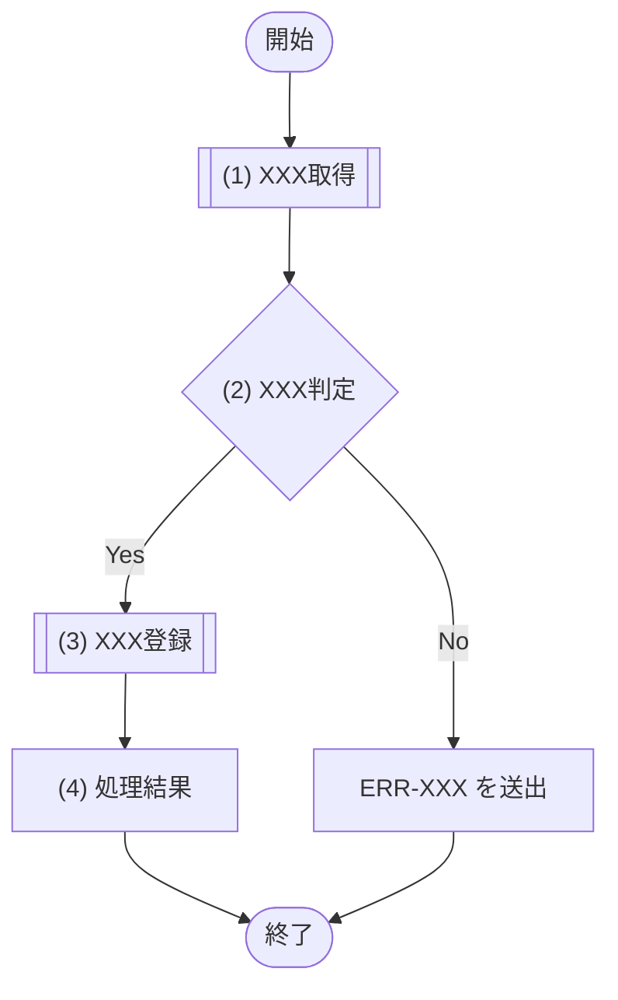

<!-- コピーして 03_機能設計/05_モジュール設計/MOD-XXX_モジュール名.md として使用。index.md への行追加を先に行うこと -->
<!-- エラーはエラーコード＋発生条件を記載する。ERR の定義(エラー名/HTTPステータス/文言)は エラーメッセージ一覧.md が正本のため、本文書に再記載しない -->
<!-- 各見出し(##/###/####)直上のコメントに「定義内容(そのセクションの意味)」「定義する条件」「項目説明(各列・各項目の意味)」「定義ルール」をセットで記載する。子セクションを持つセクションは、親コメントにセクション全体の定義内容・共通ルールを、各子セクションのコメントにその子の項目説明を記載する。編集時はコメントを読んでから該当セクションを埋める -->

<!--
【1. 基本情報】
定義内容: このモジュールの識別情報と属性(ID・名称・種別・概要・状態など)を一覧で示す。
定義する条件: 全モジュールで必須。
項目説明:
- モジュールID: このモジュールの識別子(MOD-XXX 連番)。
- モジュール名: モジュールの日本語名称(論理名)。
- 種別: モジュールの分類(Service / Repository / Utility / Domain)。
- 概要: モジュールの目的(1〜3行)。
定義ルール:
- モジュールID は MOD-XXX の連番。採番は一覧の最大値+1、欠番の再利用は禁止。
- 種別は Service / Repository / Utility / Domain のいずれか。
-->
# 1. 基本情報

| 項目 | 内容 |
|---|---|
| モジュールID | MOD-XXX |
| モジュール名 |  |
| 種別 | Service / Repository / Utility / Domain |
| 概要 | (1〜3行) |

<!--
【2. 責務】
定義内容: このモジュールが担う責務を一覧で示す。
定義する条件: 全モジュールで必須。担う責務を1件以上定義する。
項目説明:
- No: 責務の連番。
- 責務: このモジュールが受け持つ役割・処理範囲(1件1行)。
定義ルール:
- 1責務1行で記載し、No は 1 からの連番とする。
- API入出力仕様・画面仕様など他文書の責務は書かない(モジュール内部の責務のみ)。
-->
# 2. 責務

| No | 責務 |
|---|---|
| 1 |  |

<!--
【3. インターフェース】
定義内容: このモジュールが外部に公開するインターフェース(メソッド)ごとに、概要・入出力・処理フロー・処理詳細をまとめて定義する。
定義する条件: 全モジュールで必須。外部から呼び出せる公開インターフェースを定義する。
構成: インターフェースごとに ### (n) 処理名 の見出しを作り、その配下に #### 1. 概要、#### 2. 入力、#### 3. 出力、#### 4. 例外、#### 5. 処理フロー、#### 6. 処理詳細 を配置する。(n) は §3 の並び順の連番。
定義ルール:
- 各インターフェース(メソッド)に関する全情報(概要・入出力・フロー・詳細)を ### (n) 配下に集約する。独立した「処理フロー」「処理詳細」のトップレベルセクションは設けない。
- インターフェースの命名は「XXXX取得処理」「XXXX登録処理」「XXXX更新処理」「XXXX削除処理」「XXXX判定処理」のいずれかで終わる形に統一する。
- 処理詳細内の各ステップ(##### (n))の命名も同様の命名規則に従う。
-->
# 3. インターフェース

<!--
【## (1) XXX処理】
定義内容: 1つの公開インターフェース(メソッド)の全定義をまとめる。
定義する条件: 公開インターフェースごとに定義する。
定義ルール:
- 見出しは ### (n) 処理名 の形式。(n) は §3 の並び順の連番。
- 処理名は「XXXX取得処理」「XXXX登録処理」「XXXX更新処理」「XXXX削除処理」「XXXX判定処理」のいずれかで終わる形に統一する。上記に当てはまらない処理(送信・発行・算出など)は末尾に「処理」を付ける(例: XXXX送信処理)。
-->
## (1) XXX処理

<!--
【### 1. 概要】
定義内容: このインターフェースの目的を簡潔に示す。
定義する条件: 全インターフェースで必須。
項目説明:
- 概要文: インターフェースの目的(「〜する処理。」の形で1行)。具体的な判定ロジック(SQL-ID、変数名、具体的なステータス値等)は書かない。処理パターンがある場合は箇条書きで「・XXXXの場合はXXXを行う」という表現を用いる。
定義ルール:
- 1〜3行で記載する。
-->
### 1. 概要

XXXXをXXXXする処理。

<!--
【### 2. 入力】
定義内容: このインターフェースの入力パラメータを定義する。
定義する条件: 全インターフェースで必須。
項目説明:
- 入力(入力項目／説明): 引数の日本語名／内容・型・制約。引数ごとに1行。引数が無ければ「なし」。
定義ルール:
- 入力項目には「項目名」を記載する（物理名は記載しない）。
- 物理名や型名による配列表記（例: 会議室一覧(Room[])）は禁止し、Object または Object[] 型とした上でサブ項目をインデントして展開すること。
-->
### 2. 入力

| 入力項目 | データ型 | 説明 |
|---|---|---|
|  |  |  |

<!--
【### 3. 出力】
定義内容: このインターフェースの出力データを定義する。
定義する条件: 全インターフェースで必須。
項目説明:
- 出力(出力項目／説明): 戻り値の日本語名／内容。戻り値ごとに1行。戻り値が無ければ「なし」。
定義ルール:
- 出力項目には「項目名」を記載する（物理名は記載しない）。
- 物理名や型名による配列表記（例: 会議室一覧(Room[])）は禁止し、Object または Object[] 型とした上でサブ項目をインデントして展開すること。
-->
### 3. 出力

| 出力項目 | データ型 | 説明 |
|---|---|---|
|  |  |  |

<!--
【### 4. 例外】
定義内容: このインターフェースの例外/エラーを定義する。
定義する条件: 全インターフェースで必須。
項目説明:
- 例外(エラーID／説明): 送出しうるエラー(ERR-XXX)／発生条件。送出しなければ「なし」。
定義ルール:
- 例外・エラーはエラーコードで参照する(HTTPステータス・文言は再記載しない。定義は エラーメッセージ一覧.md を参照)。
-->
### 4. 例外

| エラーID | 説明 |
|---|---|
|  |  |

<!--
【### 4. 処理フロー】
定義内容: このインターフェースの内部処理の流れ(開始から戻り値／例外の返却まで、分岐と各処理の順序)を mermaid フローチャートで俯瞰する。
定義する条件: 全インターフェースで必須。単一ステップ(取得して返却するのみ)の場合も、開始→処理→終了の最小フローを必ず記載する。
項目説明(フロー要素):
- 開始 / 終了: メソッドの開始と、戻り値／例外の返却。
- 呼び出しノード [["(n) 処理名"]]: 他モジュール(MOD)・クエリ(SQL)・外部サービスを呼び出す(委譲する)処理。#### 5. 処理詳細 で `| MOD-ID | 処理名 |`・`| SQL-ID | クエリ名 |`・`| 外部サービス | 処理名 |` のいずれかの表を持つ処理は、関数呼び出しを表す二重角括弧 [[ ]](サブルーチン形状)で記す。
- 処理ノード ["(n) 処理名"]: 委譲を伴わない内部処理、および末尾の「処理結果」ブロック。#### 5. 処理詳細 で上記の呼び出し表を持たない処理は矩形 [ ] で記す。
- 判定ノード {"(n) 判定名"}: 連番付きの分岐。分岐条件・パターンは #### 5. 処理詳細 の条件分岐マトリクスで定義する。
- エッジラベル: 判定の分岐結果と、例外送出(ERR-XXX を送出)の経路。
定義ルール:
- 各処理は (1)(2)… の連番で表し、#### 5. 処理詳細 と対応させる。
- 処理(取得・整形・登録・更新・削除・外部呼び出しなど)の結果を見て分岐する場合は、処理ノードから直接分岐エッジを出さず、処理ノードの直後に判定ノード {"(n) XXX判定"} を置き、そこから分岐させる(処理と判定を分ける。CLAUDE §8-19)。判定ノードの中で取得・整形・登録・更新・削除・外部呼び出し等の処理を暗黙に行わない(署名検証・JWT検証など外部委譲の検証も独立した処理として先に定義し、判定はその結果を参照する)。
- 処理ノードは、#### 5. 処理詳細 で他の定義単位を呼び出す(委譲する)処理 —— `| MOD-ID | 処理名 |`・`| SQL-ID | クエリ名 |`・`| 外部サービス | 処理名 |` のいずれかの表を持つ処理 —— を二重角括弧 [["(n) 処理名"]](関数呼び出しブロック=サブルーチン形状)で、それ以外の内部処理・「処理結果」ブロックを矩形 ["(n) 処理名"] で記す。判定ノードは {"(n) 判定名"}、例外送出ノード ["ERR-XXX を送出"] は矩形のままとする。
- フローチャートのノード(処理名・判定名)には設計ID(SQL-ID・MOD-ID・TBL-ID・API-ID 等)を添えない。ノードは処理名・判定名のみで記載し、対応する呼び出しモジュール・クエリ・テーブル等のIDは #### 5. 処理詳細 で対応付ける。例外送出ノード「ERR-XXX を送出」は設計IDの補足ではないため対象外。
- フローチャートのノードとエッジラベルには処理名・判定結果だけを短く記載し、呼び出し先、外部サービス名、リトライ回数、ステータス値、通知内容などの詳細を書かない。詳細は #### 5. 処理詳細に定義する。
- 例外送出(ロールバック)経路もフローに表す。
- 処理名・判定名は「XXXX取得処理」「XXXX登録処理」「XXXX更新処理」「XXXX削除処理」「XXXX判定処理」の命名規則に従う(ただしフローチャートのノードラベルでは「処理」を省略してもよい)。
- 戻り値を返す処理では、必ずフローチャートの末尾に「レスポンス」ブロックを配置し、そこでリターンする内容を定義すること。
-->
### 4. 処理フロー

<!--
【### 5. 処理詳細】
定義内容: #### 4. 処理フロー の各処理((1)(2)…)について、呼び出すモジュール・引数・取得内容・条件分岐・戻り値/出力など具体的な処理内容を定義する。
定義する条件: 全インターフェースで必須。
構成: 各処理を ##### (n) 処理名 で展開する。条件定義・条件分岐マトリクスは見出しではなくキャプション行(「条件定義:」「条件分岐マトリクス:」)で示す。
定義ルール(セクション共通):
- 各ステップの命名は「XXXX取得処理」「XXXX登録処理」「XXXX更新処理」「XXXX削除処理」「XXXX判定処理」のいずれかで終わる形に統一する。上記に当てはまらない処理(送信・発行・算出など)は末尾に「処理」を付ける(例: XXXX送信処理)。
- 何らかの処理(取得・整形・登録・更新・削除・外部呼び出しなど)を行い、その結果で分岐する場合は、処理と判定を必ず別処理に分ける。処理を独立した処理型ステップとして先に定義し、判定(判定型)はその結果を「(x) 処理名の結果」で参照する。処理ノードから直接分岐させたり、判定ノードの中で暗黙に取得・整形・登録・更新・外部呼び出し等を行わない(CLAUDE §8-19)。
- 取得結果を参照する箇所(引数・判定対象など)は必ず「(x) 処理名の結果」の形で取得元を明記する。
- 取得処理を含め、戻り値を返す処理では、処理詳細の末尾に「処理結果」を置き、| 項目名 | データ型 | 値 | 説明 | 表で返却する項目を定義する。
- クエリ(SQL-XXX)を実行する処理では、呼び出しモジュール表(| MOD-ID | 処理名 |)に代えて | SQL-ID | クエリ名 | 表を用いる。
- 見出し直後の説明文は、その処理の**目的**(何のために行うか)を1〜2行で記載する。SQL の条件・カラム比較・区分値・パラメータ束縛などの具体的な判定ロジックは説明文に書かない(条件・区分値・引数は 条件定義・条件分岐マトリクス・引数表、および参照先の正本(SQL-XXX / TBL-XXX)で定義する)。
- 処理に複数のパターン・分岐がある場合は、説明文に「・〜の場合は〜する」の箇条書きで記載する。
-->
### 5. 処理詳細

<!--
【#### (1) XXX取得処理】(処理型ステップ)
定義内容: モジュール呼び出し・データ取得を行う1つの処理(#### 3. 処理フロー の処理ノードに対応)。呼び出すモジュールと引数を定義する。
定義する条件: モジュール呼び出し・データ取得を行う処理で用いる。
項目説明:
- 見出し直後の説明文: この処理の**目的**(何のために行うか)を1〜2行で記載する。具体的な判定ロジック(SQL条件・カラム比較・区分値・パラメータ束縛)は書かず、条件・パターンがある場合は「・〜の場合は〜する」の箇条書きで示す。取得系は「該当が無い場合は NULL を返す」旨も記載する。
- 呼び出しモジュール表: MOD-ID=呼び出す他モジュールのID／処理名=メソッドの和名。呼び出しモジュールがある場合にのみ記載する。クエリ(SQL-XXX)を実行する処理では、この表に代えて SQL-ID=実行するクエリのID／クエリ名=クエリの和名 の表を用いる。
- 利用ライブラリ/基盤表: 利用ライブラリ/基盤=外部ライブラリ・標準実行基盤APIの名称／用途=利用目的。外部ライブラリ・標準実行基盤APIを利用する処理でのみ記載する。
- 引数表: 引数項目=渡す引数／値=渡す値(メソッド引数や「(x) 処理名の結果」)。呼び出しモジュール表または SQL-ID 表を記載する場合にのみ記載する。
定義ルール:
- 呼び出しモジュールの処理名はメソッドの和名で記載する。
- SQL(SQL-XXX)を実行する処理は | SQL-ID | クエリ名 | 表で実行クエリを示す(MOD-ID 表は用いない)。
- 外部ライブラリ・標準実行基盤APIを利用する場合は、外部ライブラリ利用専用モジュールの処理詳細と §7 利用ライブラリ/基盤 に定義する。API・JOB・他モジュールからは直接呼び出さない。
- 呼び出しモジュール・実行クエリがない内部処理では、MOD-ID 表・SQL-ID 表・引数表を記載しない。
- 呼び出しモジュール・実行クエリがなく、処理内で参照する入力・前段処理結果を明示する必要がある場合は、引数表ではなく | 参照項目 | 値 | 表を用いる。
- 外部サービスを直接呼び出す場合は、MOD-ID 表ではなく | 外部サービス | 処理名 | 表を用い、渡す値は | 送信項目 | 値 | 表で定義する。署名検証など外部サービス由来の検証を行う場合は | 検証項目 | 値 | 表を用いる。
- 外部サービス側のAPI項目名・イベント名・ヘッダ名など、物理名以外に定義する術がない場合は例外として最小限の物理名記載を許可する。
- データ取得処理は、該当が無い場合に NULL を返す旨を定義する。
-->
#### (1) XXX取得処理

XXX のために XXX する。(処理の目的を記載する。判定ロジックは書かず、分岐がある場合は「・〜の場合は〜する」で記載する)

| MOD-ID | 処理名 |
|---|---|
| MOD-XXX | XXX処理 |

| 引数項目 | 値 |
|---|---|
| XXX | 引数.XXX |

<!--
【#### (2) XXX判定処理】(判定型ステップ)
定義内容: 条件分岐を行う1つの処理(#### 3. 処理フロー の判定ノードに対応)。条件定義と条件分岐マトリクスで分岐を定義する。
定義する条件: 内部処理に判定・分岐がある場合に用いる。
項目説明:
- 見出し直後の説明文: この判定の**目的**(何を判定するか)を1行で記載する。具体的な条件・比較・区分値は説明文に書かず、条件定義・条件分岐マトリクスで定義する。
- 条件定義表(キャプション「条件定義:」): No=条件番号(条件(x))／判定対象=評価する対象／条件=成立とみなす条件(比較記号・!= NULL・件数=0 等で表記)。
- 条件分岐マトリクス(キャプション「条件分岐マトリクス:」): 縦=条件・処理／横=パターン#x。条件は ◯満たす・×満たさない・-判定しない、処理は ◯実行・-非実行。
- 処理結果表: 戻り値を返す処理では、項目名=返す項目、値=戻り値(取得元を「(x) 処理名の結果」で明記)、説明=呼び出し元へ返す意味を末尾に付す。返却・出力を伴わない処理では「なし」とする。
定義ルール:
- 条件の記法: 大小・前後の比較は ＜/＜＝/＞/＞＝、存在(取得結果あり)判定は != NULL で表す。「〜が無ければ」等の文章表現にしない。
- 条件分岐が発生する処理は、条件分岐マトリクス(縦軸=条件・処理、横軸=パターン#x)で表す。処理は各行に展開し、パターン列ごとに ◯=実行／-=実行しない を記す。
-->
#### (2) XXX判定処理

条件分岐をマトリクス形式で定義する。取得結果・件数など、判定に用いる条件のみを定義する。

条件定義:

| No | 判定対象 | 条件 |
|---|---|---|
| 条件(1) | (x) XXX処理の結果 | != NULL |

条件分岐マトリクス:

| 条件・処理 | #1 | #2 |
|---|---|---|
| 条件(1) | ◯ | × |
| 処理 |  |  |
| 次の処理へ進む | ◯ | - |
| ERR-XXX を送出する | - | ◯ |

戻り値を返す処理では、戻り値・出力の内容を定義する。返却・出力を伴わない処理では「なし」とする。

| 項目名 | データ型 | 値 | 説明 |
|---|---|---|---|
| なし | - | - | - |

#### (4) 処理結果

処理結果を返却する。

| 項目名 | データ型 | 値 | 説明 |
|---|---|---|---|
| 戻り値 | Object | (3) XXX登録処理の結果 | 呼び出し元へ返す処理結果 |
| - ID | Integer | (3) XXX登録処理の結果 | 登録した対象のID |
<!--
【4. トランザクション・排他制御】
定義内容: このモジュールのトランザクション境界と排他制御方式を示す。
定義する条件: DB 更新を伴うモジュールで定義する。該当しない場合は各行に「なし」を記載する。
項目説明:
- トランザクション境界: トランザクションの開始・終了範囲(どのメソッドのどこからどこまでか)。
- 排他制御: ロック方式・対象(不要なら「なし」)。
定義ルール:
- トランザクション境界は対象メソッドと範囲を明記する。
- 排他制御はロック方式(悲観 / 楽観)と対象テーブルを記載し、不要なら「なし」とする。
-->
# 4. トランザクション・排他制御

| 項目 | 内容 |
|---|---|
| トランザクション境界 | (どのメソッドのどこからどこまでか) |
| 排他制御 | (ロック方式・対象。不要なら「なし」) |

<!--
【5. データアクセス】
定義内容: このモジュールがアクセスするテーブルと、CRUD 操作・用途を示す。
定義する条件: DB アクセスを伴うモジュールで定義する。
項目説明:
- テーブル: アクセス対象のテーブル(TBL-XXX。正本は データベース設計)。
- C / R / U / D: 実施する操作に ✓ を付す(Create / Read / Update / Delete)。
- 用途: そのテーブルへのアクセス目的。
定義ルール:
- テーブルは TBL-ID で参照する(カラム定義は再記載しない)。
- 実施する操作の列に ✓ を付す。
-->
# 5. データアクセス

| テーブル | C | R | U | D | 用途 |
|---|---|---|---|---|---|
| TBL-XXX |  | ✓ |  |  |  |

<!--
【6. エラー・例外】
定義内容: このモジュールが送出するエラー・例外を、発生条件と対応で一覧化する。
定義する条件: エラー・例外を送出するモジュールで定義する。
項目説明:
- 条件: エラーが発生する条件(どの処理・判定で発生するか)。
- エラー: エラーコード(ERR-XXX。定義は エラーメッセージ一覧.md を参照)。
- 対応: 発生時のモジュールの振る舞い(送出・ロールバックなど)。
定義ルール:
- エラーはエラーコードで参照する(HTTPステータス・文言は再記載しない)。
- 各行に発生条件と対応を明記する。
-->
# 6. エラー・例外

| 条件 | エラー | 対応 |
|---|---|---|
|  | ERR-XXX |  |

<!--
【7. 利用ライブラリ/基盤】
定義内容: このモジュール内で利用する外部ライブラリ・標準実行基盤APIを一覧で示す。
定義する条件: 外部ライブラリ・標準実行基盤APIを利用するモジュールで定義する。利用しない場合は各行に「なし」を記載する。
項目説明:
- 利用ライブラリ/基盤: 利用対象の外部ライブラリ・標準実行基盤API。物理名以外に定義する術がない場合のみ最小限の物理名を記載する。
- 用途: 利用目的。
- 管理方針: バージョン固定、秘密情報管理、設定値管理など。
定義ルール:
- API・JOB・他モジュールは外部ライブラリ・標準実行基盤APIを直接呼び出さず、外部ライブラリ利用専用モジュールの処理を MOD-ID と処理名で参照する。
- 外部ライブラリ由来の例外は、本モジュールで定義した戻り値または ERR-ID に変換する。
-->
# 7. 利用ライブラリ/基盤

| 利用ライブラリ/基盤 | 用途 | 管理方針 |
|---|---|---|
| なし | - | - |
