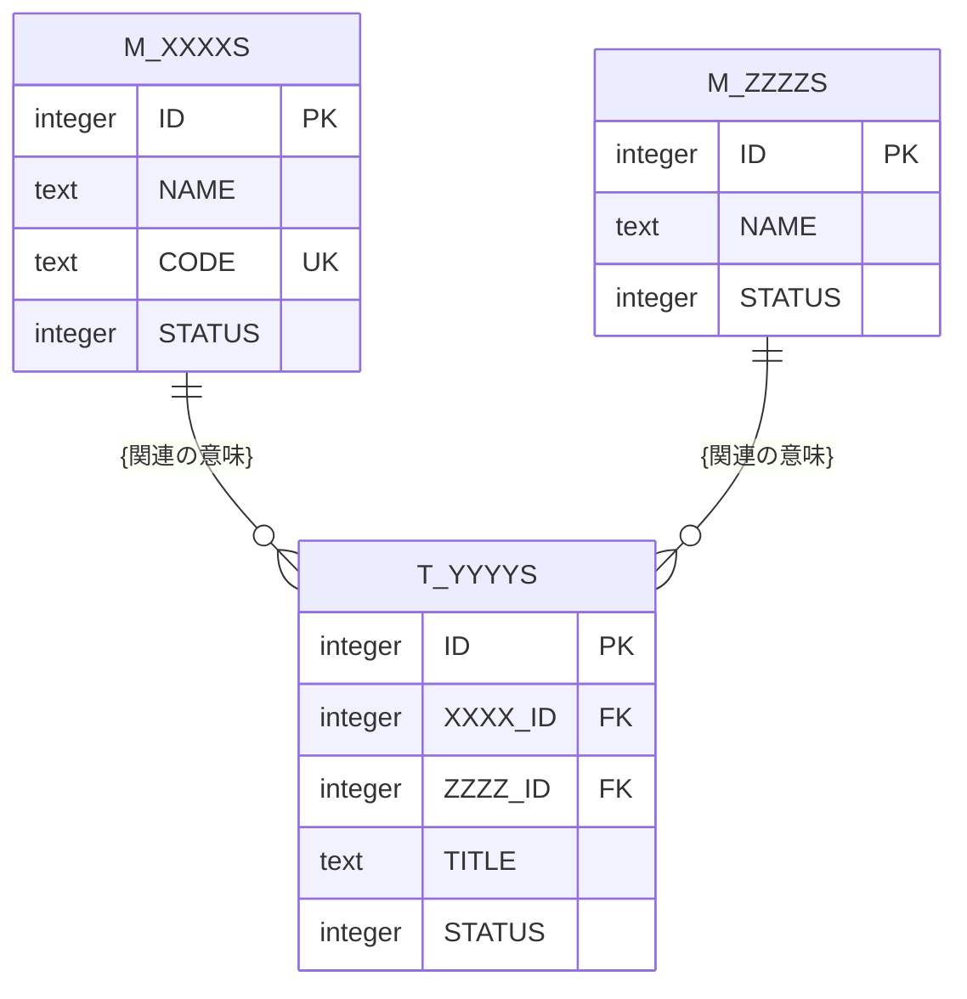

<!-- コピーして 03_機能設計/07_データベース設計/ER図.md として使用 -->
<!-- 全テーブル間の物理リレーションを俯瞰する図。各テーブルのカラム定義の正本は 07_データベース設計/ 配下の各 TBL 文書(共通カラムは 共通カラム.md)であり、本図には主キー・外部キー・一意キーなど関連の理解に必要な主要カラムのみ記載する -->
<!-- 07(データベース設計)のため物理名(英語のテーブル名・カラム名)を記載してよい。物理名・型は 命名規則.md の方針に従う(接頭辞 M_/T_/H_/TP_、スネークケース大文字、型は基盤方針に合わせる) -->
<!-- 各見出し(# )直上のコメントに「定義内容」「定義する条件」「項目説明」「定義ルール」をセットで記載する。編集時はコメントを読んでから該当セクションを埋める -->

<!--
【1. 概要】
定義内容: このER図が俯瞰する対象(システムが取り扱う全テーブルと物理リレーション)を要約し、型・カラム定義の正本の所在を示す。
定義する条件: 必須。冒頭に箇条書きで記載する。
項目説明:
- 対象範囲: 本図が示す全テーブル間のリレーションであること。
- 正本の所在: カラム定義の正本が各 TBL 文書・共通カラム.md であること。
- 型方針: 採用する DB 基盤と型表記方針(命名規則.md を正とする)。
定義ルール:
- 各カラムの詳細・制約・インデックスは各 TBL 文書が正本。本図では主要カラムのみ記載する旨を明記する。
- 型表記は 命名規則.md の型方針に従う(基盤固有の型注記を用いる)。
-->
# 1. 概要

{システム名} の全テーブル間のリレーションを示す。

- 各テーブルのカラム定義の正本は 07_データベース設計/ 配下の各 TBL 文書(共通カラムは 共通カラム.md)であり、本図には主要カラムのみ記載する。
- 型は {DB基盤}(例: {SQLite / PostgreSQL 等})方針({型例: INTEGER / TEXT 等})。命名・型の詳細は 命名規則.md を正とする。

<!--
【2. ER図】
定義内容: 全テーブルと、その間の物理リレーション(外部キー関係)・多重度を Mermaid erDiagram で表す。
定義する条件: 必須。
項目説明:
- エンティティ(テーブル): 物理名(大文字)で記載する。各テーブルは TBL 文書と対応する。
- 属性ブロック: 各テーブルの主要カラムのみを「型 物理名 キー種別」で列挙する(型は小文字表記可)。キー種別は PK(主キー) / FK(外部キー) / UK(一意キー)。
- 関連: テーブル間の線と、関連の意味(ラベル)。
- 多重度: Mermaid の記法(||--o{ = 1:N、}o--o{ = M:N、||--o| = 1:0..1 など)で表す。
定義ルール:
- テーブル名・カラム名は物理名(大文字)で記載する(命名規則.md に従う)。
- 共通カラム(作成日時・更新日時・削除日時など)は 共通カラム.md が正本のため本図には記載しない。主キー・外部キー・一意キー・関連理解に必要な主要カラムのみ記載する。
- 全カラム・制約・インデックスの正本は各 TBL 文書。本図で網羅しない。
- 関連の親子・多重度・意味・対応 TBL-ID は §3 リレーション一覧に記載する。
-->
# 2. ER図

<!--
【3. リレーション一覧】
定義内容: 全テーブル間の親子関係(外部キーリレーション)を、親・子・多重度・意味の一覧で示す。
定義する条件: 必須。
項目説明:
- 親: リレーションの 1 側テーブル。物理名(TBL-XXX) で完全修飾する。
- 子: リレーションの N(または 0..1)側テーブル。物理名(TBL-XXX) で完全修飾する。
- 関係: 親→子の多重度(1 : N / M : N / 1 : 0..1 など)。
- 説明: 関連の意味と、結合に用いる外部キーカラム(子側の物理名)を記載する。一意制約や NULL 許容など補足があれば添える。
定義ルール:
- 各リレーションは §2 ER図の線・各 TBL 文書の外部キー定義と整合させる。矛盾があれば TBL 文書側を正とする。
- 中間テーブル(M:N を分解した交差テーブル)は、両親からの 1:N を各行で示す。
- 外部キーカラム名は物理名(大文字)で記載する。
-->
# 3. リレーション一覧

| 親 | 子 | 関係 | 説明 |
|---|---|---|---|
| M_XXXXS(TBL-XXX) | T_YYYYS(TBL-YYY) | 1 : N | {親}は複数の{子}を持つ(T_YYYYS.XXXX_ID) |
| M_ZZZZS(TBL-ZZZ) | T_YYYYS(TBL-YYY) | 1 : N | {親}は複数の{子}を持つ(T_YYYYS.ZZZZ_ID) |
