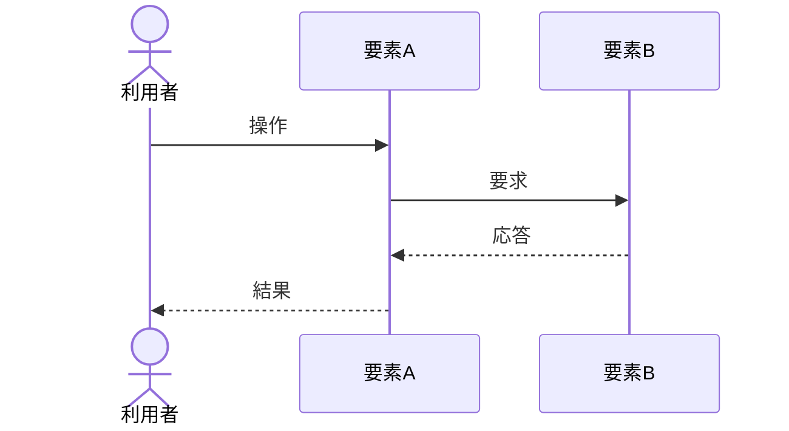

<!-- コピーして 03_機能設計/08_シーケンス設計/SEQ-XXX_シーケンス名.md として使用。03_機能設計/08_シーケンス設計/index.md への行追加を先に行うこと -->
<!-- シーケンスは複数要素の時系列連携を俯瞰する図。各要素(SCR/API/MOD/JOB/TBL/外部サービス)の内部仕様は各文書が正本。本文書は連携順序のみを定義し内部仕様を再記載しない -->
<!-- 図は mermaid の sequenceDiagram で記述する。エラー・メッセージは ERR-XXX / MSG-XXX を ID 参照する(文言・HTTPステータスは再記載しない) -->
<!-- 各見出し(##/###)直上のコメントに「定義内容(そのセクションの意味)」「定義する条件」「項目説明(各列・各項目の意味)」「定義ルール」をセットで記載する。編集時はコメントを読んでから該当セクションを埋める -->

<!--
【1. 基本情報】
定義内容: このシーケンスの識別情報と属性(ID・名称・概要・契機・関連要素)を一覧で示す。
定義する条件: 全シーケンスで必須。
項目説明:
- シーケンスID: このシーケンスの識別子(SEQ-XXX 連番)。
- シーケンス名: シーケンスの日本語名称。
- 概要: このシーケンスが表す連携の目的(1〜3行)。
- 契機: シーケンスの開始契機(利用者操作 / 定期(Cron) / Webhook 受信 など)。
- 関連要素: 登場する主要な要素のID(SCR/API/MOD/JOB/TBL/外部)。
定義ルール:
- シーケンスIDは SEQ-XXX の連番。採番は一覧の最大値+1、欠番の再利用は禁止。
- 関連要素は §2 登場要素と一致させる。
-->
# 1. 基本情報

| 項目 | 内容 |
|---|---|
| シーケンスID | SEQ-XXX |
| シーケンス名 |  |
| 概要 | (1〜3行) |
| 契機 |  |
| 関連要素 |  |

<!--
【2. 登場要素】
定義内容: シーケンス図に登場する各要素(参加者)を、種別・IDとともに定義する。
定義する条件: 全シーケンスで必須。登場する要素を漏れなく列挙する。
項目説明:
- 要素: シーケンス図での表示名。
- 種別: 要素の分類(アクター / 画面(SCR) / API / モジュール(MOD) / ジョブ(JOB) / テーブル(TBL) / 外部サービス)。
- ID/参照: 対応する文書ID(SCR-XXX/API-XXX/MOD-XXX/JOB-XXX/TBL-XXX)。外部サービスはサービス名。
- 役割: このシーケンスでの役割(1行)。
定義ルール:
- 内部仕様は各文書が正本。ここでは連携上の役割のみ記載する。
- 外部サービスは採用する決済・メール送信・スケジューラ等のサービス名で記載する。
-->
# 2. 登場要素

| 要素 | 種別 | ID/参照 | 役割 |
|---|---|---|---|
|  |  |  |  |

<!--
【3. シーケンス図】
定義内容: 要素間のメッセージ授受を時系列で表した mermaid sequenceDiagram。
定義する条件: 全シーケンスで必須。
定義ルール:
- mermaid の sequenceDiagram で記述する。participant/actor で §2 の登場要素を宣言する。
- 分岐は alt/else、繰り返しは loop、補足は Note で表す。
- エラー・メッセージは ERR-XXX / MSG-XXX で参照する(文言・HTTPステータスは書かない)。
- 認証・認可・入力検証は API-COM §7 共通前処理として Note で示す(各段の再記載はしない)。
-->
# 3. シーケンス図

<!--
【4. ステップ説明】
定義内容: シーケンス図の各ステップ(メッセージ)について、処理内容と参照先を補足する。
定義する条件: 全シーケンスで必須。図の主要メッセージを番号順に説明する。
項目説明:
- No: ステップ番号(図の時系列順)。
- 送信元 → 送信先: メッセージの方向(§2 の要素)。
- 内容: そのステップで行う処理(1〜2行)。詳細は各要素の文書を参照する。
定義ルール:
- 内容は連携上の意味に限る。内部ロジックの詳細は各文書(MOD/API/JOB)を参照する。
-->
# 4. ステップ説明

| No | 送信元 → 送信先 | 内容 |
|---|---|---|
| 1 |  |  |

<!--
【5. 例外・代替】
定義内容: 正常系(§3)から分岐する例外・代替の流れと、その結果(返すエラー・状態)を定義する。
定義する条件: 例外・代替がある場合に定義する。無ければ「なし」の行を残す。
項目説明:
- 分岐: 分岐の契機・条件。
- 分岐後の流れ: そのときの処理・結果(返す ERR-XXX / 更新する状態 / 表示する MSG-XXX)。
定義ルール:
- エラー・メッセージは ERR-XXX / MSG-XXX で参照する。
-->
# 5. 例外・代替

| 分岐 | 分岐後の流れ |
|---|---|
|  |  |
