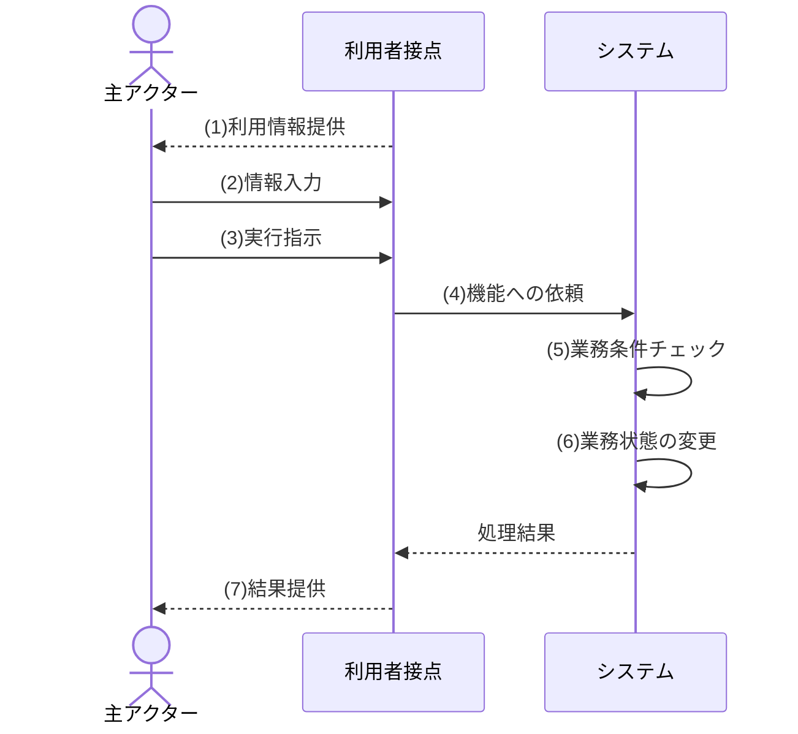
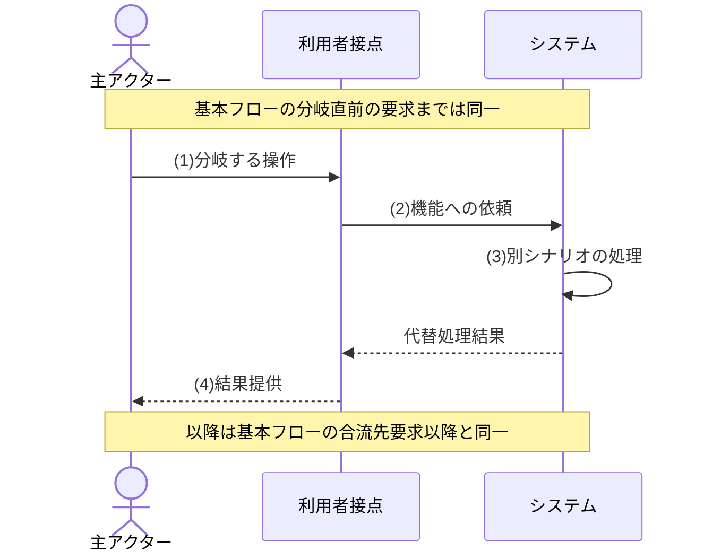
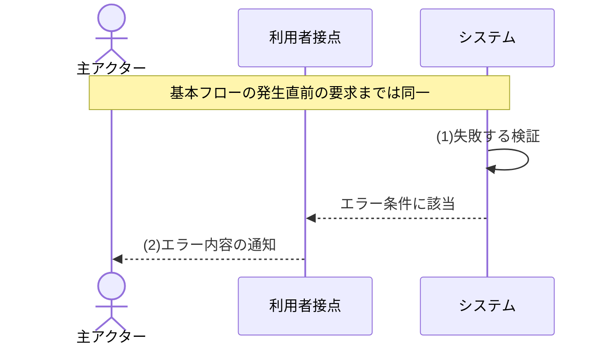
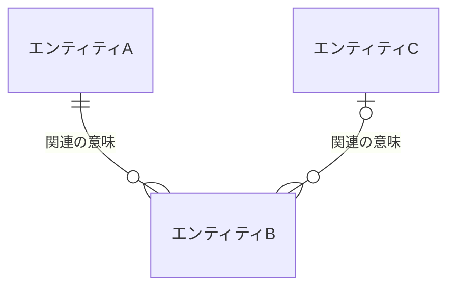

[← テンプレート一覧](README.md)

<!-- 本節は統合設計書「第2節 機能要件」のテンプレート版。各セクション/サブセクション直上のHTMLコメントに「定義内容 / 定義する条件 / 項目説明 / 定義ルール」をセットで記載する。編集時はコメントを読んでから該当セクションを埋める。本文は空欄プレースホルダ(<...>・XXX・例示行)とし、実データは記入サンプル版側で埋める。Cloudflare Workers / D1とデータアクセス境界は[はじめに](00_はじめに.md#0-はじめに)・[要求定義](01_要求定義.md#1-要求定義)の確定制約として扱い、本節で別方式へ再定義しない。 -->
<!-- 見出しは本節「# 2. 機能要件」(H1)開始、サブは「## 2.x」、ユースケースは「### 【UC-XXX】…」(H3)。担当節(第2節)以外の内容は書かない。一覧・項目・条件・分岐・処理は必ずテーブルで書く。物理名(英語のテーブル名・カラム名・メソッド名)は書かない(振る舞いとデータのみ)。 -->

<!--
【2. 機能要件】
定義内容: システムが提供する機能の一覧と、対象範囲内で想定される利用者・外部システム・定期/非同期起動の全振る舞い(ユースケース)、業務情報のデータモデル、共通区分定義を定義する。機能要求と認可は独立節を設けず各ユースケース内で定義する。要求定義(§1)を実現する「何をするか」を、設計詳細(how)を含めずに定義する。
定義する条件: 全システムで必須。
項目説明:
- 2.1 機能一覧: 提供する機能を | 機能ID(F-XXX) | 機能名 | 概要 | 主な利用者 | で列挙する。
- 2.2 ユースケース: 全機能と全起動契機をUC一覧で対応付け、各UCを ### 【UC-XXX】単位で定義する。UC記載様式(対応機能/主アクター/目的/事前条件/起動契機/正常終了/異常終了)＋事前/事後条件・入力/出力データ・状態定義・状態パターン(SP-x)・基本/代替(ALT)/例外(EXC)フローで構成する。機能要求と認可(操作権限・閲覧スコープ・項目許可)もこれらのセクションで定義する。
- 2.3 データモデル: 全UCが扱う業務情報を日本語論理名のエンティティ・主要属性・関連(多重度)で定義する。
- 2.4 共通区分定義: 共通利用する静的な業務区分（区分値）を定義する(利用者ロールを含む)。
- 2.5 未決事項: 資料から確定できない要件判断を、選択肢・影響・決定主体・期限・着手影響とともに管理する。
定義ルール:
- 機能ID(F-XXX)・UC-XXX・RULE-XXX・TBD-XXXは文書全体、SP/ALT/EXCはUC内の最大値+1で採番し、欠番・廃止IDを再利用しない。他節からはUC-XXX/SP-x等の完全修飾で参照する。入力はUC-XXX/IN-XX、出力はUC-XXX/OUT-XX、状態はUC-XXX/STATE-XX、状態遷移はUC-XXX/TR-XXとする。
- 2.1の全F-IDを1件以上のUCへ対応させ、2.2の全UC-IDを1件以上のF-IDへ対応させる。UC一覧と個別UCはID単位で一対一にし、孤立した機能・UCを残さない。
- 利用者の画面操作だけでなく、クライアント共通操作、外部システム起動、Cron/Queue/JOB等の定期・非同期起動も抽出対象とする。主アクター、業務目的、起動契機のいずれかが独立する場合は別UCとする。
- 同じ業務目的の達成途中で呼ぶ選択肢取得等の補助APIは独立UCにせず親UCの基本/代替フローへ含める。
- 状態パターン(SP-x)は正常(基本フロー)を SP-1 とし、代替(ALT)・例外(EXC)を続けて判定優先順に採番する。すべてのSPが基本/ALT/EXCフローのいずれかに対応し、すべてのALT/EXCがいずれかのSPから参照されるよう双方向に網羅する(SP-x は §2.2 を正本とし、§3 画面から完全修飾 UC-XXX/SP-x で参照する)。
- 画面項目・API仕様・DB構造・処理ロジック等の設計詳細、設計層の識別子(SCR/API/M/JOB/SQL/TBL等)、物理名、実装メカニズム(版数・楽観ロック・トークン・セッション・キュー分割等)、英字の区分コードは書かない。振る舞いとデータのみを業務語・日本語名で表し、設計は後続フェーズで定義する。
- 同じ区分値を複数箇所で使う場合は、2.4を正本とし、更新可能マスターと混在させない。
- 認可をロール名だけの記載で終わらせず、UC共通の規則(複数ロール時の合成規則、閲覧スコープの優先順位、ロールなしの拒否)は2.2 ユースケースで、許可ロール・組織階層の範囲・本人判定・基準日・項目許可・範囲外要求の扱いは各UCの事前条件・入力/出力データ・代替/例外フローで一意にする。固定の業務区分は2.4を正本とする。
- 複数UCで完全に同一の権限要件・業務ルール・状態遷移は2.2冒頭へ共通表として一度だけ定義し、関連UCを列挙してよい。個別差分は各UCへ記載し、同一内容を共通表と個別UCへ重複記載しない。
- 満たすべき機能要求(必須・一意性・形式・初期状態・記録要件等)は独立の要件一覧を設けず、該当UCの事前条件・事後条件・入力/出力データ・状態パターン・フローへ、達成可否を判定できる粒度で定義する。
- 各UCの基本フロー・代替フロー・例外フローは、内容表を正本とし、利用者・利用者接点・システムだけの要件レベルシーケンス図を補助図として持たせる。具体的な画面名、画面遷移、データベース、API、モジュールその他の設計要素は登場させない。
-->
# 2. 機能要件

本章は、本システムの機能一覧・全ユースケース・業務データモデル・共通区分定義・未決事項を定義する。機能要件は利用者とシステムの業務上の振る舞いを正本とし、画面名・画面遷移・API・モジュール・データベース・実装方式は後続設計で定義する。

**目次**

- [2.1 機能一覧](#21-機能一覧)
- [2.2 ユースケース](#22-ユースケース)
- [2.3 データモデル](#23-データモデル)
- [2.4 共通区分定義](#24-共通区分定義)
- [2.5 未決事項](#25-未決事項)

<!--
【2.1 機能一覧】
定義内容: 本システムが提供する機能を、機能ID・機能名・概要・主な利用者の一覧で示す。
定義する条件: 全システムで必須。
項目説明:
- 機能ID: 機能の識別子(F-XXX 連番)。他節(画面/API/ユースケース)からはこのIDで参照する。
- 機能名: 機能の日本語名称。
- 概要: 機能が提供する内容(1行)。
- 主な利用者: その機能を主に利用する、§1.3で定義した利用者ロール名。
定義ルール:
- 機能IDは F-XXX の連番。採番は最大値+1、欠番の再利用は禁止。
- 概要は1行で簡潔に書く。画面項目・API・DB項目・処理ロジックは書かない。
- 主な利用者は要件レベルの粗い利用者区分のみ記載する(画面のロール制御・APIの認可仕様は書かない)。
-->
## 2.1 機能一覧

| 機能ID | 機能名 | 概要 | 主な利用者 |
|---|---|---|---|
| F-XXX | <機能名> | <機能の内容を1行で> | <主な利用者> |

<!--
【2.2 ユースケース】
定義内容: §1の対象範囲と2.1の全機能を実現する、利用者・外部システム・時刻起動とシステムの具体的な振る舞い(シナリオ)を、漏れなくユースケース単位で定義する。
定義する条件: 全システムで必須。
項目説明(各UCの構成):
- UC一覧: UC-ID / ユースケース / 主アクター・起動元 / 起動契機 / 対応機能を1行1UCで示す。
- 見出し: 「### 【UC-XXX】<ユースケース名>（<対象>向け）」。UC IDは全体で一意な連番(UC-001, UC-002 …)。SCR / API はこのIDを「トレース元」として参照する。<対象>は主アクター。
- 概要ヘッダ表: 対応機能 / 主アクター / 目的 / 事前条件(要約) / 起動契機 / 正常終了 / 異常終了 の7行で、ユースケースを俯瞰する。
- 事前条件: 開始前に成立している状態(操作者に必要なロール・閲覧スコープ・基準日の条件を含む)。事後条件: 正常完了後に成立している状態。(それぞれ別テーブル)
- 入力データ: この振る舞いが扱う入力(情報/要否/内容)。出力データ: 結果として提供する出力(情報/内容)。(それぞれ別テーブル) ロール・スコープ別に許可項目が異なる場合はここで一意に定義する。
- 状態定義: 状態パターンで用いる各状態軸について、「項目・意味・内容」で定義する。内容欄では、取り得る値と成立条件を値ごとの箇条書きで示す。
- 状態パターン(SP-x): 状態定義で定義した状態軸の組み合わせ(パターン)を、判定優先順のマトリクスで定義する。列=パターンID＋状態軸＋結果(事後状態)＋対応フロー。各パターンは対応する1つのフロー(基本フロー/ALT-x/EXC-x)を持つ。
- 共通有効性判定基準: 複数UCで用いる「有効」「無効」を、対象・基準時点・有効条件・無効条件の4列で定義する。
- 基本フロー: 正常系の振る舞いをシーケンス図＋内容表で示す。代替フロー(ALT-x): 正常系から外れるが目的を達成する別シナリオ。例外フロー(EXC-x): エラーで中断するシナリオ(発生Step・条件・フロー)。ALT/EXCは基本フローとの差分だけを示す。
- シーケンス図と内容表: 各フローは「補助シーケンス図 → 要求内容表（Step・要求・内容）」の順で示す。登場者は主アクター(U)・論理的な利用者接点(SCR)・システム(FUNC)とし、具体的な画面名や設計要素は書かない。処理結果はシステムから利用者接点への点線戻りを経て利用者へ提供し、内容表を要求の正本とする。
定義ルール:
- UC一覧には対象範囲内の全UCを列挙し、一覧の全UC-IDに個別定義を1件ずつ作成する。個別定義だけのUC、一覧だけのUCを禁止する。
- 全F-IDをUC一覧の対応機能へ1回以上記載する。1つの機能に独立したアクター・目的・起動契機が複数ある場合は1対多でUCを分ける。
- 利用者操作、クライアント共通操作、外部イベント、Cron/Queue/JOBを同じ抽出基準で確認する。同じ目的内の正常・代替・例外は別UCへ分割せず、SP/ALT/EXCで網羅する。
- 各UCは「### 【UC-XXX】…」で並べ、UC間は水平線(---)で区切る。UCが1つでも本形式に従う。
- 各UC内の 概要ヘッダ表は見出し直下にラベルなしのテーブルで置き、事前条件・事後条件・入力データ・出力データ・状態定義・状態パターン・各フローは、それぞれ太字ラベル＋テーブルで個別に記載する。
- 状態定義は 出力データの直後・状態パターンの前に「**状態定義**」ラベルと「| 項目 | 意味 | 内容 |」の3列表で配置する。状態パターンの各状態軸を同じ名称で1行ずつ定義し、内容欄はHTMLの箇条書き（`<ul><li>値：成立条件</li>...</ul>`）で、表に使用するすべての値の意味・成立条件・境界を記載する。「／」で複数の値を連結しない。パターンID・結果(事後状態)・対応フローは状態軸ではないため状態定義へ含めない。
- 状態軸の項目名は判定対象が分かる具体名とし、「妥当性」「有効性」「一意性」「整合性」等の「～性」は使用せず、該当する軸を「～状態」で表す。状態以外の軸は「～権限」「～区分」「～の有無」等で対象を明示する。社員番号とメールのように独立して判定できる複数の観点を1項目へまとめず、観点ごとに状態軸を分割する。
- 状態パターンは 状態定義の直後・基本フローの前に「**状態パターン**」ラベル＋テーブルで配置する。列は「パターンID」＋「主要な状態軸」＋「結果(事後状態)」＋「対応フロー」とし、行を状態の組み合わせ(パターン)として判定優先順に並べる。判定に無関係な軸は「－」とし、「先に成立した条件により当該パターンの判定には使用しない」を意味する。
- 状態パターンは判定順に完全な決定表とする。状態定義に列挙した全値を対応列へ1回以上出現させ、先行軸が正常値の場合に後続軸の各値がどの結果・フローへ到達するかを漏れなく定義する。登録・更新、利用停止・再有効化、存在しない・退職済み等、独立して成立する状態や操作を1セルへまとめない。同じフローへ合流する場合も別パターンとして残す。理論上成立しない組み合わせは行を作らず、状態定義の意味・内容欄で成立しない理由（例：登録時は既存対象を指定しない）を明記する。先行条件により判定不要となる列だけを「－」とする。
- 状態パターンとフローは双方向に網羅する。すべてのパターンは対応フロー(基本フロー/ALT-x/EXC-x)を1つ持ち、すべてのALT-x/EXC-xはいずれかのパターンから参照される(パターンの追加が代替・例外フローの網羅漏れを検出する装置になる)。
- 状態値・区分は要件レベルの日本語名で書く(設計層IDは参照しない)。ローカルID(SP-x/ALT-x/EXC-x)は連番を維持し欠番の再利用は禁止。他節からは UC-XXX/SP-1・UC-XXX/ALT-1・UC-XXX/EXC-1 と完全修飾して参照する。
- 「有効」「無効」「妥当」とだけ書かず、対象の存在、利用状態、基準日、有効開始日・終了日、取消状態等の判定軸と境界条件を、共通有効性判定基準または各UCのチェック内容に列挙する。有効期間の両端を含むか、終了日未設定をどう扱うか、有効条件を1つでも満たさない場合の無効条件を明示する。
- ALTの分岐Step・EXCの発生Stepは、基本フロー内容表の連番(#)に対応させる。
- 例外フローは1行1条件で個別に定義し、フロー名、発生Step、発生条件、要求する振る舞い、通知内容、事後状態、再入力・再実行、復帰先または異常終了を記載する。複数条件を1行へ束ねるのは、結果・事後状態・復帰条件がすべて同一で、状態定義では個別値として区別されている場合だけとする。
- 基本フローは「補助図 → 内容表」。代替・例外は各ALT-x/EXC-xごとに「1行サマリ表 → 補助図 → 内容表」を並べる。1枚の図に複数シナリオを束ねない。
- シーケンス図は`mermaid`フェンスで開閉し、`autonumber`は使わない。番号付きメッセージは内容表のStepと一対一にし、判定結果を示す点線戻りは番号を付けず内容表の独立行にしない。
- 登場者は `actor U as <主アクター>`、`participant SCR as 利用者接点`、`participant FUNC as システム` とする。具体的な画面名、遷移先画面、SCR2、DB、API、モジュールは使用しない。利用者接点を持たない定期起動等はSCRを宣言しない。
- 利用者操作は`U->>SCR`、利用者要求の受領は`SCR->>FUNC`、業務判断・検証・業務状態の参照・変更・記録は`FUNC->>FUNC`で表す。システムの結果は`FUNC-->>SCR`の点線戻りを置いた後に`SCR-->>U`で提供する。`SCR->>FUNC`を置いた図は、基本フローへの合流を注記する場合を除き、同じ図内で`FUNC-->>SCR`により閉じる。初期表示、フォーム、ボタン、画面遷移等は記載せず、「利用情報提供」「結果提供」等の要求語を用いる。
- メッセージは業務上の語で書き、内容表（Step・要求・内容）と1対1で対応させる。Stepは図の連番に一致させ、番号なしの戻り線は内容表へ独立行を作らない。チェックの内容欄には検証対象と分岐条件の成立判定を記載する。
- 処理ステップの条件・差分を短く補足する場合は、対象participantの側に`Note right of <participant>: <補足>`で配置する。枠付き注釈に見せずテキストラベルとして示すため、当該図の先頭に`%%{init: {"themeVariables": {"noteBkgColor": "transparent", "noteBorderColor": "transparent"}}}%%`を置く。補足は番号を付けず、内容表の独立行にしない。
- ALT/EXCで基本フローの特定ステップを差し替える場合は、図と内容表で基本フローと同じ番号・シーケンス名を使用し、条件および処理内容の違いをサマリ表と内容欄に記載する。
- ALT/EXC図は基本フローとの差分だけを示す。先頭に「基本フローの<分岐・発生直前の要求>までは同一」を置き、省略範囲を明示する。ALTが合流する場合は末尾に「以降は基本フローの<合流先要求>以降と同一」を置く。差分図内で`SCR->>FUNC`を再掲した場合は、結果提供または合流前に`FUNC-->>SCR`を置く。
- チェック処理は実線の自己メッセージ`FUNC->>FUNC: (N)<チェック>`で示し、内容表の同じStepで判定内容まで定義する。該当0件・無効・重複等の判定結果は、利用者接点がある図では番号なしの`FUNC-->>SCR: <判定結果>`、ない図では`FUNC-->>FUNC: <判定結果>`とする。
- シーケンス図・内容表に具体的な画面名・画面遷移・UI部品、API・モジュール・データベース・物理名・HTTP・SQL・実装方式を書かない。判定結果は番号なしの点線戻り、利用者への提供は`SCR-->>U`で示す。
- 認可はUC共通の規則(複数ロール時の権限合成、閲覧スコープの優先順位と確定規則、ロールなしの拒否)を2.2 ユースケースへ記載し、各UCの事前条件に許可ロールと閲覧スコープ・基準日を、入力/出力データにロール・スコープ別の許可項目を、代替/例外フローに権限不足・範囲外要求の扱いを定義する。「認証済みのため常に許可」と省略しない。
- 機能要求(必須・一意性・形式・初期状態・記録要件等)は該当UCの事前条件・事後条件・入力/出力データ・状態パターン・フローへ、達成可否を判定できる粒度で定義する。
- 画面項目定義・APIパラメータ・DB構造などの設計詳細は書かない(振る舞いとデータのみ)。
- 複数UCは下の「### 【UC-XXX】…」ブロックをUC単位で連番追加し(UC-001, UC-002 …)、UC間を --- で区切る。
-->
## 2.2 ユースケース

本節は、[対象範囲](01_要求定義.md#17-対象範囲)内の全機能と利用者操作・クライアント共通操作・外部イベント・定期/非同期起動から予見される全ユースケースを定義する。UC共通の認可規則の正本は本節、各UC個別の認可条件・機能要求は各UC、固定の業務区分は[共通区分定義](02_機能要件.md#24-共通区分定義)とし、画面項目・API仕様・処理ロジック等の設計詳細は書かない。

<UC共通の認可規則(複数ロール時の権限合成、閲覧スコープの優先順位と確定規則、ロールなしの拒否、操作途中の認証失効・認可喪失の扱い(クライアント共通捕捉UCへの委譲有無)、固定の業務区分の正本参照)を記載する>

各UCの状態定義は「項目・意味・内容」の3列で、状態パターンに用いる判定軸と全状態値の成立条件を値ごとの箇条書きで定義する。状態パターンは成立可能な組合せを一意に網羅する完全な決定表とし、「－」は先に成立した条件により、そのパターンの判定には当該項目を使用しないことを示す。

**共通有効性判定基準**

| 対象 | 基準時点 | 有効の判定 | 無効の判定 |
|---|---|---|---|
| <組織・役職・社員・アカウント・ロール等> | <業務日・適用日等> | <存在・利用状態・有効期間・取消状態等を組み合わせた有効条件。期間境界と終了日未設定の扱いを含む> | <有効条件のどれを満たさない場合に無効となるか> |

| UC-ID | ユースケース | 主アクター／起動元 | 起動契機 | 対応機能 |
|---|---|---|---|---|
| UC-XXX | <ユースケース名> | <利用者／外部システム／時刻> | <起動契機> | F-XXX |

### 【UC-XXX】<ユースケース名>（<対象>向け）
<このユースケースの概要を1行で記載する>

| 項目 | 内容 |
|---|---|
| 対応機能 | F-XXX |
| 主アクター | <主アクター> |
| 目的 | <このユースケースで達成する業務目的> |
| 事前条件 | <開始前に成立している状態の要約> |
| 起動契機 | <利用者/システムがこの振る舞いを開始するきっかけ> |
| 正常終了 | <正常完了時の結果> |
| 異常終了 | <中断・拒否時の扱い> |

**事前条件**

| No | 条件 |
|---|---|
| 1 | <開始前に成立している条件> |
| 2 | <操作者に必要なロール・閲覧スコープ・基準日の条件> |

**事後条件**

| No | 条件 |
|---|---|
| 1 | <正常完了後に成立している条件> |

**入力データ**

| 入力ID | 入力名 | 必須区分 | 内容 |
|---|---|---|---|
| UC-XXX/IN-01 | <入力情報> | 必須／条件付き必須／任意／対象外 | <意味、許可値、形式、範囲、単位、桁数、未指定時、他項目との関係、不正時の振る舞い、RULE-IDを記載> |

**出力データ**

| 出力ID | 出力名 | 内容 |
|---|---|---|
| UC-XXX/OUT-01 | <出力情報> | <意味、提供条件、提供対象、含む／含めない情報、0件時、複数件時の順序、算出条件、関連フロー・RULE-IDを記載> |

**権限要件**

| アクター／ロール | 実行可能な操作 | 実行不可の操作 | 対象範囲 | 状態による制限 | 権限不足時 | 関連フロー |
|---|---|---|---|---|---|---|
| <ロール> | <許可操作> | <禁止操作> | <全体・組織・本人等> | <制限条件> | <要求する振る舞い> | <UC-XXX/BF等> |

**業務ルール**

| ルールID | ルール名 | 適用対象 | 適用条件 | 判定内容 | 成立時 | 不成立時 | 例外条件 | 優先順位 | 関連フロー |
|---|---|---|---|---|---|---|---|---|---|
| RULE-XXX | <1つの判定名> | <対象> | <適用条件> | <客観的な判定> | <結果> | <結果> | <例外なし／例外条件> | <競合するルールとの順序> | <UC-XXX/BF等> |

**状態定義**

| 項目 | 意味 | 内容 |
|---|---|---|
| <先行状態> | <先に判定する対象と成立条件> | <ul><li>成立：後続状態を判定できる</li><li>不成立：後続状態を判定せず例外終了する</li></ul> |
| <後続状態> | <先行状態が成立した場合に判定する対象と条件> | <ul><li>基本値：基本フローへ進む</li><li>代替値：代替フローへ進む</li></ul> |

**状態パターン**

| パターンID | <先行状態> | <後続状態> | 結果(事後状態) | 対応フロー |
|---|---|---|---|---|
| SP-1 | 成立 | 基本値 | <正常完了後の状態> | 基本フロー |
| SP-2 | 成立 | 代替値 | <代替完了後の状態> | ALT-1 |
| SP-3 | 不成立 | － | <未更新等の例外終了状態> | EXC-1 |

**状態遷移**

| 遷移ID | 遷移前状態 | 操作／事象 | 遷移条件 | 遷移後状態 | 禁止遷移 | 失敗時 | 再実行時 | 取消時 |
|---|---|---|---|---|---|---|---|---|
| UC-XXX/TR-01 | <状態> | <操作・事象> | <RULE-IDまたは条件> | <状態> | <禁止される遷移> | <維持する状態> | <再実行結果> | <取消後状態> |

**競合・重複実行要件**

| 観点 | 要求 |
|---|---|
| 同一要求の再実行 | <同一要求を複数回受けた場合の業務結果。想定しない場合は対象外と理由> |
| 同時実行 | <競合時に成立させる要求と保証する業務状態。競合しない場合は対象外と理由> |
| 一部失敗 | <一部だけ完了した状態を許可するか、失敗後に維持する状態> |

**基本フロー**

| Step | 要求 | 内容 |
|---|---|---|
| 1 | 利用情報提供 | <開始に必要な情報を利用者へ提供する> |
| 2 | 情報入力 | <利用者が…を入力する> |
| 3 | 実行指示 | <利用者が…を指示する> |
| 4 | 機能への依頼 | <システムが利用者の要求を受け付ける> |
| 5 | 業務条件チェック | <判定対象、成立条件、不成立時の分岐を定義する> |
| 6 | 業務状態の変更 | <作成・変更・取消される業務情報と変更後状態を定義する> |
| 7 | 結果提供 | <正常終了時に提供する結果を定義する> |

**代替フロー**

| ALT ID | フロー名 | 分岐Step | 発生条件 | 処理内容 | 合流先／正常終了 | 事後状態 |
|---|---|---|---|---|---|---|
| ALT-1 | <条件を表す名称> | <基本フローのStep> | <客観的な条件> | <基本フローとの差分> | <合流Stepまたは別の正常終了> | <完了後の業務状態> |

| Step | 要求 | 内容 |
|---|---|---|
| 1 | 分岐する操作 | <利用者が…する> |
| 2 | 機能への依頼 | <入力内容を機能へ送信する> |
| 3 | 別シナリオの処理 | <…する> |
| 4 | 結果提供 | <別経路の結果を利用者へ提供する> |

**例外フロー**

| EXC ID | フロー名 | 発生Step | 発生条件 | 要求する振る舞い | 通知内容 | 事後状態 | 再入力／再実行 | 復帰先／異常終了 |
|---|---|---|---|---|---|---|---|---|
| EXC-1 | <条件を表す名称> | <基本フローまたはALTのStep> | <1行1条件> | <中断・拒否・状態維持> | <利用者が原因と対応を識別できる内容> | <失敗後の業務状態> | <可否と条件> | <復帰Stepまたは異常終了> |

| Step | 要求 | 内容 |
|---|---|---|
| 1 | 失敗する検証 | <…を検証し、エラー条件に該当することを判定する> |
| 2 | エラー内容の通知 | <原因、修正対象、再実行条件を利用者へ通知する> |

<!-- EXC-2以降も「1行サマリ表 → 図 → 内容表」を同様に並べる(ラベル行・結合サマリ表は置かない)。 -->

<!-- 上の「### 【UC-XXX】…」ブロックを UC 単位で連番追加し(UC-001, UC-002 …)、UC間を --- で区切る。 -->

<!--
【2.3 データモデル】
定義内容: 2.2の全ユースケースが参照・更新する業務情報を、日本語論理名のエンティティ・主要属性・関連(多重度)として定義し、データベース設計(§4)の論理正本にする。
定義する条件: 永続化する業務データを扱うシステムでは必須。
項目説明:
- エンティティ: 業務上意味を持つデータのまとまりの論理名。
- 意味・役割: エンティティが表す業務上の対象・目的。
- 業務識別子: 業務上インスタンスを識別する属性(内部IDは書かない)。
- 主要属性: 業務判断に使う代表的な属性の論理名。
- 主な利用UC: そのエンティティを参照・更新するユースケース(UC-XXX)。
- 関連・多重度: エンティティ間の業務的な関係と「1 対 0..*」等の多重度。
定義ルール:
- エンティティ名・属性名は日本語の論理名だけを使用し、物理テーブル名・物理カラム名・SQLite型・制約・索引は書かない(物理設計は§4 データベース設計を正本とする)。
- 2.2の全UCが扱う業務データを漏れなくエンティティへ対応させ、エンティティと物理テーブルの対応は§4.2 テーブル一覧で定める。
- 区分値の集合は2.4 共通区分定義を正本として参照し、本節で値を再定義しない。
- 技術目的だけのデータ(更新ガード等)は本節に含めず、データベース設計だけで定義する。
- ER図はエンティティと関連(多重度)だけを示し、属性は2.3.1の表を正本とする。
-->
## 2.3 データモデル

<全ユースケースが扱う業務情報の論理構造の説明>

### 2.3.1 エンティティ定義

| エンティティ | 意味・役割 | 業務識別子 | 主要属性 | 主な利用UC |
|---|---|---|---|---|
| <エンティティ名> | <業務上の対象・目的> | <業務識別属性> | <属性1、属性2、…> | UC-XXX |

### 2.3.2 関連定義

| 関連 | 多重度 | 意味・制約 |
|---|---|---|
| <エンティティA> − <エンティティB>（<関連名>） | 1 対 0..* | <業務的な意味・整合条件> |

<!--
【2.4 共通区分定義】
定義内容: 利用者に提供する選択肢、入力規則への適合判定、検索・出力で共通利用する静的な業務区分（区分値）を定義する。利用者ロール等も本表を正本とする。
定義する条件: 更新可能マスターではなく、リリース単位で固定される業務区分を複数箇所で利用する場合に定義する。
項目説明:
- 区分種別: 区分値の集合の業務上の名称。
- 区分値: 利用者・帳票で用いる業務上の値（日本語名）。
- 利用条件: 指定可能な機能、任意性、状態などの条件。
定義ルール:
- 区分値・利用条件を1行1値で列挙し、「など」「定義済み」のまま残さない。
- 各ユースケースは本表を正本として参照し、各章で別の値集合を再定義しない。設計層の物理コード・列挙値は後続の設計フェーズで定義する。
- 更新可能な組織・役職等は本表に含めず、マスター設計で定義する。
-->
## 2.4 共通区分定義

<本節は、<共通利用する固定の業務区分（区分値）>を定義する。<正本・委譲先・非対象（更新可能マスターを含めない旨）>とする。>

| 区分種別 | 区分値 | 利用条件 |
|---|---|---|
| <区分名> | <区分値> | <指定可能な機能・条件> |

- <区分値の供給方法（アプリケーション定義）と、各ユースケースでの利用箇所を記載する>
- <利用者ロール等を採用する場合は本表で区分値を定義し、ロール別の操作・スコープ・項目規則を2.2の各UCで定義する旨を記載する>

<!--
【2.5 未決事項】
目的: 資料内の根拠だけでは確定できず、要件責任者等の決定が必要な事項を、本文へ推測で混入させず管理する。
記載対象: 選択肢により入力・出力・条件・状態・フロー・受入結果が変わる事項。
記載禁止: 設計者の推奨だけで確定した仕様、実装方式だけの選択、根拠のない期限・上限・権限。
必須区分: 条件付き必須。未確定事項が1件以上ある場合に必須。0件の場合も「なし」と明記する。
記載条件: 既存資料の相互参照後も一意に確定できない場合。
省略条件: 未決事項がない場合は表を省略できるが、節内に「なし」と記載する。
記載粒度: 1行1論点。複数選択肢が独立なら行を分割する。
記載形式: 下表。IDはTBD-XXXの文書全体連番。
関連項目: 対象UC・入力・出力・RULE・フローを完全修飾して記載する。
記載例: 検索の一致方式が資料にないため、完全一致・前方一致・部分一致を選択肢として管理する。
禁止例: 一般的だから部分一致にする。
レビュー観点: 未決のまま設計者が決定していないか、影響と決定期限が着手判定に反映されているか。
-->
## 2.5 未決事項

<資料内の根拠だけでは確定できない事項を記載する。未決事項がない場合は「なし」と記載する。>

| 未決事項ID | 対象要件・箇所 | 未決内容 | 確定できない理由 | 想定される選択肢 | 決定が必要な理由 | 影響範囲 | 決定主体 | 決定期限 | 機能設計着手への影響 |
|---|---|---|---|---|---|---|---|---|---|
| TBD-XXX | <UC・入力・出力・RULE・フロー> | <疑問点> | <資料上の不足> | <採用を意味しない選択肢> | <未決では設計できない理由> | <機能・設計・試験> | <要件責任者等> | <必要時期> | <着手可否> |
