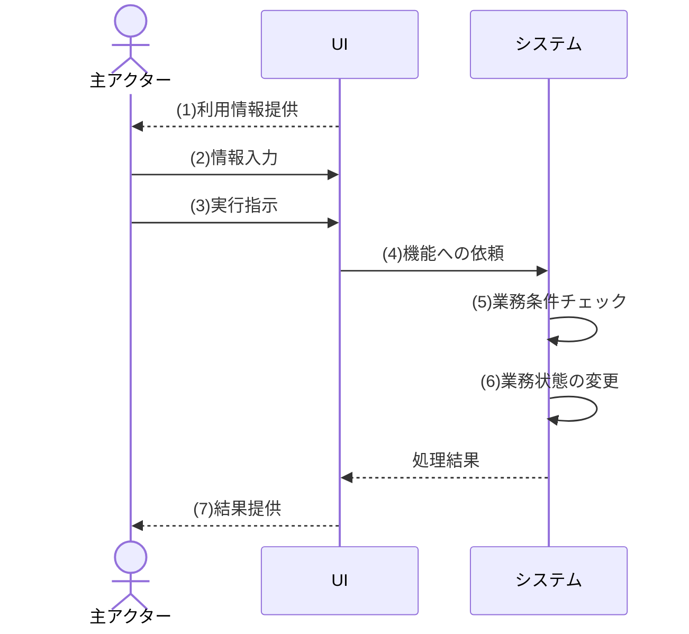
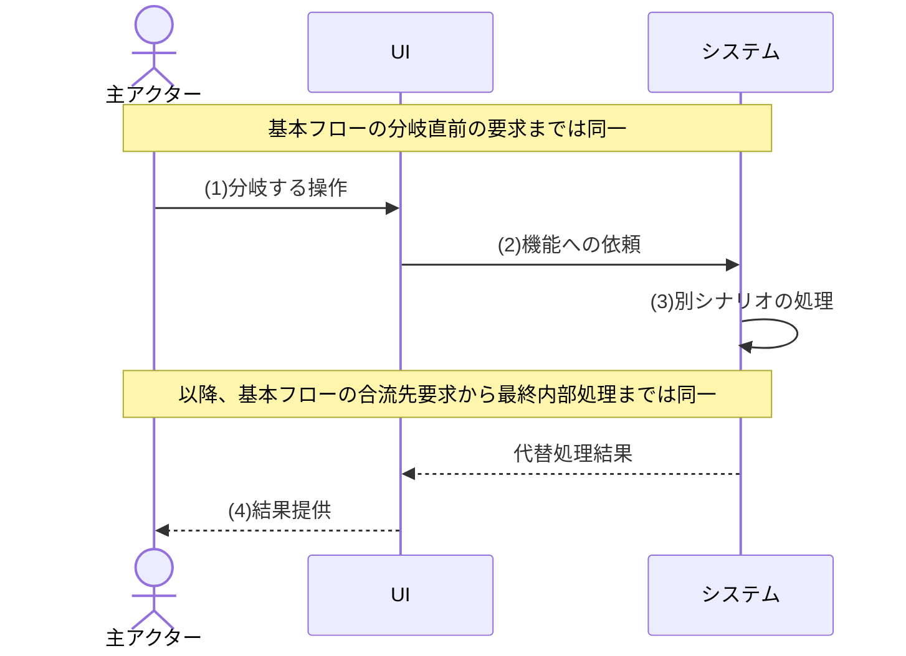
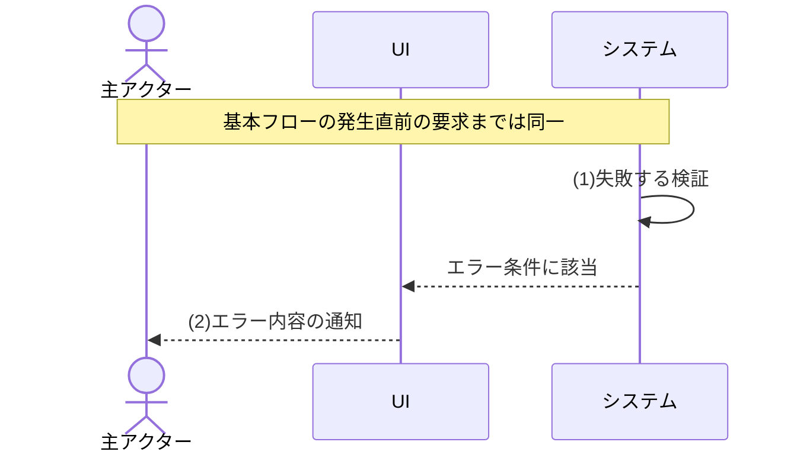
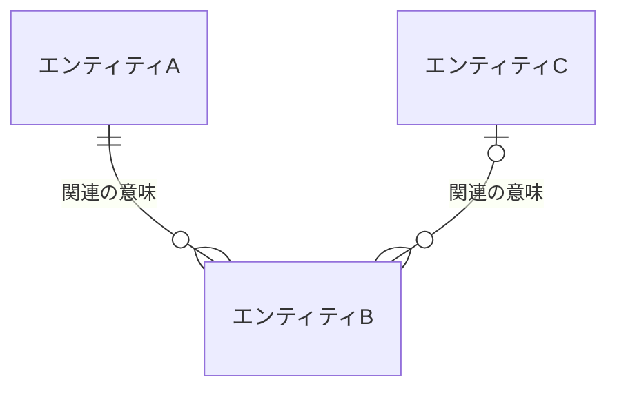

[← テンプレート一覧](README.md)

<!-- 本節は統合設計書「第2節 機能要件」のテンプレート版。各セクション/サブセクション直上のHTMLコメントに「定義内容 / 定義する条件 / 項目説明 / 定義ルール」をセットで記載する。編集時はコメントを読んでから該当セクションを埋める。本文は空欄プレースホルダ(<...>・XXX・例示行)とし、実データは記入サンプル版側で埋める。Cloudflare Workers / D1とデータアクセス境界は[はじめに](00_はじめに.md#0-はじめに)・[要求定義](01_要求定義.md#1-要求定義)の確定制約として扱い、本節で別方式へ再定義しない。 -->
<!-- 見出しは本節「# 2. 機能要件」(H1)開始、サブは「## 2.x」、2.2配下は「### 2.2.N <見出し名>」、2.3配下は「### 2.3.N <見出し名>」(H3)。担当節(第2節)以外の内容は書かない。一覧・項目・条件・分岐・処理は必ずテーブルで書く。物理名(英語のテーブル名・カラム名・メソッド名)は書かない(振る舞いとデータのみ)。 -->

<!--
【機能要件テンプレート統合記載規則】

本コメントと各記入ブロック直前のコメントを、このテンプレート固有の項目別記載規則の正本とし、独立した機能要件記載ルール文書を設けない。リポジトリ共通規約は併用する。共通規則は本コメント、項目固有の列・記載順・判定方法は各ブロックコメントを適用し、両方を満たすこと。規則間に矛盾を検出した場合は記載者が解釈で選択せず、使用前にテンプレート内の矛盾を解消する。

【使用時の必須規則】
- H1・H2・UCのH3、表の列、記載順、ID形式、補助図＋内容表の組を変更しない。共通化で重複を除く場合を除き、定義済みの記入ブロックを削除しない。
- 必須項目は省略不可。条件付き必須項目が非該当の場合もブロックを削除せず、「対象外：<客観的な非該当理由>」と記載する。「必要に応じて」「該当する場合」だけを理由にしない。
- 完成文書に`<...>`、`XXX`、例示行、未定、要確認、根拠のない「など」「適切」「所定」「有効な値」を残さない。資料から確定できない業務判断は本文で決めず、本文からTBD-IDを参照して2.6へ記録する。
- 同じ要求を複数箇所へ複写しない。ロール別の機能実行可否、対象範囲および項目許可は2.2の権限要件、権限不足・範囲外要求に対する振る舞いは2.3の各UCの状態パターン・例外フロー、固定区分は2.5、未決事項は2.6を正本とし、下流設計はIDで参照する。
- 機能要件には利用者・外部主体・時刻とシステムの業務上の振る舞いだけを書く。画面名・画面遷移・UI部品、API、HTTP、モジュール、クラス、テーブル、カラム、SQL、トランザクション・排他の方式、製品・ライブラリ等の実現方法を書かない。
- 1行に複数の独立した入力、状態軸、判定、遷移、代替条件、例外条件、未決論点を混在させない。同じ結果へ進む場合も、独立して判定可能な状態値・条件は別行で定義する。
- 各判定は、対象、基準時点、成立条件、不成立条件、境界、結果、関連フローを客観的に検証できる粒度で記載する。
- 修正時は本文、状態定義、状態パターン、フロー、シーケンス図、内容表、TBD、下流参照、レビュー項目の正引き・逆引きを同時に確認する。

【必須区分】
| 必須区分 | 適用規則 |
|---|---|
| 必須 | 全機能要件で記載する。非該当を理由に省略しない |
| 条件付き必須 | 下表の記載条件が成立するとき必須。非該当時も「対象外：理由」を残す |
| 任意 | 要件の一意性または理解を補助するときだけ記載できる。新しい要求を推測で追加しない |
| 対象外 | 記載条件が成立しないことを客観的な理由とともに明示した状態。空欄を対象外とみなさない |

【項目別定義】
| No | 項目名 | 目的 | 記載対象 | 記載禁止 | 必須区分 | 記載条件 | 省略・対象外条件 | 記載粒度 | 記載形式 | 識別子 | 関連項目 | 記載例 | 禁止例 | レビュー観点 |
|---:|---|---|---|---|---|---|---|---|---|---|---|---|---|---|
| 1 | 機能一覧 | 提供範囲を識別する | 機能名、価値、主利用者 | 画面・API・モジュール名 | 必須 | 全機能 | 省略不可 | 1行1機能 | 表 | F-XXX | UC一覧、上位要求 | 社員を登録する | 登録APIを呼ぶ | 全FがUCへ対応するか |
| 2 | UC一覧 | UC・主アクター・機能の対応を示す | UC名、主アクター、F-ID | 起動契機、補助処理だけのUC | 必須 | 全UC | 省略不可 | 1行1UC | 4列表 | UC-XXX | 個別UC、F-ID | UC-001：社員を登録する：人事担当者：F-004 | マスター取得UC | 一覧と個別が一対一か |
| 3 | UC概要 | 目的と完了境界を示す | 主体、目的、開始、正常・異常終了 | 画面遷移、HTTP結果 | 必須 | 全UC | 省略不可 | 各項目1文 | 2列表 | UC-XXX | 事前・事後条件 | 登録結果を提供する | 詳細画面へ遷移する | 正常・異常境界が一意か |
| 4 | 事前条件 | 開始可能状態を定める | 開始前から成立する認証・権限・業務状態 | フロー中に判定する対象存在・入力規則適合状態 | 必須 | 全UC | 条件なしでも「なし」と理由 | 1行1条件 | 表 | UC-XXX/PRE-XX | 例外フロー | 有効な登録権限を持つ | 入力した組織が有効 | 開始条件と処理条件が混在しないか |
| 5 | 事後条件 | 完了後状態を定める | 正常完了で成立する業務状態・記録 | 保存方式、テーブル | 必須 | 全UC | 省略不可 | 1行1状態 | 表 | UC-XXX/POST-XX | 状態パターン、出力 | 社員が在籍中となる | employee表へINSERT | 受入判定できるか |
| 6 | 入力データ | 受け付ける情報と制約を定める | 意味、必須区分、値、形式、範囲、単位、桁数、未指定、項目関係、不正時 | UI部品、API型 | 必須 | 全UC | 入力なしは対象外と理由 | 1行1入力 | 表 | UC-XXX/IN-XX | 状態定義、EXC、TBD | 未指定は現状維持 | テキストボックス | 境界・空・0・日付が明確か |
| 7 | 出力データ | 利用者が得る結果を定める | 条件、対象者、含有・除外情報、0件、順序、算出 | 表示位置、ファイル実装 | 必須 | 全UC | 出力なしは対象外と理由 | 1行1出力 | 表 | UC-XXX/OUT-XX | BF・ALT・EXC、状態定義 | 0件を件数0で通知 | CSVで返す | 結果と対象者が一意か |
| 8 | 状態定義 | 決定表の各状態軸・値を定義する | 項目、意味、全値と成立条件 | 操作の混在、複数観点の混在、「～性」 | 必須 | 全UC | 省略不可 | 1行1状態軸、操作は操作定義へ分離、値は箇条書き | 3列表 | UC-XXX/STATE-XX（行順） | 操作定義、状態パターン | メール重複状態 | 操作区分を状態軸として定義 | 操作と項目状態を区別し、全値・境界を定義したか |
| 9 | 状態パターン | 全成立組合せ、対応フローおよび遷移後状態を網羅する | 状態軸、対応フロー、遷移後状態 | 意味未定義の値、複数の対応フロー・遷移後状態 | 必須 | 全UC | 省略不可 | 1行1成立パターン | 決定表 | UC-XXX/SP-x | STATE、POST、BF・ALT・EXC | 重複ならEXC-3へ進み未登録 | その他 | 全値・全フロー・遷移後状態が双方向に整合するか |
| 10 | 基本フロー | 代表正常経路を定める | 主体、入力、判定、結果、次条件 | 画面名、API、内部呼出 | 必須 | 全UC | 省略不可 | 1Step1要求 | 補助図＋表 | UC-XXX/BF/Step-n | SP | 重複なしなら登録 | APIをPOST | 主語・条件・結果があるか |
| 11 | 代替フロー | 正常な別経路を定める | 名称、分岐元、条件、差分、合流・正常終了、事後状態 | 失敗経路 | 条件付き必須 | 基本以外の正常経路がある | 存在しない場合は対象外と理由 | 1列1条件・1経路。属性を行へ配置 | 転置サマリ＋補助図＋表 | UC-XXX/ALT-x | SP、BF | 任意項目省略で登録 | エラー表示 | 合流先と終了状態があるか |
| 12 | 例外フロー | 正常完了不能時を定める | 名称、発生元、条件、振る舞い、通知、事後状態、再実行、復帰・終了 | HTTP状態、例外クラス | 条件付き必須 | 正常完了不能条件がある | 存在しない場合は対象外と理由 | 1列1条件・1経路。属性を行へ配置 | 転置サマリ＋補助図＋表 | UC-XXX/EXC-x | SP、BF・ALT | 重複を通知し未登録 | 500を返す | 失敗後状態、UIへの戻り、次操作が明確か |
| 13 | 競合・重複実行 | 同時・再送時の業務結果を定める | 成立要求、同一要求結果、一部失敗状態 | ロック方式、トークン | 条件付き必須 | 更新、再実行、同時実行で結果が変わる | 参照だけで結果不変 | 観点ごとに1行 | 表 | TBD-XXX | EXC、状態パターン | 成立は1件だけ | 楽観ロック | 結果を要求として定義したか |
| 14 | データモデル | 業務情報の論理構造を示す | 日本語論理名、属性、関連、多重度 | テーブル、型、索引 | 条件付き必須 | 永続化する業務情報がある | 永続情報を扱わない | 1行1エンティティ・関連 | ER補助図＋表 | なし | UC入出力 | 社員と所属履歴 | employee_id INTEGER | 全入出力を網羅するか |
| 15 | 共通区分 | 固定値集合を一元化する | 区分名、全値、意味合い | 物理コード、更新可能マスター、指定可能な機能・操作可否 | 条件付き必須 | 複数箇所で固定区分を使う | 固定区分がない | 1区分1H3、1行1値 | H3＋2列表 | なし | 入力、状態定義 | 在籍中：在籍関係が継続している状態 | ACTIVE | 区分ごとに全値の意味が一意か |
| 16 | 未決事項 | 推測を防ぎ着手条件を示す | 疑問、理由、選択肢、影響、主体、期限、着手影響 | 独自決定、実装案だけの比較 | 条件付き必須 | 資料から一意に確定できない | 0件なら「なし」 | 1行1論点 | 表 | TBD-XXX | 全項目 | 一致方式を要件責任者が決定 | 部分一致にする | 未決だけが残っているか |

【ID・命名規則】
| 対象 | 形式 | 採番単位 | 参照例 |
|---|---|---|---|
| 機能 | F-XXX | 文書全体 | F-001 |
| ユースケース | UC-XXX | 文書全体 | UC-001 |
| 基本フローStep | UC-XXX/BF/Step-n | UC内 | UC-001/BF/Step-5 |
| 代替フロー | UC-XXX/ALT-x | UC内 | UC-001/ALT-1 |
| 代替フローStep | UC-XXX/ALT-x/Step-n | 代替フロー内 | UC-001/ALT-1/Step-9 |
| 例外フロー | UC-XXX/EXC-x | UC内 | UC-001/EXC-1 |
| 例外フローStep | UC-XXX/EXC-x/Step-n | 例外フロー内 | UC-001/EXC-1/Step-1 |
| 状態 | UC-XXX/STATE-XX | UC内の状態定義行順 | UC-001/STATE-01 |
| 状態パターン | UC-XXX/SP-x | UC内 | UC-001/SP-1 |
| 入力 | UC-XXX/IN-XX | UC内 | UC-001/IN-01 |
| 出力 | UC-XXX/OUT-XX | UC内 | UC-001/OUT-01 |
| 未決事項 | TBD-XXX | 文書全体 | TBD-001 |

- 新規IDは同じ採番単位の最大値+1とする。欠番は許容し、欠番・廃止IDを別対象へ再利用しない。
- 廃止時は参照元を確認して廃止記録を残し、既存IDを詰めない。ID変更時は本文、状態、フロー、トレーサビリティ、後続設計、試験を同時確認する。
- 図内aliasは要件IDではない。UIは、利用者の操作・入力をシステムへ渡し、システムの結果を利用者へ提供する論理的な境界とする。特定の画面・画面遷移・UI部品・クライアント実装を表さず、設計層IDとして他章から参照しない。

【完成判定ゲート】
- 全F・UC・IN・OUT・STATE・SP・ALT・EXC・TBDが重複なく採番され、正引き・逆引きできる。
- 全Fが1件以上のUCに対応し、UC一覧と個別UCが一対一である。全SPが1つの基本・ALT・EXCへ対応し、全ALT・EXCが1件以上のSPから参照される。
- 状態定義の全値が状態パターンに現れ、成立可能な組合せに未定義・重複一致がない。入力、出力、判定、対応フローおよび遷移後状態を受入条件として客観的に検証できる。
- 基本フローと全ALT・EXCに補助シーケンス図と内容表があり、番号付きメッセージとStep・要求が一致する。UIを持つすべての図では、基本フローへの合流や要求線・共通処理の省略有無にかかわらず、対象機能からUIへの点線戻りとUIから利用者への提供がある。
- Mermaid図を実レンダリングし、構文エラー、切断した戻り、未宣言participant、具体画面・DB・API・モジュールの混入がない。
- 必須項目に空欄がなく、条件付き必須の非該当理由が記載され、TBD以外に曖昧語・未定義値・プレースホルダーが残らない。
- TBDごとに決定主体・期限・着手影響があり、未決事項を除く設計着手可否を判定できる。致命的TBDがある場合は「着手可能」と判定しない。
-->

<!--
【2. 機能要件】
定義内容: システムが提供する機能の一覧、アクター／ロール別の権限、対象範囲内で想定される利用者・外部システム・定期/非同期起動の全振る舞い(ユースケース)、業務情報のデータモデル、共通区分定義を定義する。要求定義(§1)を実現する「何をするか」を、設計詳細(how)を含めずに定義する。
定義する条件: 全システムで必須。
項目説明:
- 2.1 機能一覧: 提供する機能を | 機能ID(F-XXX) | 機能名 | 概要 | 主な利用者 | で列挙する。
- 2.2 権限要件: 2.1の機能要件を操作とし、アクター／ロール別の実行可否をマトリクスで定義する。
- 2.3 ユースケース: 全機能をUC一覧で対応付け、全起動契機を個別UCで定義し、各UCを「### 2.3.N 【UC-XXX】」単位で定義する。UC記載様式(対応機能/主アクター/起動契機/正常終了/異常終了)＋目的・事前/事後条件・入力/出力データ・状態定義・状態パターン(SP-x)・基本/代替(ALT)/例外(EXC)フローで構成する。機能要求と認可(操作権限・閲覧スコープ・項目許可)もこれらのセクションで定義する。
- 2.4 データモデル: 全UCが扱う業務情報を日本語論理名のエンティティ・主要属性・関連(多重度)で定義する。
- 2.5 共通区分定義: 共通利用する静的な業務区分（区分値）を定義する(利用者ロールを含む)。
- 2.6 未決事項: 資料から確定できない要件判断を、選択肢・影響・決定主体・期限・着手影響とともに管理する。
定義ルール:
- 章・節見出し直後の概要は「本章では／本節では、〜を定義する」「〜を示す」の汎用定型文2行以内とし、個別の規則・正本・例外は後続の表または該当項目へ記載する。
- 機能ID(F-XXX)・UC-XXX・TBD-XXXは文書全体、SP/ALT/EXCはUC内の最大値+1で採番し、欠番・廃止IDを再利用しない。他節からはUC-XXX/SP-x等の完全修飾で参照する。入力はUC-XXX/IN-XX、出力はUC-XXX/OUT-XX、UC固有状態はUC-XXX/STATE-XXとする。
- 2.1の全F-IDを1件以上のUCへ対応させ、2.3の全UC-IDを1件以上のF-IDへ対応させる。UC一覧と個別UCはID単位で一対一にし、孤立した機能・UCを残さない。
- 利用者の画面操作だけでなく、クライアント共通操作、外部システム起動、Cron/Queue/JOB等の定期・非同期起動も抽出対象とする。主アクター、業務目的、起動契機のいずれかが独立する場合は別UCとする。
- 同じ業務目的の達成途中で呼ぶ選択肢取得等の補助APIは独立UCにせず親UCの基本/代替フローへ含める。
- 状態パターン(SP-x)は正常(基本フロー)を SP-1 とし、代替(ALT)・例外(EXC)を続けて判定優先順に採番する。すべてのSPが基本/ALT/EXCフローのいずれかに対応し、すべてのALT/EXCがいずれかのSPから参照されるよう双方向に網羅する(SP-x は §2.3 を正本とし、§3 画面から完全修飾 UC-XXX/SP-x で参照する)。
- 画面項目・API仕様・DB構造・処理ロジック等の設計詳細、設計層の識別子(SCR/API/M/JOB/SQL/TBL等)、物理名、実装メカニズム(版数・楽観ロック・トークン・セッション・キュー分割等)、英字の区分コードは書かない。振る舞いとデータのみを業務語・日本語名で表し、設計は後続フェーズで定義する。
- 同じ区分値を複数箇所で使う場合は、2.5を正本とし、更新可能マスターと混在させない。
- 認可をロール名だけの記載で終わらせず、複数ロール時の合成規則、閲覧スコープの優先順位、ロールなしの拒否、許可ロール、組織階層の範囲、本人判定、基準日、項目許可および範囲外要求の扱いを、必要とする各UCの事前条件・入力/出力データ・状態パターン・代替/例外フローで一意にする。固定の業務区分は2.5を正本とする。
- 満たすべき機能要求(必須・一意性・形式・初期状態・記録要件等)は独立の要件一覧を設けず、該当UCの事前条件・事後条件・入力/出力データ・状態パターン・フローへ、達成可否を判定できる粒度で定義する。
- 各UCの基本フロー・代替フロー・例外フローは、内容表を正本とし、利用者・UI・システムだけの要件レベルシーケンス図を補助図として持たせる。具体的な画面名、画面遷移、データベース、API、モジュールその他の設計要素は登場させない。
-->
# 2. 機能要件

本章では、本システムの機能要件を定義する。
機能、ユースケース、データモデル、共通区分および未決事項を示す。

**目次**

- [2.1 機能一覧](#21-機能一覧)
- [2.2 権限要件](#22-権限要件)
  - [2.2.1 アクター定義](#221-アクター定義)
  - [2.2.2 権限マトリクス](#222-権限マトリクス)
- [2.3 ユースケース](#23-ユースケース)
  - [2.3.1 ユースケース一覧](#231-ユースケース一覧)
  - [2.3.X 【UC-XXX】<ユースケース名>（<対象>向け）](#23x-uc-xxxユースケース名対象向け)
- [2.4 データモデル](#24-データモデル)
  - [2.4.1 エンティティ定義](#241-エンティティ定義)
  - [2.4.2 関連定義](#242-関連定義)
- [2.5 共通区分定義](#25-共通区分定義)
  - [2.5.1 <区分名>](#251-区分名)
- [2.6 未決事項](#26-未決事項)

<!--
【2.1 機能一覧】
定義内容: 本システムが提供する機能を、機能ID・機能名・概要・主な利用者の一覧で示す。
定義する条件: 全システムで必須。
項目説明:
- 機能ID: 機能の識別子(F-XXX 連番)。他節(画面/API/ユースケース)からはこのIDで参照する。
- 機能名: 機能の日本語名称。
- 概要: 機能が提供する内容(1行)。
- 主な利用者: その機能を主に利用する、§1.3で定義した利用者ロール名。
定義ルール:
- 機能IDは F-XXX の連番。採番は最大値+1、欠番の再利用は禁止。
- 概要は1行で簡潔に書く。画面項目・API・DB項目・処理ロジックは書かない。
- 主な利用者は要件レベルの粗い利用者区分のみ記載する(画面のロール制御・APIの認可仕様は書かない)。
-->
## 2.1 機能一覧

本節では、本システムが提供する機能を定義する。
各機能の概要と主な利用者を示す。

| 機能ID | 機能名 | 概要 | 主な利用者 |
|---|---|---|---|
| F-XXX | <機能名> | <機能の内容を1行で> | <主な利用者> |

<!--
【2.2 権限要件・2.3 ユースケース】
定義内容: §1の対象範囲と2.1の全機能を実現する、利用者・外部システム・時刻起動とシステムの具体的な振る舞い(シナリオ)を、漏れなくユースケース単位で定義する。
定義する条件: 全システムで必須。
項目説明(各UCの構成):
- アクター定義: 権限マトリクスで使用する全アクターと、それぞれが指す利用段階、テナント内の役割または起動主体の意味合いを示す。
- 権限マトリクス: 2.1の機能要件を操作の行、対象範囲内のアクター／ロールを列とし、実行可否を○・△・－で示す。
- UC一覧: UC-ID / ユースケース / 主アクター / 対応機能を1行1UCで示す。起動契機は個別UCを正本とし、一覧には記載しない。
- 見出し: 「### 2.3.N 【UC-XXX】<ユースケース名>（<対象>向け）」。Nは2.3内のH3出現順、UC IDは全体で一意な連番(UC-001, UC-002 …)。SCR / API はUC-IDを「トレース元」として参照する。<対象>は主アクター。
- 概要ヘッダ表: 対応機能 / 主アクター / 起動契機 / 正常終了 / 異常終了 の5行で、ユースケースを俯瞰する。目的は見出し直後の独立記述、事前条件は概要表直後の独立セクションだけに記載する。
- 事前条件: 開始前に成立している状態(操作者に必要なロール・閲覧スコープ・基準日の条件を含む)。事後条件: 正常完了後に成立している状態。(それぞれ別テーブル)
- 入力データ: この振る舞いが扱う入力(情報/要否/内容)。出力データ: 結果として提供する出力(情報/内容)。(それぞれ別テーブル) ロール・スコープ別に許可項目が異なる場合はここで一意に定義する。
- 状態定義: 状態パターンで用いる各状態軸について、「項目・意味・内容」で定義する。内容欄では、取り得る値と成立条件を値ごとの箇条書きで示す。
- 状態パターン(SP-x): 状態定義で定義した状態軸の組み合わせ(パターン)を、判定優先順のマトリクスで定義する。列=パターンID＋状態軸＋対応フロー＋遷移後状態とする。各パターンは対応する1つのフロー(基本フロー/ALT-x/EXC-x)と、その実行後に成立する状態を持つ。
- 基本フロー: 正常系の振る舞いをシーケンス図＋内容表で示す。代替フロー(ALT-x): 正常系から外れるが目的を達成する別シナリオ。例外フロー(EXC-x): エラーで中断するシナリオ(発生Step・条件・フロー)。ALT/EXCは基本フローとの差分だけを示す。
- シーケンス図と内容表: 各フローは「補助シーケンス図 → 要求内容表（Step・要求・内容）」の順で示す。登場者は主アクター(U)・論理的なUI境界(UI)・システム(FUNC)とし、具体的な画面名や設計要素は書かない。処理結果はシステムからUIへの点線戻りを経て利用者へ提供し、内容表を要求の正本とする。
定義ルール:
- UC一覧には対象範囲内の全UCを列挙し、一覧の全UC-IDに個別定義を1件ずつ作成する。個別定義だけのUC、一覧だけのUCを禁止する。
- 全F-IDをUC一覧の対応機能へ1回以上記載する。1つの機能に独立したアクター・目的・起動契機が複数ある場合は1対多でUCを分ける。
- 利用者操作、クライアント共通操作、外部イベント、Cron/Queue/JOBを同じ抽出基準で確認する。同じ目的内の正常・代替・例外は別UCへ分割せず、SP/ALT/EXCで網羅する。
- 各UCは「### 2.3.N 【UC-XXX】…」で並べ、UC間は水平線(---)で区切る。UCが1つでも本形式に従う。
- 2.3直下のH3は出現順に2.3.1から欠番なく採番し、追加・削除・並べ替え時は2.3直下の全H3を同期して振り直す。節番号は位置を示す番号であり、安定識別にはUC-ID等を使用する。
- ユースケース一覧は番号付きH3とし、見出しの直下にMarkdown水平区切り線`---`を置く。各UCは番号付きH3とし、各UC内に個別の権限要件ブロックを設けない。
- 2.2直下には「### 2.2.1 アクター定義」と「### 2.2.2 権限マトリクス」をこの順で配置し、各見出しの直下にMarkdown水平区切り線`---`を置く。2.2.1は、マトリクスの列に使用する全アクターを「アクター・意味合い」の2列表で定義する。意味合いは権限の重複記載ではなく、対象者の利用段階、テナントとの関係、業務上の役割または起動主体を定義する。2.2.2は、2.1の全F-IDを「F-XXX 機能名」形式で1行ずつ並べ、対象範囲内の全アクター／ロールを列とするマトリクスで定義する。○は実行可、△はセル内に明記した対象範囲・項目・操作に限り実行可、－は当該アクター／ロール単独では実行不可を表す。F-ID・機能名は2.1を正本とし、独自の操作名を追加しない。
- 各UCは見出し直後に目的を1行で記載し、その直後に概要ヘッダ表をラベルなしで置く。事前条件・事後条件・入力データ・出力データ・状態定義・状態パターン・各フローは、それぞれ太字ラベル＋テーブルで個別に記載する。
- 状態定義は 出力データの直後・状態パターンの前に「**状態定義**」ラベルと「| 項目 | 意味 | 内容 |」の3列表で配置する。状態パターンの各状態軸を同じ名称で1行ずつ定義し、内容欄はHTMLの箇条書き（`<ul><li>値：成立条件</li>...</ul>`）で、表に使用するすべての値の意味・成立条件・境界を記載する。「／」で複数の値を連結しない。パターンID・対応フロー・遷移後状態は状態軸ではないため状態定義へ含めない。
- 状態軸の項目名は判定対象が分かる具体名とし、「妥当性」「有効性」「一意性」「整合性」等の「～性」は使用せず、該当する軸を「～状態」で表す。状態以外の軸は「～権限」「～区分」「～の有無」等で対象を明示する。独立して判定できる複数の観点を1項目へまとめず、観点ごとに状態軸を分割する。
- 状態パターンは 状態定義の直後・基本フローの前に「**\<状態パターン\>**」ラベル＋テーブルで配置する。列は「パターンID」＋「主要な状態軸」＋「対応フロー」＋「遷移後状態」とし、行は状態の組み合わせ(パターン)として判定優先順に並べる。判定に無関係な軸は「－」とし、「先に成立した条件により当該パターンの判定には使用しない」を意味する。
- 状態パターンは判定順に完全な決定表とする。状態定義に列挙した全値を対応列へ1回以上出現させ、先行軸が正常値の場合に後続軸の各値がどの対応フローと遷移後状態へ到達するかを漏れなく定義する。登録・更新、利用停止・再有効化、存在しない・退職済み等、独立して成立する状態や操作を1セルへまとめない。同じフローへ合流する場合も別パターンとして残す。理論上成立しない組み合わせは行を作らず、状態定義の意味・内容欄で成立しない理由（例：登録時は既存対象を指定しない）を明記する。先行条件により判定不要となる列だけを「－」とする。
- 状態パターンとフローは双方向に網羅する。すべてのパターンは対応フロー(基本フロー/ALT-x/EXC-x)を1つ持ち、すべてのALT-x/EXC-xはいずれかのパターンから参照される(パターンの追加が代替・例外フローの網羅漏れを検出する装置になる)。
- 状態値・区分は要件レベルの日本語名で書く(設計層IDは参照しない)。ローカルID(SP-x/ALT-x/EXC-x)は連番を維持し欠番の再利用は禁止。他節からは UC-XXX/SP-1・UC-XXX/ALT-1・UC-XXX/EXC-1 と完全修飾して参照する。
- 「有効」「無効」「妥当」とだけ書かず、対象の存在、利用状態、基準日、有効開始日・終了日、取消状態等の判定軸と境界条件を、各UCの状態定義へ列挙する。有効期間の両端を含むか、終了日未設定をどう扱うか、有効状態になるための全条件を明示する。
- ALTの分岐Step・EXCの発生Stepは、基本フロー内容表の連番(#)に対応させる。
- 例外フローは1列1条件で個別に定義し、EXC IDを列見出し、フロー名、発生Step、発生条件、要求する振る舞い、通知内容、事後状態、再入力・再実行、復帰先または異常終了を行へ配置する。複数条件を1列へ束ねるのは、結果・事後状態・復帰条件がすべて同一で、状態定義では個別値として区別されている場合だけとする。
- 基本フローは「補助図 → 内容表」。代替・例外は各ALT-x/EXC-xごとに「転置サマリ表 → 補助図 → 内容表」を並べる。1枚の図に複数シナリオを束ねない。
- シーケンス図は`mermaid`フェンスで開閉し、`autonumber`は使わない。番号付きメッセージは内容表のStepと一対一にし、判定結果を示す点線戻りは番号を付けず内容表の独立行にしない。
- 登場者は `actor U as <主アクター>`、`participant UI as UI`、`participant FUNC as システム` とする。UIは利用者とシステム間の論理的な入出力境界であり、特定の画面・画面遷移・UI部品・クライアント実装を表さない。具体的な画面名、遷移先画面、複数のUI participant、DB、API、モジュールは使用しない。UIを持たない定期起動等はUIを宣言しない。
- 利用者操作は`U->>UI`、利用者要求の受領は`UI->>FUNC`、業務判断・検証・業務状態の参照・変更・記録は`FUNC->>FUNC`で表す。システムの結果はFUNCからUIへの点線戻りを置いた後に、UIからUへの点線メッセージで提供する。UIを持つすべての図は、基本フローへの合流や要求線・共通処理の省略有無にかかわらず、最終結果のFUNCからUIへの点線戻りとUIからUへの提供で閉じる。初期表示、フォーム、ボタン、画面遷移等は記載せず、「利用情報提供」「結果提供」等の要求語を用いる。
- メッセージは業務上の語で書き、内容表（Step・要求・内容）と1対1で対応させる。Stepは図の連番に一致させ、番号なしの戻り線は内容表へ独立行を作らない。チェックの内容欄には検証対象と分岐条件の成立判定を記載する。
- 処理ステップの条件・差分を短く補足する場合は、対象participantの側に`Note right of <participant>: <補足>`で配置する。枠付き注釈に見せずテキストラベルとして示すため、当該図の先頭に`%%{init: {"themeVariables": {"noteBkgColor": "transparent", "noteBorderColor": "transparent"}}}%%`を置く。補足は番号を付けず、内容表の独立行にしない。
- ALT/EXCで基本フローの特定ステップを差し替える場合は、図と内容表で基本フローと同じ番号・シーケンス名を使用し、条件および処理内容の違いをサマリ表と内容欄に記載する。
- ALT/EXC図は基本フローとの差分だけを示す。先頭に「基本フローの<分岐・発生直前の要求>までは同一」を置き、省略範囲を明示する。基本フローへ合流して中間処理を省略する場合は、最終の点線戻りより前に「以降、基本フローの<合流先要求>から<最終内部処理>までは同一」を置く。要求線・中間処理を省略した場合も、UIを持つ図ではFUNCからUIへの最終結果の点線戻りとUIからUへの提供を省略しない。
- チェック処理は実線の自己メッセージ`FUNC->>FUNC: (N)<チェック>`で示し、内容表の同じStepで判定内容まで定義する。該当0件・無効・重複等の判定結果は、UIがある図では番号なしのFUNCからUIへの点線戻り、ない図ではFUNCの点線自己メッセージとする。
- シーケンス図・内容表に具体的な画面名・画面遷移・UI部品、API・モジュール・データベース・物理名・HTTP・SQL・実装方式を書かない。判定結果は番号なしの点線戻り、利用者への提供はUIからUへの点線メッセージで示す。
- 認可は、各UCの事前条件に許可ロール、ロールの有効条件、複数ロール時の権限合成、閲覧スコープ・基準日を、入力/出力データにロール・スコープ別の許可項目を、状態パターン・代替/例外フローに権限不足・範囲外要求の扱いを定義する。「認証済みのため常に許可」と省略しない。
- UCで操作が状態パターンの判定条件になる場合は、操作を`**\<操作定義\>**`の操作・説明表に分離する。UCの状態定義に「操作」「操作区分」「要求操作」を状態項目として含めず、決定表では「操作」列と操作時点の各項目状態列を明確に分ける。
- 機能要求(必須・一意性・形式・初期状態・記録要件等)は該当UCの事前条件・事後条件・入力/出力データ・状態パターン・フローへ、達成可否を判定できる粒度で定義する。
- 画面項目定義・APIパラメータ・DB構造などの設計詳細は書かない(振る舞いとデータのみ)。
- 複数UCは下の「### 2.3.N 【UC-XXX】…」ブロックをUC単位で追加し、2.3の節番号とUC-IDをそれぞれ連番にする。UC間は --- で区切る。
-->
## 2.2 権限要件

本節では、アクターおよびロールごとの機能実行権限を定義する。
アクターの意味合いと、機能要件を操作とする権限マトリクスを示す。

### 2.2.1 アクター定義

---

本項では、権限マトリクスで使用するアクターの意味合いを定義する。

| アクター | 意味合い |
|---|---|
| <アクター名> | <利用段階、テナントとの関係、業務上の役割または起動主体としての意味合い> |

### 2.2.2 権限マトリクス

---

本項では、アクターおよびロールごとの機能実行可否を定義する。

| 操作（機能要件） | <アクター／ロール1> | <アクター／ロール2> |
|---|:---:|:---:|
| F-XXX <機能名> | ○／△（<対象範囲・項目・操作>）／－ | ○／△（<対象範囲・項目・操作>）／－ |

- `○`：当該アクター／ロールで実行できる。`△`：セル内の対象範囲・項目・操作に限り実行できる。`－`：当該アクター／ロール単独では実行できない。
- アカウントが複数ロールを持つ場合の合成規則、状態条件、対象範囲および項目許可は本節へ定義する。権限不足・範囲外要求に対する振る舞いは各UCの状態パターン・例外フローへ定義する。

## 2.3 ユースケース

本節では、本システムのユースケースを定義する。
各ユースケースの条件、入出力、状態および正常・代替・例外フローを示す。

### 2.3.1 ユースケース一覧

---

| UC-ID | ユースケース | 主アクター | 対応機能 |
|---|---|---|---|
| UC-XXX | <ユースケース名> | <主アクター> | F-XXX |

---

### 2.3.X 【UC-XXX】<ユースケース名>（<対象>向け）
<このユースケースの概要を1行で記載する>

| 項目 | 内容 |
|---|---|
| 対応機能 | F-XXX |
| 主アクター | <主アクター> |
| 起動契機 | <利用者/システムがこの振る舞いを開始するきっかけ> |
| 正常終了 | <正常完了時の結果> |
| 異常終了 | <中断・拒否時の扱い> |

**事前条件**

| No | 条件 |
|---|---|
| 1 | <開始前に成立している条件> |
| 2 | <操作者に必要なロール・閲覧スコープ・基準日の条件> |

**事後条件**

| No | 条件 |
|---|---|
| 1 | <正常完了後に成立している条件> |

**入力データ**

| 入力ID | 入力名 | 必須区分 | 内容 |
|---|---|---|---|
| UC-XXX/IN-01 | <入力情報> | 必須／条件付き必須／任意／対象外 | <意味、許可値、形式、範囲、単位、桁数、未指定時、他項目との関係、不正時の振る舞い、適用する状態条件を記載> |

**出力データ**

| 出力ID | 出力名 | 内容 |
|---|---|---|
| UC-XXX/OUT-01 | <出力情報> | <意味、提供条件、提供対象、含む／含めない情報、0件時、複数件時の順序、算出条件、関連フロー・状態条件を記載> |

<!-- 複数の操作で状態パターンが分かれるUCでは記載し、該当しない場合はこのブロックと状態パターンの操作列を省略する。 -->

**\<操作定義\>**

| 操作 | 説明 |
|---|---|
| <操作1> | <操作の意味> |
| <操作2> | <操作の意味> |

**状態定義**

| 項目 | 意味 | 内容 |
|---|---|---|
| <先行状態> | <先に判定する対象と成立条件> | <ul><li>成立：後続状態を判定できる</li><li>不成立：後続状態を判定せず例外終了する</li></ul> |
| <後続状態> | <先行状態が成立した場合に判定する対象と条件> | <ul><li>基本値：基本フローへ進む</li><li>代替値：代替フローへ進む</li></ul> |

**\<状態パターン\>**

| パターンID | 操作 | <先行状態> | <後続状態> | 対応フロー | 遷移後状態 |
| --- | --- | --- | --- | --- | --- |
| SP-1 | <操作1> | 成立 | 基本値 | 基本フロー | <正常完了後の状態> |
| SP-2 | <操作2> | 成立 | 代替値 | ALT-1 | <代替完了後の状態> |
| SP-3 | － | 不成立 | － | EXC-1 | <未更新等の例外終了状態> |

**競合・重複実行要件**

| 観点 | 要求 |
|---|---|
| 同一要求の再実行 | <同一要求を複数回受けた場合の業務結果。想定しない場合は対象外と理由> |
| 同時実行 | <競合時に成立させる要求と保証する業務状態。競合しない場合は対象外と理由> |
| 一部失敗 | <一部だけ完了した状態を許可するか、失敗後に維持する状態> |

**基本フロー**

| Step | 要求 | 内容 |
|---|---|---|
| 1 | 利用情報提供 | <開始に必要な情報を利用者へ提供する> |
| 2 | 情報入力 | <利用者が…を入力する> |
| 3 | 実行指示 | <利用者が…を指示する> |
| 4 | 機能への依頼 | <システムが利用者の要求を受け付ける> |
| 5 | 業務条件チェック | <判定対象、成立条件、不成立時の分岐を定義する> |
| 6 | 業務状態の変更 | <作成・変更・取消される業務情報と変更後状態を定義する> |
| 7 | 結果提供 | <正常終了時に提供する結果を定義する> |

**代替フロー**

| ALT ID | ALT-1 |
|---|---|
| フロー名 | <条件を表す名称> |
| 分岐Step | <基本フローのStep> |
| 発生条件 | <客観的な条件> |
| 処理内容 | <基本フローとの差分> |
| 合流先／正常終了 | <合流Stepまたは別の正常終了> |
| 事後状態 | <完了後の業務状態> |

| Step | 要求 | 内容 |
|---|---|---|
| 1 | 分岐する操作 | <利用者が…する> |
| 2 | 機能への依頼 | <入力内容を機能へ送信する> |
| 3 | 別シナリオの処理 | <…する> |
| 4 | 結果提供 | <別経路の結果を利用者へ提供する> |

**例外フロー**

| EXC ID | EXC-1 |
|---|---|
| フロー名 | <条件を表す名称> |
| 発生Step | <基本フローまたはALTのStep> |
| 発生条件 | <1列1条件> |
| 要求する振る舞い | <中断・拒否・状態維持> |
| 通知内容 | <利用者が原因と対応を識別できる内容> |
| 事後状態 | <失敗後の業務状態> |
| 再入力／再実行 | <可否と条件> |
| 復帰先／異常終了 | <復帰Stepまたは異常終了> |

| Step | 要求 | 内容 |
|---|---|---|
| 1 | 失敗する検証 | <…を検証し、エラー条件に該当することを判定する> |
| 2 | エラー内容の通知 | <原因、修正対象、再実行条件を利用者へ通知する> |

<!-- EXC-2以降も「転置サマリ表 → 図 → 内容表」を同様に並べる。EXC IDを列見出し、属性を行へ配置する。 -->

<!-- 上の「### 2.3.N 【UC-XXX】…」ブロックをUC単位で追加し、2.3の節番号とUC-IDをそれぞれ連番にする。UC間を --- で区切る。 -->

<!--
【2.4 データモデル】
定義内容: 2.3の全ユースケースが参照・更新する業務情報を、日本語論理名のエンティティ・主要属性・関連(多重度)として定義し、データベース設計(§4)の論理正本にする。
定義する条件: 永続化する業務データを扱うシステムでは必須。
項目説明:
- エンティティ: 業務上意味を持つデータのまとまりの論理名。
- 意味・役割: エンティティが表す業務上の対象・目的。
- 業務識別子: 業務上インスタンスを識別する属性(内部IDは書かない)。
- 主要属性: 業務判断に使う代表的な属性の論理名。
- 主な利用UC: そのエンティティを参照・更新するユースケース(UC-XXX)。
- 関連・多重度: エンティティ間の業務的な関係と「1 対 0..*」等の多重度。
定義ルール:
- エンティティ名・属性名は日本語の論理名だけを使用し、物理テーブル名・物理カラム名・SQLite型・制約・索引は書かない(物理設計は§4 データベース設計を正本とする)。
- 2.3の全UCが扱う業務データを漏れなくエンティティへ対応させ、エンティティと物理テーブルの対応は§4.2 テーブル一覧で定める。
- 区分値の集合は2.5 共通区分定義を正本として参照し、本節で値を再定義しない。
- 技術目的だけのデータ(更新ガード等)は本節に含めず、データベース設計だけで定義する。
- ER図はエンティティと関連(多重度)だけを示し、属性は2.4.1の表を正本とする。
-->
## 2.4 データモデル

本節では、本システムが扱う業務情報を定義する。
各エンティティの属性と関連を示す。

### 2.4.1 エンティティ定義

| エンティティ | 意味・役割 | 業務識別子 | 主要属性 | 主な利用UC |
|---|---|---|---|---|
| <エンティティ名> | <業務上の対象・目的> | <業務識別属性> | <属性1、属性2、…> | UC-XXX |

### 2.4.2 関連定義

| 関連 | 多重度 | 意味・制約 |
|---|---|---|
| <エンティティA> − <エンティティB>（<関連名>） | 1 対 0..* | <業務的な意味・整合条件> |

<!--
【2.5 共通区分定義】
定義内容: 利用者に提供する選択肢、入力規則への適合判定、検索・出力で共通利用する静的な業務区分（区分値）を定義する。利用者ロール等も本表を正本とする。
定義する条件: 更新可能マスターではなく、リリース単位で固定される業務区分を複数箇所で利用する場合に定義する。
項目説明:
- 区分名: 区分値の集合の業務上の名称。
- 区分値: 利用者・帳票で用いる業務上の値（日本語名）。
- 意味合い: 区分値が表す業務上の意味。
定義ルール:
- 区分ごとに「### 2.5.N <区分名>」のH3を設け、出現順に2.5.1から欠番なく採番する。各見出し直下にMarkdown水平区切り線`---`を置く。
- 各区分は概要2行以内と「区分値・意味合い」の2列表で構成する。区分が複数ある場合は、下のH3ブロックを区分単位で追加する。
- 区分値と意味合いを1行1値で列挙し、「など」「定義済み」のまま残さない。
- 意味合いには指定可能な機能、操作可否、状態遷移等を記載せず、区分値そのものの業務上の意味を記載する。
- 各ユースケースは本表を正本として参照し、各章で別の値集合を再定義しない。設計層の物理コード・列挙値は後続の設計フェーズで定義する。
- 更新可能な組織・役職等は本表に含めず、マスター設計で定義する。
-->
## 2.5 共通区分定義

本節では、本システムで共通利用する固定区分を定義する。
各区分の値と意味合いを示す。

### 2.5.1 <区分名>

---

<この区分が表す対象を2行以内で記載する>

| 区分値 | 意味合い |
|---|---|
| <区分値1> | <区分値1が表す業務上の意味> |
| <区分値2> | <区分値2が表す業務上の意味> |

<!--
【2.6 未決事項】
目的: 資料内の根拠だけでは確定できず、要件責任者等の決定が必要な事項を、本文へ推測で混入させず管理する。
記載対象: 選択肢により入力・出力・条件・状態・フロー・受入結果が変わる事項。
記載禁止: 設計者の推奨だけで確定した仕様、実装方式だけの選択、根拠のない期限・上限・権限。
必須区分: 条件付き必須。未確定事項が1件以上ある場合に必須。0件の場合も「なし」と明記する。
記載条件: 既存資料の相互参照後も一意に確定できない場合。
省略条件: 未決事項がない場合は表を省略できるが、節内に「なし」と記載する。
記載粒度: 1行1論点。複数選択肢が独立なら行を分割する。
記載形式: 下表。IDはTBD-XXXの文書全体連番。
関連項目: 対象UC・入力・出力・状態定義・フローを記載する。UC内のIDは完全修飾する。
記載例: 検索の一致方式が資料にないため、完全一致・前方一致・部分一致を選択肢として管理する。
禁止例: 一般的だから部分一致にする。
レビュー観点: 未決のまま設計者が決定していないか、影響と決定期限が着手判定に反映されているか。
-->
## 2.6 未決事項

本節では、要件定義時点で確定していない事項を管理する。
各事項の選択肢、影響、決定主体および期限を示す。

| 未決事項ID | 対象要件・箇所 | 未決内容 | 確定できない理由 | 想定される選択肢 | 決定が必要な理由 | 影響範囲 | 決定主体 | 決定期限 | 機能設計着手への影響 |
|---|---|---|---|---|---|---|---|---|---|
| TBD-XXX | <UC・入力・出力・状態定義・フロー> | <疑問点> | <資料上の不足> | <採用を意味しない選択肢> | <未決では設計できない理由> | <機能・設計・試験> | <要件責任者等> | <必要時期> | <着手可否> |
