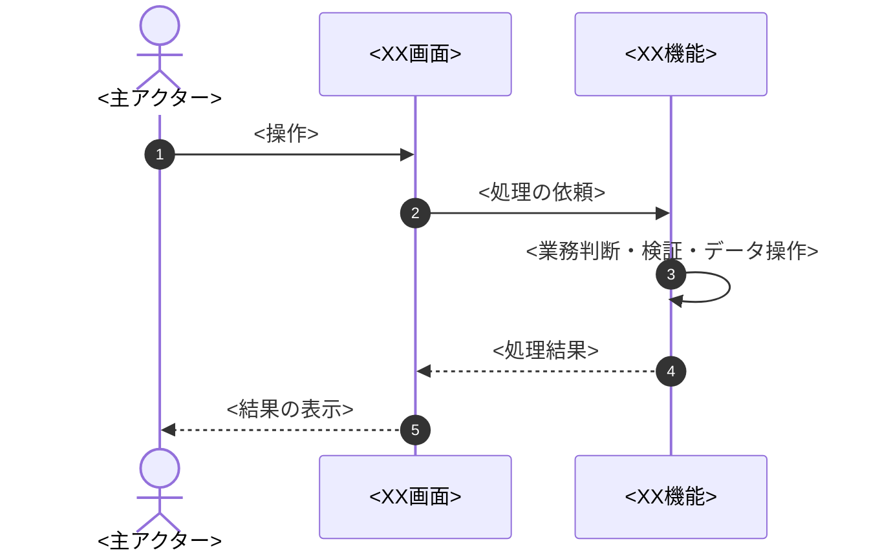
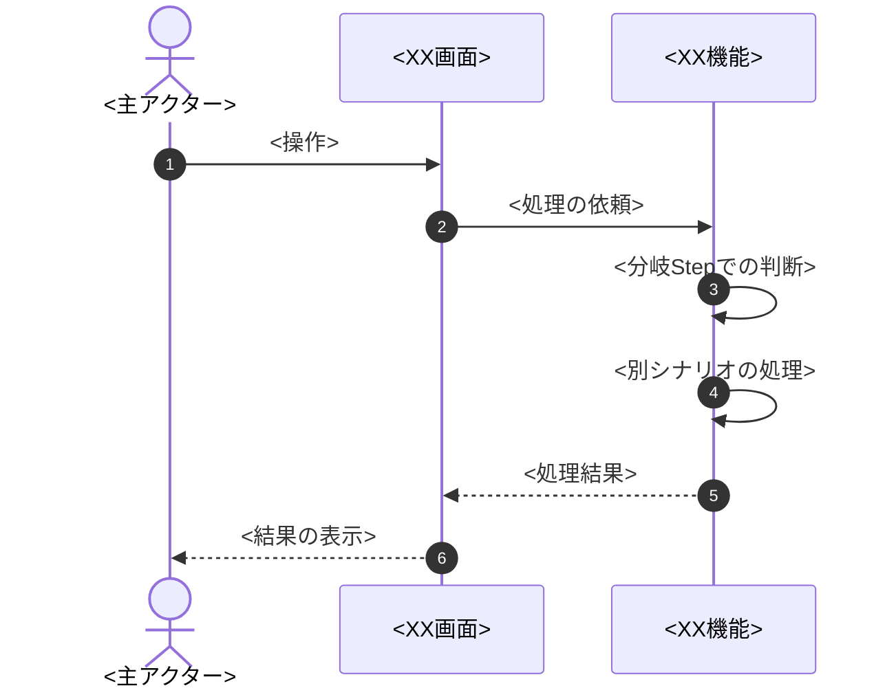
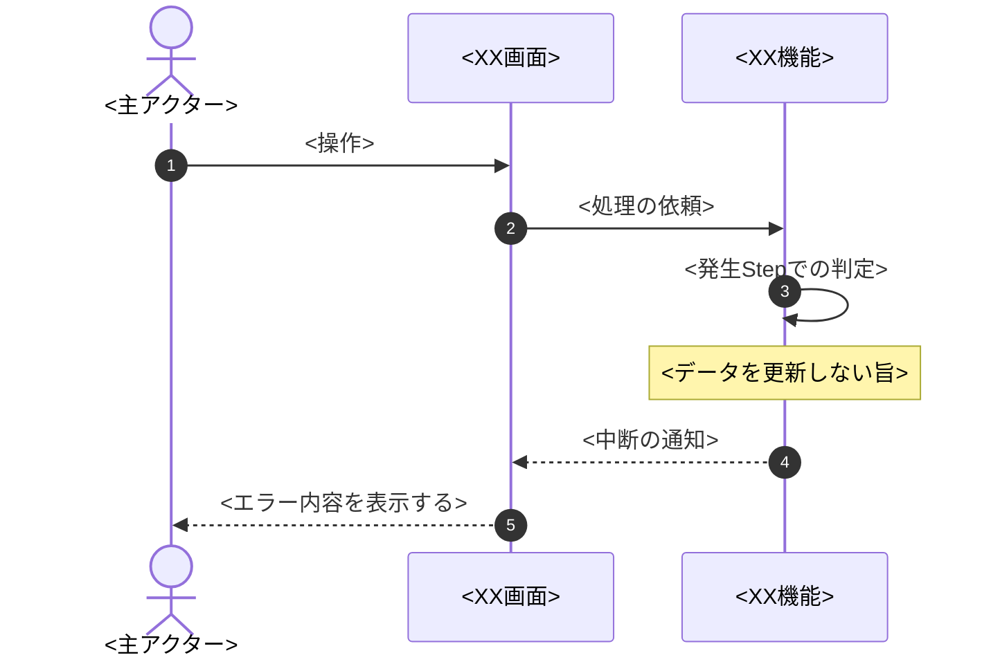
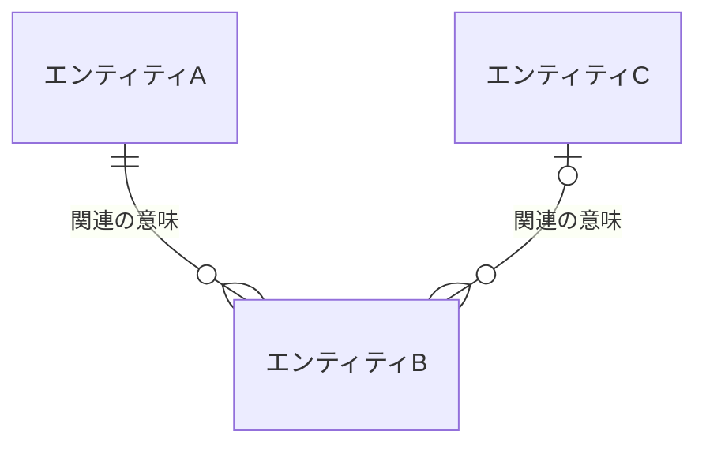

[← テンプレート一覧](README.md)

<!-- 本節は統合設計書「第2節 機能要件」のテンプレート版。各セクション/サブセクション直上のHTMLコメントに「定義内容 / 定義する条件 / 項目説明 / 定義ルール」をセットで記載する。編集時はコメントを読んでから該当セクションを埋める。本文は空欄プレースホルダ(<...>・XXX・例示行)とし、実データは記入サンプル版側で埋める。Cloudflare Workers / D1とデータアクセス境界は§0・§1の確定制約として扱い、本節で別方式へ再定義しない。 -->
<!-- 見出しは本節「# 2. 機能要件」(H1)開始、サブは「## 2.x」、ユースケースは「### 【UC-XXX】…」(H3)。担当節(第2節)以外の内容は書かない。一覧・項目・条件・分岐・処理は必ずテーブルで書く。物理名(英語のテーブル名・カラム名・メソッド名)は書かない(振る舞いとデータのみ)。 -->

<!--
【2. 機能要件】
定義内容: システムが提供する機能の一覧と、対象範囲内で想定される利用者・外部システム・定期/非同期起動の全振る舞い(ユースケース)、業務情報のデータモデル、共通コード定義を定義する。機能要求と認可は独立節を設けず各ユースケース内で定義する。要求定義(§1)を実現する「何をするか」を、設計詳細(how)を含めずに定義する。
定義する条件: 全システムで必須。
項目説明:
- 2.1 機能一覧: 提供する機能を | 機能ID(F-XXX) | 機能名 | 概要 | 主な利用者 | で列挙する。
- 2.2 ユースケース: 全機能と全起動契機をUC一覧で対応付け、各UCを ### 【UC-XXX】単位で定義する。UC記載様式(対応機能/主アクター/目的/事前条件/起動契機/正常終了/異常終了)＋事前/事後条件・入力/出力データ・状態パターン(SP-x)・基本/代替(ALT)/例外(EXC)フローで構成する。機能要求と認可(操作権限・閲覧スコープ・項目許可)もこれらのセクションで定義する。
- 2.3 データモデル: 全UCが扱う業務情報を日本語論理名のエンティティ・主要属性・関連(多重度)で定義する。
- 2.4 共通コード定義: 複数設計層で共通利用する静的な業務コードと表示名を定義する(固定ロールコードを含む)。
定義ルール:
- 機能ID(F-XXX)・UC-XXX は一覧の最大値+1で採番し、欠番を再利用しない。他節からは UC-XXX を完全修飾で参照する。
- 2.1の全F-IDを1件以上のUCへ対応させ、2.2の全UC-IDを1件以上のF-IDへ対応させる。UC一覧と個別UCはID単位で一対一にし、孤立した機能・UCを残さない。
- 利用者の画面操作だけでなく、クライアント共通操作、外部システム起動、Cron/Queue/JOB等の定期・非同期起動も抽出対象とする。主アクター、業務目的、起動契機のいずれかが独立する場合は別UCとする。
- 同じ業務目的の達成途中で呼ぶ選択肢取得等の補助APIは独立UCにせず親UCの基本/代替フローへ含める。画面・API・JOB・DBを使わない場合も、UC一覧の主な実現境界へ「なし」またはクライアント内完結と明記する。
- 状態パターン(SP-x)は正常(基本フロー)を SP-1 とし、代替(ALT)・例外(EXC)を続けて判定優先順に採番する。すべてのSPが基本/ALT/EXCフローのいずれかに対応し、すべてのALT/EXCがいずれかのSPから参照されるよう双方向に網羅する(SP-x は §2.2 を正本とし、§3 画面から完全修飾 UC-XXX/SP-x で参照する)。
- 画面項目・API仕様・DB構造・処理ロジックなどの設計詳細は書かない(振る舞いとデータのみ)。物理名は書かない。
- 画面・API・モジュール・DBで同じ列挙値を使う場合は、2.4をコード値の正本とし、更新可能マスターと混在させない。
- 認可をロール名だけの記載で終わらせず、UC共通の規則(複数ロール時の合成規則、閲覧スコープの優先順位、ロールなしの拒否)は2.2冒頭で、許可ロール・組織階層の範囲・本人判定・基準日・項目許可・範囲外要求の扱いは各UCの事前条件・入力/出力データ・代替/例外フローで一意にする。固定ロールコードは2.4を正本とする。
- 満たすべき機能要求(必須・一意性・形式・初期状態・記録要件等)は独立の要件一覧を設けず、該当UCの事前条件・事後条件・入力/出力データ・状態パターン・フローへ、達成可否を判定できる粒度で定義する。
- 各UCの基本フロー・代替フロー・例外フローは、表に加えて要件レベル(利用者／画面／機能の3者)のシーケンス図を2.2内に持たせる。設計層の構成要素は登場させない。
-->
# 2. 機能要件

本システムが提供する機能の一覧、想定される全ユースケースの振る舞い、業務情報のデータモデル、共通コード定義を定義する。機能要求と認可条件は各ユースケースの事前条件・事後条件・入力/出力データ・状態パターン・基本/代替/例外フローで定義し(UC共通の認可規則は§2.2冒頭、固定ロールコードは§2.4を正本とする)、各フローは要件レベル(利用者／画面／機能の3者)のシーケンス図を併記して示す。画面項目・API仕様・DB構造・処理ロジックなどの設計詳細は書かない(それらは後続の節で定義する)。

<!--
【2.1 機能一覧】
定義内容: 本システムが提供する機能を、機能ID・機能名・概要・主な利用者の一覧で示す。
定義する条件: 全システムで必須。
項目説明:
- 機能ID: 機能の識別子(F-XXX 連番)。他節(画面/API/ユースケース)からはこのIDで参照する。
- 機能名: 機能の日本語名称。
- 概要: 機能が提供する内容(1行)。
- 主な利用者: その機能を主に利用する、§1.3で定義した利用者ロール名。
定義ルール:
- 機能IDは F-XXX の連番。採番は最大値+1、欠番の再利用は禁止。
- 概要は1行で簡潔に書く。画面項目・API・DB項目・処理ロジックは書かない。
- 主な利用者は要件レベルの粗い利用者区分のみ記載する(画面のロール制御・APIの認可仕様は書かない)。
-->
## 2.1 機能一覧

| 機能ID | 機能名 | 概要 | 主な利用者 |
|---|---|---|---|
| F-XXX | <機能名> | <機能の内容を1行で> | <主な利用者> |

<!--
【2.2 ユースケース】
定義内容: §1の対象範囲と2.1の全機能を実現する、利用者・外部システム・時刻起動とシステムの具体的な振る舞い(シナリオ)を、漏れなくユースケース単位で定義する。
定義する条件: 全システムで必須。
項目説明(各UCの構成):
- UC一覧: UC-ID / ユースケース / 主アクター・起動元 / 起動契機 / 対応機能(F-ID) / 主な実現境界を1行1UCで示す。主な実現境界は択一ではなく、オンラインUCがSCRとAPIの双方を経由する等、経由する主要な境界を「、」で併記する(同種の複数IDは「・」で併記し、補助・候補のAPI・JOBは（）で注記する)。
- 見出し: 「### 【UC-XXX】<ユースケース名>（<対象>向け）」。UC IDは全体で一意な連番(UC-001, UC-002 …)。SCR / API はこのIDを「トレース元」として参照する。<対象>は主アクター。
- 概要ヘッダ表: 対応機能 / 主アクター / 目的 / 事前条件(要約) / 起動契機 / 正常終了 / 異常終了 の7行で、ユースケースを俯瞰する。
- 事前条件: 開始前に成立している状態(操作者に必要なロール・閲覧スコープ・基準日の条件を含む)。事後条件: 正常完了後に成立している状態。(それぞれ別テーブル)
- 入力データ: この振る舞いが扱う入力(情報/要否/内容)。出力データ: 結果として提供する出力(情報/内容)。(それぞれ別テーブル) ロール・スコープ別に許可項目が異なる場合はここで一意に定義する。
- 状態パターン(SP-x): 振る舞いの分岐を左右するエンティティの状態区分・主要な入力条件の組み合わせ(パターン)を、判定優先順のマトリクスで定義する。列=パターンID＋状態軸＋結果(事後状態)＋対応フロー。各パターンは対応する1つのフロー(基本フロー/ALT-x/EXC-x)を持つ。
- 基本フロー: 正常系のStep順の 操作/処理・結果。代替フロー(ALT-x): 正常系から外れるが目的を達成する別シナリオ。例外フロー(EXC-x): エラーで処理が中断するシナリオ(発生Step・条件・エラーメッセージ・対応)。
- シーケンス図: 各フローの表の直後に置く、要件レベルの振る舞いを示すMermaidのsequenceDiagram。登場者は 主アクター(U) / 画面(SCR) / 機能(FUNC) の3者に固定する。
定義ルール:
- UC一覧には対象範囲内の全UCを列挙し、一覧の全UC-IDに個別定義を1件ずつ作成する。個別定義だけのUC、一覧だけのUCを禁止する。
- 全F-IDをUC一覧の対応機能へ1回以上記載する。1つの機能に独立したアクター・目的・起動契機が複数ある場合は1対多でUCを分ける。
- 利用者操作、クライアント共通操作、外部イベント、Cron/Queue/JOBを同じ抽出基準で確認する。同じ目的内の正常・代替・例外は別UCへ分割せず、SP/ALT/EXCで網羅する。
- 各UCは「### 【UC-XXX】…」で並べ、UC間は水平線(---)で区切る。UCが1つでも本形式に従う。
- 各UC内の 概要ヘッダ表は見出し直下にラベルなしのテーブルで置き、事前条件・事後条件・入力データ・出力データ・状態パターン・各フローは、それぞれ太字ラベル＋テーブルで個別に記載する。
- 状態パターンは 出力データの直後・基本フローの前に「**状態パターン**」ラベル＋テーブルで配置する。列は「パターンID」＋「主要な状態軸」＋「結果(事後状態)」＋「対応フロー」とし、行を状態の組み合わせ(パターン)として判定優先順に並べる。判定に無関係な軸は「－」(不問)と書く。
- 状態パターンとフローは双方向に網羅する。すべてのパターンは対応フロー(基本フロー/ALT-x/EXC-x)を1つ持ち、すべてのALT-x/EXC-xはいずれかのパターンから参照される(パターンの追加が代替・例外フローの網羅漏れを検出する装置になる)。
- 状態値・区分は要件レベルの日本語名で書く(設計層IDは参照しない)。ローカルID(SP-x/ALT-x/EXC-x)は連番を維持し欠番の再利用は禁止。他節からは UC-XXX/SP-1・UC-XXX/ALT-1・UC-XXX/EXC-1 と完全修飾して参照する。
- ALTの分岐Step・EXCの発生Stepは基本フローのStep番号に対応させる。
- 例外フローは1行1条件で個別に定義し(複合条件を「または」で束ねない)、各行に業務レベルのエラーメッセージ(利用者に伝える内容)を記載する。画面固有のMSG表示仕様は画面設計側で定義する。
- 各フローは表を残したまま、その直後にシーケンス図を併記する(表 → 図の順)。基本フローは図1枚。代替フローはALT-xごとに1枚、例外フローはEXC-xごとに1枚とし、各図の直前に「ALT-x: <条件の要約>」「EXC-x: <条件の要約>」の1行を置く。1枚の図に複数シナリオをalt/elseで束ねない。
- シーケンス図は ```mermaid フェンスで開閉し、前後に空行を1行入れる。先頭で autonumber を宣言する。
- 登場者は actor U as <主アクター> / participant SCR as <XX画面> / participant FUNC as <XX機能> の3者に固定し、aliasは U / SCR / FUNC とする。3者以外のparticipantを追加しない。Uは概要ヘッダ表「主アクター」の名称、SCRはそのUCで操作する画面の要件レベル名称(IDは書かない)、FUNCは対応機能(F-ID)の2.1機能名に「機能」を付した名称とする。画面を経由しないUC(クライアント内完結・定期/非同期起動)はSCRを宣言しない。
- 表の「アクター」列が主アクターのStepは U->>SCR: で表す。「システム」のStepのうち、画面表示・選択肢表示に関わるものは SCR-->>U:、業務判断・検証・データ操作は FUNC->>FUNC: (自己メッセージ)で表す。画面と機能の受け渡しは SCR->>FUNC: / FUNC-->>SCR: で表す。
- メッセージは業務上の動詞で書き、表のStep/条件と1対1で対応させる(図だけにあるステップ・表だけにあるステップを残さない)。基本フロー図のメッセージ順序は基本フローのStep番号順に対応させる。
- ALT図は分岐Stepまで基本フローと同じ流れを示し、その後に別シナリオと正常終了を示す。EXC図は発生Stepでの判定と中断、利用者への通知までを示す。例外時にデータを更新しないことは Note over で明示してよい。
- エラーメッセージの文言そのものは例外フローの表を正本とし、図には責務レベルの動詞(例「権限不足を表示する」「重複項目を表示する」)で書く。
- シーケンス図にも設計詳細を書かない。SCR-ID/API-ID/M-ID/JOB-ID/SQL-ID/TBL-ID、物理テーブル名・カラム名・SQL・メソッド名、HTTPステータス・ERR-ID・MSG-ID、設計層の構成要素(Worker API・D1等)を登場させない。データ操作はFUNCの自己メッセージとして業務語で表す(例「社員番号の重複を確認する」)。
- 認可は本節を正本とする。UC共通の規則(複数ロール時の権限合成、閲覧スコープの優先順位と確定規則、ロールなしの拒否)は2.2冒頭へ記載し、各UCの事前条件に許可ロールと閲覧スコープ・基準日を、入力/出力データにロール・スコープ別の許可項目を、代替/例外フローに権限不足・範囲外要求の扱いを定義する。「認証済みのため常に許可」と省略しない。
- 機能要求(必須・一意性・形式・初期状態・記録要件等)は該当UCの事前条件・事後条件・入力/出力データ・状態パターン・フローへ、達成可否を判定できる粒度で定義する。
- 画面項目定義・APIパラメータ・DB構造などの設計詳細は書かない(振る舞いとデータのみ)。
- 複数UCは下の「### 【UC-XXX】…」ブロックをUC単位で連番追加し(UC-001, UC-002 …)、UC間を --- で区切る。
-->
## 2.2 ユースケース

対象範囲内の全機能と、利用者・外部システム・定期/非同期処理から予見される全起動契機を、ユースケース単位で定義する。

<UC共通の認可規則(複数ロール時の権限合成、閲覧スコープの優先順位と確定規則、ロールなしの拒否、固定ロールコードの正本参照)を記載する>

| UC-ID | ユースケース | 主アクター／起動元 | 起動契機 | 対応機能(F-ID) | 主な実現境界 |
|---|---|---|---|---|---|
| UC-XXX | <ユースケース名> | <利用者／外部システム／時刻> | <起動契機> | F-XXX | SCR-XXX／API-XXX／JOB-XXX／クライアント内完結／なし |

### 【UC-XXX】<ユースケース名>（<対象>向け）
<このユースケースの概要を1行で記載する>

| 項目 | 内容 |
|---|---|
| 対応機能 | F-XXX |
| 主アクター | <主アクター> |
| 目的 | <このユースケースで達成する業務目的> |
| 事前条件 | <開始前に成立している状態の要約> |
| 起動契機 | <利用者/システムがこの振る舞いを開始するきっかけ> |
| 正常終了 | <正常完了時の結果> |
| 異常終了 | <中断・拒否時の扱い> |

**事前条件**

| No | 条件 |
|---|---|
| 1 | <開始前に成立している条件> |
| 2 | <操作者に必要なロール・閲覧スコープ・基準日の条件> |

**事後条件**

| No | 条件 |
|---|---|
| 1 | <正常完了後に成立している条件> |

**入力データ**

| 情報 | 要否 | 内容 |
|---|---|---|
| <入力情報> | 必須／任意 | <内容> |

**出力データ**

| 情報 | 内容 |
|---|---|
| <出力情報> | <内容> |

**状態パターン**

| パターンID | <状態軸1> | <状態軸2> | 結果(事後状態) | 対応フロー |
|---|---|---|---|---|
| SP-1 | <値> | <値> | <事後状態> | 基本フロー／ALT-x／EXC-x |

**基本フロー**

| Step | アクター | 操作/処理 | 結果 |
|---|---|---|---|
| 1 | <アクター> | <操作/処理> | <結果> |



**代替フロー**

| ALT ID | 分岐Step | 条件 | フロー |
|---|---|---|---|
| ALT-1 | <Step> | <条件> | <目的を達成する別シナリオ> |

ALT-1: <条件の要約>



**例外フロー**

| EXC ID | 発生Step | 条件 | エラーメッセージ | 対応 |
|---|---|---|---|---|
| EXC-1 | <Step> | <1行1条件> | <業務レベルのエラーメッセージ> | <対応> |

EXC-1: <条件の要約>



<!-- 上の「### 【UC-XXX】…」ブロックを UC 単位で連番追加し(UC-001, UC-002 …)、UC間を --- で区切る。 -->

<!--
【2.3 データモデル】
定義内容: 2.2の全ユースケースが参照・更新する業務情報を、日本語論理名のエンティティ・主要属性・関連(多重度)として定義し、データベース設計(§4)の論理正本にする。
定義する条件: 永続化する業務データを扱うシステムでは必須。
項目説明:
- エンティティ: 業務上意味を持つデータのまとまりの論理名。
- 意味・役割: エンティティが表す業務上の対象・目的。
- 業務識別子: 業務上インスタンスを識別する属性(内部IDは書かない)。
- 主要属性: 業務判断に使う代表的な属性の論理名。
- 主な利用UC: そのエンティティを参照・更新するユースケース(UC-XXX)。
- 関連・多重度: エンティティ間の業務的な関係と「1 対 0..*」等の多重度。
定義ルール:
- エンティティ名・属性名は日本語の論理名だけを使用し、物理テーブル名・物理カラム名・SQLite型・制約・索引は書かない(物理設計は§4 データベース設計を正本とする)。
- 2.2の全UCが扱う業務データを漏れなくエンティティへ対応させ、エンティティと物理テーブルの対応は§4.2 テーブル一覧で定める。
- 区分値の集合は2.4 共通コード定義を正本として参照し、本節で値を再定義しない。
- 技術目的だけのデータ(更新ガード等)は本節に含めず、データベース設計だけで定義する。
- ER図はエンティティと関連(多重度)だけを示し、属性は2.3.1の表を正本とする。
-->
## 2.3 データモデル

<全ユースケースが扱う業務情報の論理構造の説明>



### 2.3.1 エンティティ定義

| エンティティ | 意味・役割 | 業務識別子 | 主要属性 | 主な利用UC |
|---|---|---|---|---|
| <エンティティ名> | <業務上の対象・目的> | <業務識別属性> | <属性1、属性2、…> | UC-XXX |

### 2.3.2 関連定義

| 関連 | 多重度 | 意味・制約 |
|---|---|---|
| <エンティティA> − <エンティティB>（<関連名>） | 1 対 0..* | <業務的な意味・整合条件> |

<!--
【2.4 共通コード定義】
定義内容: 画面の選択肢、APIの列挙値、モジュール検証、DB制約で共通利用する静的な業務コードを定義する。固定ロールコード等の認可用コードも本表を正本とする。
定義する条件: 更新可能マスターではなく、リリース単位で固定される業務区分を複数設計層で利用する場合に定義する。
項目説明:
- 区分種別: コード集合の業務上の名称。
- コード: API・モジュール・DBで受け渡す一意な値。
- 表示名: 画面・帳票で使用する利用者向け名称。
- 利用条件: 指定可能な機能、任意性、状態などの条件。
定義ルール:
- コード値・表示名・利用条件を1行1値で列挙し、「など」「定義済み」のまま残さない。
- 画面/API/モジュール/DBは本表を正本として参照し、各章で別の値集合を再定義しない。
- 更新可能な組織・役職等は本表に含めず、マスター設計で定義する。
-->
## 2.4 共通コード定義

| 区分種別 | コード | 表示名 | 利用条件 |
|---|---|---|---|
| <区分名> | `<CODE>` | <表示名> | <指定可能な機能・条件> |

- <選択肢の供給方法（アプリケーション定義またはマスターAPI）と、API・モジュール・DBの検証責務を記載する>
- <固定ロールコードを採用する場合は本表で定義し、ロール別の操作・スコープ・項目規則を2.2の各UCで定義する旨を記載する>

