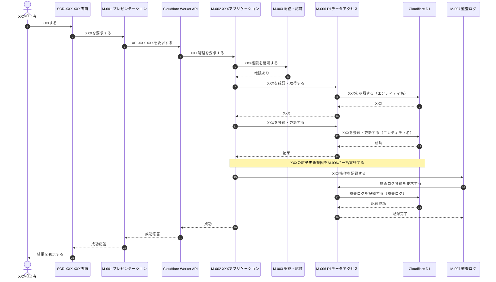
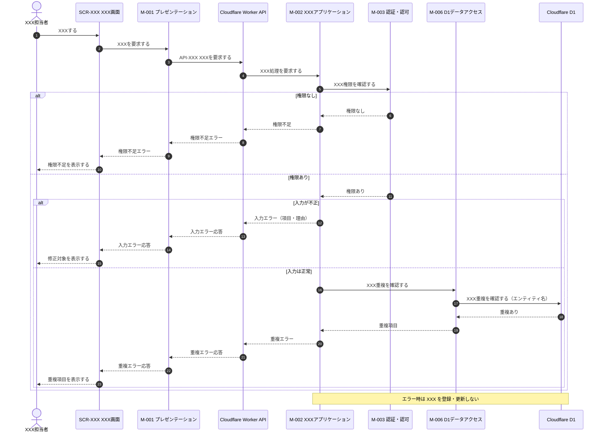
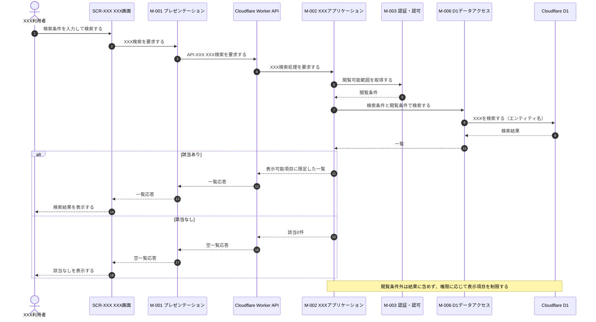
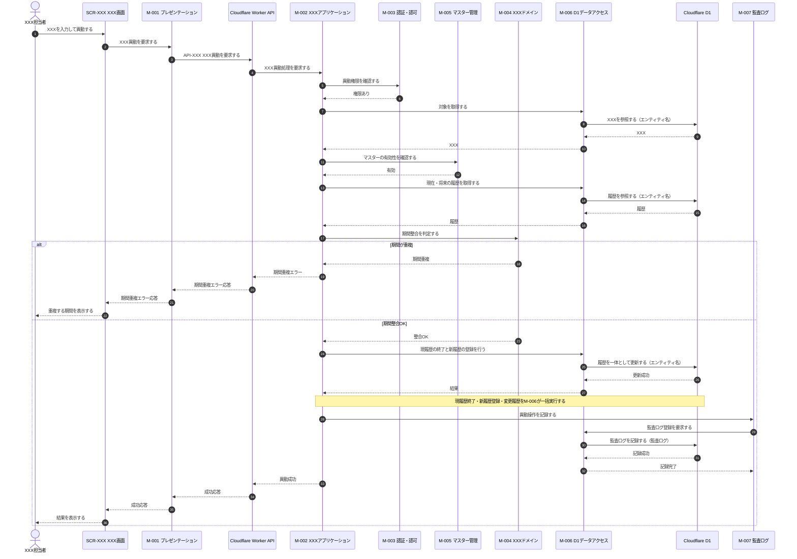
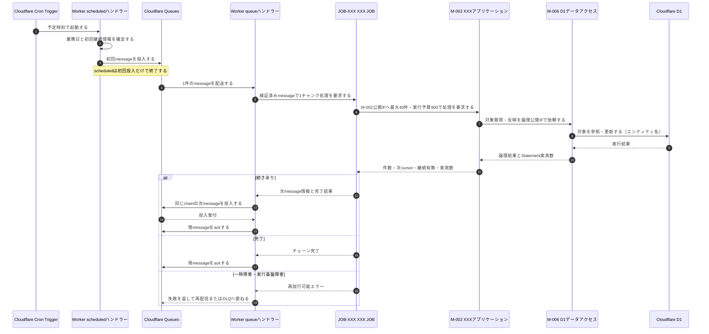

[← テンプレート一覧](README.md)

<!-- 本節は統合設計書「3. シーケンス設計」のテンプレート版。各サブセクション直上の定義ルールコメント(定義内容/定義する条件/項目説明/定義ルール)に従い、空欄プレースホルダを実データで置き換えて使う -->
<!-- シーケンスは構成要素の存在・図中正式名称・接続順・受け渡し・条件分岐・結果返却と、画面/DB/API/JOB/モジュール設計IDへの対応の正本。各要素の入出力・項目・内部処理等の詳細仕様は個別節を正本とし、本節へ重複記載しない -->
<!-- 本番基盤はCloudflare Workers Paid + Cloudflare D1 + Cloudflare Queues。DBは単一のparticipant「Cloudflare D1」(alias DB)に集約し、DBとのメッセージは必ずM-006から送受信する。D1へ向かう往路メッセージの末尾に、参照する§2.3のエンティティ名(日本語論理名)を全角括弧で列挙する(復路には付けない)。物理テーブル名・カラム名・SQL・D1メソッド名は書かない -->
<!-- エラー・メッセージは責務レベルの動詞で書く。具体的なERR-ID・MSG-ID・文言・HTTPステータスは図に書かない(採番・文言は §6 API設計/§4 画面設計 で定義し、トレーサビリティで対応付ける) -->

<!--
【3. シーケンス設計】
定義内容: §2.5で図が必要と判定されたユースケースにおける論理構成要素間の連携を、正常系・代替/例外系に分けて時系列(Mermaid sequenceDiagram)で定義し、連携定義(条件分岐・データ参照更新・D1原子実行境界)で補足する。
定義する条件: 複数要素の連携・分岐・D1原子更新を伴うUCで必須。静的表示・単純CRUDは省略可(§2.5に省略理由を記す)。
項目説明:
- 3.1 論理構成要素: 全図のactor/participantを図中表示名と宣言種別単位で一度だけ登録し、設計ID・詳細正本・使用シーケンス・連携責務を定義する。3.1.1でシーケンスごとのSCR/API/M/JOB/DB対応を定義する。
- 3.2〜 各シーケンス: 正常系・代替/例外系を Mermaid sequenceDiagram で示し、直後に連携定義(条件分岐・データ参照更新・D1原子実行境界・補足事項)を表で補足する。
定義ルール:
- 各図の直後の条件分岐「根拠」列に、対象UCの状態パターンを完全修飾(UC-XXX/SP-x)で示し、正常/代替/例外の分岐と双方向に網羅する(SP-x の定義は §2.2 が正本)。
- 全図の全actor/participantは§3.1にちょうど1行存在させ、宣言種別と図中表示名を完全一致させる。§3.1の全行は1件以上の図で使用し、未登録要素・未使用要素・名称揺れを禁止する。
- オンライン経路は「アクター→SCR→M-001→Cloudflare Worker API→M-002（ログインはM-003）」を省略しない。M-001内完結UCはAPIなしを明記する。APIへの要求矢印にはAPI-IDを付記する。
- JOB経路は「Cron Trigger→scheduledハンドラー→Queue→queueハンドラー→JOB→M-002」を省略せず、起動基盤・メッセージ基盤・ハンドラー・JOB本体を別participantにする。
- DBは単一participant「Cloudflare D1」(alias DB)に集約し、往路メッセージ末尾に参照する§2.3のエンティティ名を全角括弧で列挙する(復路には付けない)。D1と送受信できるparticipantはM-006だけとし、API・JOB・他モジュールからD1への矢印を禁止する。
- メッセージは業務上の動詞で書く。物理テーブル名・カラム名・SQL・メソッド名・具体的なERR-ID/MSG-ID・HTTPステータスは図に書かない。
- 認可結果を後続データ取得へ渡すシーケンスは、§2.7を正本として論理スコープ、操作者業務主体、許可組織等の集合、基準日、項目許可を受け渡すことを示す。複数ロールやロールなしを「認証済みのため常に許可」と省略しない。
- 正規化対象の更新では、正規化、正規化後検証、差分判定、履歴生成、永続化の順序を示す。
- 更新可能マスターでは手動利用可否と有効期間を区別し、即時無効化、任意終了日、将来の期間終了予約を同じ意味で示す。
- 複数SQLを不可分にする場合、業務モジュールは論理的な原子更新範囲をM-006へ1回で依頼し、M-006が1回の `env.DB.batch()` で実行する。図には物理メソッド名を書かず、直後のD1原子実行境界表にTX-ID、SQL-ID順序、全体ロールバック条件を記す。
-->
# 3. シーケンス設計

<!--
【3 節冒頭】
定義内容: 本節が扱うシーケンスの範囲と、§2.5で図が必要と判定された各ユースケースの正常・代替・例外系の割り当てを1〜3行で示す。
定義する条件: 全体で必須。
定義ルール:
- §2.5で図が必要と判定されたUC-XXXを根拠とし、上位要件にない振る舞いを追加しない。「不要」のUCは§2.5の理由と一致させる。
- 各状態パターン(UC-XXX/SP-x)は 正常系 / 代替・例外系 のいずれかで表現し、各シーケンス直後の連携定義(条件分岐)の根拠列に完全修飾で紐付ける。
-->

本節は、§2.5で図が必要と判定されたユースケース XXX の連携(利用者・画面・Workers上のAPI/JOB・機能・M-006・Cloudflare D1・監査)を時系列に検証する。各状態パターンは正常系または代替・例外系のいずれかで表現し、各図の直後の連携定義でデータ参照・更新とD1原子実行境界を補足する。

<!--
【3.1 論理構成要素】
定義内容: 本節の全シーケンス図に登場するactor/participantを図中表示名単位で一覧化し、画面・DB・API・JOB・モジュールの設計IDと接続責務の正本にする。
定義する条件: 本節で必須。
項目説明:
- 図中表示名: Mermaidの`as`以降に記載する正式名称。対応するSCR/API/M/JOBのIDを含める。
- 宣言: Mermaidの`actor` / `participant`。
- 種別: アクター / 画面 / 画面グループ / DB / API / 起動基盤 / JOBハンドラー / メッセージ基盤 / JOB / モジュール / 外部システム / クライアント状態。
- ID/参照・詳細正本: §4〜§8の設計IDと詳細定義箇所。
- 使用シーケンス: 当該表示名を宣言する全§3.x。
- 連携責務・制約: 接続責務、直接接続可能先、禁止事項。
定義ルール:
- 全図からactor/participant宣言を抽出した集合と本表の集合を、宣言種別・図中表示名で完全一致させる。本表だけの行、図だけの要素、同一要素の名称揺れを残さない。
- 行はアクター、画面(§4)、DB(§5)、API(§6)、JOB(§7)、モジュール(§8)、外部システム・クライアント状態の順に、本表を正本として詳細化する章の順で並べる。
- ロール差がある場合、アクターは「利用者」でなく具体的なロール名または同じ権限経路を利用するロール集合にする。
- SCR・Cloudflare D1・API・JOB・Mは§4.1・§5.1・§6.2・§7.2・§8.2のIDと正式名称に一致させる。
- データベースは単一の「Cloudflare D1」要素に集約し、エンティティごとに要素を分けない。保持する業務データは§2.3 データモデルのエンティティと対応させる。
- D1アクセスはM-006に限定する。Workersの `env.DB`、Prepared Statement、SQL-ID、物理表はシーケンス図へ記載せず、§8・§9を正本とする。
- 物理名(英語テーブル名・カラム名・メソッド名)は書かない。エンティティは§2.3の日本語論理名で表す。
- 役割はこのシーケンスでの連携責務だけを記載する(詳細仕様は各節の正本を参照)。
-->
## 3.1 論理構成要素

| 図中表示名 | 宣言 | 種別 | ID/参照 | 詳細正本 | 使用シーケンス | 連携責務・制約 |
|---|---|---|---|---|---|---|
| XXX担当者 | actor | アクター | <ロール/UC参照> | §1・§2.7 | §3.2・§3.3・§3.5 | <操作責務> |
| XXX利用者 | actor | アクター | <ロール/UC参照> | §1・§2.7 | §3.4 | <操作責務> |
| SCR-XXX XXX画面 | participant | 画面 | SCR-XXX | §4.x | §3.2〜§3.5 | 入力・表示をM-001へ委譲する |
| Cloudflare D1 | participant | DB | Cloudflare D1 / SQLite | §2.3・§5.1 | §3.2〜§3.6 | §2.3のエンティティを保持し、M-006以外との直接接続を禁止する |
| Cloudflare Worker API | participant | API | API-XXX〜API-YYY | §6.1・§6.2 | §3.2〜§3.5 | HTTP境界処理後に単一業務モジュール公開IFを1回呼ぶ。DBへ直接アクセスしない |
| Cloudflare Cron Trigger | participant | 起動基盤 | JOB-XXX/Cron | §7.x | §3.6 | scheduledハンドラーを起動する |
| Worker scheduledハンドラー | participant | JOBハンドラー | JOB-XXX/scheduled | §7.x | §3.6 | 初回Queueメッセージだけを投入する |
| Cloudflare Queues | participant | メッセージ基盤 | JOB-XXX Queue | §7.x | §3.6 | 初回・継続・再配信メッセージを配送する |
| Worker queueハンドラー | participant | JOBハンドラー | JOB-XXX/queue | §7.x | §3.6 | JOBを1回呼び、ack・retry・継続投入を制御する |
| JOB-XXX XXX JOB | participant | JOB | JOB-XXX | §7.x | §3.6 | M-002公開IFへチャンク処理を委譲し、M-006・D1へ直接アクセスしない |
| M-001 プレゼンテーション | participant | モジュール | M-001 | §8.x | §3.2〜§3.5 | 画面イベントをAPIへ送り、API応答を画面状態へ反映する |
| M-002 XXXアプリケーション | participant | モジュール | M-002 | §8.x | §3.2〜§3.6 | ユースケース進行と原子更新境界を制御する |
| M-003 認証・認可 | participant | モジュール | M-003 | §8.x | §3.2〜§3.5 | 認証・認可・閲覧範囲を判定する |
| M-004 XXXドメイン | participant | モジュール | M-004 | §8.x | §3.5 | 業務状態・期間整合を判定する |
| M-005 マスター管理 | participant | モジュール | M-005 | §8.x | §3.5 | マスターの取得・有効性・更新可否を判定する |
| M-006 D1データアクセス | participant | モジュール | M-006 | §8.x・§9 | §3.2〜§3.6 | D1 BindingとSQL実行を一元化し、D1へ接続する唯一の要素 |
| M-007 監査ログ | participant | モジュール | M-007 | §8.x | §3.2・§3.5 | 監査イベントを生成しM-006へ保存委譲する |

### 3.1.1 シーケンス・詳細設計対応

| シーケンス | UC/SP | アクター／起動元 | 画面・M-001 | API | JOB | 主処理モジュール／IF | 下位モジュール | 永続化・外部 |
|---|---|---|---|---|---|---|---|---|
| §3.x <オンライン処理> | UC-XXX/SP-x | <アクター> | SCR-XXX / M-001 | API-XXX（補助APIも列挙） | なし | M-XXX/IF-XX | M-XXX・M-006 | Cloudflare D1 |
| §3.y <非同期処理> | UC-YYY/SP-y | Cron Trigger / Queues | なし | なし | JOB-XXX | M-002/IF-XX | M-006 | Cloudflare D1 |

上表は§2.5で図が必要な全UC/SPを重複・欠落なく列挙する。APIを使わないクライアント内処理、画面/APIを使わないJOBは「なし」を明記する。

<!--
【3.2 <対象>・正常系】
定義内容: 対象ユースケースの正常系(状態パターン SP-1)の連携を、Mermaid sequenceDiagram で時系列に定義し、直後に連携定義を補足する。
定義する条件: §2.5でシーケンス図が「必要」と判定された各UCで必須。
項目説明:
- 図: autonumber を付し、actor/participant で論理要素を宣言し、往路→復路の連携を業務上の動詞で記す。
- 連携定義: 条件分岐 / データ参照・更新 / D1原子実行境界 を小表で補足する。
定義ルール:
- participantは§3.1に登録した図中表示名をそのまま使用する。オンライン経路ではSCR、M-001、Cloudflare Worker API、主処理モジュールを省略しない。D1は単一participant(alias DB)に集約する。
- M-001からAPIへの要求矢印には§3.1.1と一致するAPI-IDを付記する。
- D1への往路メッセージ末尾に、参照する§2.3のエンティティ名(日本語論理名)を全角括弧で列挙する(復路には付けない)。D1との矢印はM-006だけに接続する。
- メッセージは業務上の動詞にし、変数操作・具体的SQL・物理メソッド名・具体的ERR-ID/MSG-ID・HTTPステータスは書かない。
- 認可確認は更新処理より前に置く。複数エンティティ更新は1つの原子更新要求としてM-006へ渡し、1回のD1 batchに含めるSQL-ID順序を原子実行境界表に記す。
- 本図が表現する状態パターン(UC-XXX/SP-1)を連携定義(条件分岐)の根拠列に完全修飾で記す。
-->
## 3.2 XXX・正常系

**連携定義**

条件分岐

| 条件ID | 判定箇所 | 条件 | 成立時 | 不成立時 | 根拠 |
|---|---|---|---|---|---|
| COND-01 | XXX機能 |  |  | (3.3で表現) | UC-XXX/SP-1 (不成立=SP-x) |

データ参照・更新

| エンティティ | CRUD | 目的 | 実行主体 |
|---|---|---|---|
| XXX | R / C / U / D |  | データアクセス |

D1原子実行境界

| TX-ID | 論理開始 | 実行SQL-ID・順序 | D1実行方式 | 成功条件 | 全体ロールバック条件 | 実行主体 |
|---|---|---|---|---|---|---|
| TX-XXX | M-XXXが不可分な更新をM-006へ依頼 | SQL-XXX → SQL-YYY | M-006による1回の `env.DB.batch()` | 全Statement成功 | いずれかのStatement失敗(UC-XXX/SP-x) | M-006 |

<!--
【3.3 <対象>・入力不正/重複(代替・例外系)】
定義内容: 対象ユースケースの代替・例外系(権限・入力・マスター・重複・保存異常など)を、alt 分岐を用いた Mermaid sequenceDiagram で定義し、直後に状態パターン対応表を補足する。
定義する条件: 対象UCに代替・例外がある場合に必須(なければ理由を記載)。
項目説明:
- 図: alt/else で各失敗分岐を表現し、正常系(3.2)と同じ判定順で並べる。
- 状態パターン対応: 各分岐がどの状態パターン(UC-XXX/SP-x)に対応し、どの処理を行うかを表で示す。
定義ルール:
- 1つの状態パターンに1つの分岐を対応させ、束ね表現(「または」で複数条件を1分岐)を避ける。
- エラーは責務レベルの動詞で書き、具体的ERR-ID/MSG-ID/文言/HTTPステータスを図に書かない。
- 例外時にデータを更新しないこと(中途半端なデータを残さないこと)を Note で明示する。
-->
## 3.3 XXX・入力不正/重複

**状態パターン対応**

| 分岐 | 条件 | 状態パターン | 本シーケンスでの処理 |
|---|---|---|---|
| a |  | UC-XXX/SP-x |  |

<!--
【3.4 <対象>・検索(参照系)】
定義内容: 対象ユースケースの検索・参照連携を Mermaid sequenceDiagram で定義し、直後に連携定義を補足する。
定義する条件: 検索・参照系UCで必須。
項目説明:
- 図: 認可(閲覧可能範囲)取得→条件検索→表示項目の限定→表示、の順で記す。
- 連携定義: 条件分岐 / データ参照・更新 / D1原子実行境界(参照のみは理由付きで「なし」)。
定義ルール:
- 認可(閲覧可能範囲)取得を検索より前に置く。閲覧条件外は結果に含めないことを表現する。
- 個人情報保護のため、権限に応じて表示項目を制限することを Note で明示する。
- 参照のみでD1更新がない場合は、D1原子実行境界を理由付きで「なし」とする。
-->
## 3.4 XXX・検索

**連携定義**

条件分岐

| 条件ID | 判定箇所 | 条件 | 成立時 | 不成立時 | 根拠 |
|---|---|---|---|---|---|
| COND-01 | XXX機能 |  |  |  | UC-XXX/SP-x |

データ参照・更新

| エンティティ | CRUD | 目的 | 実行主体 |
|---|---|---|---|
| XXX | R |  | データアクセス |

D1原子実行境界

| 内容 |
|---|
| なし(参照のみ。更新を伴わないため) |

<!--
【3.5 <対象>・異動(期間整合)】
定義内容: 対象ユースケースの更新連携(履歴の期間整合を伴うもの)を Mermaid sequenceDiagram で定義し、直後に連携定義を補足する。
定義する条件: 履歴の期間整合・複数エンティティ更新を伴うUCで必須。
項目説明:
- 図: 権限確認→対象状態確認→マスター有効性→期間整合判定→履歴の終了と新規登録→変更履歴・監査、の順で記す。
- 連携定義: 条件分岐(各失敗を状態パターンに紐付け) / データ参照・更新 / D1原子実行境界。
定義ルール:
- 期間整合の判定(既存履歴との重複がないこと)を明示的なステップとして置く。
- 現履歴の終了と新履歴の登録・変更履歴を1つの原子更新要求とし、M-006が1回のD1 batchで実行するSQL-ID順序を原子実行境界表に記す。
- 監査ログを業務D1 batchと同一/別のどちらにするかを補足に記し、別の場合は確定順と失敗時方針を示す。
-->
## 3.5 XXX・異動

**連携定義**

条件分岐

| 条件ID | 判定箇所 | 条件 | 成立時 | 不成立時 | 根拠 |
|---|---|---|---|---|---|
| COND-01 | XXX機能 |  |  |  | UC-XXX/SP-x |

データ参照・更新

| エンティティ | CRUD | 目的 | 実行主体 |
|---|---|---|---|
| XXX | R / U / C |  | データアクセス |

D1原子実行境界

| TX-ID | 論理開始 | 実行SQL-ID・順序 | D1実行方式 | 成功条件 | 全体ロールバック条件 | 実行主体 |
|---|---|---|---|---|---|---|
| TX-XXX | M-XXXが不可分な履歴更新をM-006へ依頼 | SQL-XXX → SQL-YYY → SQL-ZZZ | M-006による1回の `env.DB.batch()` | 全Statement成功 | いずれかのStatement失敗 | M-006 |

補足事項

| 観点 | 内容 |
|---|---|
| 同期/非同期 |  |
| 競合制御 | 楽観ロックの条件付き更新、UNIQUE/CHECK/trigger等のD1制約、およびbatch失敗時の全体ロールバックを§5・§9と一致させる |
| 監査ログ |  |

<!--
【3.6 定期・非同期JOB】
定義内容: Cronから初回Queue投入、Queue consumerによる最大40件のチャンク処理、次message投入、ack、再配信/DLQまでを示す。
定義する条件: scheduledまたはQueueを使用する全UCで必須。
定義ルール: §3.1と同じ図中表示名でCron Trigger、scheduledハンドラー、Queue、queueハンドラー、JOB本体を個別に宣言する。scheduledから業務モジュール・M-006・D1へ直接矢印を引かない。JOB本体はM-002だけを呼び、D1との矢印はM-006だけに接続する。
-->
## 3.6 定期・非同期JOB

**連携定義**

| 観点 | 固定設計 |
|---|---|
| 初回message | `cursor=null`、`chainRunId`、`chunkNo=1`、`businessDate` |
| 継続message | M-002が返したcursor、同じchainRunId/businessDate、連続するchunkNo |
| consumer設定 | `max_batch_size=1`、`max_concurrency=1`、`max_retries=3`、DLQ必須 |
| チャンク上限 | 最大40件、D1 Statement内部予算900、Paid hard limit 1,000 |
| 成功順序 | チャンク確定 → 続きがあれば次message投入確定 → 現message ack |
| 再試行 | allowlistだけ即時再試行（exponential backoff + full jitter）。結果不明は状態/version再読込み。過負荷、timeout、CPU、memoryは即時再試行せずQueue redelivery |
| データアクセス | JOB → M-002 → M-006 → Cloudflare D1。JOB・scheduled・QueueからD1への直接経路なし |

D1原子実行境界は、当該チャンク内の対象単位ごとに§3.x/§8/§9のTX-IDへ追跡する。Queue message全体を1つのD1 transactionとはみなさず、再配信は `chainRunId + chunkNo`と対象version/冪等キーで無害化する。
