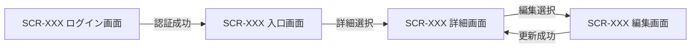

[← テンプレート一覧](README.md)

<!--
テンプレート先行:
- 画面設計のフォーマット・粒度・記載ルールを変更する場合は、最初に本テンプレートを更新し、その後に記入サンプルへ反映する。
- 記入サンプル側だけで見出し・表列・ID規則を追加しない。本テンプレートを画面設計書式の正本とする。
- 4.3 以降は全画面で同じ9サブセクションを反復し、一部画面だけを「代表画面」として詳細化しない。
-->
<!--
本節は統合設計書「3. 画面設計」の詳細設計テンプレートである。§2.2の各ユースケース(基本・代替・例外フロー)の利用者操作、入力、API呼出契機、
正常・代替・例外結果を画面仕様へ具体化する。画面はWorkers上のAPIだけを利用し、Cloudflare D1、`env.DB`、物理テーブル、SQL、M-006を直接参照しない。
画面ID・画面名は§3.1 画面一覧、利用APIは§5.2 API一覧を構成上の正本とし、本章ではレイアウト・項目・イベント・状態・遷移を詳細化する。
画面IDは SCR-XXX、項目IDは画面内ローカルの ITM-XX、イベントIDは画面内ローカルの EVT-XX とする。
表示文言は全画面共通のものを§3.0.1、個別画面だけのものを各画面の「メッセージ一覧」の正本とし、他サブセクションでは MSG-XX だけを参照する。
-->

# 3. 画面設計

本章は、全画面のURL・権限・画面レイアウト・初期表示・項目・イベント・入力チェック・状態/表示制御・遷移・メッセージを詳細設計レベルで定義する。画面の存在・ID・遷移は[画面一覧](03_画面設計.md#31-画面一覧)・[画面遷移](03_画面設計.md#32-画面遷移)を正本とし、各画面を同一のサブセクション様式で記載する。

**目次**

- [3.0 共通認証・API応答制御](#30-共通認証api応答制御)
- [3.1 画面一覧](#31-画面一覧)
- [3.2 画面遷移](#32-画面遷移)
- [3.3 SCR-XXX XXX画面](#33-scr-xxx-xxx画面)

<!--
【4.0 共通認証・API応答制御】
定義内容: 全画面へ横断適用する認証状態管理、認証切れ、相関ID、要求取消し等のAPI応答制御と、全画面共通の認証イベントを定義する。
定義する条件: APIを利用する画面設計で必須。
定義ルール:
- UNAUTHENTICATEDは各画面のシステムエラーへ集約せず、認証情報破棄、操作停止、ログイン画面遷移、検証済み戻り先の順で統一する。
- 戻り先は同一オリジンかつ許可ルートだけに制限し、認証情報・個人情報を含む入力値を引き継がない。
- 個別画面のイベント表では、本節と異なる制御を行う場合だけ関係・差分を記載する。
- 認証状態の保持場所、付与規則、破棄契機など全画面共通の認証制御は本節へ集約し、個別画面へ重複定義しない。
- 共通ヘッダーのログアウト等、全画面へ共通適用するイベントは共通イベント表へ文書全体で一意な EVT-COMMON-XX で定義し、個別画面のローカル EVT-XX と重複させない。
-->
## 3.0 共通認証・API応答制御

| 応答・事象 | 全画面共通処理 | 遷移・表示 | 個別イベント表との関係 |
|---|---|---|---|
| UNAUTHENTICATED | 保持中の認証情報を破棄し、進行中要求を取消し、画面操作を無効化する | MSG-XX を表示してログイン画面へ遷移。戻り先は検証済み内部URLだけを保持 | なし / 関係内容 |
| 相関IDありエラー | traceIdを問い合わせ表示・クライアントログ相関へ利用し、内部例外本文は表示しない | 個別画面の業務またはシステムエラー | 表示MSG、再実行可否 |

全画面へ共通適用する認証イベント(ログアウト等)を次表で定義する。個別画面はローカル EVT-XX へ重複させず、本表の EVT-COMMON-XX を参照する。

| 共通イベントID | 適用画面 | トレース元 | 起動条件 | 呼出API | 正常終了 |
|---|---|---|---|---|---|
| EVT-COMMON-XX | SCR-XXX | UC-XXX(F-XXX) | <共通イベントの起動契機> | API-XXX / なし | <共通後処理と遷移先> |

<!--
【4.0.1 共通メッセージ一覧】
定義内容: 共通API応答制御から全画面で参照するメッセージ文言の正本。
定義する条件: §3.0でMSG-IDを参照する場合に必須。
定義ルール:
- MSG-IDは個別画面を含む文書全体で一意とし、個別画面のメッセージ一覧へ重複定義しない。
- 種別は完了・確認・警告・エラー・情報の5区分に限定する。共通メッセージは全画面横断の認証切れ・システムエラー等だけを扱うため、このうちエラーと情報だけを用いる。
-->
### 3.0.1 共通メッセージ一覧

| MSG ID | 種別 | 文言 | 対応ERR |
|---|---|---|---|
| MSG-XX | エラー / 情報 | <全画面共通文言> | <エラーコード> / - |

<!--
【4.0.2 画面・API・ERR・MSG横断整合】
定義内容: 画面が利用するAPIと、APIが返すERR、画面が表示するMSGの正逆両方向の網羅を検証する。
定義する条件: APIを1件以上利用する場合に必須。
定義ルール:
- 正方向: 基本情報・初期表示・イベントで参照する全API-IDが§5.2/§5.xに存在し、各§5.x.7の全エラーコードが§3.0.1または当該画面の失敗時・状態・メッセージ一覧へ対応すること。
- 逆方向: 基本情報の利用APIが必ず初期表示またはイベントから呼ばれ、対応ERRが「-」でない全MSGが当該画面の利用APIの§5.x.7に存在すること。
- UNAUTHENTICATED等を§3.0で共通処理する場合も、対応先を「共通」として表へ記載し、個別画面で重複定義しない。
- API-ID、Method、Path、目的は§5を正本とし、画面側の呼出契機・入力・成功時・失敗時と矛盾させない。
-->
### 3.0.2 画面・API・ERR・MSG横断整合

| 画面ID | API-ID | 呼出箇所 | [API設計](05_API設計.md#5-api設計) Method / Path | ERRコード | 画面側処理 | MSG-ID | 整合結果 |
|---|---|---|---|---|---|---|---|
| SCR-XXX | API-XXX | 初期表示 / EVT-XX | GET `/api/xxx` | `<ERROR_CODE>` | [共通認証・API応答制御](03_画面設計.md#30-共通認証api応答制御)共通 / §3.x.5失敗時 / §3.x.7状態 | MSG-XX | OK / NG（理由） |

確認後、API未使用、APIエラー未処理、生成元APIのないERR対応MSG、未定義IDが1件もないことを記録する。

<!--
【4.1 画面一覧】
定義内容: 本システムの全画面を一覧化する。
定義する条件: 画面を持つシステムで必須。
項目説明:
- 画面ID: SCR-XXX の連番。
- 画面名: 日本語名称。
- URL / ルート: 画面を一意に識別するルート。
- 目的: 画面の責務。
- 主な利用者: 利用可能なロール。
- トレース元: §2 の UC-XXX と F-XXX。
定義ルール:
- 全画面を漏れなく記載し、4.3以降の個別画面と一対一に対応させる。
- URL、ロール、UC、機能IDは個別画面の基本情報と一致させる。
-->
## 3.1 画面一覧

| 画面ID | 画面名 | URL / ルート | 目的 | 主な利用者 | トレース元 |
|---|---|---|---|---|---|
| SCR-XXX | XXX画面 |  |  |  | UC-XXX(F-XXX) |

<!--
【4.2 画面遷移】
定義内容: 画面間の遷移とトリガを俯瞰する。
定義する条件: 画面設計で必須。
定義ルール:
- Mermaid flowchart で記載する。
- ノードに SCR-ID と画面名、エッジに遷移トリガを記載する。
- 詳細な条件、API、引継ぎ値は各画面の「画面イベント」「画面遷移」で定義する。
-->
## 3.2 画面遷移



<!--
【4.3以降 個別画面の反復規則】
定義内容: 各画面を同一粒度で詳細定義する。
定義する条件: 4.1に登録した全画面で必須。
構成:
1. 基本情報
2. 画面レイアウト
3. 初期表示
4. 画面項目
5. 画面イベント
6. 入力チェック
7. 画面状態・表示制御
8. 画面遷移
9. メッセージ一覧
定義ルール:
- 画面ごとに以下の9サブセクションを複製し、番号だけを当該章番号へ置換する。
- 画面レイアウトは編集可能なHTMLと設計書へ埋め込むPNGを`mockups/`配下へ同じベース名で配置する。業務上の代表状態を1点以上必須とし、空状態・確認・エラー等で配置、表示、活性の差分をレビューする必要がある場合は`-empty`、`-confirm`等の接尾辞で状態別モックアップを追加する。
- モックアップには表示対象の全ITM、一覧の全列、主要ボタン、ページャー、メッセージ領域、認証済み画面の共通ヘッダーを含める。非表示保持項目や未定義の操作は描画しない。
- モックアップのデータは架空値とし、個人情報、アクセストークン、内部接続情報を含めない。色だけに依存せず、文言・アイコン・バッジを併用して状態を識別可能にする。
- HTMLは外部CDNやネットワークアクセスへ依存しない静的原本とし、PNGを再生成した場合はHTMLとの一致を目視確認する。
- 項目ID(ITM-XX)とイベントID(EVT-XX)は画面内ローカル連番。他文書からは SCR-XXX/ITM-XX、SCR-XXX/EVT-XX と完全修飾する。
- 初期表示・イベントで呼ぶAPIは API-ID のみで示し、API内部処理やDB/SQLを記載しない。
- 基本情報の利用API、初期表示・イベントのAPI、§5.2/§5.x、§3.0.2を正逆両方向に照合し、未使用API参照と呼出箇所のない利用APIを残さない。
- 状態パターンは §2 の UC-XXX/SP-x を正本として参照し、画面側で業務条件を再定義しない。状態の条件が既存の UC-XXX/SP-x（その EXC・ALT の条件を含む）で定義済みであれば、画面側で状態を細分化しても該当する UC-XXX/SP-x を参照する。
- §2 に対応する SP がない画面状態だけ「該当なし(分類)」と明記する。システムエラー等の技術例外は「該当なし(技術例外)」とし、更新競合・同時削除等の並行性、外部サービス障害、API入力検証など §2 が SP 化しない条件は該当する分類名を括弧へ記す。いずれも §2 に SP を新設せず、UC-XXX/SP-x と混在させない。
- 全イベントについて発火条件、前提、API、成功時、失敗時、多重実行防止を判定可能にする。
- 固定コードの選択項目は§2.4のコード・表示名を参照し、更新可能マスターの選択項目は取得APIを明記する。選択肢供給元を「定義済み」のままにしない。
- ロール別に選択可能な出力項目等は、候補集合、既定値、表示順、送信順を画面項目と入力チェックで定義する。
- 認可は§2.2の各ユースケース(事前条件・入力/出力データ・代替/例外フロー)と§2.4のロールコードを正本とし、ロール・スコープ別の表示項目、編集可能項目、操作導線を個別画面へ具体化する。画面の非表示制御を唯一の認可手段にせず、APIの権限エラー時制御も定義する。
- 文字列を正規化する項目は、前後空白除去・Unicode正規化・空文字判定・長さ/形式検証・変更有無判定・送信の順序を定義する。任意項目の未入力、空白だけの入力、既存値の明示解除を区別する。
- 更新可能マスターでは、手動利用可否と有効期間の意味、指定日時点で候補となる条件、即時無効化と将来の期間終了予約を画面上で区別する。無効化時の終了日が任意なら、未指定時の送信・保持規則も定義する。
- ページングAPIを使う一覧はページャー項目、初期page/pageSize、ページ切替イベント、total/hasNext反映、応答待ち制御を定義し、2ページ目以降へ到達可能にする。
- 適用日を基準に有効性が変わるマスター候補は、基準日をAPIへ渡し、日付変更時の再取得、旧選択の解除、候補基準日と送信日の一致検証を定義する。
- 各利用APIの§5.x.7にある全ERRを、§3.0共通制御または当該画面の失敗時・状態・MSGへ漏れなく割り当てる。対応ERR付きMSGから利用APIへの逆引きも成立させ、画面起因だけのMSGは対応ERRを「-」とする。
-->
## 3.3 SCR-XXX XXX画面

<!--
【4.x.1 基本情報】
定義内容: 画面の識別情報、URL、権限、トレース、表示契機、利用APIを定義する。
定義する条件: 全画面で必須。
-->
### 3.3.1 基本情報

| 項目 | 内容 |
|---|---|
| 画面ID | SCR-XXX |
| 画面名 | XXX画面 |
| URL / ルート |  |
| 目的 |  |
| トレース元 | UC-XXX(F-XXX) |
| 利用可能ロール |  |
| 表示契機 |  |
| 利用API | API-XXX |

<!--
【4.x.2 画面レイアウト】
定義内容: 画面の構造、情報のまとまり、主要操作、代表状態を視覚的に定義する。
定義する条件: 全画面で代表状態を1点以上必須とする。配置・表示・活性が大きく異なり、視覚的なレビューが必要な状態は状態別に追加する。
作成物:
- `mockups/SCR-XXX.html`: 修正・再生成用の静的HTML原本。
- `mockups/SCR-XXX.png`: 本節へ埋め込むレビュー用画像。
定義ルール:
- PNG内の項目・一覧列・操作は§3.x.4の画面項目と一致させ、項目ラベルへITM-IDを併記する。
- 認証済み画面は共通ヘッダーを含め、未認証画面は認証済み利用者名やログアウト操作を表示しない。
- 代表状態、ロール、選択状態、空状態等の前提を表で明示する。
-->
### 3.3.2 画面レイアウト

次の記法で生成済みPNGを埋め込む。

```markdown

```

| 項目 | 内容 |
|---|---|
| 代表状態 | <利用ロール、データ有無、入力・選択状態> |
| 配置要点 | <情報グループの順序、主要操作の位置、状態を識別する表示> |
| 編集可能な原本 | `mockups/SCR-XXX.html` |

<!--
【4.x.3 初期表示】
定義内容: 画面表示直後の処理順、API、初期値、成功時・失敗時の表示を定義する。
定義する条件: 全画面で必須。API呼出しがなければ「なし」とする。
項目説明:
- No: 実行順。
- 処理: 画面側の初期化内容。
- API: 呼び出すAPI。
- 正常時: 設定・表示内容。
- 異常時: 状態とMSG。
-->
### 3.3.3 初期表示

| No | 処理 | API | 正常時 | 異常時 |
|---:|---|---|---|---|
| 1 |  | API-XXX / なし |  | MSG-XX を表示 |

<!--
【4.x.4 画面項目】
定義内容: 入力、表示、一覧、ボタン等の全項目を定義する。
定義する条件: 全画面で必須。
項目説明:
- 項目ID: 画面内ローカル ITM-XX。
- 種別: テキスト、日付、選択、表示、一覧、ボタン、リンク等。
- 必須: 必須、任意、―。
- 入力・表示規則: 最大長、形式、初期値、選択元、権限制御、活性条件。
定義ルール:
- 物理カラム名を書かない。
- 入力項目だけでなく表示項目、一覧操作、メッセージ領域も含める。
- 選択項目はコード正本または取得API、表示名、未選択時の送信値を明記する。
-->
### 3.3.4 画面項目

| 項目ID | 項目名 | 種別 | 必須 | 入力・表示規則 |
|---|---|---|---|---|
| ITM-01 |  |  | 必須 / 任意 / ― |  |

<!--
【4.x.5 画面イベント】
定義内容: 利用者操作または画面契機ごとの処理を定義する。
定義する条件: 全画面で必須。
項目説明:
- イベントID: 画面内ローカル EVT-XX。
- 発火条件: 操作・契機。
- 前提/入力: 参照するITM、選択行、画面状態。
- API: 呼び出すAPI。画面内完結なら「なし」。
- 成功時: 状態更新、表示、遷移。
- 失敗時: MSGと状態。
- 多重実行防止: ボタン無効化等。
-->
### 3.3.5 画面イベント

| イベントID | イベント名 | 発火条件 | 前提・入力 | API | 成功時 | 失敗時 | 多重実行防止 |
|---|---|---|---|---|---|---|---|
| EVT-01 |  |  | ITM-XX | API-XXX / なし |  | MSG-XX を表示 | 応答まで操作を無効化 |

<!--
【4.x.6 入力チェック】
定義内容: クライアント側で行う単項目・相関チェックを定義する。
定義する条件: 入力項目がある画面で必須。入力がなければ「なし」とする。
項目説明:
- 対象: ITM-ID。
- タイミング: 入力時、フォーカス離脱時、イベント実行時等。
- チェック内容: 必須、形式、長さ、範囲、相関。
- 違反時: MSGとフォーカス・送信制御。
定義ルール:
- 業務上の存在・一意性・権限等、サーバー判定はAPI応答として扱い本表へ混在させない。
-->
### 3.3.6 入力チェック

| No | 対象 | タイミング | チェック内容 | 違反時 |
|---:|---|---|---|---|
| 1 | ITM-XX | EVT-XX 実行時 |  | MSG-XX を表示し送信しない |

<!--
【4.x.7 画面状態・表示制御】
定義内容: 状態ごとの項目活性、表示内容、ロール制御、対応SPを定義する。
定義する条件: 全画面で必須。
定義ルール:
- 正常、0件、処理中、業務エラー、権限エラー、技術例外を必要に応じて網羅する。
- UCの状態パターンは完全修飾 UC-XXX/SP-x で参照する。
-->
### 3.3.7 画面状態・表示制御

| 状態 | 条件・契機 | 入力・操作制御 | 表示内容 | 対応状態パターン |
|---|---|---|---|---|
| 初期表示 | 画面表示時 |  |  | UC-XXX/SP-x |
| 処理中 | API応答待ち | 入力・主操作を無効化 | MSG-XX | 該当なし(技術例外) |
| システムエラー | 技術例外 | 再実行可否をイベント仕様に従って制御 | MSG-XX | 該当なし(技術例外) |

<!--
【4.x.8 画面遷移】
定義内容: 遷移元イベント、遷移先、条件、引継ぎ値を定義する。
定義する条件: 全画面で必須。遷移がなければ「なし」とする。
-->
### 3.3.8 画面遷移

| 遷移元イベント | 遷移先 | 条件 | 引継ぎ値 |
|---|---|---|---|
| EVT-XX | SCR-XXX |  |  |

<!--
【4.x.9 メッセージ一覧】
定義内容: 当該画面だけで表示する文言の正本。全画面共通文言は§3.0.1を参照する。
定義する条件: 全画面で必須。
定義ルール:
- MSG-IDは共通メッセージ(§3.0.1)と全画面のメッセージを通した文書全体の連番(例: MSG-01, MSG-02)で採番し、画面別プレフィックスや画面内ローカル連番を用いない。文書内で一意とし、既存IDを変更・再利用しない。
- 他サブセクションでは文言を再掲せずMSG-IDで参照する。
- 対応ERRはAPI設計のエラーコード、エラー起因でなければ「-」。
- 対応ERRは当該画面の利用APIの§5.x.7に存在しなければならない。利用APIの各ERRにも§3.0共通または当該画面のMSGが必ず1つ以上対応する。
-->
### 3.3.9 メッセージ一覧

| MSG ID | 種別 | 文言 | 対応ERR |
|---|---|---|---|
| MSG-XX | 完了 / 確認 / 警告 / エラー / 情報 |  | <エラーコード> / - |
