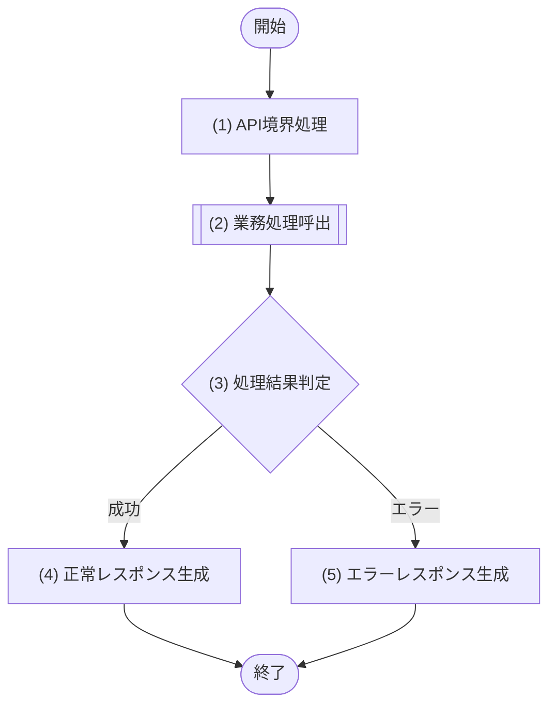

[← テンプレート一覧](README.md)

<!-- 本節は統合設計書「6. API設計」の詳細設計テンプレート。API一覧に登録した全APIについて、§6.x の個別APIブロックを複製して定義する。代表APIだけを詳細化してはならない -->
<!-- APIはCloudflare Workers上のHTTP通信境界に限定する。認証・認可、HTTP/JSONの構文検証、相関ID付与、単一の業務モジュール呼出、HTTPレスポンス変換だけを担当し、業務判断・原子実行境界・監査・データアクセスは呼出先モジュールへ委譲する -->
<!-- APIおよびJOBからCloudflare D1へ直接アクセスしてはならない。API/JOB本文からenv.DB、D1 Workers Binding API、テーブル(TBL)、クエリ(SQL)を参照・実行することも禁止する。個別APIの処理詳細には呼び出す単一のM-ID/IF-ID、論理処理名、引数、論理結果からHTTP結果への変換だけを記載する -->
<!-- APIの存在、シーケンスごとのAPI-ID、M-001からの呼出順、主処理モジュールへの接続は§3.1・§3.1.2を構成上の正本とし、本章ではHTTP契約と境界処理を詳細化する -->

# 6. API設計

<!--
【6.1 API共通設計】
定義内容: 全APIへ適用する通信境界、認証認可、形式、エラー、ページング、競合、冪等性、依存方向を定義する。
定義する条件: APIを持つシステムで必須。
定義ルール:
- API境界は原則として1つの業務モジュールの公開処理だけを呼び出す。複数モジュールの調整は業務モジュール内で行う。
- API/JOBはD1・`env.DB`・D1 Workers Binding API・TBL・SQLへ直接アクセスまたは直接参照しない。D1 batchや原子実行の開始・終了も行わない。
- 個別APIは共通事項を再定義せず、差分だけを記載する。
-->
## 6.1 API共通設計

| 観点 | 仕様 |
|---|---|
| 実行基盤 | 本番Cloudflare Workers Paid。HTTPハンドラーはWorkerの `fetch` 経路で実行する |
| ベースパス | `/api` |
| データ形式 | 原則 `application/json; charset=utf-8`。ファイル応答は個別APIで定義する |
| 認証 | 認証APIを除き、認証トークンを `Authorization: Bearer {token}` で受け付ける |
| 認可 | API境界で認証主体を確定し、§2.2の各UCで定義した操作権限・閲覧スコープ・項目制御に対する最終認可は呼出先業務モジュールへ委譲する |
| 相関ID | `X-Request-ID` を受理し、未指定時はAPI境界で生成する。応答と業務モジュール呼出へ同じ値を伝播する |
| 日付・日時 | 日付は `YYYY-MM-DD`、日時はタイムゾーン付きISO 8601 |
| エラー形式 | `errorCode`、`message`、`fieldErrors[]`、`traceId` を持つ共通JSON |
| ページング | ページングを採用する個別APIでは、`page` は1始まり・既定1、`pageSize` は既定20・上限100とし、応答に `page`、`pageSize`、`total`、`hasNext` を返す |
| 更新競合 | 更新要求の `version` と現在版を業務モジュールで比較し、不一致時は409を返して上書きしない |
| 部分更新 | 省略項目は現値保持、明示nullは個別APIで解除可能としたNULL可項目だけに許可する。業務モジュールが現値とマージしてからデータアクセスモジュールへ渡す |
| 冪等性 | GETの再実行可否、更新系の二重実行防止方式を定義する。`Idempotency-Key` を採用する場合は、キー、要求ハッシュ、処理状態、応答をモジュール管理下の永続領域へ保存する方式まで定義する |
| 個人情報 | 認証主体の権限と利用目的に必要な項目だけを返す。返却可能項目の判定は業務モジュールの論理結果に従う |
| 依存方向 | `画面 → M-001 プレゼンテーション → Cloudflare Worker API → 単一業務モジュール → M-006 → Cloudflare D1`。APIはM-006、D1 binding、SQL、物理表を認識しない |
| Binding注入 | Workerの構成境界は `env` をM-006の生成経路だけへ渡し、APIには業務モジュール公開IFだけを注入する。APIの型・引数・状態に `env.DB` またはD1オブジェクトを含めない |
| 完了保証 | 応答に必要な業務更新は業務モジュール呼出を `await` して完了後に応答する。`ctx.waitUntil()` に必須の永続化を委ねない |

### 6.1.1 API境界の責務

- HTTPヘッダー、パス、クエリ、ボディを受理し、認証主体と論理入力を組み立てる。
- §6.x.4 の構文・形式バリデーションを実施する。
- 個別APIで定義した単一の業務モジュール公開処理を1回呼び出す。
- 業務モジュールの論理結果をHTTPステータス・レスポンス項目・共通エラー形式へ変換する。
- `env.DB`参照、D1 API呼出、テーブル参照、クエリ実行、業務状態判定、D1 batch制御、監査記録を行わない。
- Workerコンテキストを業務モジュールへ横流しせず、認証主体・相関ID・論理入力・期限等の必要な論理値だけを渡す。

### 6.1.2 共通エラーレスポンス

| 項目名 | 型 | 必須 | 説明 |
|---|---|---|---|
| errorCode | string | Yes | 機械判定用エラーコード |
| message | string | Yes | 利用者向けメッセージ |
| fieldErrors | array | Yes | 項目エラー。項目に閉じない場合は空配列 |
| fieldErrors[].field | string | No | 対象項目名 |
| fieldErrors[].reason | string | No | エラー理由コード |
| traceId | string | Yes | 問い合わせ・ログ相関用ID |

### 6.1.3 固定コードAPI参照表

固定コード値の唯一の正本は§2.4とし、本表にはAPI項目名、NULL可否、§2.4で定義した許可値を転記して物理契約との対応を示す。API境界と呼出先業務モジュールの双方で列挙外を拒否する。

| API項目名 | NULL | §2.4の許可値 |
|---|---|---|
| `<codeItem>` | 可 / 不可 | `<CODE_A>` / `<CODE_B>` |

<!--
【6.1.4 認可・閲覧範囲のAPI適用】
定義内容: §2.2の各UCで定義した認可条件を、API利用条件・データスコープ・返却/更新項目へ対応づける。
定義する条件: ロール、所属、本人性または項目でAPI契約が変わる場合に必須。
定義ルール: 全ロールを列挙し、スコープ、利用可能API、対象条件、項目許可、複数ロール合成、ロールなしDENYを省略しない。
-->
### 6.1.4 認可・閲覧範囲のAPI適用

固定ロールコードの正本は§2.4、操作権限、閲覧スコープおよび項目許可の正本は§2.2の各ユースケースとする。API境界は認証主体を渡し、業務モジュールが次表と§2.2から最終認可結果を確定する。

| ロールコード | データ閲覧スコープ | API利用条件・項目制御 |
|---|---|---|
| `<ROLE_CODE>` | `ALL` / `ORGANIZATION` / `SELF` | <利用可能API、対象条件、返却項目または更新可能項目> |

- 複数ロール時の操作権限・項目許可の合成、スコープ優先順位、許可組織集合、ロールなし時のDENYを§2.2と同じ規則で明記する。
- マスター候補取得等で管理者だけが無効データを取得できる場合は、通常参照と管理参照の条件を分けて記載する。

<!--
【6.1.5 マスター利用可否の共通契約】
定義内容: 更新可能マスターの手動利用可否、有効期間、候補条件、更新・無効化の共通意味を定義する。
定義する条件: 手動利用可否と有効期間を持つマスターAPIがある場合に必須。
定義ルール: 未来開始前・期限到来後・手動無効を区別し、即時無効化と将来終了予約、任意終了日未指定時の扱いを一意にする。
-->
### 6.1.5 マスター利用可否の共通契約

- 手動利用可否と有効期間を独立して定義し、指定日時点で業務利用可能となる論理条件を記載する。
- 未来開始前、期限到来後、手動無効の各状態を区別する。
- 即時無効化時に更新する項目、終了日の必須/任意、終了日未指定時の現値保持、更新操作による将来終了予約を明記する。

<!--
【6.2 API一覧】
定義内容: 全APIのID、HTTPメソッド、パス、目的、権限、呼出先業務モジュールを一覧化する。
定義する条件: 必須。
定義ルール:
- 1行を1つのHTTPメソッド・1つのパスに対応させる。登録と更新を1行へ併記しない。
- 呼出モジュールは1 APIにつき原則1件とし、定義済みのM-ID/IF-IDまで完全修飾する。
-->
## 6.2 API一覧

| API-ID | Method | Path | 目的 | 主な権限 | 呼出モジュール |
|---|---|---|---|---|---|
| API-XXX | GET / POST / PUT / PATCH / DELETE | `/api/xxx` |  |  | M-002/IF-XX（ログイン以外）/ M-003/IF-XX（ログイン） |

<!--
【6.x 個別API】
定義内容: API一覧に登録した各APIの完全な物理契約と、単一モジュール呼出までの境界処理を定義する。
定義する条件: API一覧の全行について必須。このブロックをAPI件数分反復する。
構成: 基本情報、リクエスト項目、レスポンス項目、バリデーション、処理フロー、番号対応の処理詳細、エラー定義。
定義ルール:
- JSONキー、ヘッダー名、HTTPパス以外の実装クラス名・物理メソッド名は記載しない。
- 処理フローと処理詳細の番号・名称・出現順を一致させる。
- モジュール呼出は処理詳細に定義済みのM-ID/IF-IDと論理処理名で記載し、APIから下位データアクセスへ分岐させない。
- 固定業務コードは§2.4を正本として許可値を列挙し、未知コードとロール非許可値を区別する。
- 認可は§2.2の各UC定義を正本とし、個別APIで許可ロール、対象スコープ、返却項目または更新可能項目を省略せず列挙する。複数ロール時の合成は業務モジュールへ委譲し、API境界だけで確定しない。
- 文字列入力は、API境界の型・ペイロード上限検証と、業務モジュールで行う前後空白除去・Unicode正規化・正規化後の空文字/長さ/形式検証を区別して記載する。部分更新では省略、明示null、空文字を区別する。
- 省略可能な検索・出力条件は個別APIごとに既定値を明記し、`ALL`等の全件指定と省略時既定値を同一視しない。
- 更新可能マスターの取得・更新APIは、手動利用可否と有効期間の関係、指定日時点の候補条件、即時無効化、終了日未指定時の現値保持を明記する。
- `createdAt`・`updatedAt`等の永続化結果日時は呼出先モジュールの結果を変換し、APIサーバーの現在時刻で代用しない。
- 項目選択型のファイルAPIは、fieldコード、ヘッダー、論理取得項目、整形、ロール別許可集合、既定順、指定順の扱いを個別API内に定義する。
- 基本情報は「API-ID / API名」「Method / Path」「冪等性 / 正常応答」の複合行を標準とする。既存設計との同期で分割行を使う場合は章内の全APIで統一し、情報を欠落させない。
- 呼出先公開IFが宣言する全業務例外、API境界の全検証例外・認証例外・技術例外を§6.x.7へ正確に1回ずつ割り当てる。発生元のないエラー、未変換の公開IF例外、同じ条件の重複割当を禁止する。
- 各§6.x.7のエラーは、そのAPIを利用する全画面の§4.0.2で共通制御またはMSGへ割り当てられていることを逆引き確認する。
-->
## 6.x XXX API

### 6.x.1 基本情報

| 項目 | 内容 |
|---|---|
| API-ID / API名 | API-XXX / <API名> |
| Method / Path | `<GET / POST / PUT / PATCH / DELETE>` / `/api/xxx` |
| 目的 |  |
| 実行権限 |  |
| トレース元 | F-XXX / UC-XXX |
| 呼出モジュール | M-002/IF-XX <論理処理名> / M-003/IF-XX <ログイン論理処理名>（ログインだけ） |
| 冪等性 / 正常応答 | <再実行・キー方針> / 200・201・204 |

### 6.x.2 リクエスト項目

<!-- 項目名はAPI上の物理名。場所は path / query / header / body。項目がない場合は「なし」を1行記載する -->

| 項目名 | 場所 | 型 | 必須 | 説明・制約 |
|---|---|---|---|---|
| xxxId | path | string | Yes |  |
| xxx | body | string | Yes / No |  |

### 6.x.3 レスポンス項目

| 項目名 | 場所 | 型 | 必須 | 説明 |
|---|---|---|---|---|
| xxxId | body | string | Yes |  |

<!-- 項目選択型ファイルAPIでは次表を追加し、fieldコードから出力列までを一意に対応づける -->

| fieldコード | 出力ヘッダー | 論理取得項目 | NULL・表示整形 | 許可ロール |
|---|---|---|---|---|
| `<fieldCode>` | <ヘッダー> | <業務モジュール結果の項目> | <空欄、日付、コード表示名等> | <ロール> |

省略時のfieldコード順、指定時に要求順を維持するか、CSV/XLSXのContent-Type、ファイル名、文字コード・BOM・改行・エスケープ、シート・セル型、数式注入防止を個別APIで定義する。

### 6.x.4 バリデーション

<!-- API境界で行う構文・形式検証を定義する。存在、重複、状態遷移、権限範囲、文字列の業務正規化後検証等はモジュールへ委譲する。固定コードは§2.4、認可は§2.2の各UC定義、出力fieldコードは個別APIの対応表との一致を検証する -->

| No | 対象 | 検証内容 | 違反時エラー |
|---:|---|---|---|
| 1 | xxx | 必須、型、形式、長さ、範囲等 | VALIDATION_ERROR |

### 6.x.5 処理フロー

### 6.x.6 処理詳細

| No | 処理名 | 種別 | 処理詳細 | 呼出先公開IF・論理処理名 | 引数・参照値 | 結果変換 |
|---:|---|---|---|---|---|---|
| 1 | API境界処理 | 境界 | 認証主体、相関ID、パス・クエリ・ボディから論理入力を生成する | - | HTTPリクエスト | 論理入力 |
| 2 | 業務処理呼出 | モジュール呼出 | 個別APIの業務処理を単一モジュールへ委譲する | M-002/IF-XX XXX処理（ログインはM-003/IF-XX ログイン処理） | 認証主体、相関ID、論理入力 | 論理処理結果 |
| 3 | 処理結果判定 | 判定 | (2)の論理処理結果が成功か、業務エラーかを判定する | - | (2)の結果 | 成功時は(4)、エラー時は(5) |
| 4 | 正常レスポンス生成 | 境界 | 成功結果を§6.x.3の項目と正常HTTPステータスへ変換する | - | (2)の成功結果 | 正常レスポンス |
| 5 | エラーレスポンス生成 | 境界 | 公開IFの業務例外または境界例外を§6.x.7の一意な行と共通エラー形式へ変換する | - | (2)のエラー結果または境界例外、traceId | エラーレスポンス |

### 6.x.7 エラー定義

| HTTP | エラーコード | 発生元 | 発生条件 | API境界の処理 |
|---:|---|---|---|---|
| 400 | VALIDATION_ERROR | API境界 | §6.x.4の検証違反 | 共通エラー形式へ変換する |
| 401 | UNAUTHENTICATED | API境界 | 認証情報がない、または無効 | 共通エラー形式へ変換する |
| 403 | FORBIDDEN | M-XXX/IF-XX | 呼出先公開IFが操作不可を返した | 共通エラー形式へ変換する |
| 404 | `<RESOURCE_NOT_FOUND>` | M-XXX/IF-XX | 呼出先公開IFの対象不存在例外 | 共通エラー形式へ変換する |
| 409 | `<BUSINESS_CONFLICT>` | M-XXX/IF-XX | 呼出先公開IFの競合・状態不整合例外 | 共通エラー形式へ変換する |
| 500 | INTERNAL_ERROR | API境界 / M-XXX/IF-XX | 想定外の内部異常 | 内部情報を隠して共通エラー形式へ変換する |

公開IFの例外一覧と本表を正逆照合し、該当しない404/409等の例示行は削除する。各エラーコードは§4.0.2で、利用画面の共通制御またはMSGへ対応づける。

<!-- API一覧の全件について、上記 §6.x.1〜§6.x.7 を反復する -->
