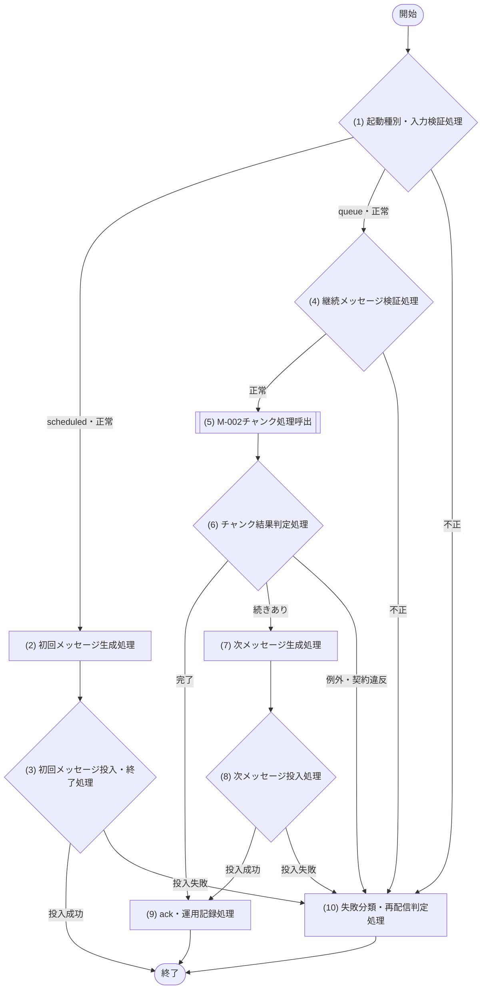

[← テンプレート一覧](README.md)

<!-- 本節は統合設計書「6. JOB設計」の詳細テンプレート。Cloudflare Workers Paid、Cloudflare Queues、Cloudflare D1を前提とし、Cron→scheduledハンドラー→Queue→queueハンドラー→JOB本体→M-002の40件単位処理を定義する。 -->
<!-- JOBハンドラーとJOB本体はCloudflare D1、env.DB、D1 API、物理データ構造、SQL、M-006へ直接アクセスしない。queueハンドラーはJOB本体を1回呼び、JOB本体からM-002の公開IFへデータ処理を委譲する。 -->
<!-- JOBの存在・正式名称とCron Trigger→scheduledハンドラー→Queues→queueハンドラー→JOB→M-002の接続順は[JOB一覧](06_JOB設計.md#62-job一覧)を構成上の正本とし、本章ではイベント・メッセージ・ハンドラー処理を詳細化する。 -->

# 6. JOB設計

**目次**

- [6.1 JOB設計方針](#61-job設計方針)
- [6.2 JOB一覧](#62-job一覧)
- [6.3 JOB-XXX XXX JOB](#63-job-xxx-xxx-job)

## 6.1 JOB設計方針

- 本番基盤はCloudflare Workers Paid + Cloudflare D1 + Cloudflare Queuesで固定する。
- Cron Triggerの `scheduled()` handlerは初回Queue messageを生成・投入するだけとし、対象取得、業務処理、M-002呼出、D1処理を行わない。JOBの起動契機はCron Triggerだけとし、認証済み手動入口などの追加起動経路は設けない。
- Queuesの`queue()`ハンドラーは1 messageにつき定義済みJOB本体をちょうど1回呼び、JOB本体はM-002の指定公開IFをちょうど1回呼び出す。ハンドラーとJOB本体は対象を反復せず、対象抽出・個別更新・D1原子実行をM-002以下へ委譲する。
- 1チャンクの対象上限は40件、D1 Statement内部予算は1 Worker invocation当たり900件とする。Paid planのhard limit 1,000件との差100件は制御、状態再読込み、障害確認用に残し、正常処理で使い切らない。
- D1 Statement数はM-002以下で、`batch()`内の各Statement、状態/version再読込み、即時再試行を各1件として実測し、JOB本体を介してqueueハンドラーへ論理結果として返す。queueハンドラーは900超過を契約違反として扱う。
- 継続messageは `cursor`、`chainRunId`、`chunkNo`、`businessDate`を必須契約とする。初回は `cursor=null`、`chunkNo=1`、継続時は同じ `chainRunId` / `businessDate`と次cursor、連続するchunkNoを使用する。
- Queue consumer設定は `max_batch_size=1`、`max_concurrency=1`、`max_retries=3`、DLQ必須とする。queueハンドラーは成功したmessageだけをackし、失敗を握りつぶさない。
- 即時再試行はM-006内のCloudflare推奨retryable allowlistに一致する一時障害だけに限定し、回数上限付きexponential backoff + full jitterを使用する。書込み結果不明時は状態/versionを再読込みしてから判断する。
- 過負荷、Worker timeout、CPU超過、memory超過は同一invocationで即時再試行せず、Queue redeliveryへ委ねる。最大再試行後はDLQへ移し、運用手順に従う。
- 必須のQueue投入とM-002呼出を完了までawaitする。必須処理を未完了のまま `ctx.waitUntil()` へ退避して終了またはackしない。
- `scheduled`ハンドラーへはQueue producerだけ、`queue`ハンドラーへはJOB本体だけ、JOB本体へはM-002公開IFだけを注入し、いずれにも`env.DB`、D1オブジェクト、SQL-ID、TBL-ID、M-006を渡さない。

## 6.2 JOB一覧

| JOB-ID | JOB名 | 目的 | 起動・継続経路 | 唯一の業務呼出先 |
|---|---|---|---|---|
| JOB-XXX | XXX JOB | <目的> | `scheduled()` → 初回Queue投入 → `queue()`ハンドラー → JOB本体 → 継続Queue | M-002/IF-XX（JOB本体が1 messageにつき1回。scheduled/queueハンドラーは直接呼ばない） |

<!-- 7.3のブロックをJOB-IDごとに複製する。処理フローの番号・名称は処理詳細と完全一致させる。 -->
## 6.3 JOB-XXX XXX JOB

### 6.3.1 基本情報

| 項目 | 内容 |
|---|---|
| JOB-ID / JOB名 | JOB-XXX / XXX JOB |
| 目的 / トレース元 | <目的> / UC-XXX |
| 本番基盤 | Cloudflare Workers Paid + Cloudflare D1 + Cloudflare Queues |
| Workers handler | `scheduled()`（初回message投入のみ） / `queue()`（JOB本体呼出・ack/retry・継続制御） |
| Cron Trigger | <Trigger名>、UTC Cron式、UTC予定時刻、業務IANAタイムゾーン、`controller.scheduledTime`からbusinessDateを確定する規則 |
| Queue / consumer | <Queue名> / <consumer名> |
| Queue設定 | `max_batch_size=1`、`max_concurrency=1`、`max_retries=3`、`dead_letter_queue="<DLQ名>"`。環境別Wrangler設定を[詳細設計への引継ぎ事項](11_詳細設計への引継ぎ.md#11-詳細設計への引継ぎ事項)と一致させる |
| チャンク上限 | 最大40対象 / Queue message。40件またはD1 Statement実測900件の先に達した方で終了する |
| D1 Statement上限 | 内部予算900 / Worker invocation、Workers Paid hard limit 1,000。100件を予約する |
| 多重・重複制御 | `chainRunId + chunkNo`を冪等キーとし、Queueのat-least-once配信、次message投入後の現message再配信、Cron再送をM-002以下で安全に判定する |
| 呼出モジュール / 公開IF | M-002 XXXアプリケーション / M-002/IF-XX `<チャンク処理名>` |
| 禁止事項 | JOBからM-006、D1、`env.DB`、D1 API、SQL、物理表へ直接アクセスしない |

### 6.3.2 起動パラメータ・継続message

#### scheduled入力

| 項目 | 型 | 必須 | 値・検証 |
|---|---|---:|---|
| scheduledTime | Integer | Yes | `controller.scheduledTime`（UTC epoch ms）。Cron式と許容時間差を検証する |
| businessDate | String | Yes | `YYYY-MM-DD`。scheduledTimeと業務IANAタイムゾーンから一意に確定する |

#### Queue message body

| 項目 | 型 | 必須 | 初回 | 継続・検証規則 |
|---|---|---:|---|---|
| cursor | String / null | Yes | `null` | M-002が返したopaqueな次cursor。JOBは分解・改変しない |
| chainRunId | String | Yes | JOB-ID、businessDate、scheduledTimeから安定採番 | 全チャンクで不変。長さ・文字集合・採番衝突を検証する |
| chunkNo | Integer | Yes | `1` | 前messageのchunkNo + 1。1以上の安全整数かつ上限を定義する |
| businessDate | String | Yes | 確定済み業務日 | 全チャンクで不変、`YYYY-MM-DD`、再配信でも再計算しない |

Queue envelopeのmessage IDとdelivery attemptは相関・運用判定だけに用いる。業務冪等性はbodyの `chainRunId + chunkNo`で保証し、配信ごとに変わり得る値へ依存しない。

### 6.3.3 処理対象

| 対象 | 抽出条件 | 除外条件 | 処理単位・順序 |
|---|---|---|---|
| <論理対象> | M-002/IF-XXでbusinessDateとcursorから決定 | M-002の業務条件で決定 | 安定順の最大40件。JOBは対象ID一覧、物理条件、内部cursorを生成しない |

### 6.3.4 処理フロー

### 6.3.5 処理詳細

#### (1) 起動種別・入力検証処理

- handler種別をscheduled、queueのいずれかへ一意に分類する。手動入口など追加の起動経路は設けない。
- scheduledはCron式、scheduledTime、業務IANAタイムゾーンからbusinessDateを確定する。
- queueはbatch内message数が1件であることを確認し、(4)へ渡す。
- 不正入力ではM-002を呼ばず、(10)へ進む。scheduledから業務処理へ直接分岐してはならない。

#### (2) 初回メッセージ生成処理

| 項目 | 設定値 |
|---|---|
| cursor | `null` |
| chainRunId | JOB-ID、businessDate、scheduledTimeから安定・一意に採番 |
| chunkNo | `1` |
| businessDate | (1)で確定した値 |

同じCron eventからは同じchainRunIdを再生成し、Queue投入の再試行で別chainを作らない。

#### (3) 初回メッセージ投入・終了処理

初回messageのQueue投入Promiseをawaitする。成功時はchainRunId、businessDate、投入messageの安全な相関情報を記録して終了し、M-002を呼ばない。失敗時はack相当の成功扱いをせず(10)へ進む。必須投入を `ctx.waitUntil()` へ退避しない。

#### (4) 継続メッセージ検証処理

`cursor`、`chainRunId`、`chunkNo`、`businessDate`の存在、型、長さ、値域、相関を検証する。cursorはnullまたはopaque stringのまま扱い、内容を解釈しない。schema不正は非retryable入力エラーとしてM-002を呼ばず(10)へ進む。

#### (5) M-002チャンク処理呼出

| M-ID / IF-ID | 処理名 | 呼出回数 |
|---|---|---:|
| M-002/IF-XX | <チャンク処理名> | 当該Queue messageでちょうど1回 |

| 引数 | 値 |
|---|---|
| cursor | message.cursor |
| chainRunId | message.chainRunId |
| chunkNo | message.chunkNo |
| businessDate | message.businessDate |
| maxItems | `40` |
| statementBudget | `900` |

| 結果 | 型 | 契約 |
|---|---|---|
| targetCount / successCount / skipCount / failureCount | Integer | 各0以上、targetCountは40以下、targetCount = successCount + skipCount + failureCount |
| nextCursor | String / null | hasNext=trueでは非空、falseではnull |
| hasNext | Boolean | 安定順で未処理対象が残る場合true |
| statementCount | Integer | 当該Worker invocationで実測したD1 Statement数。0〜900 |
| duplicate | Boolean | 同じchainRunId + chunkNoの再配信を既処理として扱ったか |
| writeOutcome | Enum | `CONFIRMED` / `NOT_APPLICABLE`。結果不明のまま正常を返さない |
| failureSummaries | Object[] | 対象を特定できる安全なIDと公開エラー分類。個人情報・生D1例外を含めない |

呼出をawaitする。M-002は最大40件かつ900 Statement以内で対象取得・処理・状態確認を完了し、D1アクセスはM-006公開IFだけを通す。

| M-002公開例外 | 発生条件 | retryable | (10)の扱い |
|---|---|---:|---|
| `<BUSINESS_EXCEPTION>` | [モジュール設計](07_モジュール設計.md#7-モジュール設計)の公開IFと同一 | No | 業務失敗を記録しack / 手動対応。要件に応じた扱いを一意に記載 |
| `<RETRYABLE_TEMPORARY>` | allowlist即時再試行後も一時障害 | Yes | 例外を返してQueue redelivery |
| `<WRITE_OUTCOME_UNRESOLVED>` | 状態/version再読込みでも確定不能 | Yes | 同一invocationで書込みを再送せずQueue redelivery |
| `<PLATFORM_OVERLOAD_OR_LIMIT>` | 過負荷、timeout、CPU、memory等 | Yes | 即時再試行せずQueue redelivery |
| `<NON_RETRYABLE_SYSTEM>` | 設定不備、契約違反、恒久障害 | No | ack可否とDLQ/運用隔離を具体化 |

完成版では[モジュール設計](07_モジュール設計.md#7-モジュール設計)の当該M-002公開IFが宣言する全例外を、本表へ重複なくちょうど1回割り当てる。

#### (6) チャンク結果判定処理

次の順序で副作用なしに判定する。

1. 型、非負性、件数式、targetCount <= 40、statementCount <= 900を検証する。不成立は契約違反として(10)へ進む。
2. writeOutcomeが確定済みであることを検証する。結果不明の正常扱いを禁止する。
3. failureCountと公開契約から業務上の完了/失敗を決定する。
4. hasNext=falseかつnextCursor=nullなら完了として(9)へ進む。
5. hasNext=trueかつnextCursorが非空なら続きありとして(7)へ進む。それ以外は契約違反として(10)へ進む。

#### (7) 次メッセージ生成処理

| 項目 | 設定値 |
|---|---|
| cursor | (5)のnextCursor |
| chainRunId | 現messageと同じ値 |
| chunkNo | 現message.chunkNo + 1 |
| businessDate | 現messageと同じ値 |

次messageの論理冪等キーを `chainRunId + (chunkNo + 1)`として固定する。件数、Statement数、対象ID一覧をcursorへ追加せず、M-002が発行したopaque値をそのまま引き継ぐ。

#### (8) 次メッセージ投入処理

次messageのQueue投入Promiseをawaitする。投入成功後だけ(9)へ進む。投入後・現message ack前に障害が起きた場合は現messageが再配信され得るため、M-002は `chainRunId + chunkNo`、次チャンクは `chainRunId + chunkNo + 1`で重複を無害化する。投入失敗は(10)へ進み、現messageをackしない。

#### (9) ack・運用記録処理

チャンク処理が確定し、hasNext=trueの場合は次message投入も確定した後で、現messageをackする。chainRunId、chunkNo、businessDate、message ID、delivery attempt、件数、statementCount、duplicate、hasNext、所要時間、公開エラー分類を記録する。cursor、生D1例外、SQL、個人情報はログへ出さない。

#### (10) 失敗分類・再配信判定処理

| 失敗分類 | 同一invocationの即時再試行 | Queue messageの扱い |
|---|---|---|
| Cloudflare推奨retryable allowlist一致の一時D1障害 | M-006内だけで、回数上限付きexponential backoff + full jitter | 解消しなければthrow/retryし、`max_retries=3`後にDLQ |
| 書込み結果不明 | 先にM-006経由で状態/versionを再読込み。未確定と判断できた場合だけallowlist規則内で再試行 | 判定不能ならthrow/retry、最大再試行後DLQ |
| 過負荷 / Worker timeout / CPU超過 / memory超過 | しない | Queue redelivery。最大再試行後DLQ |
| 業務エラー / schema不正 / 恒久設定不備 | しない | 無限再配信しない。ackして運用隔離するか、明示的にDLQへ送る方式を完成版で一意に定義 |
| M-002結果の契約違反 / 40件・900 Statement超過 | しない | 現messageを正常ackせず運用隔離。再配信で解消しない場合のDLQ送付方式を完成版で固定 |
| scheduledの入力不正 | しない | Queueへ投入せず実行失敗を返し、監査・アラート |
| scheduledの初回投入失敗 | しない（producer SDK/基盤の安全な再試行規則がある場合だけ別途定義） | 実行失敗を返しアラート。同じchainRunIdで再実行 |

Queue retry時は例外を握りつぶさず、redelivery対象messageを成功ackしない。DLQの監視、調査、businessDate固定の再投入、重複安全性、復旧承認者を[詳細設計への引継ぎ事項](11_詳細設計への引継ぎ.md#11-詳細設計への引継ぎ事項)へ定義する。

### 6.3.6 D1原子実行・冪等性・継続性

| 観点 | 設計 |
|---|---|
| D1アクセス | M-002以下がM-006公開IFを使用する。JOBはD1/SQL/M-006を参照しない |
| 原子実行 | 対象単位のTX-IDはM-002が宣言し、対応M-006公開IFが1回のD1 `batch()`で実行する |
| チャンク冪等性 | `chainRunId + chunkNo`の一意性、対象version、業務冪等キーをM-002/M-006で保証する |
| 継続順序 | 現チャンク確定 → 次message投入確定 → 現message ack。途中障害による重複は冪等キーで無害化する |
| statement予算 | maxItems=40、statementBudget=900。再読込み・即時再試行を含む実測値を返し、1,000へ到達させない |
| 多重起動 | `max_concurrency=1`に加え、異なるconsumer/Queue再配信も想定して永続的冪等性で防ぐ。設定だけを排他保証としない |

### 6.3.7 監視・運用

| 観点 | 必須設計 |
|---|---|
| メトリクス | chain開始/完了/失敗、chunk数、1 chunk件数、statementCount最大・累計、900接近回数、Queue遅延、delivery attempt、DLQ件数、重複件数 |
| アラート | 初回投入失敗、連続chunk失敗、statementCount予算超過、Queue滞留、`max_retries=3`到達/DLQ、未完了chain、timeout/CPU/memory失敗 |
| 相関 | JOB-ID、chainRunId、chunkNo、businessDate、message ID、traceIdを全handler・M-002結果で相関する |
| DLQ復旧 | 原因除去、状態/version確認、businessDate固定、同一chainRunId/適切なchunkNoでの再投入、二重反映検証、承認・証跡 |
| 設定同期 | WranglerのCron UTC式、producer/consumer binding、`max_batch_size=1`、`max_concurrency=1`、`max_retries=3`、DLQを[詳細設計への引継ぎ事項](11_詳細設計への引継ぎ.md#11-詳細設計への引継ぎ事項)・環境設定・試験で正逆照合する |
