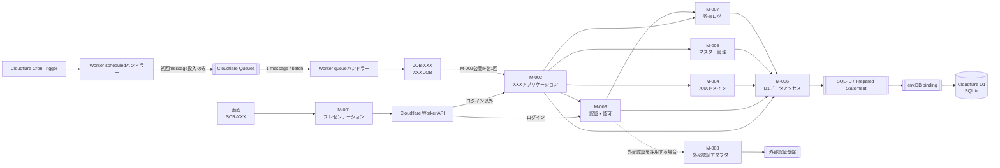
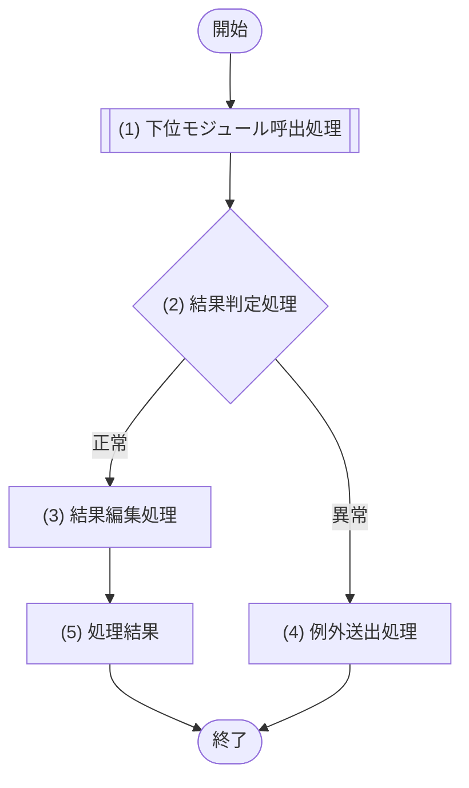
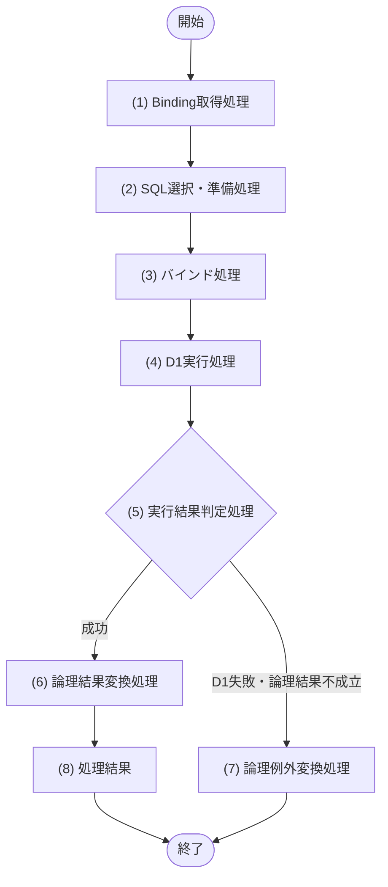

[← テンプレート一覧](README.md)

<!--
【8. モジュール設計】
定義内容: Cloudflare Workers上の対象システムを構成する論理モジュールの責務・依存関係と、各公開インターフェースの入出力・例外・処理フロー・処理詳細・D1原子実行・競合制御を、実装可能な詳細設計レベルで定義する。
定義する条件: 全システムで必須。
構成: 8.1 論理モジュール構成 / 8.2 モジュール責務 / 8.3 依存・データアクセスルール / 8.4 公開インターフェース一覧 / 8.5 個別モジュール詳細 / 8.6 レビュー観点。
定義ルール:
- モジュールIDは M-XXX、公開インターフェースIDは各モジュール内で IF-XX とし、他文書からは M-XXX/IF-XX で参照する。
- モジュールの存在・正式名称・上位からの接続順は§3.1・§3.1.2と一致させ、本章では責務・公開IF・内部処理を詳細化する。
- 画面はM-001だけを呼び、M-001はCloudflare Worker APIだけを呼び出す。APIはログイン以外をM-002、ログインをM-003に委譲する。JOBはM-002に委譲する。
- API・JOB はCloudflare D1へ直接アクセスせず、`env.DB`、D1 API、SQL、テーブルを直接参照しない。API・JOB の処理フロー・処理詳細には SQL-ID、テーブル物理名、TBL-ID、D1 binding処理を記載してはならない。
- Workerの `env.DB` bindingを受領・参照し、D1の `prepare()` / `bind()` / `first()` / `all()` / `run()` / `raw()` / `batch()`を呼び出せるのはM-006だけとする。M-001〜M-005・M-007・M-008へD1オブジェクトを渡さない。
- 8章の個別モジュール設計でSQL-IDを記載できるのは、概要・公開IF対応表・処理詳細を含むM-006ブロック内だけとする。他モジュールはM-006の公開インターフェースをM-006/IF-XXで呼び出す。
- M-007 も監査ログを直接保存せず M-006 に委譲する。M-008 だけが外部認証基盤を直接呼び出せる。
- 複数Statementを不可分にする1つのTX-IDは、1つのM-006公開IFで受け付け、M-006がPrepared Statement配列へ変換して1回の `env.DB.batch()` で実行する。上位モジュールが複数M-006 IFを順に呼んで1つのbatchとみなしてはならない。
- フローの全番号付きノードを同じ番号・名称で処理詳細に展開し、暗黙の取得・判定・更新を残さない。複数IFが完全に同一のフローを使う場合だけ、共通フローとIF別対応表による定義を許可する。
- M-002は§2.4の固定コード、§2.2の各UCで定義した操作権限・閲覧スコープ・項目許可集合、項目選択APIのロール別許可集合、期間・状態等の業務妥当性を明示的に検証してからM-006を呼び出す。
- 登録・更新日時を公開結果へ返すIFは、M-006が返す永続化結果日時を上位へ伝播し、別モジュールの現在時刻で代用しない。無更新時の日時も取得元を定義する。
-->
# 8. モジュール設計

<!--
【8.1 論理モジュール構成】
定義内容: 画面・Workers API・Workers JOB・モジュール・SQL・D1 binding・Cloudflare D1・外部システムの許可された依存方向を示す。
定義する条件: 必須。
定義ルール:
- API はログイン以外を M-002、ログインを M-003 にだけ委譲する。
- JOB は M-002 にだけ委譲する。
- SQL、D1 binding、Cloudflare D1の直前に必ずM-006を置き、`env.DB`を他要素へ接続しない。
- 外部認証基盤の直前には必ず M-008 を置く。
-->
## 8.1 論理モジュール構成

`scheduled()`と手動再実行入口はQueue producerだけを受け取り、M-002・M-006・D1へ接続しない。queueハンドラーは `max_batch_size=1` / `max_concurrency=1`でJOB本体を1回呼び、JOB本体が`cursor`、`chainRunId`、`chunkNo`、`businessDate`をM-002へ渡す。D1への許可経路は図示したM-006経由だけとする。M-008と外部認証基盤は外部認証採用時だけ残し、採用時は先に§3.1へ両participantを登録してログインシーケンスへ接続する。

<!--
【8.2 モジュール責務】
定義内容: 各モジュールの主な責務と非責務を一覧化する。
定義する条件: 全モジュールを1行ずつ定義する。
項目説明: モジュールID / モジュール名 / 主な責務 / 担当しないこと。
定義ルール:
- `env.DB`参照・Prepared Statement生成・bind・D1実行はM-006の責務として一意に置く。
- 外部認証基盤呼び出しは M-008 の責務として一意に置く。
- 業務フロー制御、業務判定、マスター判定、認証認可、監査データ生成を分離する。
-->
## 8.2 モジュール責務

| モジュールID | モジュール名 | 主な責務 | 担当しないこと |
|---|---|---|---|
| M-001 | プレゼンテーション | 画面表示・入力受付・API呼び出し・画面状態制御 | API内部処理、業務判定、D1/SQL/TBL参照 |
| M-002 | XXXアプリケーション | ログイン以外の業務ユースケース制御、D1原子更新の論理境界宣言、下位モジュールの調停 | SQL実行、`env.DB`参照、D1 Statement生成、画面表示、認証基盤呼び出し |
| M-003 | 認証・認可 | ログイン制御、認証状態・操作権限・閲覧範囲の判定 | 業務データ更新、SQL/D1実行、認証基盤への直接接続 |
| M-004 | XXXドメイン | 業務状態・期間・一意性・更新可否等のドメイン判定 | HTTP制御、SQL/D1実行、認可判断 |
| M-005 | マスター管理 | マスター取得・有効性・重複・更新可否の判定 | ユースケース全体制御、SQL/D1実行 |
| M-006 | D1データアクセス | `env.DB` bindingの受領、`prepare()` / `bind()` /実行/`batch()`、D1結果・例外の論理形式への変換 | 業務ルール・認可・画面制御、D1オブジェクトの上位返却 |
| M-007 | 監査ログ | 監査イベント生成、記録要否・記録内容の決定 | D1直接保存、`env.DB`参照、SQL実行、業務データ更新 |
| M-008 | 外部認証アダプター | 外部認証基盤呼び出しと外部形式から内部形式への変換 | D1/SQL実行、業務認可の最終判定 |

具象化時は§3.1に存在するM-IDと本表を完全一致させる。上表のM-008は条件付き候補であり、外部認証を採用しない場合はM-008行・§8.1の経路・個別設計を削除する。採用する場合は§3.1とログインシーケンスへ`M-008 外部認証アダプター`および外部認証基盤を先に追加する。

<!--
【8.3 依存・データアクセスルール】
定義内容: モジュール間呼び出し、D1/SQL、外部システム、D1原子実行に関する禁止・許可ルールを規範として定義する。
定義する条件: 必須。
定義ルール: 「原則」ではなく、レビューで適否を一意に判定できる禁止・許可表現で記載する。
-->
## 8.3 依存・データアクセスルール

1. 画面はM-001だけを呼び、M-001はCloudflare Worker APIだけを呼び出す。画面とM-001は業務モジュール・SQL・D1を直接呼び出してはならない。
2. API はログイン以外を M-002、ログインを M-003 にだけ委譲する。API から M-004〜M-008 を直接呼び出してはならない。
3. queueハンドラーはJOB本体だけを呼び、JOB本体はM-002にだけ委譲する。queueハンドラーとJOB本体はM-003〜M-008、SQL、D1を直接呼び出してはならない。
4. 個別API・JOBの処理フロー、処理詳細、入出力、注入契約には、実行依存として `env.DB`、D1オブジェクト/API、SQL-ID、TBL-ID、テーブル物理名、SQL文、binding情報を記載してはならない。アーキテクチャ上の共通禁止事項、クエリ予算、トレース説明はこの限りでない。
5. `env.DB`を受領・参照し、D1の `prepare()` / `bind()` / `first()` / `all()` / `run()` / `raw()` / `batch()`を呼び出せるのはM-006だけとする。
6. 8章の個別モジュール処理でSQL-IDを記載できるのは、M-006の処理詳細だけとする。M-001〜M-005・M-007・M-008の処理詳細にはSQL-IDを記載してはならない。M-006の概要・公開IF対応表、および6・9・10章の正規トレースでの参照は許可する。
7. M-002〜M-005・M-007 がデータを参照・更新するときは、M-006 の公開インターフェースを呼び出す。
8. M-007 は監査イベントを生成して M-006 に渡し、自ら監査ログストアや DB へ接続しない。
9. M-008 だけが外部認証基盤を直接呼び出せる。他モジュールは M-008 の公開インターフェースを利用する。
10. 原子更新境界はM-002がTX-IDとして業務単位で宣言し、対応する1つのM-006公開IFが全Prepared Statementを1回の `env.DB.batch()` で実行する。単一StatementはD1自動コミットとし、明示的BEGIN/COMMIT/ROLLBACKを設計しない。
11. モジュール間の循環依存を禁止する。処理結果を見て分岐するときは取得・更新処理と判定処理を別ノードにする。
12. M-003は§2.2の各UCの認可定義を正本として、有効ロール、操作、対象、基準日から`ALL` / `ORGANIZATION` / `SELF`等の論理スコープを解決する。複数ロールの合成、組織子孫集合、本人紐付けなし、ロールなしの動作を公開IF契約へ明記する。
13. M-002がスコープ付きデータ取得をM-006へ依頼するときは、`scopeType`、操作者業務主体ID、許可組織ID集合、基準日を暗黙値にせず毎回渡す。M-006は受領済み条件をSQLへバインドするだけで認可を拡張しない。
14. Worker構成境界は `env` をM-006生成経路だけへ渡し、API・JOBにはM-002/M-003の公開IFだけを注入する。M-006以外の入力・出力・状態・例外へD1型を露出しない。
15. M-006が実行するSQLは§9の静的SQL-IDから選択し、値は順序付きplaceholderへ `bind()` する。動的な値の文字列連結、未定義SQL、任意SQL実行IFを禁止する。
16. API応答またはJOB完了に必要な更新は、呼出元が公開IFの完了をawaitする。必須永続化を `ctx.waitUntil()` へ退避しない。
17. placeholderを使うSQLは `?1`〜`?N`（`1 <= N <= 100`）を欠番なく使用し、最大ordinal N、§9のbind定義数、M-006の `.bind()` 引数数を一致させる。placeholderなしのSQLでは `.bind()` を呼ばない。
18. JOB本体が呼ぶM-002公開IFは、`cursor`、`chainRunId`、`chunkNo`、`businessDate`、`maxItems=40`、`statementBudget=900`を入力とし、処理件数、次cursor、継続有無、当該Worker invocationのD1 Statement実測数を返す。900到達前にチャンクを終了し、Paid planのhard limit 1,000を使い切らない。
19. D1への即時再試行は、Cloudflare公式資料を確認して§12で版管理したretryable allowlistに一致する一時障害だけに限定し、回数上限付きexponential backoff + full jitterを用いる。過負荷、Worker timeout、CPU超過、memory超過は即時再試行せず、Queue redeliveryへ返す。
20. 書込み結果が不明な障害では、同じ書込みを再送する前にM-006が状態またはversionを再読込みし、確定済み・未確定・競合を判定する。再読込みもStatement実測数へ加算し、判定不能時はQueue redeliveryへ返す。

<!--
【8.4 公開インターフェース一覧】
定義内容: 全モジュールが公開するインターフェースを一覧化し、呼出元と処理種別を示す。
定義する条件: 必須。全公開IFを1行ずつ記載する。
項目説明:
- IF ID: モジュール内ローカルID(IF-XX)。完全修飾IDは M-XXX/IF-XX。
- 公開機能名: 論理名。「〜取得」「〜判定」「〜登録」「〜更新」「〜実行」等。
- 呼出元: 許可された呼出元(API / JOB / M-XXX)。
- 処理種別: 参照 / 更新 / 判定 / 制御 / 外部連携 / 表示制御。
-->
## 8.4 公開インターフェース一覧

| モジュール | IF ID | 公開機能名 | 呼出元 | 処理種別 |
|---|---|---|---|---|
| M-XXX | IF-01 |  |  | 参照 / 更新 / 判定 / 制御 / 外部連携 / 表示制御 |

<!--
【8.5 個別モジュール詳細】
定義内容: 各モジュールの全公開IFを集約表で契約化し、各IFまたは完全に同一のIF群について処理フローと番号対応の処理詳細を定義する。
定義する条件: 全モジュール・全公開IFで必須。
定義ルール:
- 8.X.1 モジュール概要、8.X.2 公開インターフェース詳細（集約表）、8.X.3以降にIF別または共通の処理フロー・処理詳細・原子性/競合/冪等性を配置する。
- 8.X.2は1行1IFで「IF / 概要 / 入力 / 出力 / 例外 / 原子性・競合・冪等性」を欠落なく記載する。入力・出力・例外を別小節へ分散させず、一覧から全契約を比較できる形式を正本とする。
- 複数IFの処理手順が完全に同じ場合だけ、モジュール単位の共通処理フローとIF別処理詳細対応表へ集約できる。この場合も全IFの差異を表の各行に記載する。
- フローの番号付きノードと処理詳細の見出しを、番号・名称とも厳密一致させる。
- 他モジュール呼び出しは M-XXX/IF-XX、外部システム呼び出しは外部システム名で示す。
- SQL-ID・D1実行方式・bind対応表はM-006の処理詳細だけに置く。他モジュールでは「利用SQL」節自体を作らない。
- 固定コード入力は§2.4との一致判定、項目選択入力はロール別許可集合・既定順・要求順の扱いを、担当業務モジュールの処理詳細に記載する。
- 認可を扱うIFは§2.2の該当UCとの対応を示し、入力目的ごとの許可ロール、対象スコープ、返却項目/更新可能項目、複数ロール時の合成、拒否条件を処理詳細へ記載する。
- 文字列を正規化する更新IFは、前後空白除去、Unicode正規化、正規化後の空文字・長さ・形式検証、現値との正規化後比較、変更履歴生成、M-006呼出の順をフローまたは処理詳細で固定する。省略、明示null、空文字を区別する。
- 更新可能マスターを扱うIFは、手動利用可否と有効期間を独立に判定し、即時無効化、将来の期間終了予約、終了日未指定時の現値保持を処理詳細へ記載する。
- 参照結果を判定して更新するIFは、条件付きDML、期待変更行数、UNIQUE/CHECK/FOREIGN KEY/trigger、同一D1 batchでTOCTOUを防ぐ。再試行対象・上限・最終例外を定義し、画面/APIで検証済みでも業務モジュールで再検証する。
- 将来予約・期間履歴・階層・上長等の時間依存参照を扱うIFは、後続更新で不変条件が破れないよう逆参照検証、置換/取消方針、マスター期間包含を定義する。
- M-006の出力契約には、上位APIが必要とする永続化結果（版数、登録・更新日時等）をSQLのRETURNING結果またはD1 Resultメタデータから漏れなく含める。
- 構造化した変更概要を保存・表示する場合は、schemaVersion、変更イベントごとのfieldCode/operation生成表、許可キー・値、重複排除と並び順、実変更なし時の非生成、個人情報を保存しない規則、API表示文字列への変換、不正データ時の安全な代替表示を業務モジュールの共通契約として定義する。
- 変更者表示は必須文字列となるフォールバック表を定義する。JOB、社員に紐づくAPI利用者、社員未紐付け/論理削除済み利用者、想定外の操作者欠落を区別し、想定外時の運用警告も定義する。
-->
## 8.5 個別モジュール詳細

<!-- 以下の一般モジュール形式を§3.1に登録したM-001〜M-005・M-007と、外部認証採用時だけM-008について反復し、その後のM-006専用形式でデータアクセスを定義する。 -->

### 8.X M-XXX <モジュール名>

#### 8.X.1 モジュール概要

| 項目 | 内容 |
|---|---|
| モジュールID | M-XXX |
| モジュール名 |  |
| 目的 |  |
| 主な呼出元 |  |
| 呼出可能先 |  |
| 状態保持 | なし / あり(保持内容・範囲) |

#### 8.X.2 公開インターフェース詳細

| IF | 概要 | 入力 | 出力 | 例外 | 原子性・競合・冪等性 |
|---|---|---|---|---|---|
| IF-01 <公開機能名> | <目的・事前/事後条件> | <項目、型、必須/任意、NULL/省略、制約> | <項目、型、0件時> | <公開例外コードを全列挙> | 参照のみ / TX-XXX、競合条件、再実行方針 |
| IF-XX JOBチャンク処理 | 安定順の次チャンクを処理する | cursor:String/null、chainRunId:String、chunkNo:Integer、businessDate:Date、maxItems=`40`、statementBudget=`900` | 件数、nextCursor、hasNext、statementCount、duplicate、writeOutcome、失敗分類 | 業務例外、retryable一時例外、WRITE_OUTCOME_UNRESOLVED、実行基盤例外、契約違反を全列挙 | 対象単位TX-ID、chainRunId+chunkNo、version/冪等キー。最大40件・900 Statement |

M-002がJOB本体から呼ばれる場合はJOBチャンク処理行を残し、他モジュールまたは非該当システムでは削除する。該当時は後続の処理フロー・処理詳細を当該IF用に複製する。

このIFの処理フロー・処理詳細には、入力検証、冪等状態確認、安定順対象取得、40件/900 Statementの予算判定、対象単位処理、書込み結果不明時の状態/version再読込み、次cursor生成、集計結果生成を番号付きで全て置く。D1アクセスは各ノードからM-006公開IFへ委譲し、SQL-IDや物理名はM-002側へ記載しない。

#### 8.X.3 IF-01 <公開機能名> 処理フロー

#### 8.X.4 IF-01 <公開機能名> 処理詳細

| No | 処理名 | 呼出先 | 入力・参照値 | 処理内容 | 出力・分岐・例外 |
|---:|---|---|---|---|---|
| 1 | 下位モジュール呼出処理 | M-XXX/IF-XX | 入力.xxx | 論理入力を渡して公開IFを1回呼び出す | 下位結果 |
| 2 | 結果判定処理 | - | (1)の結果 | 成功・業務例外を副作用なしで判定する | 成功は(3)、異常は(4) |
| 3 | 結果編集処理 | - | (1)の成功結果 | 公開契約へ編集する | (5)へ |
| 4 | 例外送出処理 | - | (1)の業務例外 | §8.X.2に宣言した一意な公開例外へ変換する | 公開例外 |
| 5 | 処理結果 | - | (3)の結果 | 公開契約の結果を返す | 出力 |

処理フローの全番号・名称・分岐を本表へ同じ順で記載する。判定行ではデータ取得・更新・外部呼出を行わず、暗黙の処理を文章へ埋め込まない。

#### 8.X.5 原子性・競合・冪等性

| IF | TX-ID / M-006公開IF | 競合保証 | 失敗・再試行 | 冪等性 |
|---|---|---|---|---|
| IF-01 | なし / TX-XXX・M-006/IF-XX | version、UNIQUE、trigger等の論理要件 | 再試行対象、上限、最終公開例外 | 同一入力再実行時の結果 |

### 7.Y M-006 D1データアクセス

#### 7.Y.1 モジュール概要

| 項目 | 内容 |
|---|---|
| モジュールID | M-006 |
| 目的 | 静的SQL-IDをD1 Prepared Statementとして実行し、物理結果・例外を論理契約へ変換する |
| 主な呼出元 | M-002〜M-005、M-007（許可した公開IFだけ） |
| 呼出可能先 | Cloudflare D1のみ |
| Binding | `env.DB`。M-006生成時だけ受領し、外部へ公開・返却・共有しない |
| 状態保持 | リクエスト/JOB実行をまたぐ可変状態なし。Prepared Statement、bind値、D1結果は呼出単位 |

#### 7.Y.2 公開インターフェース詳細

| IF | 概要 | 論理入力 | 論理出力 | 論理例外 | SQL・D1実行 | TX-ID |
|---|---|---|---|---|---|---|
| IF-01 <取得名> | <取得目的> | <物理名を含まない検索条件> | <論理行/一覧、0件時、Statement実行数> | DATA_ACCESS_ERROR等 | SQL-XXX / `first()`・`all()`・`raw()` | なし（参照） |
| IF-02 <原子更新名> | <不可分な更新目的> | <検証済み更新command> | <永続化日時・version、Statement実行数等> | CONFLICT、DUPLICATE、DATA_ACCESS_ERROR等 | SQL-XXX → SQL-YYY / 1回の `batch()` | TX-XXX |

TX-IDを持つ更新は1行1公開IFとし、上位が複数M-006 IFを連続呼出して原子更新を組み立てない。任意SQL文字列、D1Database、D1PreparedStatement、D1Resultを公開入力・出力へ含めない。

#### 7.Y.3 共通処理フロー

#### 7.Y.4 共通処理詳細（IF別対応表）

| No | 処理名 | 対象IF | D1 API | 処理内容 | 結果・例外 |
|---:|---|---|---|---|---|
| 1 | Binding取得処理 | 全IF | `env.DB` | M-006内部に注入済みのbindingを取得する。接続pool・接続開始は行わない | binding欠落は設定例外 |
| 2 | SQL選択・準備処理 | 全IF | `prepare()` | §9のSQL-IDに対応する静的SQLを選び、Statementを準備する。入力値でSQL本文を連結しない | Prepared Statement |
| 3 | バインド処理 | 全IF | `bind()` | §9の `?1`〜`?N`（1〜100、欠番なし）と論理入力を型・NULL規則どおりbindし、最大ordinal Nと引数数を一致させる。placeholderなしでは呼ばない | bind済みStatement。`undefined`は禁止。ordinal・定義・引数数不一致は実行前の設計/実装エラー |
| 4 | D1実行処理 | 参照IF | `first()` / `all()` / `raw()` | §9で指定した方法を1回実行する | D1結果 |
| 4 | D1実行処理 | 単一更新IF | `run()` | 単一Statementを自動コミットで実行する | D1結果メタデータ |
| 4 | D1実行処理 | TX-XXX更新IF | `batch()` | 全Statementを事前にprepare/bindし、定義順の配列を1回だけ実行する | 同順の結果配列。1件失敗時は全体ロールバック |
| 5 | 実行結果判定処理 | 全IF | - | 成否、0/1/複数行、変更行数、期待件数を副作用なしで判定する。batch後の件数不一致はロールバック済みとはみなさない | 成功は(6)、失敗は(7) |
| 6 | 論理結果変換処理 | 全IF | - | SQLiteのINTEGER真偽、TEXT日時/JSON、NULL、列名を公開IFの論理型へ変換する | M-006論理出力 |
| 7 | 論理例外変換処理 | 全IF | - | constraint/trigger/期待件数/D1障害を安定した論理例外へ変換し、生エラー・SQL・個人情報を上位へ出さない | §8.Y.2の論理例外 |
| 8 | 処理結果 | 全IF | - | D1オブジェクトを含まない論理結果を返す | 呼出元へ返却 |

#### 7.Y.5 SQL・bind・結果対応

| IF | Statement順 | SQL-ID | D1実行 | bind順: placeholder → 論理入力 → `.bind()`引数 | 期待結果・変更件数 | 論理出力/例外 |
|---|---:|---|---|---|---|---|
| IF-01 | 1 | SQL-XXX | `all()` | 1:`?1`→入力.xxx→第1引数、2:`?2`→入力.yyy→第2引数 | 0..n行 | 一覧 |
| IF-02 | 1 | SQL-YYY | `batch()` | 1:`?1`→入力.xxx→第1引数 | 変更1行。不成立時はTRG-XXX/guard StatementがSQLエラーにする | guard失敗はCONFLICTかつTX-XXX全体ロールバック |
| IF-02 | 2 | SQL-ZZZ | 同じ `batch()` | 1:`?1`→入力.xxxから事前確定した値→第1引数 | 追加1行 | 失敗はTX-XXX全体ロールバック |

SQL本文、全placeholder、列別変換は§9を正本とする。本表はM-006 IF、実行方式、順序、期待結果、論理契約を正逆に結ぶ。

#### 7.Y.6 D1例外変換

| D1/SQLiteの検出事象 | 判定情報 | M-006論理例外 | 再試行 | ログ方針 |
|---|---|---|---|---|
| UNIQUE違反 | 制約ID/安定識別子 | <DUPLICATE_XXX> | しない | SQL値・個人情報を除外 |
| CHECK/FOREIGN KEY/trigger ABORT | 制約ID/trigger安定コード | <BUSINESS_CONFLICT> / DATA_CONSTRAINT_VIOLATION | しない | traceId、SQL-ID、制約ID |
| 楽観更新0行 | `meta.changes=0`等の期待件数不一致 | UPDATE_CONFLICT | しない | traceId、SQL-ID |
| allowlist一致の一時的D1障害 | §12で確認日・根拠を版管理したCloudflare推奨retryable分類 | DATA_ACCESS_TEMPORARY | 回数上限付きexponential backoff + full jitter。再試行分もStatement数へ加算 | 生本文を上位へ返さない |
| 書込み結果不明 | 通信断等により成否を断定できない | WRITE_OUTCOME_UNKNOWN | 状態/versionをM-006経由で再読込み後、未確定時だけ再試行。判定不能は上位へ返す | traceId、冪等キー、判定分類だけを記録 |
| 過負荷 / Worker timeout / CPU超過 / memory超過 | Workers/Queuesの実行失敗分類 | DATA_ACCESS_TEMPORARY / 実行基盤失敗 | 同一invocationで即時再試行しない。JOB本体へ例外を返し、queueハンドラーのredeliveryへ委ねる | traceIdと安全な診断情報 |
| その他 | 未分類 | DATA_ACCESS_ERROR | 再試行しない | traceIdと安全な診断情報 |

#### 7.Y.7 D1原子実行・競合・冪等性

| TX-ID | M-006 IF | SQL-ID順 | 成功条件 | 全体失敗条件 | 競合・冪等性 |
|---|---|---|---|---|---|
| TX-XXX | M-006/IF-02 | SQL-YYY → SQL-ZZZ | 全Statement成功。競合guard不成立はbatch内SQLエラーになる | Statement、constraint、trigger、guardのいずれか失敗 | version/冪等キー/UNIQUE、再試行方針 |

batch成功後のアプリケーション判定では完了済みbatchをロールバックできない。不可分な変更件数・version・不変条件は同じbatch内のconstraint・trigger・guard Statement等でSQLエラー化する。成功した `changes=0` を後からCONFLICTへ変換できても、先行/後続書込みの全体ロールバック保証にはならない。

同じbatchの後続Statementは、先行Statementの結果を受け取ってからbindできない。ID・日時・操作token等は呼出前に確定して全Statementへ事前bindするか、SQLite trigger等のDB内処理へ置く。

JOB本体からの呼出では、M-002がM-006の各結果からD1 Statement実行数（`batch()`内各要素、再読込み、即時再試行を含む）を集計する。1チャンクは最大40件かつ900 Statement以内で止め、残件があれば次cursorを返す。hard limit 1,000を正常系の処理枠として使用しない。

<!--
【8.6 レビュー観点】
定義内容: モジュール設計完了時の必須確認事項を示す。
定義する条件: 必須。
-->
## 8.6 レビュー観点

- [ ] 全モジュール・全公開IFが8.4と、各モジュールの集約型「公開インターフェース詳細」で一対一対応し、入力・出力・全例外・原子性/競合/冪等性が1行で比較できる。
- [ ] 全処理フローの番号付きノードが、同じ番号・名称の処理詳細を持つ。共通フロー方式では全IFの差異が対応表に列挙されている。
- [ ] API はログイン以外を M-002、ログインを M-003 にだけ委譲している。
- [ ] JOB は M-002 にだけ委譲している。
- [ ] API・JOBに `env.DB`、D1オブジェクト/API、SQL-ID、TBL-ID、テーブル物理名、binding処理がない。
- [ ] `env.DB`、`prepare()`、`bind()`、`first()`/`all()`/`run()`/`raw()`、`batch()`はM-006だけにあり、SQL-IDはM-006の処理詳細内だけにある。
- [ ] M-007 の永続化は M-006 経由、外部認証基盤呼び出しは M-008 だけである。
- [ ] 更新系IFはTX-ID、M-006の単一公開IF、SQL-ID順、D1実行方式、全体ロールバック条件、競合制御、冪等性を定義している。
- [ ] 複数Statementの不可分更新は1回のD1 `batch()`であり、複数M-006 IF呼出を1つのbatchと誤定義していない。
- [ ] batch成功後の判定でロールバックできる前提がなく、不可分な検証を同一batch内の条件付きDML・制約・triggerで行う。
- [ ] 取得・判定・更新が別ノードで、判定ノードに暗黙のデータアクセスがない。
- [ ] 固定コードを受ける業務IFが§2.4との一致を検証し、DB制約だけに検証を依存していない。
- [ ] M-003の認可IFが§2.4の全ロールコードと§2.2の各UCの操作権限、スコープ優先、組織子孫、本人条件、項目許可を具体化し、M-002からM-006へ全スコープ条件が伝播している。
- [ ] APIの`createdAt`・`updatedAt`等がM-006の永続化結果から上位へ伝播し、無更新時にも日時の取得元が定義されている。
- [ ] 項目選択型出力のfieldコード、ロール別許可、既定順・要求順、論理取得項目・ヘッダー変換が一意に対応している。
- [ ] 構造化変更概要の保存スキーマと表示変換が一意で、変更前後の実値・個人情報・未知JSONをAPIやログへ露出しない。
- [ ] 全変更イベントのfieldCode/operation、重複排除、固定順、実変更なし、変更者フォールバックが定義されている。
- [ ] 正規化対象文字列の処理順と、マスターの手動利用可否・有効期間・即時無効化がAPI/DB/SQLと一致している。
- [ ] 条件付きDML・期待変更件数・UNIQUE/CHECK/FOREIGN KEY/trigger・同一D1 batchでTOCTOU、将来予約の逆参照、階層・マスター期間包含が保護され、再試行可能なD1障害だけに上限がある。
- [ ] M-006の公開入出力・例外にD1型、生SQL、生エラーが漏れず、Workersの必須永続化が `ctx.waitUntil()` に退避されていない。
- [ ] JOB本体用M-002 IFの入力・出力が§7のcursor/chainRunId/chunkNo/businessDate、40件、900 Statementと一致し、Statement実測数にbatch要素・再読込み・即時再試行が含まれる。
- [ ] retryable allowlist、exponential backoff + full jitter、書込み結果不明時の状態/version再読込み、過負荷/timeout/CPU/memory時のQueue redeliveryがM-006例外変換とM-002公開例外へ一意に対応する。
